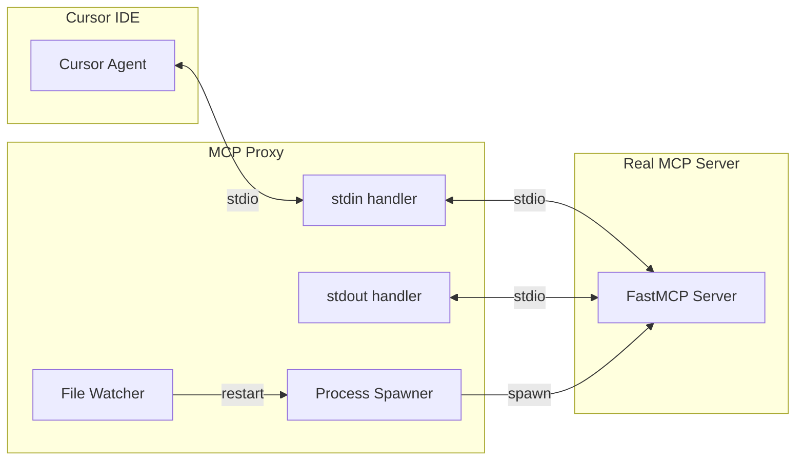
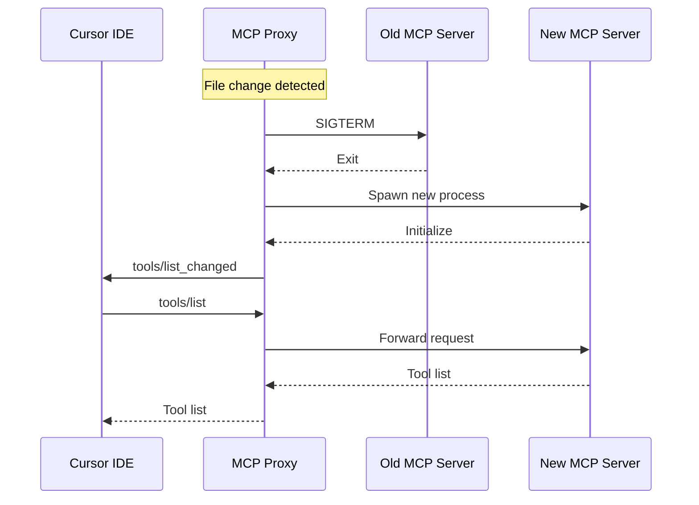

# MCP Hot-Reload Proxy

> Transparent proxy for MCP server hot-reloading during development

## Diagram



## Reload Flow



## Components

| Component | File | Description |
|-----------|------|-------------|
| MCP Proxy | `scripts/mcp_proxy.py` | Main proxy script |

## Features

- **Transparent Proxy**: Neither Cursor nor server knows about the proxy
- **File Watching**: Monitors Python files for changes
- **Debouncing**: Prevents rapid restarts (3 second default)
- **Daemon Restart**: Optionally restarts dependent daemons
- **MCP Protocol**: Sends `tools/list_changed` notification on reload

## Architecture

```
┌─────────┐  stdio   ┌─────────────┐  stdio   ┌─────────────┐
│ Cursor  │ ◄──────► │   Proxy     │ ◄──────► │ Real MCP    │
│         │          │ (spawns &   │          │ Server      │
└─────────┘          │  restarts)  │          └─────────────┘
                     └─────────────┘
```

## Configuration

### With Proxy (Development)

```json
{
  "mcpServers": {
    "aa_workflow": {
      "command": "python",
      "args": [
        "/path/to/scripts/mcp_proxy.py",
        "--cwd", "/path/to/redhat-ai-workflow",
        "--",
        "uv", "run", "python", "-m", "server"
      ]
    }
  }
}
```

### Without Proxy (Production)

```json
{
  "mcpServers": {
    "aa_workflow": {
      "command": "uv",
      "args": [
        "run", "--directory", "/path/to/redhat-ai-workflow",
        "python", "-m", "server"
      ]
    }
  }
}
```

## Environment Variables

| Variable | Default | Description |
|----------|---------|-------------|
| `MCP_PROXY_DEBUG` | 0 | Enable debug logging |
| `MCP_PROXY_NO_WATCH` | 0 | Disable file watching |
| `MCP_PROXY_DEBOUNCE` | 3.0 | Debounce time in seconds |
| `MCP_PROXY_RESTART_DAEMONS` | 0 | Restart daemons on reload |

## Usage

```bash
# Run proxy with real server
python scripts/mcp_proxy.py \
    --cwd /path/to/project \
    -- \
    uv run python -m server

# Debug mode
MCP_PROXY_DEBUG=1 python scripts/mcp_proxy.py ...

# Disable file watching (just proxy)
MCP_PROXY_NO_WATCH=1 python scripts/mcp_proxy.py ...
```

## Related Diagrams

- [MCP Server Core](../01-server/mcp-server-core.md)
- [WebSocket Server](../01-server/websocket-server.md)
