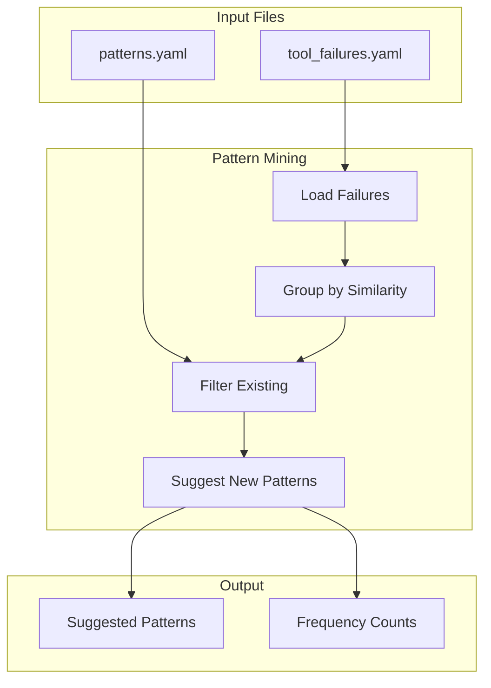
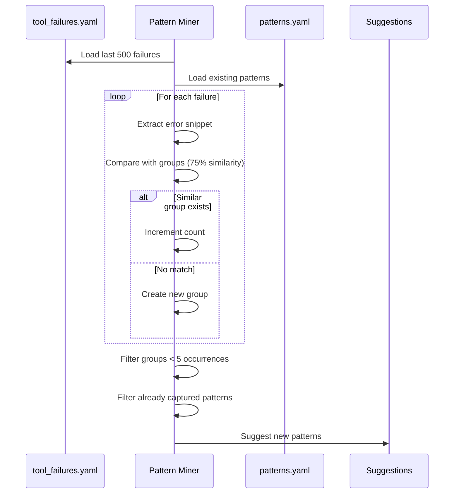
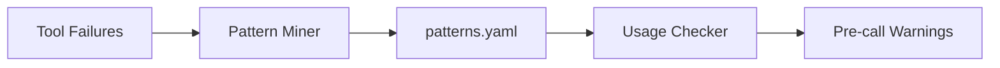

# Pattern Miner

> Auto-discover error patterns from tool failures

## Diagram



## Mining Process



## Components

| Component | File | Description |
|-----------|------|-------------|
| mine_patterns_from_failures | `scripts/pattern_miner.py` | Main mining function |

## Algorithm

1. **Load Failures**: Read last 500 entries from `tool_failures.yaml`
2. **Group by Similarity**: Use SequenceMatcher with 75% threshold
3. **Count Occurrences**: Track frequency of each error group
4. **Filter Threshold**: Only suggest patterns with 5+ occurrences
5. **Filter Existing**: Exclude errors already in `patterns.yaml`

## Usage

```bash
# Run pattern mining
python scripts/pattern_miner.py

# Scheduled via skill
/suggest-patterns
```

## Output Example

```yaml
suggested_patterns:
  - pattern: "manifest unknown"
    count: 12
    tool: bonfire_deploy
    examples:
      - "Error: manifest unknown: abc123"
      - "Error: manifest unknown: def456"
    suggested_fix: "Use full 40-char SHA instead of short SHA"

  - pattern: "connection refused"
    count: 8
    tool: k8s_get_pods
    examples:
      - "Error: connection refused to cluster"
    suggested_fix: "Run kube_login first"
```

## Integration with Layer 5

The pattern miner feeds into the Layer 5 usage pattern system:



## Related Diagrams

- [Usage Pattern System](../01-server/usage-pattern-system.md)
- [Auto-Heal Decorator](../01-server/auto-heal-decorator.md)
- [Layer 5 Dashboard](./layer5-dashboard.md)
