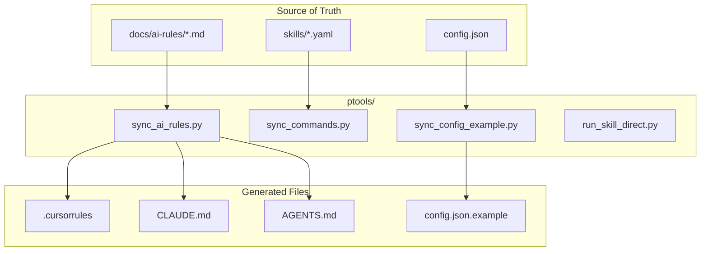

# PTools - Project Maintenance Tools

> Scripts for syncing configuration and maintaining project consistency

## Diagram



## Scripts

### sync_ai_rules.py

Syncs AI rules from single source of truth to all targets.

**Source**: `docs/ai-rules/*.md`

**Targets**:
- `.cursorrules` - Concatenated markdown for Cursor
- `CLAUDE.md` - With @import statements for Claude Code
- `AGENTS.md` - Cross-tool standard

```bash
# Sync everything
python ptools/sync_ai_rules.py

# Preview changes
python ptools/sync_ai_rules.py --dry-run

# Skip command sync
python ptools/sync_ai_rules.py --rules-only
```

### sync_commands.py

Syncs slash commands from skill definitions.

**Source**: `skills/*.yaml`

**Output**: Updates command lists in documentation

```bash
# Sync commands
python ptools/sync_commands.py

# List available commands
python ptools/sync_commands.py --list
```

### sync_config_example.py

Generates `config.json.example` from actual config with secrets redacted.

**Source**: `config.json`

**Output**: `config.json.example`

```bash
# Generate example config
python ptools/sync_config_example.py

# Verify no secrets leaked
python ptools/sync_config_example.py --verify
```

### run_skill_direct.py

Runs skills directly without MCP server (for testing).

```bash
# Run a skill directly
python ptools/run_skill_direct.py coffee

# With inputs
python ptools/run_skill_direct.py start-work --inputs '{"issue_key": "AAP-123"}'
```

## Generated File Headers

All generated files include a header:

```markdown
<!--
  ╔═══════════════════════════════════════════════════════════════════════════╗
  ║  AUTO-GENERATED FILE - DO NOT EDIT DIRECTLY                               ║
  ║                                                                           ║
  ║  Source: docs/ai-rules/                                                   ║
  ║  Sync:   make sync-ai-rules                                               ║
  ║  Generated: 2026-02-05 10:30:00                                           ║
  ╚═══════════════════════════════════════════════════════════════════════════╝
-->
```

## Makefile Integration

```makefile
# Sync AI rules
sync-ai-rules:
	python ptools/sync_ai_rules.py

# Sync config example
sync-config:
	python ptools/sync_config_example.py

# Sync all
sync: sync-ai-rules sync-config
```

## AI Rules Structure

```
docs/ai-rules/
├── 00-identity.md         # AI identity and context
├── 10-skill-first.md      # Skill-first approach
├── 20-session-management.md # Session handling
├── 30-git-safety.md       # Git safety rules
├── 40-ephemeral.md        # Ephemeral environment rules
├── 50-auto-debug.md       # Auto-debug behavior
└── 55-work-completion.md  # Work completion rules
```

Files are numbered for ordering (00, 10, 20...).

## Related Diagrams

- [Config System](../01-server/config-system.md)
- [Skill Engine](../04-skills/skill-engine-architecture.md)
- [Persona Definitions](../05-personas/persona-definitions.md)
