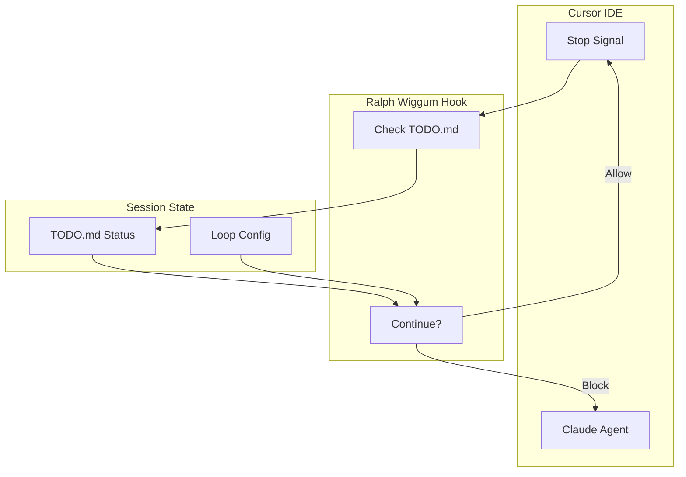
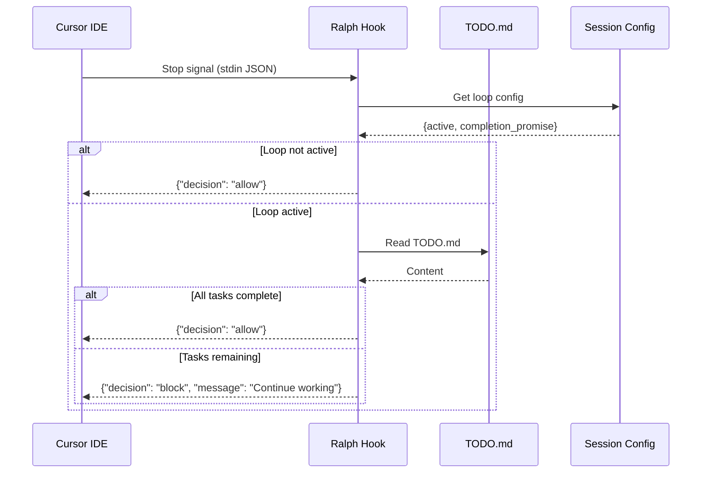
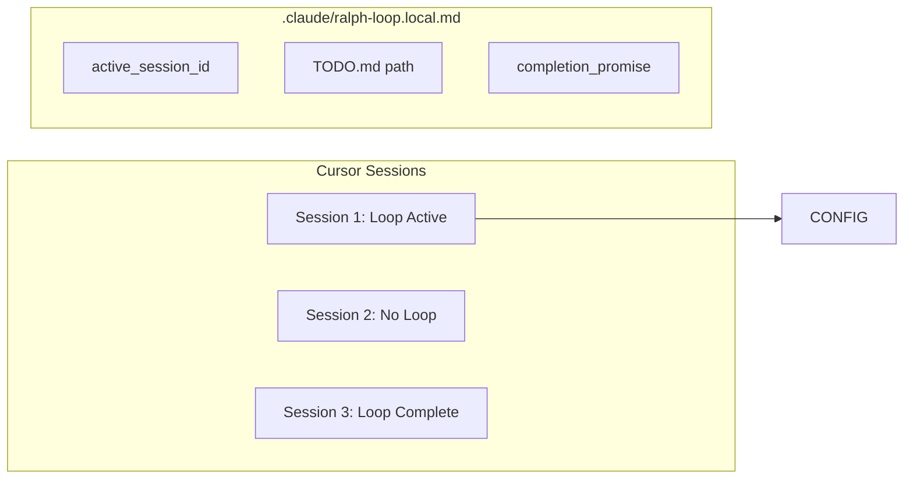

# Ralph Loop (Stop Hook)

> Stop hook for autonomous task loops in Cursor IDE

## Diagram



## Hook Flow



## Components

| Component | File | Description |
|-----------|------|-------------|
| ralph_wiggum_hook.py | `scripts/ralph_wiggum_hook.py` | Stop hook script |

## Configuration

Configure in `.cursor/hooks.json`:

```json
{
  "version": 1,
  "hooks": {
    "stop": [
      {
        "command": "python ~/.config/aa-workflow/ralph_wiggum_hook.py"
      }
    ]
  }
}
```

## Input Format

The hook receives JSON via stdin:

```json
{
  "session_id": "abc123",
  "stop_hook_active": true,
  "cwd": "/path/to/project",
  "completion_promise": "DONE"
}
```

## Output Format

The hook outputs JSON decision:

```json
{
  "decision": "block",
  "message": "3 tasks remaining in TODO.md. Continue working.",
  "context": {
    "tasks_total": 5,
    "tasks_complete": 2,
    "tasks_remaining": 3
  }
}
```

Or to allow stop:

```json
{
  "decision": "allow"
}
```

## Session Awareness

Each Cursor chat session has its own loop configuration:



## TODO.md Format

The hook checks for completion markers:

```markdown
# Task List

- [x] Completed task 1
- [x] Completed task 2
- [ ] Pending task 3  ← Blocks stop
- [ ] Pending task 4  ← Blocks stop
```

## Completion Promise

When all tasks are done, Claude must output the completion promise:

```
DONE
```

This signals the hook to allow stopping.

## Usage

Start a Ralph Loop from Claude:

```
/ralph-loop

TODO:
1. Fix the authentication bug
2. Add unit tests
3. Update documentation

--completion-promise DONE
```

Cancel a loop:

```
/ralph-loop:cancel-ralph
```

## Related Diagrams

- [Skill Hooks](./skill-hooks.md)
- [Skill Engine](../04-skills/skill-engine-architecture.md)
- [Sprint Daemon](../02-services/sprint-daemon.md)
