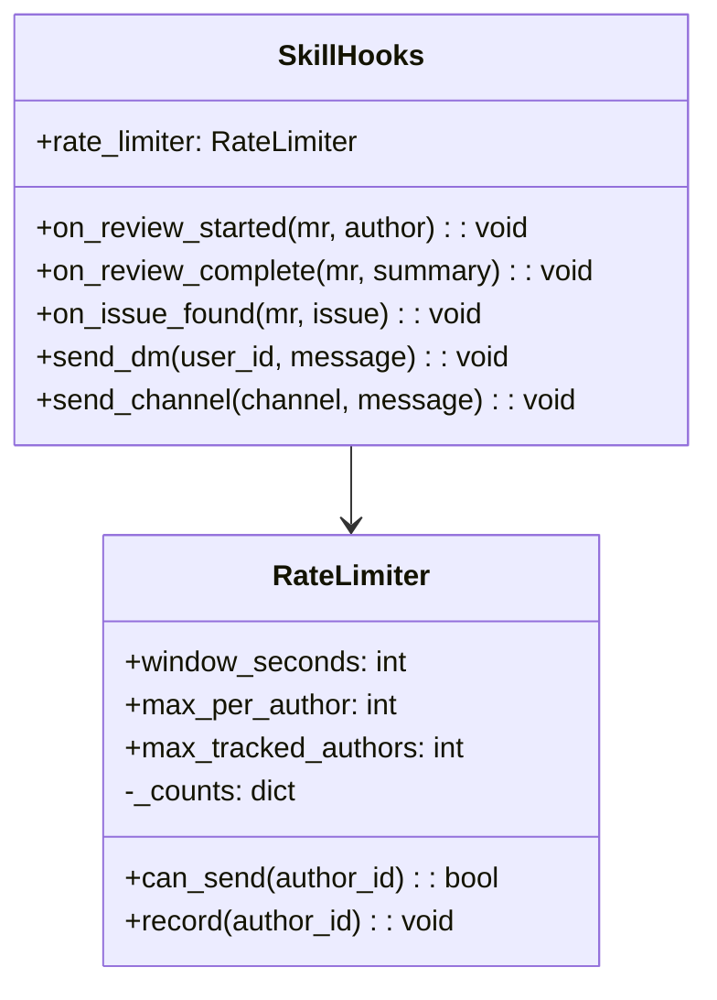
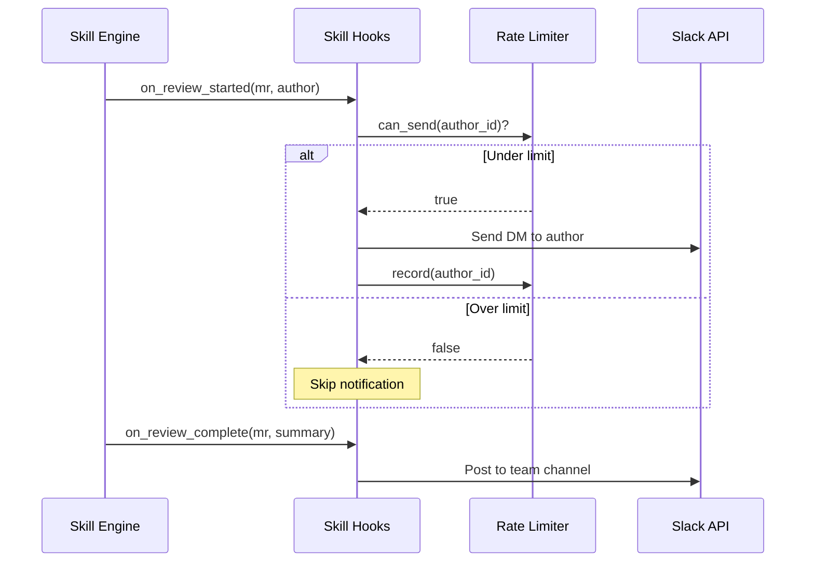

# Skill Hooks

> Event-driven notifications during skill execution

## Diagram



## Hook Flow



## Components

| Component | File | Description |
|-----------|------|-------------|
| SkillHooks | `scripts/skill_hooks.py` | Main hooks class |
| RateLimiter | `scripts/skill_hooks.py` | Spam prevention |

## Rate Limiting

Prevents notification spam to individual users:

| Setting | Default | Description |
|---------|---------|-------------|
| `window_seconds` | 300 | Rate limit window (5 min) |
| `max_per_author` | 3 | Max notifications per window |
| `max_tracked_authors` | 500 | Memory limit for tracking |

## Hook Events

### on_review_started

Fired when a code review begins:
```python
await hooks.on_review_started(
    mr={"iid": 123, "title": "Fix bug"},
    author={"id": "U123", "name": "Dave"}
)
# → DM to author: "Starting review of MR !123"
```

### on_review_complete

Fired when review finishes:
```python
await hooks.on_review_complete(
    mr={"iid": 123, "title": "Fix bug"},
    summary={"issues": 2, "suggestions": 5}
)
# → Channel post: "Review complete: 2 issues, 5 suggestions"
```

### on_issue_found

Fired for each significant issue:
```python
await hooks.on_issue_found(
    mr={"iid": 123},
    issue={"severity": "high", "file": "api.py", "line": 42}
)
# → DM to author: "Found high-severity issue in api.py:42"
```

## Message Format

Notifications are terse and actionable:

```
📝 Review started: MR !123 "Fix authentication bug"

⚠️ Found 2 issues in your MR !123:
  • High: SQL injection risk in api.py:42
  • Medium: Missing error handling in utils.py:18

✅ Review complete: MR !123
  Issues: 2 | Suggestions: 5
  View: https://gitlab.com/...
```

## Integration

Used by:
- **review-pr** skill: Notifies authors during review
- **review-all-prs** skill: Batch review notifications
- **sprint-autopilot** skill: Progress updates

## Related Diagrams

- [Skill Engine](../04-skills/skill-engine-architecture.md)
- [Slack Integration](../07-integrations/slack-integration.md)
- [Ralph Loop](./ralph-loop.md)
