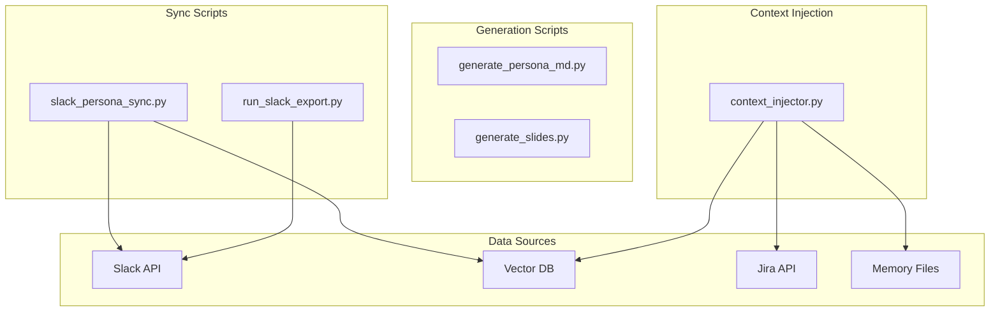
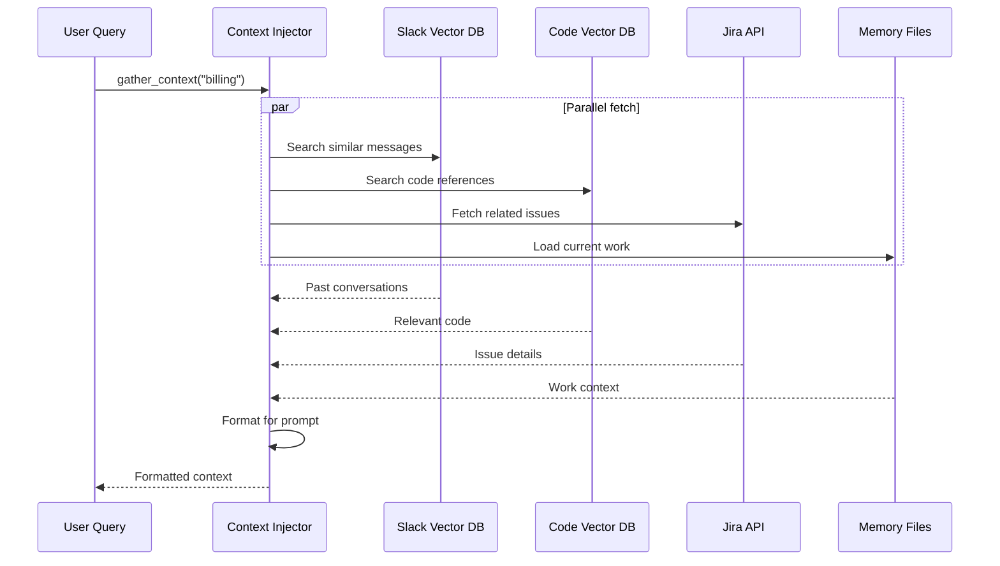
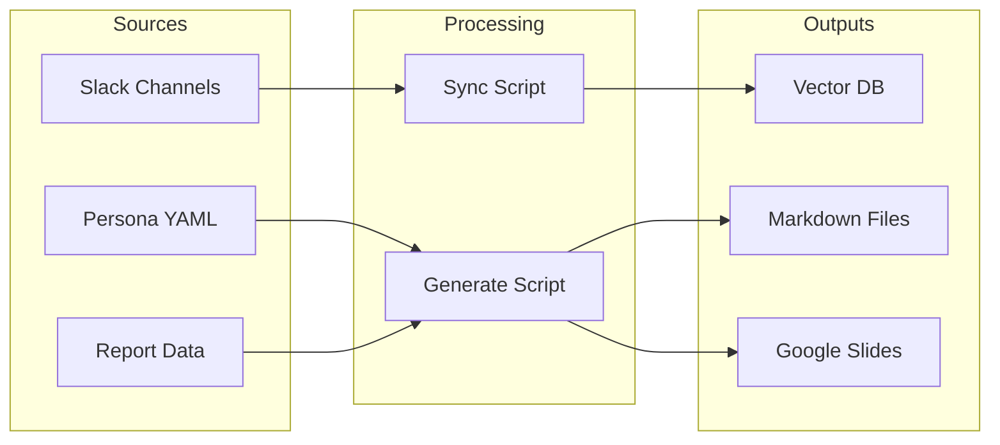

# Sync & Generation Scripts

> Scripts for syncing data and generating artifacts

## Diagram



## Scripts

### slack_persona_sync.py

Syncs Slack messages to persona vector store for semantic search.

```bash
# Full sync (90 days, 3 workers)
python scripts/slack_persona_sync.py --full

# Full sync with options
python scripts/slack_persona_sync.py --full --days 180 --workers 5 --delay 1.0

# Sync forwards from oldest
python scripts/slack_persona_sync.py --full --days 30 --direction forwards

# Resume interrupted sync
python scripts/slack_persona_sync.py --full --resume

# Incremental sync (1 day)
python scripts/slack_persona_sync.py --incremental

# Check status
python scripts/slack_persona_sync.py --status

# Search indexed messages
python scripts/slack_persona_sync.py --search "CVE release"
```

### run_slack_export.py

Exports Slack messages for style analysis.

```bash
# Export your messages
python scripts/run_slack_export.py

# Export specific channels
python scripts/run_slack_export.py --channels general,engineering

# Output to file
python scripts/run_slack_export.py --output messages.jsonl
```

### generate_persona_md.py

Generates persona markdown files from YAML configuration.

```bash
# Generate all personas
python scripts/generate_persona_md.py

# Generate specific persona
python scripts/generate_persona_md.py --persona devops
```

### generate_slides.py

Generates Google Slides presentations from templates.

```bash
# Generate slides from template
python scripts/generate_slides.py --template quarterly-review

# With custom data
python scripts/generate_slides.py --data report.yaml
```

### context_injector.py

Gathers knowledge from multiple sources for AI context injection.

```python
from scripts.context_injector import ContextInjector

injector = ContextInjector()
context = await injector.gather_context(
    query="How does billing work?",
    include_slack=True,
    include_code=True,
    include_jira=True,
)

# context["formatted"] contains ready-to-inject prompt section
```

## Context Injection Flow



## Data Flow



## Related Diagrams

- [Slack Persona Tools](../03-tools/slack-persona-tools.md)
- [Style Tools](../03-tools/style-tools.md)
- [Memory Abstraction](../06-memory/memory-abstraction-layer.md)
