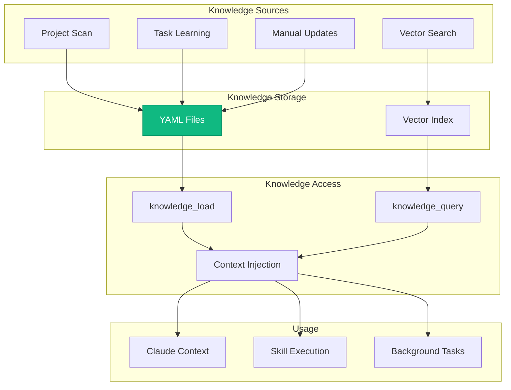
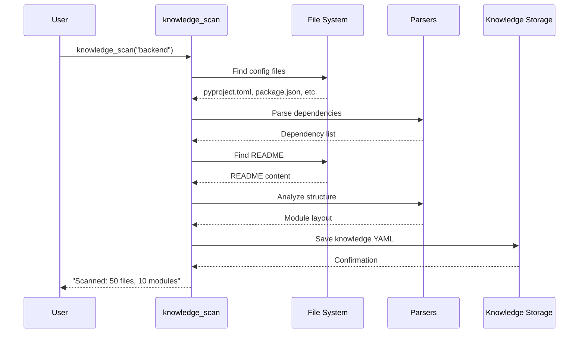
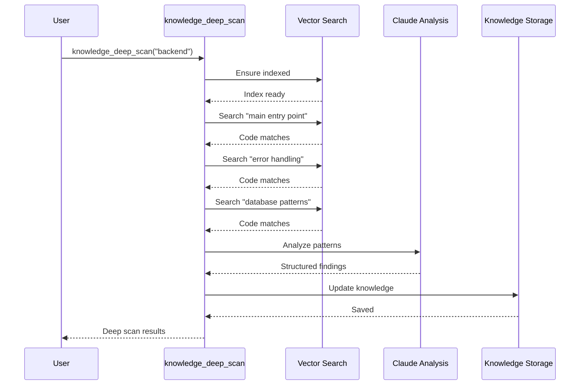
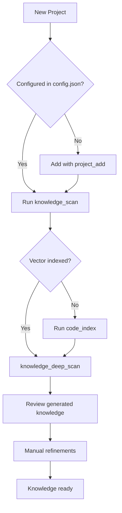
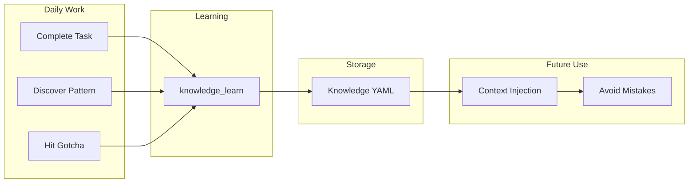

# Knowledge System Architecture

The Knowledge System provides persistent project expertise that grows over time. It stores architecture understanding, coding patterns, gotchas, and learnings specific to each project and persona combination.

## Overview



## Knowledge Structure

### Directory Layout

```
memory/knowledge/
├── personas/
│   ├── developer/
│   │   ├── automation-analytics-backend.yaml
│   │   ├── pdf-generator.yaml
│   │   └── redhat-ai-workflow.yaml
│   ├── devops/
│   │   ├── automation-analytics-backend.yaml
│   │   └── app-interface.yaml
│   ├── incident/
│   │   └── automation-analytics-backend.yaml
│   └── release/
│       └── automation-analytics-backend.yaml
└── shared/
    └── common-patterns.yaml
```

### Knowledge File Schema

```yaml
# memory/knowledge/personas/developer/automation-analytics-backend.yaml

# Metadata
project: automation-analytics-backend
persona: developer
version: "1.0"
last_updated: "2026-01-26T12:00:00Z"
confidence: high  # high, medium, low

# Architecture overview
architecture:
  overview: |
    FastAPI-based REST API for automation analytics.
    Uses PostgreSQL with SQLAlchemy ORM.
    Deployed to OpenShift via Konflux pipelines.

  key_modules:
    - name: api/
      purpose: REST API endpoints
      patterns: ["FastAPI routers", "Pydantic models"]

    - name: billing/
      purpose: Usage billing calculations
      patterns: ["vCPU hour tracking", "Metering integration"]

    - name: db/
      purpose: Database models and migrations
      patterns: ["Alembic migrations", "SQLAlchemy models"]

  dependencies:
    internal:
      - metering-service: "Usage data source"
      - pdf-generator: "Report generation"
    external:
      - postgresql: "Primary database"
      - redis: "Caching layer"

# Coding patterns specific to this project
patterns:
  coding:
    - name: "API Route Pattern"
      description: "All routes use dependency injection for DB sessions"
      example: |
        @router.get("/items/{id}")
        async def get_item(id: int, db: Session = Depends(get_db)):
            return crud.get_item(db, id)

    - name: "Error Handling"
      description: "Use HTTPException with standard error codes"
      example: |
        raise HTTPException(status_code=404, detail="Item not found")

  testing:
    - name: "Use pytest fixtures"
      description: "All tests use conftest.py fixtures for DB setup"

    - name: "Mock external services"
      description: "Use responses library for HTTP mocking"

# Common gotchas and pitfalls
gotchas:
  - issue: "Database connection pooling"
    description: "Pool exhaustion under load"
    solution: "Use connection pool with max_overflow=10"
    learned_from: "AAP-11234"

  - issue: "Timezone handling"
    description: "All timestamps must be UTC"
    solution: "Use datetime.utcnow() not datetime.now()"
    learned_from: "Production incident 2024-03"

  - issue: "Large report generation"
    description: "Reports > 100MB timeout"
    solution: "Use streaming response with chunked transfer"

# Learnings from completed tasks
learned_from_tasks:
  - task: "AAP-12345"
    learning: "The billing calculation uses vCPU-hours, not instance-hours"
    date: "2026-01-15"

  - task: "AAP-12400"
    learning: "Alembic migrations must be run with --sql for review first"
    date: "2026-01-20"

# Deployment information
deployment:
  environments:
    stage: "https://stage.analytics.example.com"
    prod: "https://analytics.example.com"

  pipelines:
    type: "Konflux"
    namespace: "automation-analytics-tenant"

  configuration:
    - APP_ENV: "stage/prod"
    - DATABASE_URL: "From secret"
    - REDIS_URL: "From configmap"
```

## Knowledge Operations

### knowledge_scan

Automatically scans a project and generates initial knowledge:



### knowledge_load

Loads project knowledge into Claude's context:

```python
# Load for current session
knowledge_load(project="backend", persona="developer")

# Returns formatted knowledge for context injection:
# - Architecture overview
# - Key patterns
# - Gotchas to avoid
# - Recent learnings
```

### knowledge_learn

Records learnings from completed tasks:

```python
knowledge_learn(
    learning="The API rate limits apply per-user, not per-token",
    task="AAP-12456",
    section="gotchas",
    project="backend"
)
```

### knowledge_update

Manually updates a knowledge section:

```python
knowledge_update(
    project="backend",
    persona="developer",
    section="patterns.coding",
    content="""
    - name: "New Pattern"
      description: "..."
    """,
    append=True  # Add to existing list
)
```

### knowledge_query

Retrieves specific knowledge sections:

```python
knowledge_query(
    project="backend",
    persona="developer",
    section="gotchas"
)
# Returns just the gotchas section
```

### knowledge_deep_scan

Performs deep analysis using vector search:



## Knowledge Flow

### Initial Setup



### Ongoing Learning



## Context Injection

Knowledge is automatically injected into Claude's context during:

### Session Start

```python
# In session_start()
if project:
    knowledge = knowledge_load(project, persona)
    context += f"\n## Project Knowledge\n{knowledge}\n"
```

### Skill Execution

```python
# Skills can request knowledge
steps:
  - id: load_context
    tool: knowledge_query
    args:
      project: "{{ project }}"
      section: "gotchas"

  - id: analyze
    compute: |
      # Use gotchas in analysis
      known_issues = load_context.gotchas
```

### Persona Loading

```python
# When persona_load is called
async def persona_load(persona_name: str):
    # Load persona config
    config = load_persona_yaml(persona_name)

    # Auto-load project knowledge if configured
    if project := get_current_project():
        knowledge = knowledge_load(project, persona_name)
        inject_context(knowledge)
```

## Confidence Levels

Knowledge has confidence levels that affect how it's presented:

| Level | Meaning | Source |
|-------|---------|--------|
| `high` | Verified, well-tested | Manual review, production learnings |
| `medium` | Likely accurate | Auto-scan, recent tasks |
| `low` | May be outdated | Old scans, inferred patterns |

```yaml
confidence: high

# In context injection:
# High confidence: presented as facts
# Medium confidence: presented with "typically" language
# Low confidence: presented as suggestions to verify
```

## Integration Points

### With Skills

Skills can query knowledge during execution:

```yaml
steps:
  - id: get_patterns
    tool: knowledge_query
    args:
      project: "{{ project }}"
      section: "patterns.testing"

  - id: run_tests
    tool: run_tests
    args:
      pattern: "{{ get_patterns.test_pattern | default('test_*.py') }}"
```

### With Daemons

Daemons use knowledge for context:

```python
# Sprint Daemon
async def process_issue(issue_key: str):
    project = detect_project_from_issue(issue_key)
    knowledge = await knowledge_load(project, "developer")

    # Claude prompt includes knowledge
    prompt = f"""
    ## Context
    {knowledge}

    ## Task
    Work on {issue_key}: {issue.summary}
    """
```

### With Vector Search

Deep scans use vector search:

```python
async def knowledge_deep_scan(project: str):
    # Ensure vector index exists
    await code_index(project)

    # Search for key patterns
    patterns = await code_search("coding patterns", project=project)
    errors = await code_search("error handling", project=project)
    auth = await code_search("authentication", project=project)

    # Analyze and store
    findings = analyze_patterns(patterns, errors, auth)
    update_knowledge(project, findings)
```

## Best Practices

### 1. Regular Scanning

```bash
# Weekly: Re-scan all projects
make knowledge-refresh

# After major changes: Specific project
knowledge_scan("backend", force=True)
```

### 2. Capture Learnings

After every significant task:
```python
knowledge_learn(
    learning="What you discovered",
    task="JIRA-KEY",
    project="project-name"
)
```

### 3. Review and Curate

```python
# Periodically review auto-generated knowledge
knowledge_query("backend", section="learned_from_tasks")

# Promote valuable learnings to gotchas
knowledge_update(
    "backend", "developer", "gotchas",
    content=promoted_learning,
    append=True
)
```

### 4. Persona-Specific Knowledge

Different personas need different knowledge:

| Persona | Focus |
|---------|-------|
| developer | Coding patterns, testing, local dev |
| devops | Deployment, K8s configs, pipelines |
| incident | Error patterns, monitoring, debugging |
| release | Release process, versioning, rollback |

## MCP Tools

| Tool | Purpose |
|------|---------|
| `knowledge_load` | Load project knowledge into context |
| `knowledge_scan` | Auto-scan and generate knowledge |
| `knowledge_update` | Update a knowledge section |
| `knowledge_query` | Query specific sections |
| `knowledge_learn` | Record task learnings |
| `knowledge_list` | List all knowledge files |
| `knowledge_deep_scan` | Deep analysis with vectors |

## See Also

- [Vector Search](./vector-search.md) - Semantic code search
- [Memory System](./memory-system.md) - Persistent state
- [State Management](./state-management.md) - Runtime state
- [Personas Reference](../personas/README.md) - Persona configurations
