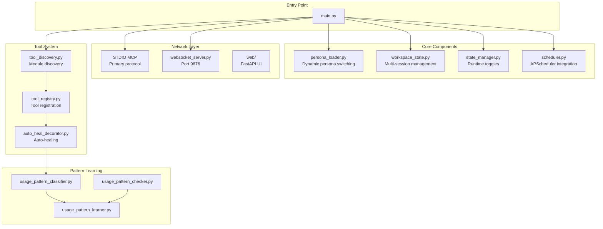
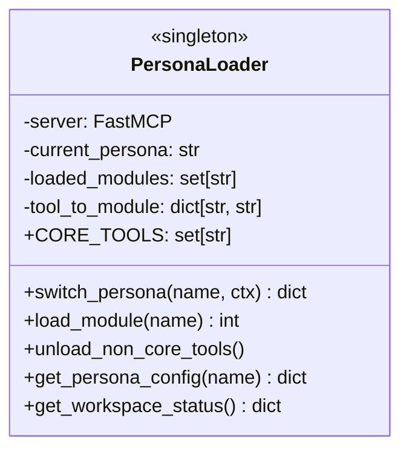
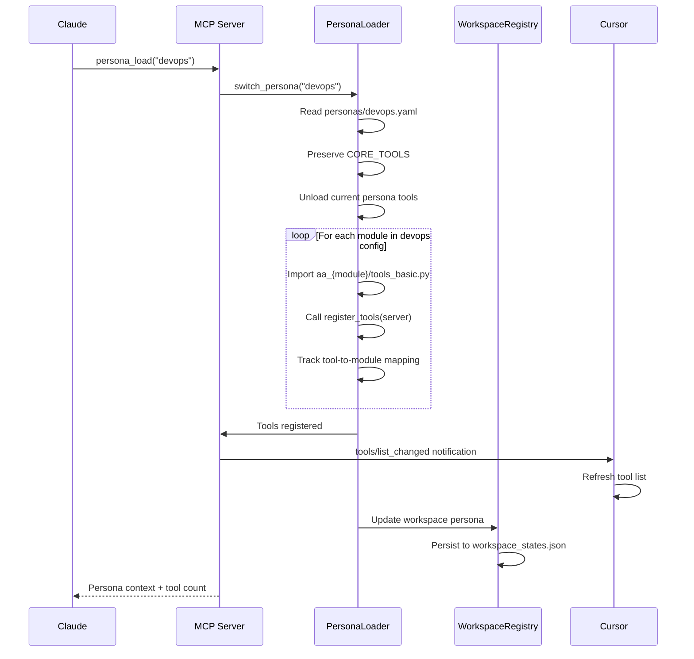
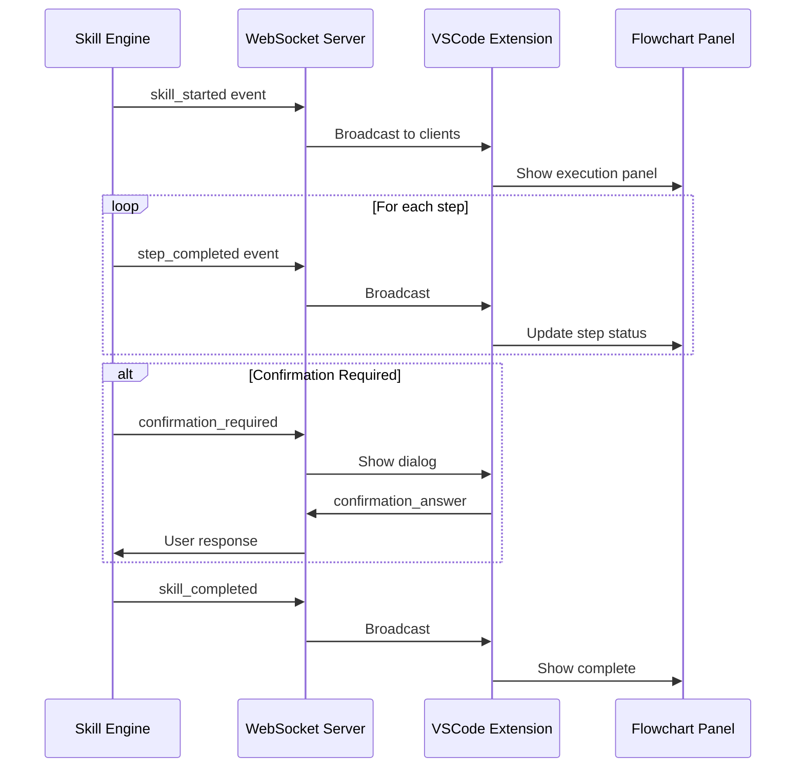
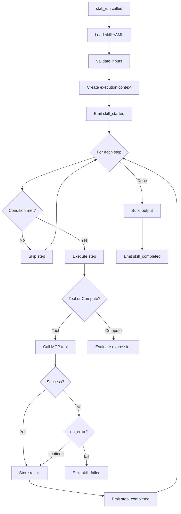
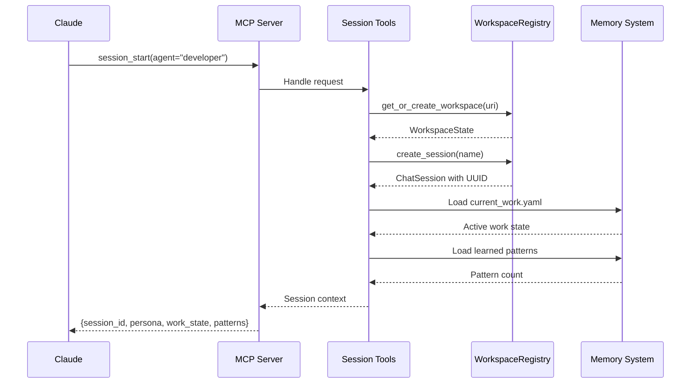

# 🔧 MCP Server Implementation

This document describes the technical implementation details of the AI Workflow MCP server, including tool loading, persona switching, WebSocket communication, and skill execution.

> **Terminology:** "Personas" are tool configuration profiles, not separate AI instances. The `persona_load` tool switches which tools are available.

## Design Principles

1. **Single MCP Server**: One server loads/unloads tools dynamically based on active persona
2. **Dynamic Persona Loading**: Switch personas mid-session with tools updating automatically
3. **Tool Modules**: Each domain has tools in `tools_basic.py` and `tools_extra.py`
4. **Auto-Heal**: Tools wrapped with `@auto_heal` decorators for VPN/auth recovery
5. **Multi-Session**: Support multiple concurrent chat sessions per workspace
6. **Real-Time Updates**: WebSocket server for skill execution visualization
7. **Dual Mode**: Each module can run standalone OR be loaded as a plugin

## Server Architecture



## Directory Structure

```text
server/                           # Core infrastructure
├── main.py                       # Main server entry point
├── __main__.py                   # Module entry point
├── persona_loader.py             # Dynamic persona/tool loading
├── workspace_state.py            # Multi-session management
├── state_manager.py              # Runtime state persistence
├── websocket_server.py           # Real-time skill updates
├── auto_heal_decorator.py        # Auto-heal decorators
├── scheduler.py                  # APScheduler integration
├── config.py                     # Configuration access
├── config_manager.py             # Thread-safe config singleton
├── paths.py                      # Centralized path definitions
├── utils.py                      # Shared utilities
├── tool_discovery.py             # Module discovery
├── tool_registry.py              # Tool registration
├── workspace_utils.py            # Workspace helpers
├── workspace_exporter.py         # VSCode extension export
└── usage_pattern_*.py            # Layer 5 learning system (7 files)

tool_modules/                     # Tool plugins (20+ modules)
├── aa_workflow/                  # Core workflow tools (18 tools)
├── aa_git/                       # Git operations (30 tools)
├── aa_gitlab/                    # GitLab MRs & pipelines (30 tools)
├── aa_jira/                      # Jira issues (28 tools)
├── aa_k8s/                       # Kubernetes operations (28 tools)
├── aa_bonfire/                   # Ephemeral environments (20 tools)
├── aa_konflux/                   # Tekton pipelines (35 tools)
├── aa_quay/                      # Container registry (8 tools)
├── aa_prometheus/                # Metrics queries (13 tools)
├── aa_alertmanager/              # Alert management (7 tools)
├── aa_kibana/                    # Log search (9 tools)
├── aa_google_calendar/           # Calendar & meetings (6 tools)
├── aa_gmail/                     # Email processing (6 tools)
├── aa_slack/                     # Slack integration (10 tools)
├── aa_appinterface/              # App-interface config (7 tools)
├── aa_lint/                      # Linting tools (7 tools)
├── aa_dev_workflow/              # Dev workflow helpers (9 tools)
├── aa_code_search/               # Semantic search (5 tools)
├── aa_performance/               # Performance tracking (4 tools)
├── aa_meet_bot/                  # Meet bot control (6 tools)
└── aa_ollama/                    # Local LLM inference (3 tools)
```

## Tool Module Pattern

### Basic vs Extra Tools

Each module splits tools into two files:

| File | Purpose | Loading |
|------|---------|---------|
| `tools_basic.py` | Core tools used in skills (71%) | Always loaded |
| `tools_extra.py` | Advanced tools rarely used (29%) | On-demand |

This reduces context window usage by ~30%.

### tools_basic.py Example

```python
"""Git basic tools - frequently used in skills."""

from mcp.server.fastmcp import FastMCP
from server.auto_heal_decorator import auto_heal_git

def register_tools(server: FastMCP) -> int:
    """Register basic git tools."""

    @server.tool()
    @auto_heal_git()
    async def git_status(repo: str) -> str:
        """Get git status for a repository."""
        # Implementation
        return "..."

    @server.tool()
    @auto_heal_git()
    async def git_log(repo: str, limit: int = 10) -> str:
        """Get recent commits."""
        # Implementation
        return "..."

    return 2  # Number of tools registered
```

### tools_extra.py Example

```python
"""Git extra tools - rarely used advanced operations."""

from mcp.server.fastmcp import FastMCP

def register_tools(server: FastMCP) -> int:
    """Register extra git tools."""

    @server.tool()
    async def git_bisect_start(repo: str, bad: str, good: str) -> str:
        """Start git bisect."""
        # Implementation
        return "..."

    return 1
```

## Dynamic Persona Loading

### PersonaLoader Class



### Persona Switching Flow



### Core Tools (Never Unloaded)

| Tool | Purpose |
|------|---------|
| `persona_load` | Switch personas |
| `persona_list` | List available personas |
| `session_start` | Initialize/resume session |
| `session_info` | Get session details |
| `debug_tool` | Self-healing tool debugger |
| `memory_read` | Read from memory |
| `memory_write` | Write to memory |
| `vpn_connect` | Connect to VPN |
| `kube_login` | Refresh Kubernetes auth |

### Persona Configuration

`personas/devops.yaml`:

```yaml
name: devops
description: DevOps persona for deployments and infrastructure
version: "1.0"

modules:
  - workflow     # Always include
  - k8s
  - bonfire
  - quay
  - gitlab
  - prometheus
  - alertmanager

persona: |
  You are a DevOps engineer focused on deployments and infrastructure.

  Your expertise:
  - Kubernetes cluster management
  - Ephemeral environment deployment
  - Container image management
  - Monitoring and alerting

  Available skills:
  - deploy_ephemeral
  - test_mr_ephemeral
  - investigate_alert
  - rollout_restart

skills:
  - deploy_ephemeral
  - test_mr_ephemeral
  - investigate_alert
```

## WebSocket Server

### Purpose

Real-time communication for skill execution visualization in the VSCode extension.

### Architecture



### Event Types

| Event | Direction | Purpose |
|-------|-----------|---------|
| `skill_started` | Server → Client | Skill execution began |
| `skill_updated` | Server → Client | Step progress |
| `step_completed` | Server → Client | Step finished |
| `skill_completed` | Server → Client | Skill finished |
| `skill_failed` | Server → Client | Skill error |
| `confirmation_required` | Server → Client | User decision needed |
| `confirmation_answer` | Client → Server | User's response |
| `auto_heal_triggered` | Server → Client | Auto-heal in progress |
| `heartbeat` | Both | Keep connection alive |

### Server Implementation

```python
class SkillWebSocketServer:
    def __init__(self, port: int = 9876):
        self.port = port
        self.clients: set[WebSocket] = set()
        self.running_skills: dict[str, SkillState] = {}
        self.pending_confirmations: dict[str, PendingConfirmation] = {}

    async def broadcast(self, event: dict):
        """Broadcast event to all connected clients."""
        message = json.dumps(event)
        for client in self.clients:
            try:
                await client.send(message)
            except:
                self.clients.discard(client)

    async def emit_skill_started(self, execution_id: str, skill_name: str):
        await self.broadcast({
            "type": "skill_started",
            "execution_id": execution_id,
            "skill_name": skill_name,
            "timestamp": datetime.now().isoformat()
        })
```

## Skill Execution

### Skill Engine

Located in `tool_modules/aa_workflow/src/skill_engine.py`:



### Skill YAML Structure

```yaml
name: deploy_ephemeral
description: Deploy to ephemeral environment
version: "1.0"

inputs:
  - name: mr_id
    type: integer
    required: true
  - name: duration
    type: string
    default: "4h"

steps:
  - id: check_vpn
    tool: vpn_status
    on_error: continue

  - id: fix_vpn
    condition: "check_vpn and 'disconnected' in check_vpn"
    tool: vpn_connect

  - id: reserve_namespace
    tool: bonfire_namespace_reserve
    args:
      duration: "{{ duration }}"

  - id: deploy
    tool: bonfire_deploy
    args:
      namespace: "{{ reserve_namespace.namespace }}"
      mr_id: "{{ mr_id }}"

output:
  namespace: "{{ reserve_namespace.namespace }}"
  url: "{{ deploy.url }}"
  success: true
```

## Auto-Heal Infrastructure

### Decorator Hierarchy

```mermaid
graph TD
    A[@auto_heal] --> B{Detect Error}
    B -->|VPN| C[@auto_heal_git]
    B -->|Auth + VPN| D[@auto_heal_k8s]

    D --> E[@auto_heal_ephemeral]
    D --> F[@auto_heal_konflux]
    D --> G[@auto_heal_stage]

    C --> H[Git/GitLab tools]
    E --> I[Bonfire tools]
    F --> J[Tekton tools]
    G --> K[Prometheus/Kibana]
```

### Decorator Implementation

```python
def auto_heal(cluster: str = None, max_retries: int = 1):
    """Generic auto-heal decorator."""

    def decorator(func):
        @functools.wraps(func)
        async def wrapper(*args, **kwargs):
            for attempt in range(max_retries + 1):
                try:
                    result = await func(*args, **kwargs)

                    # Check for error patterns in result
                    failure_type = _detect_failure_type(result)

                    if failure_type == 'network':
                        await _run_vpn_connect()
                        continue

                    if failure_type == 'auth':
                        await _run_kube_login(cluster or _detect_cluster(kwargs))
                        continue

                    return result

                except Exception as e:
                    if attempt < max_retries:
                        # Try to recover
                        if _is_network_error(e):
                            await _run_vpn_connect()
                        elif _is_auth_error(e):
                            await _run_kube_login(cluster)
                        continue
                    raise

            return result
        return wrapper
    return decorator

# Specialized decorators
auto_heal_ephemeral = lambda: auto_heal(cluster="ephemeral")
auto_heal_konflux = lambda: auto_heal(cluster="konflux")
auto_heal_k8s = lambda: auto_heal(cluster="stage")
auto_heal_stage = lambda: auto_heal(cluster="stage")
auto_heal_jira = lambda: auto_heal(cluster=None)  # Auth only
auto_heal_git = lambda: auto_heal(cluster=None)   # VPN only
```

## Session Management Integration

### Session Start Flow



## Startup Modes

### 1. Default Mode (Developer Persona)

```bash
python -m server
# Loads developer persona (~78 tools)
```

### 2. Specific Persona Mode

```bash
python -m server --agent devops
python -m server --agent incident
python -m server --agent release
```

### 3. Tools-Only Mode

```bash
python -m server --tools git,gitlab,jira
# Load specific modules without persona context
```

### 4. All Tools Mode (Testing)

```bash
python -m server --all
# Loads all tools (warning: may hit MCP limits)
```

## Configuration

### MCP Configuration (`.mcp.json`)

```json
{
  "mcpServers": {
    "aa_workflow": {
      "command": "bash",
      "args": [
        "-c",
        "cd ~/src/redhat-ai-workflow && source .venv/bin/activate && python3 -m server"
      ]
    }
  }
}
```

### Environment Variables

| Variable | Module | Description |
|----------|--------|-------------|
| `JIRA_URL` | aa_jira | Jira instance URL |
| `JIRA_JPAT` | aa_jira | Jira Personal Access Token |
| `GITLAB_TOKEN` | aa_gitlab | GitLab API token |
| `KUBECONFIG` | aa_k8s | Default kubeconfig path |
| `ANTHROPIC_API_KEY` | Slack daemon | Claude API key |
| `CLAUDE_CODE_USE_VERTEX` | Slack daemon | Use Vertex AI |

## Debugging

### Enable Debug Logging

```python
import logging
logging.basicConfig(level=logging.DEBUG)
```

### Tool Execution Tracing

```python
# In skill YAML
steps:
  - id: my_step
    tool: some_tool
    debug: true  # Log execution details
```

### WebSocket Debugging

```bash
# Monitor WebSocket traffic
websocat ws://localhost:9876
```

## See Also

- [Architecture Overview](./README.md) - System overview
- [Session Management](./session-management.md) - Multi-chat handling
- [Usage Pattern Learning](./usage-pattern-learning.md) - Layer 5 system
- [Daemon Architecture](./daemons.md) - Background services
- [Skills Reference](../skills/README.md) - Available skills
- [Development Guide](../DEVELOPMENT.md) - Contributing guidelines
