# 🔧 MCP Server Architecture

## Design Principles

1. **Single MCP Server**: One server loads/unloads tools dynamically based on active agent
2. **Dynamic Agent Loading**: Switch agents mid-session with tools updating automatically
3. **Tool Modules**: Each domain has tools in a `tools.py` with `register_tools(server)` function
4. **Auto-Debug**: All tools wrapped with `@debuggable` for self-healing capabilities
5. **Dual Mode**: Each module can run standalone OR be loaded as a plugin

## Quick Start

Add to your project's `.cursor/mcp.json`:

```json
{
  "mcpServers": {
    "aa-workflow": {
      "command": "bash",
      "args": [
        "-c",
        "cd ~/src/redhat-ai-workflow/mcp-servers/aa-common && source ~/src/redhat-ai-workflow/.venv/bin/activate && python3 -m src.server"
      ]
    }
  }
}
```

## Directory Structure

```
mcp-servers/
├── aa-common/                    # Core infrastructure
│   ├── src/
│   │   ├── server.py             # Main server entry point
│   │   ├── agent_loader.py       # Dynamic agent/tool loading
│   │   ├── debuggable.py         # Auto-debug decorator
│   │   └── config.py             # Shared configuration
│   └── pyproject.toml
│
├── aa-git/                       # Git operations (19 tools)
│   ├── src/
│   │   ├── tools.py              # register_tools(server) function
│   │   └── server.py             # Standalone wrapper
│   └── pyproject.toml
│
├── aa-gitlab/                    # GitLab MRs & pipelines (35 tools)
├── aa-jira/                      # Jira issues (24 tools)
├── aa-k8s/                       # Kubernetes operations (26 tools)
├── aa-bonfire/                   # Ephemeral environments (21 tools)
├── aa-quay/                      # Container registry (8 tools)
├── aa-prometheus/                # Metrics queries (13 tools)
├── aa-alertmanager/              # Alert management (6 tools)
├── aa-kibana/                    # Log search (9 tools)
├── aa-google-calendar/           # Calendar & meetings (6 tools)
├── aa-gmail/                     # Email processing (6 tools)
├── aa-slack/                     # Slack integration (15 tools)
├── aa-konflux/                   # Build pipelines (40 tools)
└── aa-appinterface/              # App-interface config (6 tools)
```

## Tool Module Pattern

### tools.py - Tool Definitions

```python
"""Git tool definitions."""

from mcp.server.fastmcp import FastMCP

def register_tools(server: FastMCP) -> int:
    """Register tools with the server.

    Args:
        server: FastMCP server instance

    Returns:
        Number of tools registered
    """

    @server.tool()
    async def git_status(repo: str) -> str:
        """Get git status."""
        # Implementation
        return "..."

    @server.tool()
    async def git_log(repo: str, limit: int = 10) -> str:
        """Get git log."""
        # Implementation
        return "..."

    return 2  # Number of tools
```

### server.py - Standalone Wrapper

```python
"""Standalone entry point for aa-git."""

import asyncio
from mcp.server.fastmcp import FastMCP
from .tools import register_tools

def main():
    server = FastMCP("aa-git")
    register_tools(server)
    asyncio.run(server.run_stdio_async())

if __name__ == "__main__":
    main()
```

## Dynamic Agent Loading

### How It Works


### AgentLoader Implementation

The `AgentLoader` class (`aa-common/src/agent_loader.py`) manages dynamic tool switching:

```python
class AgentLoader:
    CORE_TOOLS = {"agent_load", "agent_list", "session_start", "debug_tool"}

    async def switch_agent(self, agent_name: str, ctx: Context) -> dict:
        """Switch to a different agent, loading its tools dynamically."""

        # 1. Read agent config (agents/devops.yaml)
        config = self.load_agent_config(agent_name)

        # 2. Unload current tools (keep core)
        for tool_name in list(self.server._tool_manager._tools.keys()):
            if tool_name not in self.CORE_TOOLS:
                self.server._tool_manager._tools.pop(tool_name)

        # 3. Load new tool modules
        for module in config["tools"]:
            mod = importlib.import_module(f"aa_{module}.tools")
            mod.register_tools(self.server)

        # 4. Notify Cursor
        await ctx.session.send_tool_list_changed()

        return {"persona": config["persona"], "tools": len(self.server._tools)}
```

### Core Tools (Always Available)

These tools are never unloaded:

| Tool | Purpose |
|------|---------|
| `agent_load` | Switch agents |
| `agent_list` | List available agents |
| `session_start` | Initialize session |
| `debug_tool` | Self-healing tool debugger |

## Available Agents

| Agent | Modules | Tool Count | Focus |
|-------|---------|------------|-------|
| developer | git, gitlab, jira, google-calendar, gmail | ~86 | Daily coding |
| devops | k8s, bonfire, quay, gitlab | ~90 | Deployments |
| incident | k8s, kibana, jira | ~78 | Production debugging |
| release | konflux, quay, appinterface, git | ~69 | Shipping |

## Auto-Debug Infrastructure

All tools are automatically wrapped with debugging support via the `@debuggable` decorator.

### Flow

```mermaid
flowchart LR
    A[Tool Fails] --> B[Returns ❌ with hint]
    B --> C["💡 debug_tool('tool_name')"]
    C --> D[Claude inspects source]
    D --> E[Proposes fix]
    E --> F{User confirms?}
    F -->|Yes| G[Apply & commit]
    G --> H[Retry operation]
```



### The @debuggable Decorator

```python
# mcp-servers/aa-common/src/debuggable.py

@debuggable
async def my_tool(param: str) -> str:
    """My tool description."""
    result = do_something(param)
    return result
```

The decorator:
1. Captures source file and line numbers
2. Registers tool in `TOOL_REGISTRY`
3. If tool returns `❌`, appends debug hint
4. If exception occurs, captures error context

### Common Auto-Fixable Bugs

| Error Pattern | Likely Cause |
|---------------|--------------|
| "Output is not a TTY" | Missing --force/--yes flag |
| "Unknown flag: --state" | CLI syntax changed |
| "Unauthorized" | Auth not passed correctly |
| "manifest unknown" | Wrong image tag format |

## Usage Patterns

### 1. Dynamic Mode (Recommended)

Start with minimal tools, switch agents dynamically:

```bash
python -m src.server  # Starts with workflow tools only (~29)
```

Then in chat:
```
You: Load the devops agent
Claude: [calls agent_load("devops")]
        DevOps agent loaded! Now have k8s, bonfire, quay, gitlab (~90 tools)
```

### 2. Static Agent Mode

Start with a specific agent's tools pre-loaded:

```bash
python -m src.server --agent developer  # ~86 tools
python -m src.server --agent devops     # ~90 tools
```

### 3. Single Tool Module (Standalone)

Run just one module:

```bash
cd mcp-servers/aa-git
python -m src.server
```

## Adding a New Tool Module

1. **Create directory**: `aa-{name}/src/`

2. **Create `tools.py`**:
```python
from mcp.server.fastmcp import FastMCP

def register_tools(server: FastMCP) -> int:
    @server.tool()
    async def my_tool(arg: str) -> str:
        """Tool description."""
        return f"Result: {arg}"

    return 1
```

3. **Create `__init__.py`**:
```python
from .tools import register_tools
__all__ = ["register_tools"]
```

4. **Add to TOOL_MODULES** in `agent_loader.py`:
```python
TOOL_MODULES = {
    # ...
    "{name}": 5,  # estimated tool count
}
```

5. **Add to agent config** in `agents/{agent}.yaml`:
```yaml
tools:
  - {name}
```

## Special Modules

### aa-slack: Event-Driven Architecture

The `aa-slack` module implements a **long-running listener** pattern:

```
┌─────────────────────────────────────────────────────────────────┐
│  aa-slack MCP Server                                            │
│                                                                 │
│  ┌──────────────────┐     ┌──────────────────┐                 │
│  │  Background      │     │  SQLite State    │                 │
│  │  Polling Loop    │────▶│  - Last TS       │                 │
│  │  (asyncio task)  │     │  - Pending Queue │                 │
│  └────────┬─────────┘     │  - User Cache    │                 │
│           │               └────────┬─────────┘                 │
│           ▼                        │                           │
│  ┌──────────────────┐              │                           │
│  │  Slack Web API   │              │                           │
│  │  (httpx client)  │              ▼                           │
│  │  - Auth spoof    │     ┌──────────────────┐                 │
│  │  - Rate limiting │     │  MCP Tools       │                 │
│  └──────────────────┘     │  - get_pending   │◀─── LLM Calls   │
│                           │  - send_message  │                 │
│                           │  - respond_mark  │                 │
│                           └──────────────────┘                 │
└─────────────────────────────────────────────────────────────────┘
```

## Environment Variables

| Variable | Module | Description |
|----------|--------|-------------|
| `JIRA_URL` | aa-jira | Jira instance URL |
| `JIRA_JPAT` | aa-jira | Jira Personal Access Token |
| `GITLAB_TOKEN` | aa-gitlab | GitLab API token |
| `KUBECONFIG` | aa-k8s | Default kubeconfig path |

> **Note:** Quay tools use `skopeo` which leverages your existing `podman login` or `docker login` credentials - no separate token needed!

## See Also

- [Skills Reference](../skills/README.md) - Available skills
- [Architecture Overview](./README.md) - High-level architecture
- [README](../../README.md) - Getting started
