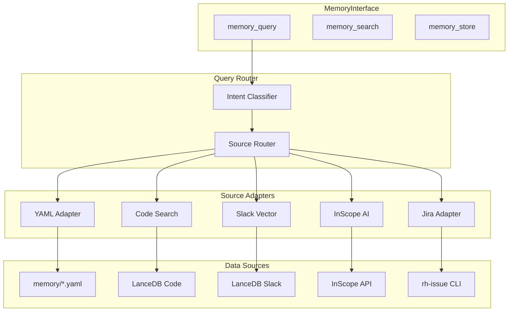
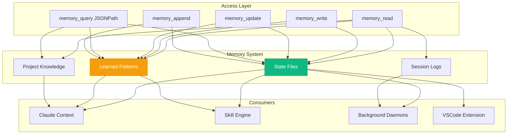
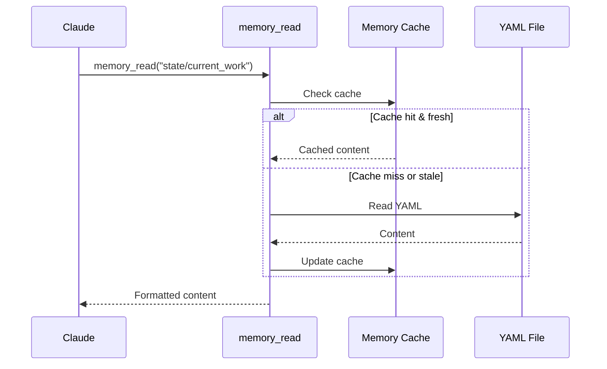
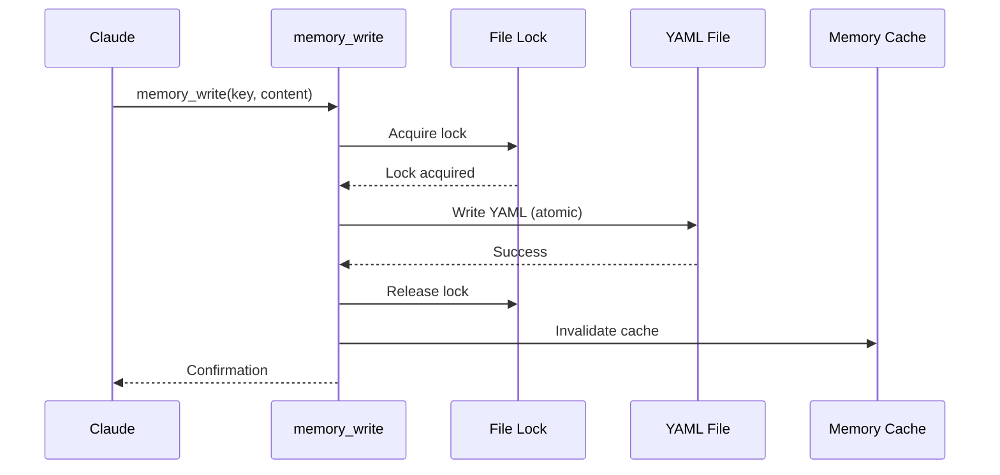
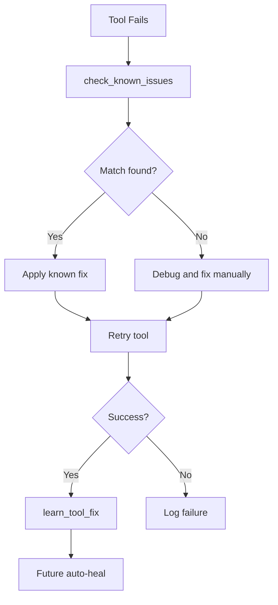
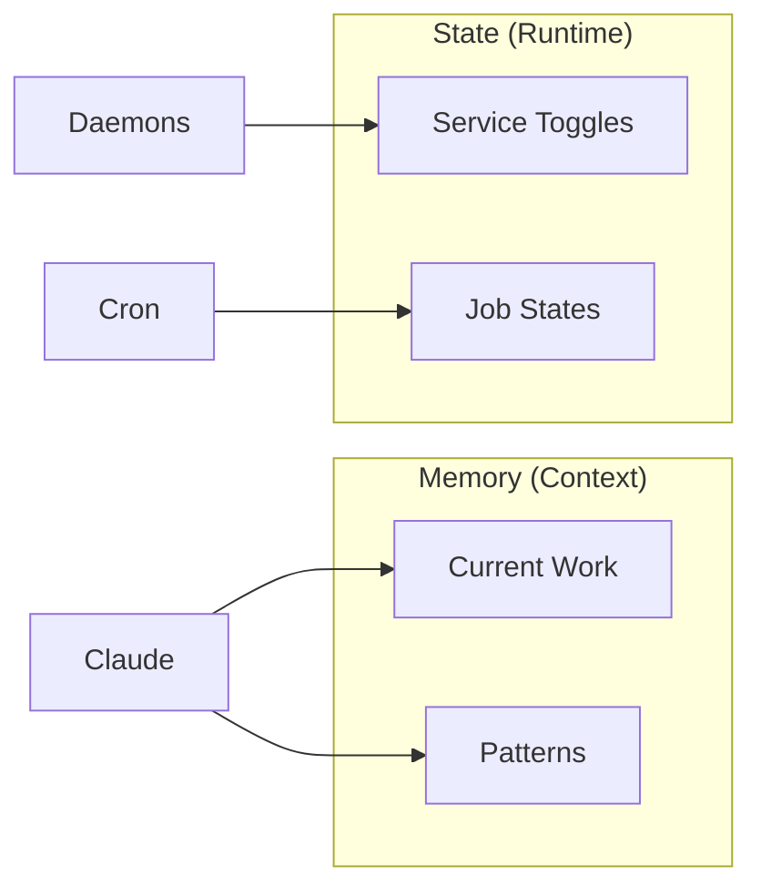

# Memory System Architecture

The Memory System provides persistent context storage that survives across Claude sessions. It stores active work state, learned patterns, error fixes, and session history.

## Memory Abstraction Layer (NEW)

The Memory Abstraction Layer provides a **unified interface** for querying multiple data sources. Instead of calling individual tools for each source, LLMs can use a single `memory_query` tool that automatically routes queries to the appropriate sources.

### Architecture Overview



### Key Components

| Component | Location | Purpose |
|-----------|----------|---------|
| MemoryInterface | `services/memory_abstraction/interface.py` | Main entry point |
| IntentClassifier | `services/memory_abstraction/classifier.py` | Classify query intent |
| QueryRouter | `services/memory_abstraction/router.py` | Route to adapters |
| ResultMerger | `services/memory_abstraction/merger.py` | Combine results |
| ResultFormatter | `services/memory_abstraction/formatter.py` | LLM-friendly output |

### Source Adapters

Adapters are discovered automatically from `tool_modules/aa_*/src/adapter.py`:

| Adapter | Module | Capabilities | Intent Keywords |
|---------|--------|--------------|-----------------|
| yaml | aa_memory_yaml | query, search, store | "working on", "current", "pattern" |
| code | aa_code_search | query, search | "function", "class", "code" |
| slack | aa_slack_persona | query, search | "discussed", "slack", "message" |
| inscope | aa_inscope | query | "rds", "clowder", "konflux" |
| jira | aa_jira | query | "issue", "ticket", "AAP-" |

### Usage

```python
# Auto-select sources based on intent
result = await memory.query("What am I working on?")
# -> Routes to yaml adapter (status_check intent)

result = await memory.query("Where is the billing calculation?")
# -> Routes to code adapter (code_lookup intent)

result = await memory.query("What did we discuss about RDS?")
# -> Routes to slack and inscope adapters

# Explicit sources
result = await memory.query(
    "billing code",
    sources=["code", "slack"]
)
```

### Creating New Adapters

```python
from services.memory_abstraction import memory_adapter, BaseAdapter

@memory_adapter(
    name="my_source",
    display_name="My Source",
    capabilities={"query", "search"},
    intent_keywords=["my", "source"],
    priority=50,
)
class MySourceAdapter(BaseAdapter):
    async def query(self, question, filter):
        # Implementation
        ...
```

## Legacy Overview

The original memory system remains available for backward compatibility:



## Directory Structure

```
memory/
├── state/                        # Active work tracking
│   ├── current_work.yaml         # Issues, branches, MRs
│   ├── environments.yaml         # Stage/prod health status
│   ├── shared_context.yaml       # Cross-session context
│   └── projects/                 # Per-project state
│       └── {project}/
│           └── current_work.yaml
│
├── learned/                      # Machine learning
│   ├── patterns.yaml             # Error patterns
│   ├── tool_failures.yaml        # Auto-heal history
│   ├── tool_fixes.yaml           # Known fixes
│   ├── usage_patterns.yaml       # Layer 5 patterns
│   └── runbooks.yaml             # Procedures that worked
│
├── knowledge/                    # Project expertise
│   ├── personas/                 # Per-persona knowledge
│   │   ├── developer/
│   │   ├── devops/
│   │   └── incident/
│   └── shared/                   # Shared patterns
│
└── sessions/                     # Session history
    └── {date}.yaml               # Daily session log
```

## State Files

### current_work.yaml

Tracks active development work:

```yaml
# memory/state/current_work.yaml

active_issues:
  - key: AAP-12345
    status: In Progress
    branch: feature/AAP-12345-add-billing
    started_at: "2026-01-26T09:00:00Z"
    mr_id: 1459
    last_activity: "2026-01-26T12:30:00Z"

  - key: AAP-12346
    status: In Review
    branch: fix/AAP-12346-timeout
    mr_id: 1460

active_branches:
  - name: feature/AAP-12345-add-billing
    project: automation-analytics-backend
    created_at: "2026-01-26T09:00:00Z"
    has_uncommitted: false

active_mrs:
  - id: 1459
    title: "AAP-12345 - feat(billing): add vCPU calculation"
    project: automation-analytics-backend
    status: open
    pipeline_status: passed
    approvals: 1

follow_ups:
  - description: "Update billing docs after AAP-12345 merges"
    related_issue: AAP-12345
    created_at: "2026-01-26T10:00:00Z"

notes: |
  Working on billing feature.
  Need to coordinate with metering team on API changes.
```

### environments.yaml

Tracks environment health:

```yaml
# memory/state/environments.yaml

stage:
  status: healthy
  last_check: "2026-01-26T12:00:00Z"
  deployments:
    automation-analytics-backend:
      version: "1.2.3-abc123"
      pods: 3/3
      last_deployed: "2026-01-25T10:00:00Z"

prod:
  status: healthy
  last_check: "2026-01-26T12:00:00Z"
  deployments:
    automation-analytics-backend:
      version: "1.2.2"
      pods: 5/5

ephemeral:
  namespaces:
    - name: ephemeral-abc123
      owner: daoneill
      expires: "2026-01-26T18:00:00Z"
      deployed:
        - mr: 1459
          image: quay.io/org/backend:abc123
```

### shared_context.yaml

Cross-session context:

```yaml
# memory/state/shared_context.yaml

# Current focus
current_focus:
  project: automation-analytics-backend
  epic: AAP-10000
  sprint: "Sprint 23"

# Preferences
preferences:
  default_namespace: ephemeral
  notification_level: important
  auto_approve_tests: true

# Team context
team:
  standup_time: "09:30"
  timezone: "Europe/Dublin"
  slack_channel: "#team-channel"

# Recent context
recent:
  last_deployment: "2026-01-25T10:00:00Z"
  last_release: "v1.2.2"
  last_incident: null
```

## Learned Patterns

### patterns.yaml

Error patterns and their solutions:

```yaml
# memory/learned/patterns.yaml

error_patterns:
  - pattern: "No route to host"
    meaning: "VPN disconnected"
    fix: "Connect to VPN"
    commands:
      - vpn_connect

  - pattern: "401 Unauthorized"
    meaning: "Kubernetes token expired"
    fix: "Refresh cluster login"
    commands:
      - kube_login cluster=stage

auth_patterns:
  - pattern: "token expired"
    cluster: stage
    fix: "kube_login(cluster='stage')"

bonfire_patterns:
  - pattern: "manifest unknown"
    meaning: "Image not found in Quay"
    fix: "Wait for build or use full SHA"

pipeline_patterns:
  - pattern: "No pods found"
    meaning: "Deployment not ready"
    fix: "Wait for rollout or check events"
```

### tool_fixes.yaml

Fixes discovered during debugging:

```yaml
# memory/learned/tool_fixes.yaml

tool_fixes:
  - tool_name: bonfire_deploy
    error_pattern: "manifest unknown"
    root_cause: "Short SHA doesn't exist in Quay"
    fix_description: "Use full 40-character SHA instead of short SHA"
    discovered_at: "2026-01-20T10:00:00Z"
    confidence: high

  - tool_name: k8s_get_pods
    error_pattern: "connection refused"
    root_cause: "Cluster API server unreachable"
    fix_description: "Check VPN connection and cluster health"
    discovered_at: "2026-01-22T14:00:00Z"
    confidence: high
```

### tool_failures.yaml

History of tool failures for analysis:

```yaml
# memory/learned/tool_failures.yaml

failures:
  - timestamp: "2026-01-26T10:30:00Z"
    tool: bonfire_deploy
    error: "manifest unknown: quay.io/org/app:abc123"
    context:
      namespace: ephemeral-xyz
      mr_id: 1459
    resolution: "Used full SHA"
    auto_healed: false

  - timestamp: "2026-01-26T11:00:00Z"
    tool: k8s_get_logs
    error: "Unauthorized"
    context:
      cluster: stage
    resolution: "kube_login"
    auto_healed: true
```

## Memory Tools

### memory_read

Read from any memory file:

```python
# Read full file
memory_read("state/current_work")

# List all memory files
memory_read()

# Returns:
# Available memory files:
# - state/current_work
# - state/environments
# - learned/patterns
# - learned/tool_fixes
# ...
```

### memory_write

Write complete file content:

```python
memory_write(
    key="state/current_work",
    content="""
    active_issues:
      - key: AAP-12345
        status: In Progress
    """
)
```

### memory_update

Update a specific field:

```python
# Update a single field
memory_update(
    key="state/current_work",
    path="notes",
    value="Working on billing feature"
)
```

### memory_append

Append to a list:

```python
# Add a follow-up
memory_append(
    key="state/current_work",
    list_path="follow_ups",
    item="""
    description: "Update docs"
    created_at: "2026-01-26T12:00:00Z"
    """
)
```

### memory_query

Query with JSONPath:

```python
# Query active issues
memory_query(
    key="state/current_work",
    query="$.active_issues[?(@.status=='In Progress')]"
)

# Query all issue keys
memory_query(
    key="state/current_work",
    query="$.active_issues[*].key"
)
```

### memory_session_log

Log an action to today's session:

```python
memory_session_log(
    action="Started work on AAP-12345",
    details="Created branch, set up ephemeral"
)
```

### check_known_issues

Check for known fixes before/after errors:

```python
# When a tool fails
fixes = check_known_issues(
    tool_name="bonfire_deploy",
    error_text="manifest unknown"
)

# Returns matching patterns and fixes
```

### learn_tool_fix

Save a fix after it works:

```python
learn_tool_fix(
    tool_name="bonfire_deploy",
    error_pattern="manifest unknown",
    root_cause="Short SHA doesn't exist in Quay",
    fix_description="Use full 40-character SHA"
)
```

## Memory Flow

### Read Flow



### Write Flow



### Auto-Heal Integration



## Session Logging

Daily session logs track all actions:

```yaml
# memory/sessions/2026-01-26.yaml

entries:
  - timestamp: "2026-01-26T09:00:00Z"
    action: "Session started"
    details: "developer persona, backend project"

  - timestamp: "2026-01-26T09:05:00Z"
    action: "Started work on AAP-12345"
    details: |
      issue_key: AAP-12345
      branch: feature/AAP-12345-add-billing

  - timestamp: "2026-01-26T10:30:00Z"
    action: "Skill: deploy_ephemeral"
    details: |
      namespace: ephemeral-abc123
      result: success

  - timestamp: "2026-01-26T12:00:00Z"
    action: "Created MR"
    details: |
      mr_id: 1459
      title: AAP-12345 - feat(billing): add vCPU calculation
```

## Health and Statistics

### memory_stats

Get memory system health:

```python
memory_stats()

# Returns:
# {
#   "files": {
#     "state/current_work": {
#       "size": 2048,
#       "last_modified": "2026-01-26T12:00:00Z"
#     },
#     ...
#   },
#   "total_size": "45KB",
#   "pattern_count": 25,
#   "fix_count": 12,
#   "session_entries_today": 15
# }
```

## Best Practices

### 1. Keep State Current

Update state after significant actions:
```python
# After starting work
memory_append("state/current_work", "active_issues", issue_data)

# After creating MR
memory_update("state/current_work", "active_mrs", mr_list)
```

### 2. Log Learnings

When discovering patterns:
```python
learn_tool_fix(
    tool_name="problematic_tool",
    error_pattern="specific error",
    root_cause="why it happened",
    fix_description="what fixed it"
)
```

### 3. Session Continuity

Log context for future sessions:
```python
memory_session_log(
    action="Paused work on AAP-12345",
    details="Waiting for API response from team"
)
```

### 4. Periodic Cleanup

Clean stale entries:
```python
# Run periodically
skill_run("memory_cleanup")
```

## Integration with State Manager

The Memory System works alongside the State Manager:

| Component | Purpose | Location |
|-----------|---------|----------|
| **Memory System** | Persistent context | `memory/*.yaml` |
| **State Manager** | Runtime toggles | `~/.config/aa-workflow/state.json` |



## See Also

- [State Management](./state-management.md) - Runtime state
- [Knowledge System](./knowledge-system.md) - Project knowledge
- [Usage Pattern Learning](./usage-pattern-learning.md) - Layer 5
- [Auto-Heal Architecture](./README.md#auto-heal-architecture) - Error recovery
