# Server Components Architecture

The `server/` directory contains the core MCP server infrastructure that powers the AI Workflow system. This document details each component and their interactions.

## Overview

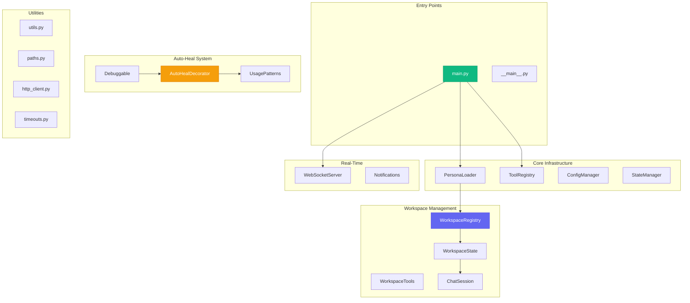

## Component Reference

### Entry Points

#### main.py

The primary entry point for the MCP server.

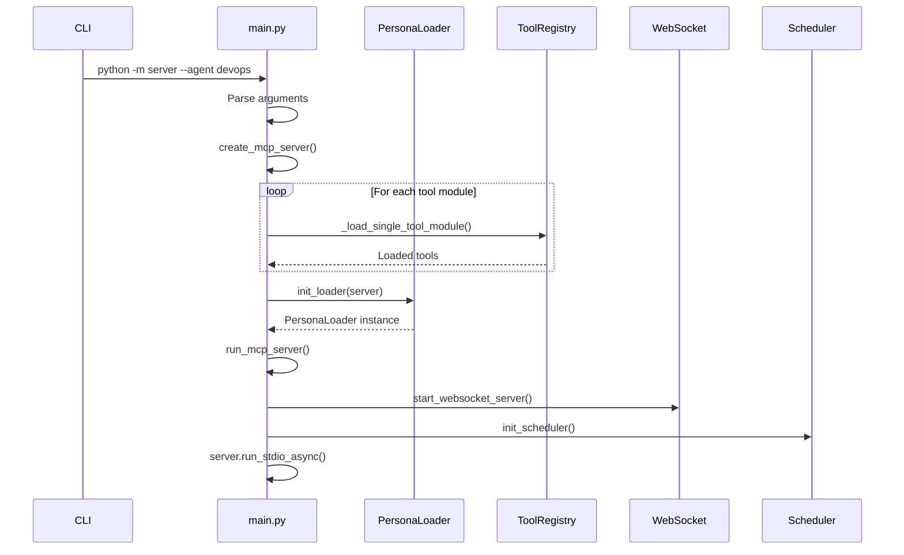

**Key Functions:**

| Function | Purpose |
|----------|---------|
| `create_mcp_server()` | Create and configure FastMCP server |
| `run_mcp_server()` | Run in stdio mode (for AI integration) |
| `init_scheduler()` | Initialize cron scheduler subsystem |

#### __main__.py

Enables `python -m server` invocation.

```python
# server/__main__.py
from .main import main
main()
```

### Core Infrastructure

#### persona_loader.py

Manages dynamic persona switching at runtime.

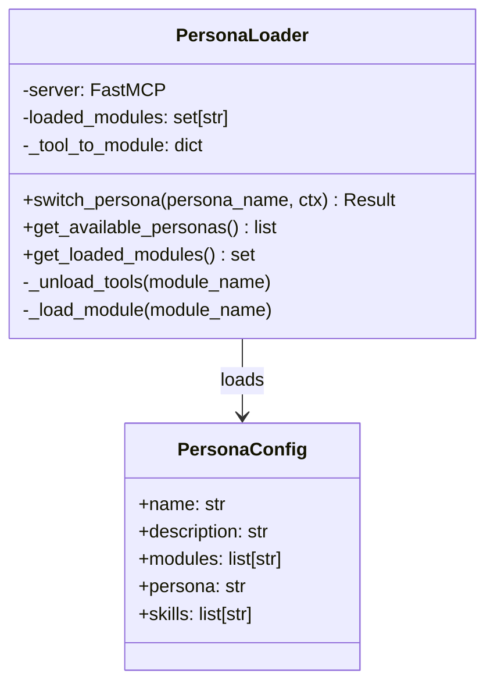

**Tool Module Discovery:**

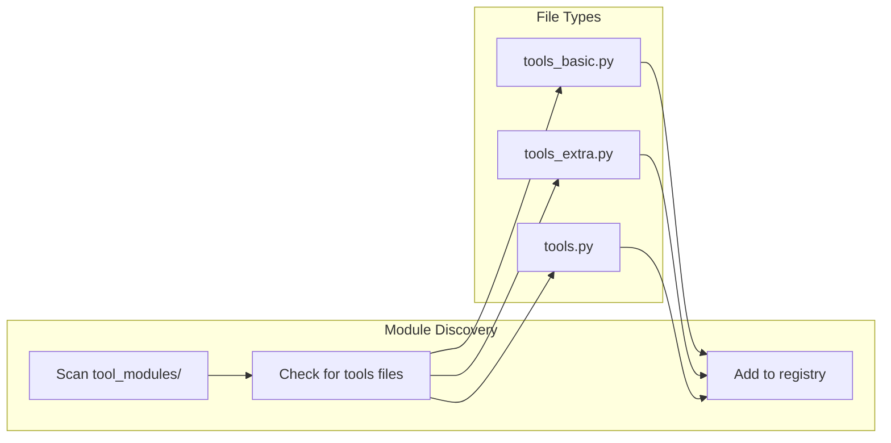

#### config.py / config_manager.py

Configuration loading and management.

```python
# config.py - Simple config access
from server.config import get_config, get_config_value

config = get_config()
jira_url = get_config_value("jira.url", "https://issues.redhat.com")
```

```mermaid
graph LR
    subgraph Sources["Config Sources"]
        JSON[config.json]
        ENV[Environment Variables]
        DEFAULTS[Defaults]
    end

    subgraph Manager["ConfigManager"]
        LOAD[Load]
        MERGE[Merge]
        CACHE[Cache]
    end

    subgraph Access["Access"]
        GET[get_config()]
        VAL[get_config_value()]
    end

    JSON --> LOAD
    ENV --> MERGE
    DEFAULTS --> MERGE
    LOAD --> MERGE
    MERGE --> CACHE
    CACHE --> GET
    CACHE --> VAL
```

#### state_manager.py

Manages persistent state across sessions.

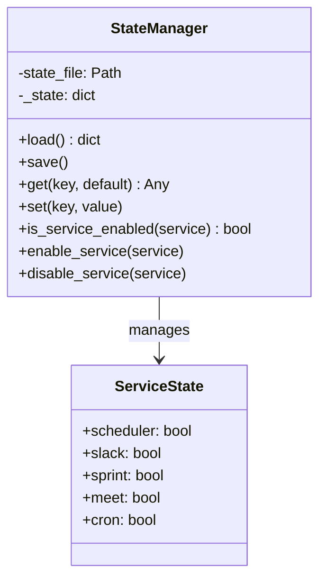

**State File Location:** `~/.config/aa-workflow/state.json`

### Workspace Management

#### workspace_state.py

Per-workspace and per-session context management.

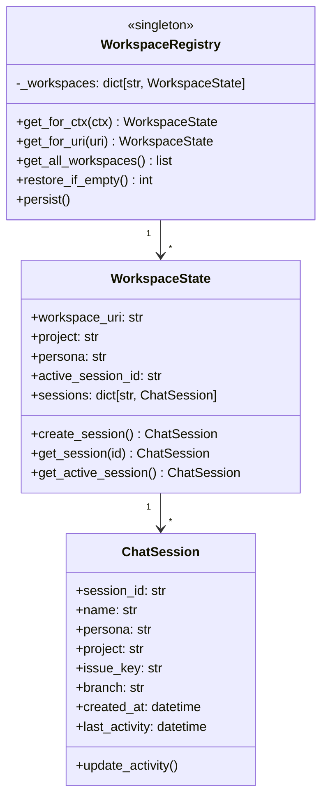

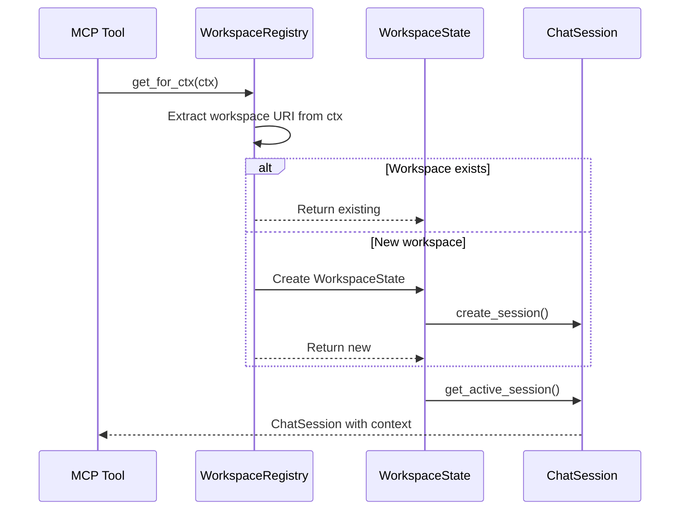

#### workspace_utils.py

Utility functions for workspace operations.

| Function | Purpose |
|----------|---------|
| `get_workspace_uri(ctx)` | Extract workspace URI from context |
| `detect_project(path)` | Auto-detect project from path |
| `format_workspace_status()` | Format status for display |

### Auto-Heal System

#### auto_heal_decorator.py

Decorator for automatic error recovery.

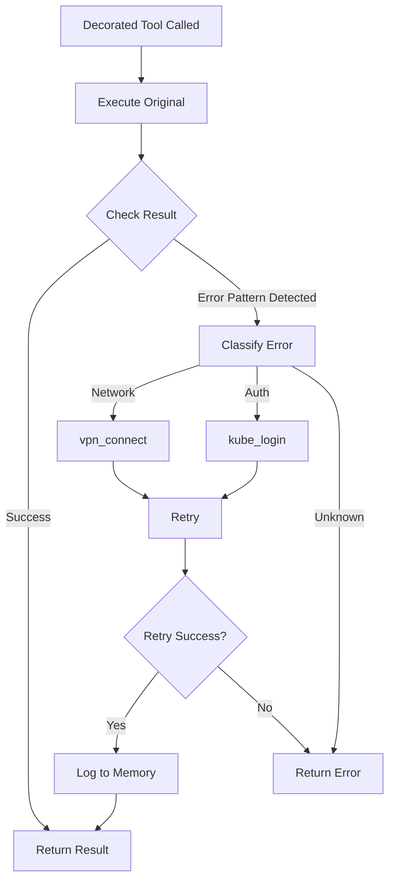

**Error Patterns:**

```python
AUTH_PATTERNS = [
    "unauthorized", "401", "forbidden", "403",
    "token expired", "authentication required",
    "not authorized", "permission denied"
]

NETWORK_PATTERNS = [
    "no route to host", "connection refused",
    "network unreachable", "timeout", "dial tcp",
    "connection reset", "eof", "cannot connect"
]
```

#### debuggable.py

Source code analysis for debugging failed tools.

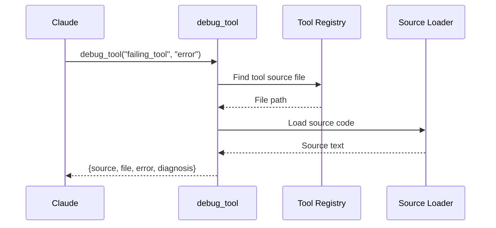

#### Usage Pattern System

Six modules for learning from usage patterns:

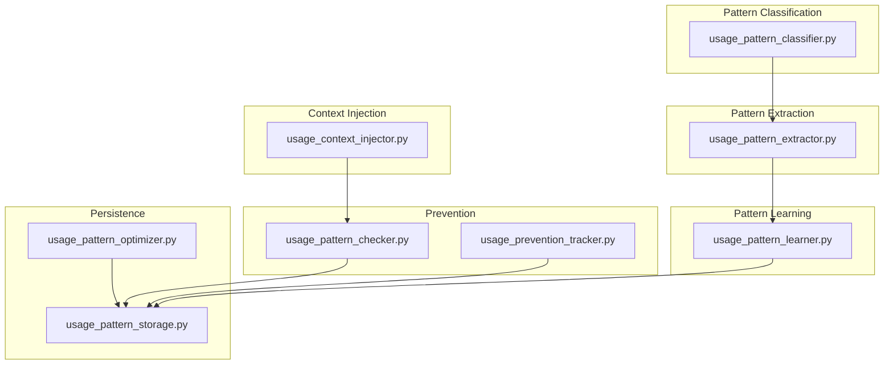

### Real-Time Communication

#### websocket_server.py

WebSocket server for real-time UI updates.

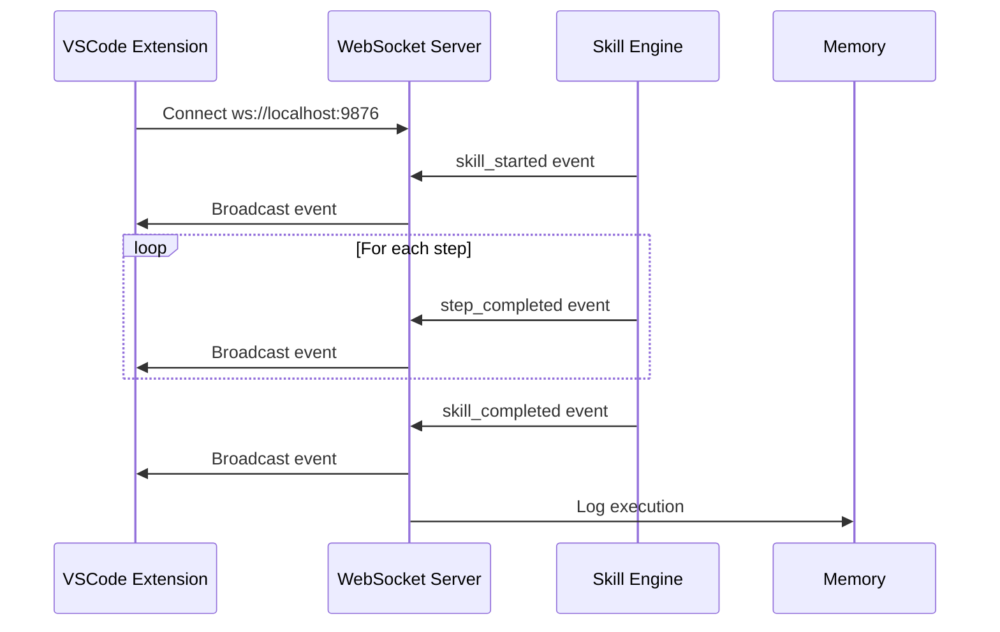

**Event Types:**

| Event | Payload |
|-------|---------|
| `skill_started` | `{skill, execution_id, inputs}` |
| `step_started` | `{step_id, step_type}` |
| `step_completed` | `{step_id, success, result, duration}` |
| `step_skipped` | `{step_id, reason}` |
| `skill_completed` | `{execution_id, success, outputs, duration}` |
| `skill_failed` | `{execution_id, error, step_id}` |
| `workspace_updated` | `{workspace_uri, sessions, persona}` |

### Utilities

#### paths.py

Centralized path management.

```python
from server.paths import (
    PROJECT_DIR,          # Root of redhat-ai-workflow
    TOOL_MODULES_DIR,     # tool_modules/
    PERSONAS_DIR,         # personas/
    SKILLS_DIR,           # skills/
    MEMORY_DIR,           # memory/
    AA_CONFIG_DIR,        # ~/.config/aa-workflow/
    WORKSPACE_STATES_FILE, # State persistence
)
```

#### utils.py

Common utility functions.

| Function | Purpose |
|----------|---------|
| `load_config()` | Load config.json |
| `run_cmd(cmd)` | Run command, return (success, output) |
| `run_cmd_full(cmd)` | Run command with full output |
| `run_cmd_shell(cmd)` | Run via shell |
| `atomic_write(path, data)` | Atomic file write |

#### http_client.py

Shared HTTP client with retry logic.

```python
from server.http_client import get_client, async_get, async_post

# Async HTTP with retries
response = await async_get("https://api.example.com/data")
```

#### timeouts.py

Centralized timeout configuration.

```python
from server.timeouts import (
    TOOL_TIMEOUT,        # Default tool timeout
    HTTP_TIMEOUT,        # HTTP request timeout
    K8S_TIMEOUT,         # Kubernetes operations
    GIT_TIMEOUT,         # Git operations
)
```

### Tool Discovery

#### tool_discovery.py

Dynamic tool module discovery.

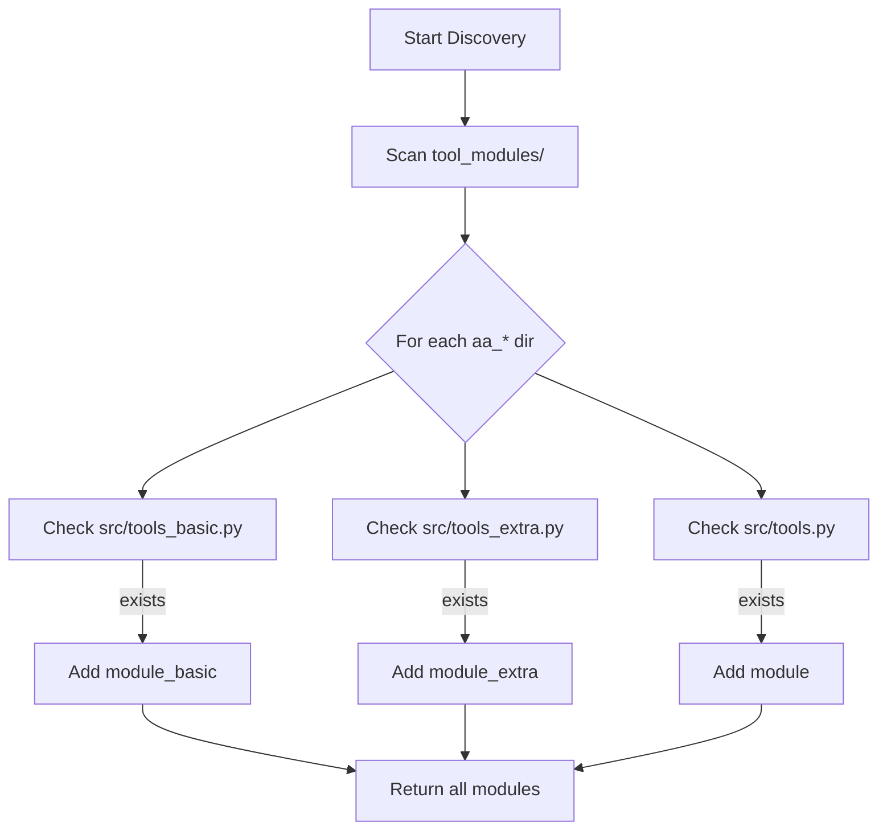

#### tool_registry.py

Tool registration and management.

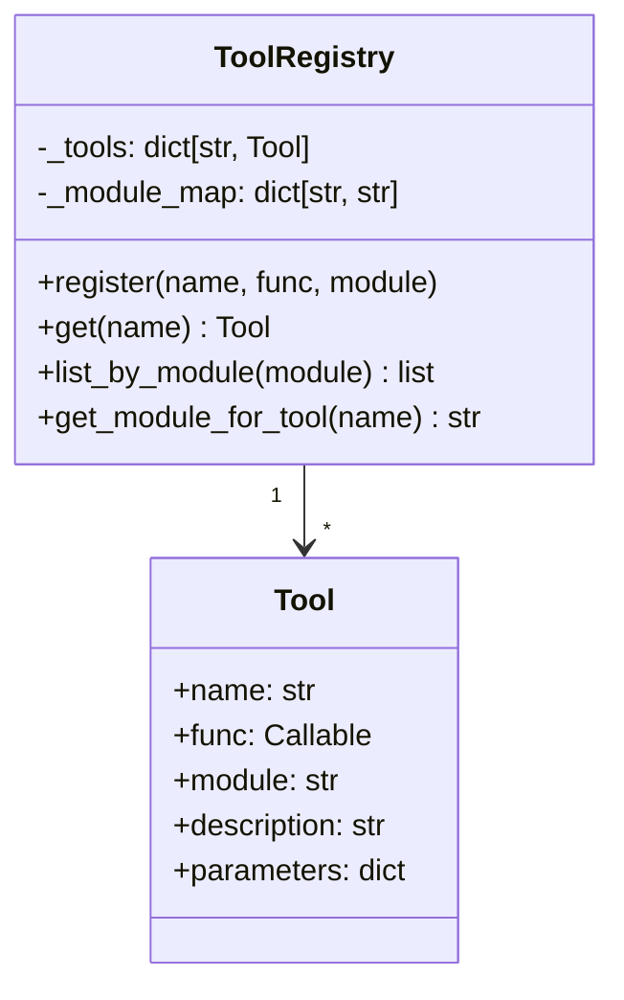

## Data Flow

### Request Processing

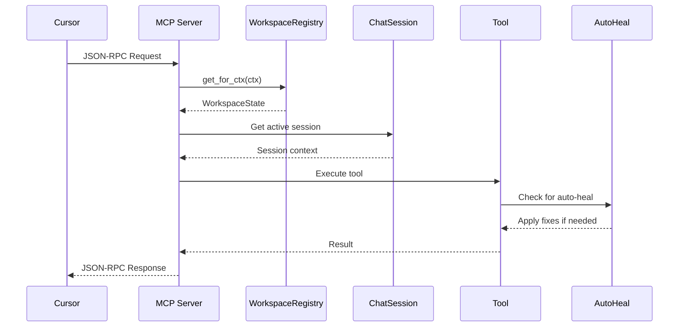

### State Persistence

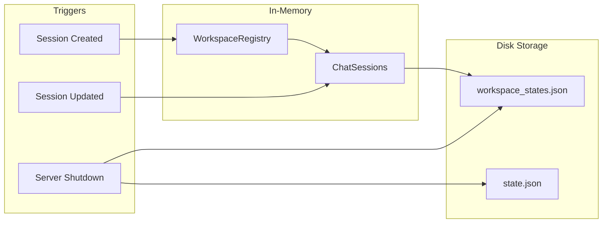

## Configuration

### Server Startup Options

```bash
# Run with specific agent
python -m server --agent devops

# Run with specific tools
python -m server --tools git,jira,gitlab

# Run all tools (may exceed limits)
python -m server --all

# Disable scheduler
python -m server --no-scheduler
```

### Environment Variables

| Variable | Purpose |
|----------|---------|
| `JIRA_JPAT` | Jira API token |
| `GITLAB_TOKEN` | GitLab API token |
| `ANTHROPIC_API_KEY` | Claude API key |
| `SLACK_BOT_TOKEN` | Slack bot token |
| `SLACK_APP_TOKEN` | Slack app token |

## File Locations

| Path | Purpose |
|------|---------|
| `~/.config/aa-workflow/` | User configuration |
| `~/.config/aa-workflow/state.json` | Service state |
| `~/.config/aa-workflow/workspace_states.json` | Session persistence |
| `~/.cache/aa-workflow/vectors/` | Vector database |
| `memory/` | Project memory files |

## See Also

- [Architecture Overview](./README.md) - System design
- [MCP Implementation](./mcp-implementation.md) - Protocol details
- [Auto-Heal System](./auto-heal.md) - Error recovery
- [Session Management](./session-management.md) - Session handling
- [State Management](./state-management.md) - Persistence patterns
