# 📋 Session Management Architecture

This document describes the multi-chat session management system that maintains independent context for each Cursor chat within a workspace.

## Overview

The AI Workflow system supports **multiple concurrent chat sessions** within a single Cursor workspace. Each chat session maintains its own:

- Session ID (UUID)
- Session name
- Active persona
- Work context (issue, branch, MR)
- Activity history

This enables users to have specialized chats for different tasks (e.g., one for coding, one for reviewing, one for deployments) while sharing the same underlying tool infrastructure.

## Architecture

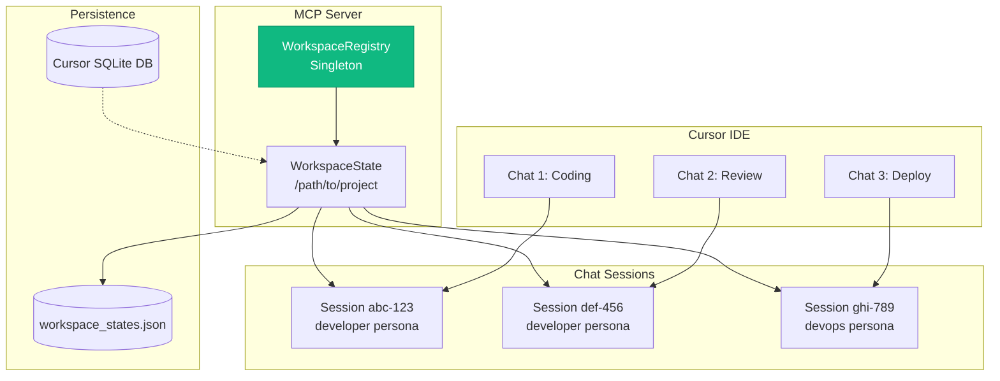

## Core Components

### WorkspaceRegistry (Singleton)

**Location**: `server/workspace_state.py`

**Purpose**: Global registry managing all workspaces and their sessions.

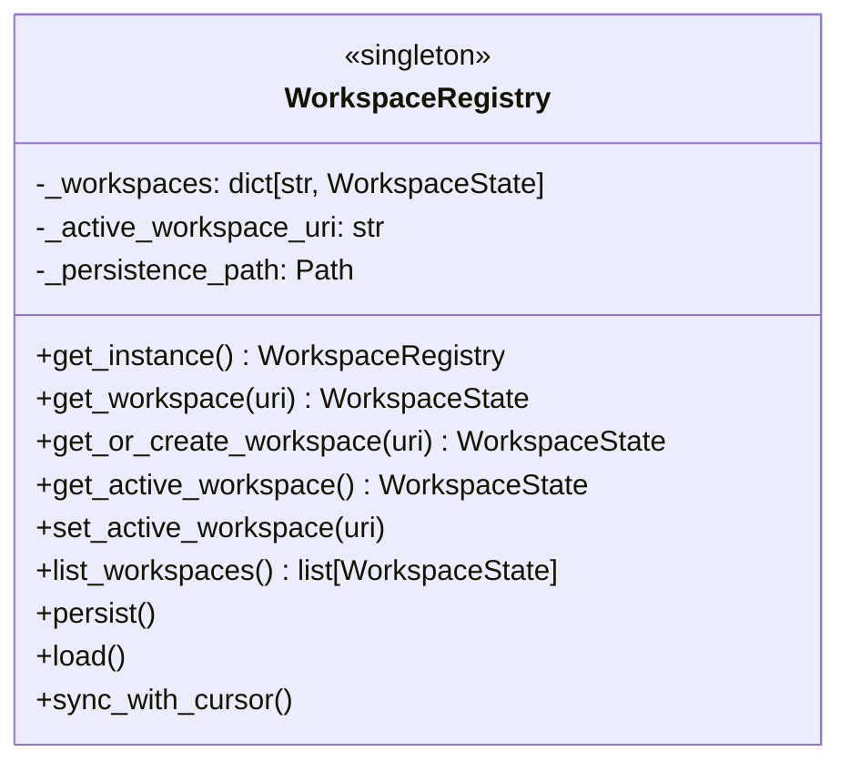

**Key Methods**:

| Method | Purpose |
|--------|---------|
| `get_instance()` | Get singleton instance |
| `get_workspace(uri)` | Get workspace by URI |
| `get_or_create_workspace(uri)` | Get or create workspace |
| `get_active_workspace()` | Get currently active workspace |
| `set_active_workspace(uri)` | Set active workspace |
| `persist()` | Save all state to disk |
| `load()` | Load state from disk |
| `sync_with_cursor()` | Sync with Cursor's database |

### WorkspaceState

**Purpose**: Represents a single Cursor workspace (folder path).

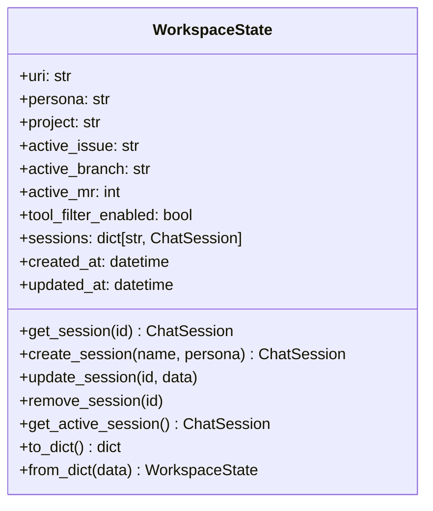

**Workspace Properties**:

| Property | Purpose |
|----------|---------|
| `uri` | Workspace folder URI (file:///path) |
| `persona` | Current persona (shared across sessions) |
| `project` | Active project name |
| `active_issue` | Current Jira issue key |
| `active_branch` | Current git branch |
| `active_mr` | Current MR ID |
| `tool_filter_enabled` | Whether tool filtering is active |
| `sessions` | Map of session_id to ChatSession |

### ChatSession

**Purpose**: Represents a single chat within a workspace.

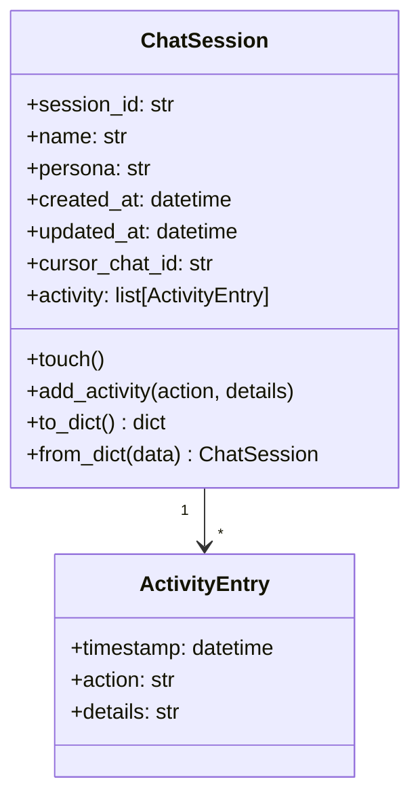

**Session Properties**:

| Property | Purpose |
|----------|---------|
| `session_id` | Unique UUID for this session |
| `name` | User-friendly name |
| `persona` | Session-specific persona (if different from workspace) |
| `created_at` | When session was created |
| `updated_at` | Last activity timestamp |
| `cursor_chat_id` | Cursor's internal chat ID (if synced) |
| `activity` | Recent activity log |

## Session Lifecycle

### Session Creation

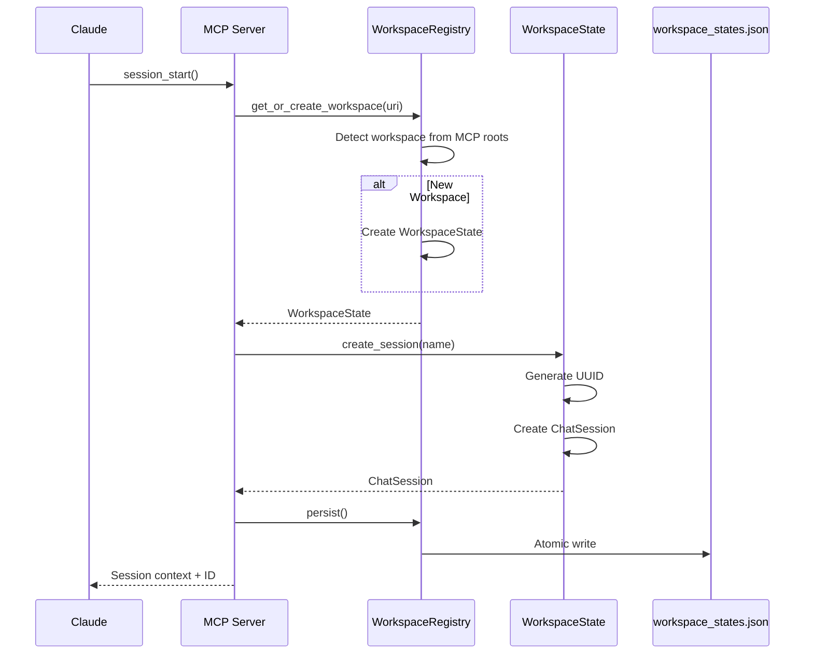

### Session Resume

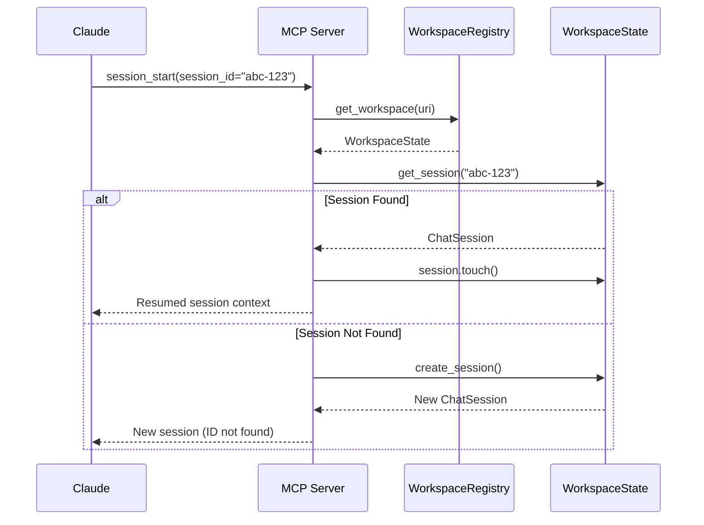

### Session Switching

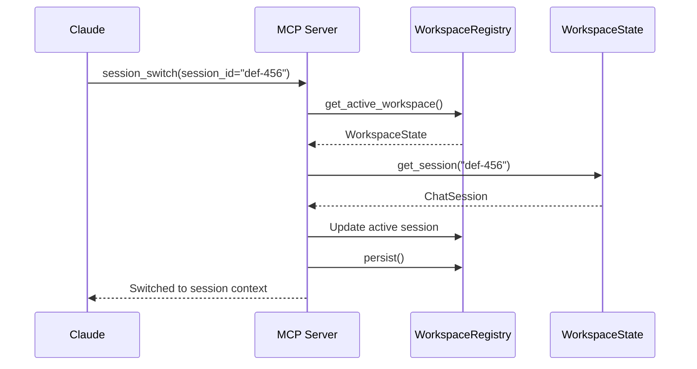

## Cursor Database Integration

The session system integrates with Cursor's internal SQLite database to:

1. **Discover existing chats** - Find chats created by the user
2. **Sync chat names** - Use Cursor's chat names
3. **Filter archived chats** - Skip deleted/archived conversations

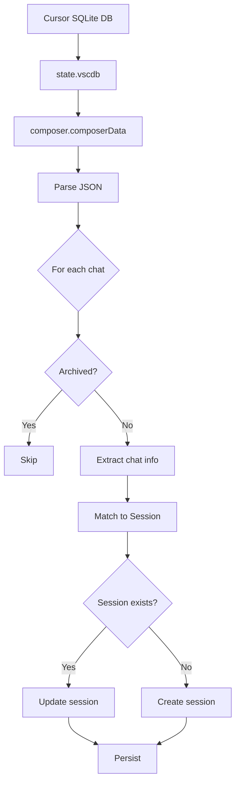

### Database Location

```
~/.config/Cursor/User/workspaceStorage/
├── <workspace-hash-1>/
│   └── state.vscdb          # SQLite database
├── <workspace-hash-2>/
│   └── state.vscdb
└── ...
```

### Data Extraction

```python
def sync_with_cursor_db(workspace_uri: str) -> None:
    """Sync sessions with Cursor's internal database."""

    # Find matching workspace storage
    cursor_storage = Path.home() / ".config/Cursor/User/workspaceStorage"

    for storage_dir in cursor_storage.iterdir():
        db_path = storage_dir / "state.vscdb"
        if not db_path.exists():
            continue

        # Check if this storage matches our workspace
        workspace_json = storage_dir / "workspace.json"
        if workspace_json.exists():
            workspace_data = json.loads(workspace_json.read_text())
            if workspace_data.get("folder") != workspace_uri:
                continue

        # Extract composer data
        conn = sqlite3.connect(str(db_path))
        cursor = conn.execute(
            "SELECT value FROM ItemTable WHERE key = 'composer.composerData'"
        )
        row = cursor.fetchone()

        if row:
            data = json.loads(row[0])
            for chat in data.get("chats", []):
                if not chat.get("archived"):
                    yield {
                        "id": chat.get("id"),
                        "name": chat.get("name", "Untitled"),
                        "updated_at": chat.get("updatedAt")
                    }

        conn.close()
```

## Persistence Format

### workspace_states.json

```json
{
  "workspaces": {
    "file:///home/user/src/project": {
      "uri": "file:///home/user/src/project",
      "persona": "developer",
      "project": "automation-analytics-backend",
      "active_issue": "AAP-12345",
      "active_branch": "aap-12345-feature",
      "active_mr": 1459,
      "tool_filter_enabled": true,
      "created_at": "2026-01-20T10:00:00Z",
      "updated_at": "2026-01-26T09:30:00Z",
      "sessions": {
        "abc-123-def-456": {
          "session_id": "abc-123-def-456",
          "name": "Working on AAP-12345",
          "persona": "developer",
          "created_at": "2026-01-25T14:00:00Z",
          "updated_at": "2026-01-26T09:30:00Z",
          "cursor_chat_id": "cursor-uuid-here",
          "activity": [
            {
              "timestamp": "2026-01-26T09:30:00Z",
              "action": "skill_run",
              "details": "Ran create_mr skill"
            }
          ]
        },
        "ghi-789-jkl-012": {
          "session_id": "ghi-789-jkl-012",
          "name": "Code Review",
          "persona": "developer",
          "created_at": "2026-01-26T08:00:00Z",
          "updated_at": "2026-01-26T08:45:00Z"
        }
      }
    }
  },
  "active_workspace": "file:///home/user/src/project",
  "global_persona": "developer",
  "version": 2,
  "updated_at": "2026-01-26T09:30:00Z"
}
```

## Session Tools

### session_start

Start a new session or resume an existing one.

```python
def session_start(
    agent: str = "",           # Optional persona to load
    project: str = "",         # Optional project context
    name: str = "",            # Optional session name
    session_id: str = ""       # Optional ID to resume
) -> dict:
    """
    Start or resume a session.

    If session_id is provided and valid, resumes that session.
    Otherwise creates a new session.

    Returns session context including:
    - session_id (save this!)
    - persona
    - project
    - active work state
    - learned patterns count
    """
```

### session_info

Get information about a session.

```python
def session_info(session_id: str = "") -> dict:
    """
    Get session information.

    If session_id provided, returns that session's info.
    Otherwise returns the workspace's active session.
    """
```

### session_list

List all sessions in the workspace.

```python
def session_list() -> list[dict]:
    """
    List all sessions in the current workspace.

    Returns list of sessions with:
    - session_id
    - name
    - persona
    - created_at
    - updated_at
    """
```

### session_rename

Rename a session.

```python
def session_rename(name: str, session_id: str = "") -> dict:
    """
    Rename a session.

    If session_id not provided, renames active session.
    """
```

### session_switch

Switch to a different session.

```python
def session_switch(session_id: str) -> dict:
    """
    Switch to a specific session.

    Updates the active session for the workspace.
    """
```

### session_sync

Sync sessions with Cursor's database.

```python
def session_sync() -> dict:
    """
    Sync MCP sessions with Cursor's internal database.

    - Adds sessions for Cursor chats without MCP sessions
    - Removes sessions for deleted Cursor chats
    - Updates session names to match Cursor
    """
```

## Multi-Chat Patterns

### Pattern 1: Task-Specific Chats

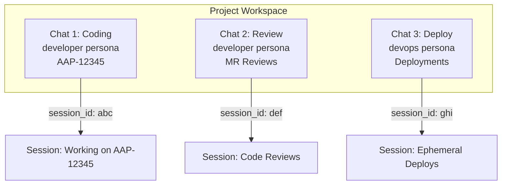

### Pattern 2: Persona Switching Within Chat

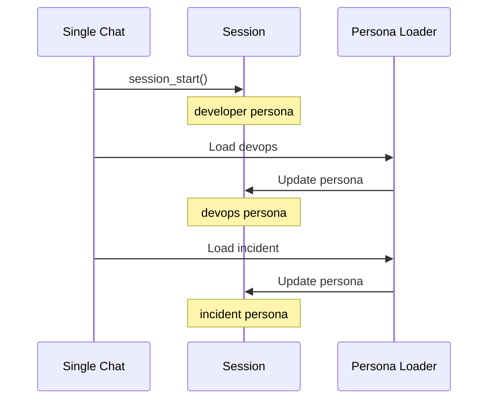

### Pattern 3: Session Handoff

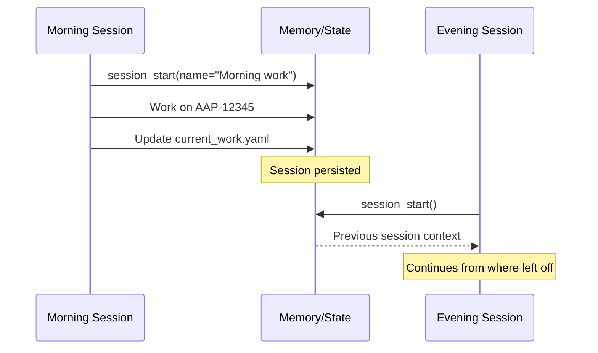

## Session Daemon Integration

The Session Daemon (`scripts/session_daemon.py`) provides:

1. **Cursor DB Watching** - Monitor for chat changes
2. **Periodic Sync** - Regular sync with workspace_states.json
3. **Full-Text Search** - Search across all chat content
4. **D-Bus Interface** - External control and queries

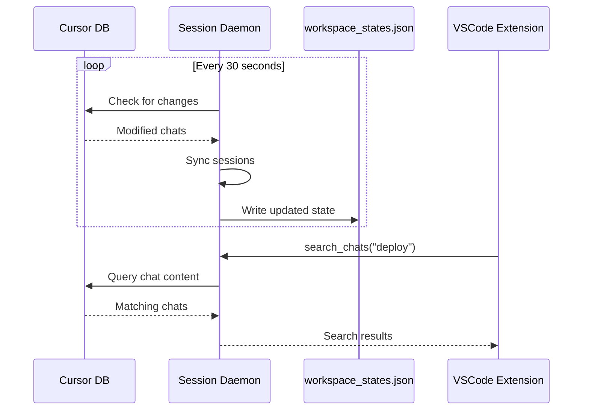

## Best Practices

### 1. Always Use session_id

```python
# Start a session and save the ID
result = session_start(name="Working on feature")
my_session_id = result['session_id']

# Later, use the ID to resume
session_start(session_id=my_session_id)
```

### 2. Name Sessions Descriptively

```python
# Good names
session_start(name="AAP-12345 - API refactor")
session_start(name="Code review - MR 1459")
session_start(name="Deploy to stage")

# Bad names
session_start(name="Chat 1")
session_start(name="Work")
```

### 3. Check Session Before Operations

```python
# Get current session context
info = session_info(session_id=my_id)
if info['persona'] != 'devops':
    # Load correct persona for deployment
    persona_load('devops')
```

### 4. Handle Session Not Found

```python
result = session_start(session_id="old-session-id")
if result.get('resumed') is False:
    # Session was not found, new one created
    print(f"Started new session: {result['session_id']}")
```

## See Also

- [Architecture Overview](./README.md) - System overview
- [State Management](./state-management.md) - Persistence patterns
- [Daemon Architecture](./daemons.md) - Session daemon details
- [VSCode Extension](./vscode-extension.md) - UI integration
