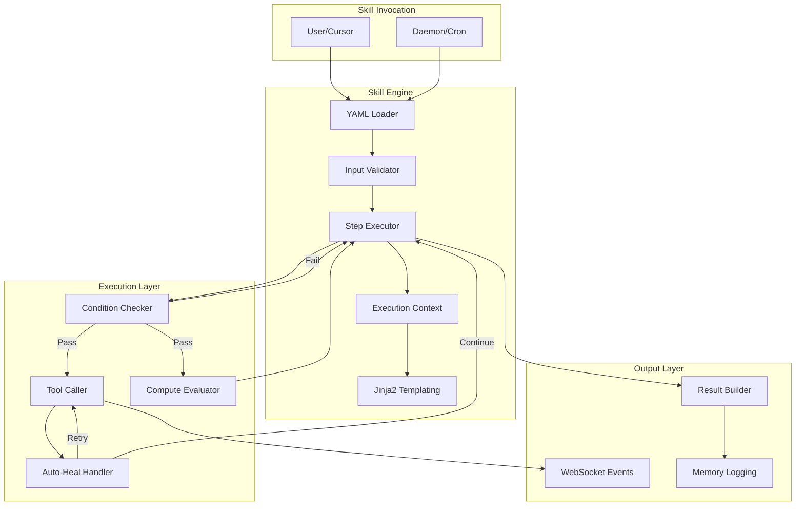
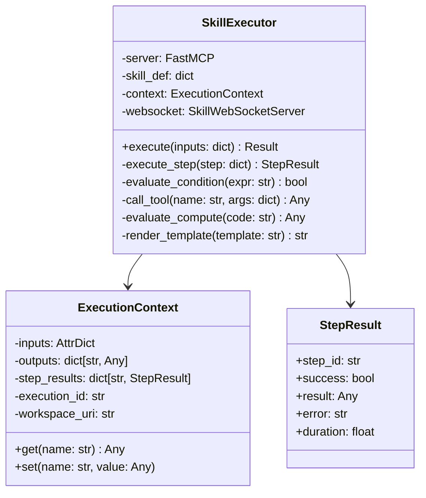
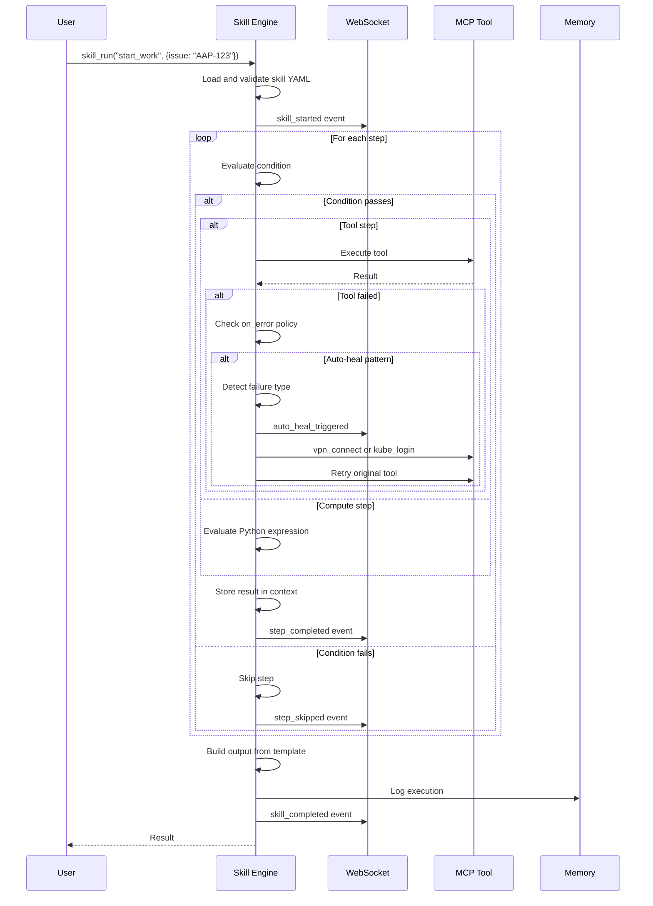
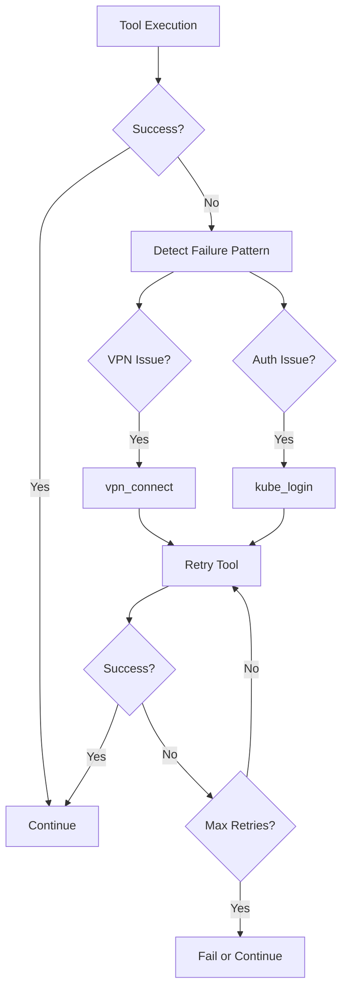

# Skill Engine Architecture

The Skill Engine is the core workflow execution system that processes YAML-defined skills, executing multi-step workflows with conditional logic, auto-healing, and real-time progress reporting.

## Overview



## Key Components

### SkillExecutor Class

The main executor that processes skill definitions step-by-step.



### AttrDict

Special dictionary that enables attribute-style access in skill expressions:

```python
# In skill YAML
args:
  issue_key: "{{ inputs.issue_key }}"  # inputs.issue_key instead of inputs["issue_key"]
  branch: "{{ get_issue.branch }}"      # get_issue.branch instead of get_issue["branch"]
```

## Skill YAML Structure

### Complete Skill Definition

```yaml
# Skill metadata
name: start_work
description: Begin work on a Jira issue with branch creation
version: "1.0"
author: "AI Workflow"

# Input parameters
inputs:
  - name: issue_key
    type: string
    required: true
    description: Jira issue key (e.g., AAP-12345)
    pattern: "^[A-Z]+-\\d+$"

  - name: branch_prefix
    type: string
    required: false
    default: "feature"
    enum: ["feature", "fix", "hotfix", "chore"]

# Execution steps
steps:
  # Step 1: Tool call
  - id: get_issue
    tool: jira_view_issue
    args:
      issue_key: "{{ inputs.issue_key }}"
    output: issue_data
    on_error: fail

  # Step 2: Compute step (Python evaluation)
  - id: build_branch_name
    compute: |
      issue_type = issue_data.get("type", "task").lower()
      summary = issue_data.get("summary", "work")[:40]
      slug = summary.lower().replace(" ", "-").replace("/", "-")
      result = f"{inputs.branch_prefix}/{inputs.issue_key}-{slug}"
    output: branch_name

  # Step 3: Conditional step
  - id: check_existing_branch
    tool: git_branch_exists
    args:
      branch: "{{ branch_name }}"
    on_error: continue

  # Step 4: Skip if branch exists
  - id: create_branch
    condition: "not check_existing_branch or '✅' not in str(check_existing_branch)"
    tool: git_create_branch
    args:
      branch: "{{ branch_name }}"
      from_branch: main
    on_error: continue

  # ========== AUTO-HEAL PATTERN ==========
  - id: detect_failure
    condition: "create_branch and '❌' in str(create_branch)"
    compute: |
      error_text = str(create_branch)[:300].lower()
      result = {
        "needs_vpn": any(x in error_text for x in ['no route', 'timeout', 'network']),
        "needs_auth": any(x in error_text for x in ['unauthorized', '401', 'forbidden']),
      }
    output: failure_info

  - id: fix_vpn
    condition: "failure_info and failure_info.get('needs_vpn')"
    tool: vpn_connect
    on_error: continue

  - id: fix_auth
    condition: "failure_info and failure_info.get('needs_auth')"
    tool: kube_login
    args:
      cluster: ephemeral
    on_error: continue

  - id: retry_create_branch
    condition: "failure_info"
    tool: git_create_branch
    args:
      branch: "{{ branch_name }}"
      from_branch: main
    output: create_branch_retry
  # ========== END AUTO-HEAL ==========

  # Step 5: Update Jira
  - id: transition_issue
    tool: jira_transition
    args:
      issue_key: "{{ inputs.issue_key }}"
      status: "In Progress"

# Output definition
outputs:
  branch: "{{ branch_name }}"
  issue: "{{ issue_data }}"
  success: true

# Optional: Confirmation prompts
confirmations:
  - step: create_branch
    message: "Create branch {{ branch_name }}?"
    default: true
```

## Step Types

### 1. Tool Steps

Execute an MCP tool and capture the result:

```yaml
- id: get_pods
  tool: k8s_get_pods
  args:
    namespace: "{{ namespace }}"
    selector: "app=myapp"
  output: pods
  on_error: continue
  timeout: 30
```

### 2. Compute Steps

Execute Python code inline:

```yaml
- id: analyze_pods
  compute: |
    healthy = [p for p in pods if p.get("status") == "Running"]
    unhealthy = [p for p in pods if p.get("status") != "Running"]
    result = {
      "healthy_count": len(healthy),
      "unhealthy_count": len(unhealthy),
      "unhealthy_pods": [p["name"] for p in unhealthy]
    }
  output: pod_analysis
```

### 3. Conditional Steps

Only execute when condition is true:

```yaml
- id: restart_pods
  condition: "pod_analysis.unhealthy_count > 0"
  tool: k8s_restart_pods
  args:
    pods: "{{ pod_analysis.unhealthy_pods }}"
```

### 4. Loop Steps

Iterate over collections:

```yaml
- id: process_issues
  loop: "{{ issues }}"
  loop_var: issue
  tool: jira_update_issue
  args:
    issue_key: "{{ issue.key }}"
    status: "In Review"
```

## Execution Flow



## Error Handling

### on_error Policies

| Policy | Behavior |
|--------|----------|
| `fail` | Stop execution immediately (default) |
| `continue` | Log error and continue to next step |
| `retry:N` | Retry up to N times before failing |

### Auto-Heal Pattern

Skills can include auto-heal blocks that detect common failures and attempt recovery:



### Failure Detection Patterns

```yaml
compute: |
  error_text = str(tool_result)[:500].lower()
  result = {
    # Network failures
    "needs_vpn": any(x in error_text for x in [
      'no route', 'timeout', 'connection refused', 'network unreachable'
    ]),
    # Authentication failures
    "needs_auth": any(x in error_text for x in [
      'unauthorized', '401', '403', 'forbidden', 'token expired'
    ]),
    # Quota/limit failures
    "quota_exceeded": 'quota' in error_text or 'limit' in error_text,
    # Resource not found
    "not_found": '404' in error_text or 'not found' in error_text,
  }
```

## Templating

Skills use Jinja2 templating for dynamic values:

### Variable References

```yaml
args:
  # Simple reference
  issue_key: "{{ inputs.issue_key }}"

  # Nested access
  branch: "{{ issue_data.fields.customfield_123 }}"

  # Default values
  namespace: "{{ namespace | default('default') }}"

  # Filters
  slug: "{{ summary | lower | replace(' ', '-') }}"
```

### Conditional Expressions

```yaml
condition: "pods and len(pods) > 0"
condition: "status == 'running' and health.ready"
condition: "not (error and 'fatal' in error)"
```

### Complex Templates

```yaml
compute: |
  # Full Python is available in compute blocks
  import json
  from datetime import datetime

  result = {
    "timestamp": datetime.now().isoformat(),
    "summary": f"Processed {len(items)} items",
    "data": json.dumps(items)
  }
```

## WebSocket Events

The skill engine broadcasts execution events via WebSocket for real-time UI updates:

### Event Types

| Event | Payload | Description |
|-------|---------|-------------|
| `skill_started` | `{skill, execution_id, inputs}` | Skill execution began |
| `step_started` | `{step_id, step_type}` | Step starting |
| `step_completed` | `{step_id, success, result, duration}` | Step finished |
| `step_skipped` | `{step_id, reason}` | Step condition not met |
| `auto_heal_triggered` | `{step_id, failure_type, action}` | Auto-heal in progress |
| `confirmation_required` | `{step_id, message, options}` | User decision needed |
| `skill_completed` | `{execution_id, success, outputs, duration}` | Skill finished |
| `skill_failed` | `{execution_id, error, step_id}` | Skill error |

### WebSocket Connection

```typescript
// VSCode Extension client
const ws = new WebSocket('ws://localhost:9876');

ws.onmessage = (event) => {
  const data = JSON.parse(event.data);

  switch (data.type) {
    case 'skill_started':
      showSkillPanel(data.skill);
      break;
    case 'step_completed':
      updateStepStatus(data.step_id, data.success);
      break;
    case 'skill_completed':
      showCompletionToast(data.outputs);
      break;
  }
};
```

## Memory Integration

Skills automatically log execution to memory:

```yaml
# Logged to memory/sessions/{date}.yaml
- action: "Skill: start_work"
  timestamp: "2026-01-26T13:00:00Z"
  details: |
    issue_key: AAP-12345
    result: success
    branch: feature/AAP-12345-add-billing
```

## Performance Considerations

### Parallel Step Execution

Steps without dependencies can be executed in parallel:

```yaml
steps:
  - id: step_a
    tool: tool_a
    parallel_group: 1

  - id: step_b
    tool: tool_b
    parallel_group: 1  # Runs parallel with step_a

  - id: step_c
    tool: tool_c
    depends_on: [step_a, step_b]  # Waits for both
```

### Caching

Tool results can be cached to avoid redundant calls:

```yaml
- id: get_config
  tool: get_app_config
  cache: 300  # Cache for 5 minutes
```

## Security

### Input Validation

All inputs are validated against their type and constraints:

```yaml
inputs:
  - name: command
    type: string
    pattern: "^[a-zA-Z0-9_-]+$"  # No shell injection
    max_length: 100
```

### Sandboxed Compute

Compute blocks run in a restricted environment:
- No file system access
- No network calls
- Limited builtins
- Timeout enforcement

## Creating Skills

### Quick Start

1. Create `skills/my_skill.yaml`
2. Define inputs and steps
3. Add auto-heal for external calls
4. Test with `skill_run("my_skill", {inputs})`
5. Create Cursor command in `.cursor/commands/my-skill.md`

### Best Practices

1. **Always add auto-heal** for tools that access external services
2. **Use descriptive step IDs** for debugging
3. **Set appropriate on_error policies** - don't hide failures
4. **Include confirmation steps** for destructive actions
5. **Log important outcomes** to memory for future reference

## See Also

- [Skills Reference](../skills/README.md) - All available skills
- [MCP Implementation](./mcp-implementation.md) - Tool architecture
- [WebSocket Protocol](./websocket-protocol.md) - Real-time events
- [Development Guide](../DEVELOPMENT.md) - Creating new skills
