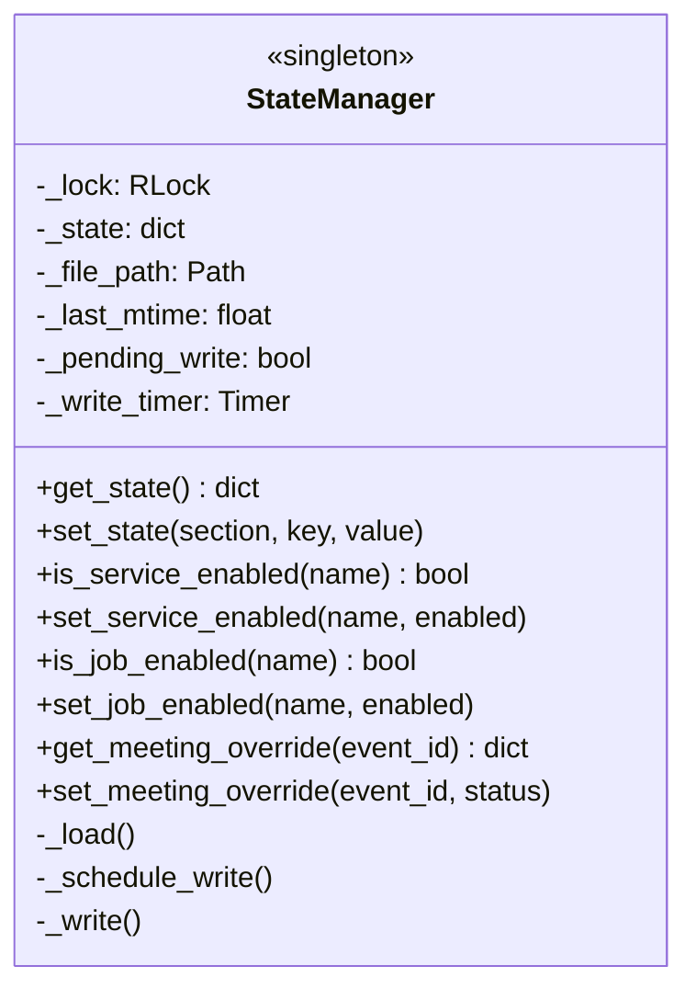
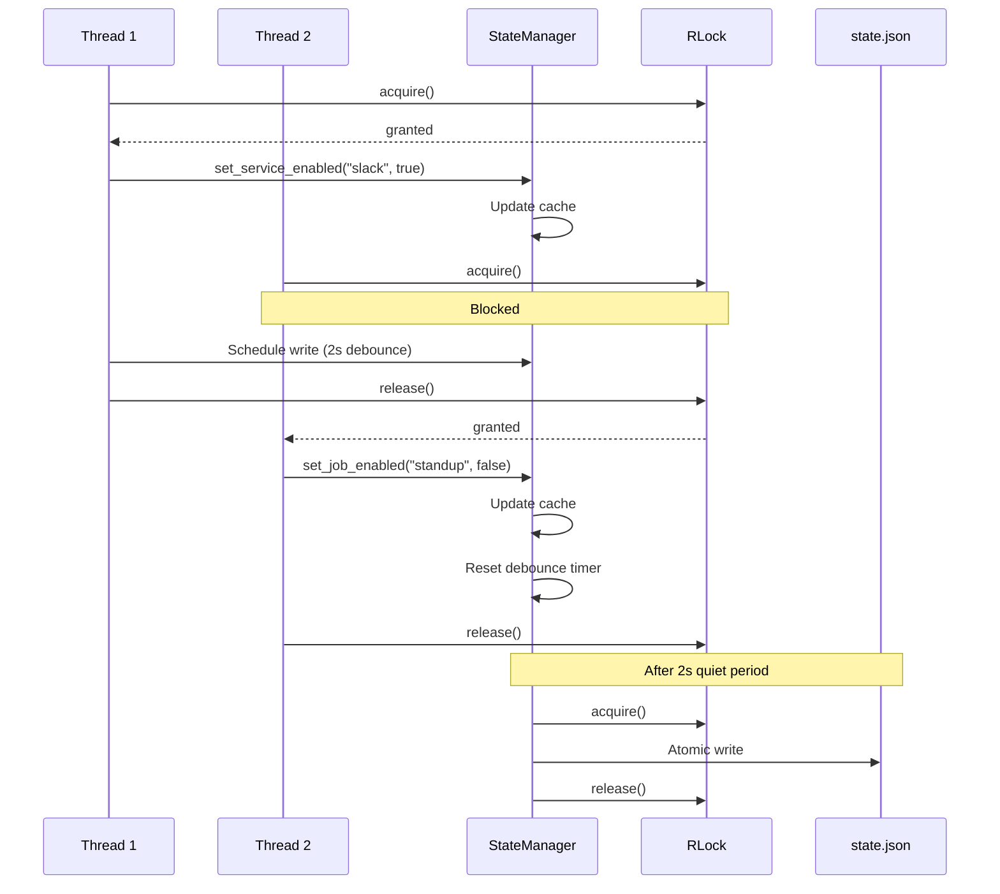
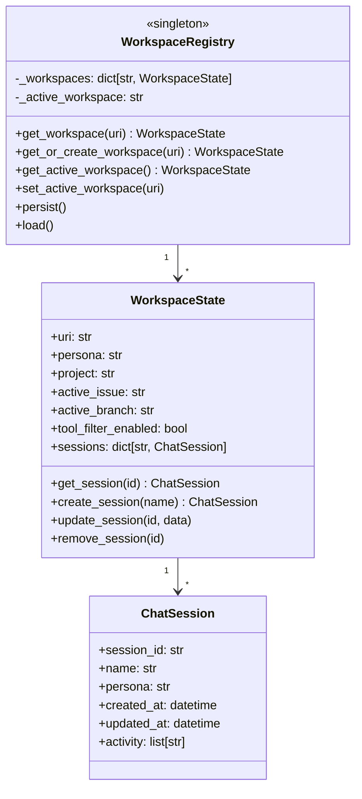
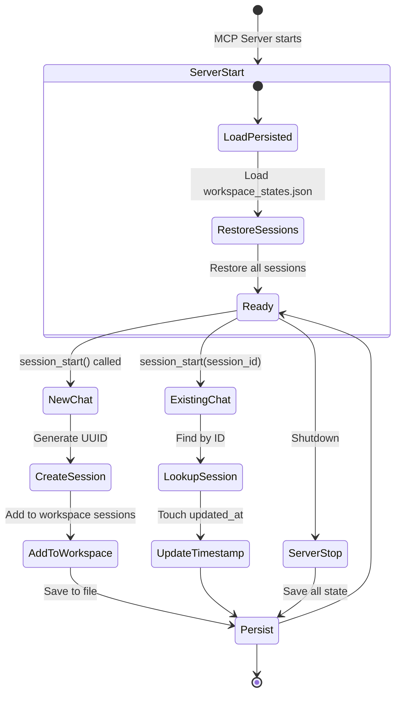
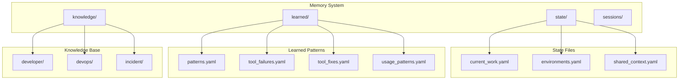
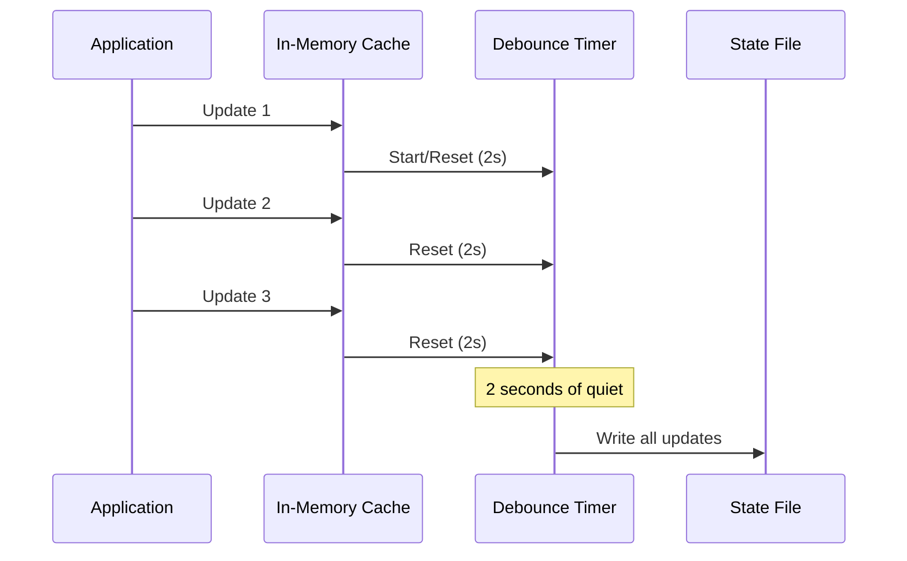
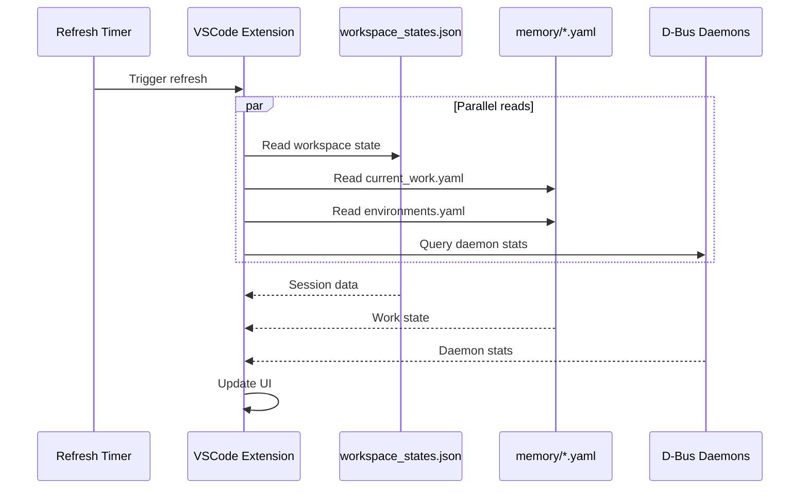
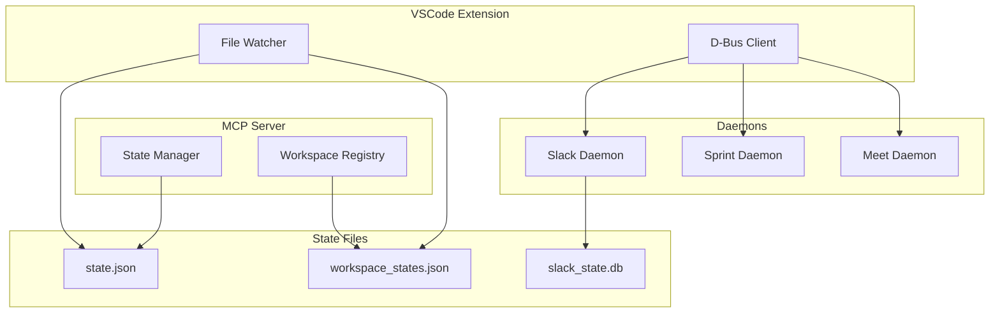

# 📊 State Management Architecture

This document describes the state management patterns used throughout the AI Workflow system, including file-based persistence, thread safety, and atomic writes.

## Overview

The AI Workflow system uses a layered state management approach:

1. **Runtime State** - In-memory caches with periodic persistence
2. **Configuration State** - Static `config.json` loaded at startup
3. **Memory State** - YAML files for persistent context
4. **Daemon State** - Per-daemon JSON/SQLite state files

## State File Locations

All state files are centralized in `~/.config/aa-workflow/`:

```
~/.config/aa-workflow/
├── state.json                # Runtime toggles (StateManager)
├── workspace_states.json     # Sessions and workspace context
├── session_state.json        # Session daemon state
├── sprint_state_v2.json      # Sprint bot state
├── meet_state.json           # Meeting daemon state
├── cron_state.json           # Cron daemon state
├── slack_state.db            # Slack message history (SQLite)
├── meetings.db               # Meeting transcripts (SQLite)
├── performance/              # Quarterly performance data
│   └── q1_2026.yaml
└── meet_bot/                 # Meet bot assets
    ├── audio/
    ├── clips/
    └── models/
```

## Core Components

### StateManager (`server/state_manager.py`)

The `StateManager` is a singleton that manages runtime toggles for services, jobs, and meeting overrides.



#### State Structure

```json
{
  "services": {
    "scheduler": true,
    "sprint_bot": true,
    "google_calendar": true,
    "gmail": false
  },
  "jobs": {
    "daily_standup": true,
    "weekly_summary": false
  },
  "meetings": {
    "event_123": {
      "status": "skip",
      "reason": "Vacation",
      "timestamp": "2026-01-26T10:00:00Z"
    }
  }
}
```

#### Thread Safety



#### Debounced Writes

```python
def _schedule_write(self):
    """Schedule a write after debounce period."""
    if self._write_timer:
        self._write_timer.cancel()

    self._write_timer = Timer(2.0, self._write)
    self._write_timer.start()
    self._pending_write = True
```

#### File Locking

```python
def _write(self):
    """Perform atomic write with file locking."""
    with self._lock:
        # Acquire exclusive file lock
        with open(self._file_path, 'w') as f:
            fcntl.flock(f.fileno(), fcntl.LOCK_EX)
            try:
                json.dump(self._state, f, indent=2)
            finally:
                fcntl.flock(f.fileno(), fcntl.LOCK_UN)

        self._pending_write = False
        self._last_mtime = self._file_path.stat().st_mtime
```

### WorkspaceRegistry (`server/workspace_state.py`)

Manages per-workspace and per-session state for multi-chat support.



#### Session State Flow



#### Cursor Database Integration

```python
def _sync_with_cursor_db(self, workspace_path: str) -> None:
    """Sync sessions with Cursor's internal database."""
    # Find Cursor workspace storage
    cursor_storage = Path.home() / ".config/Cursor/User/workspaceStorage"

    for storage_dir in cursor_storage.iterdir():
        state_db = storage_dir / "state.vscdb"
        if not state_db.exists():
            continue

        # Read composer data
        conn = sqlite3.connect(str(state_db))
        cursor = conn.execute(
            "SELECT value FROM ItemTable WHERE key = 'composer.composerData'"
        )
        row = cursor.fetchone()
        if row:
            data = json.loads(row[0])
            # Extract chat information
            for chat in data.get("chats", []):
                if not chat.get("archived"):
                    self._update_session_from_cursor(chat)
```

### Memory System (`memory/`)

YAML-based persistent context organized by category:



#### Memory File Formats

**current_work.yaml**:
```yaml
active_issues:
  - key: AAP-12345
    summary: Implement feature X
    status: In Progress
    branch: aap-12345-feature-x
    started_at: 2026-01-26T10:00:00Z

active_mrs:
  - id: 1459
    title: "AAP-12345: Implement feature X"
    status: open
    pipeline: running
    url: https://gitlab.com/...

follow_ups:
  - Check test coverage
  - Update documentation
```

**tool_failures.yaml**:
```yaml
auto_heal_stats:
  total_heals: 42
  vpn_heals: 28
  auth_heals: 14
  last_heal: 2026-01-26T09:30:00Z

recent_failures:
  - tool: bonfire_namespace_reserve
    error: "No route to host"
    healed: true
    fix_type: vpn
    timestamp: 2026-01-26T09:30:00Z
```

### Daemon State Files

Each daemon maintains its own state file:

#### Sprint State (`sprint_state_v2.json`)

```json
{
  "enabled": true,
  "current_issue": "AAP-12345",
  "issues": {
    "AAP-12345": {
      "status": "processing",
      "approved": true,
      "started_at": "2026-01-26T10:00:00Z",
      "execution_trace": [...]
    }
  },
  "stats": {
    "total_processed": 15,
    "successful": 12,
    "failed": 3
  },
  "updated_at": "2026-01-26T10:30:00Z"
}
```

#### Meet State (`meet_state.json`)

```json
{
  "schedulerRunning": true,
  "currentMeetings": [],
  "upcomingMeetings": [
    {
      "event_id": "abc123",
      "title": "Team Standup",
      "start": "2026-01-26T09:00:00Z",
      "calendar": "work@example.com",
      "mode": "notes"
    }
  ],
  "monitoredCalendars": [
    "work@example.com",
    "personal@example.com"
  ],
  "nextMeeting": {...},
  "countdown": "1h 30m",
  "lastPoll": "2026-01-26T08:30:00Z"
}
```

#### Cron State (`cron_state.json`)

```json
{
  "enabled": true,
  "timezone": "America/New_York",
  "execution_mode": "claude_cli",
  "jobs": [
    {
      "name": "daily_standup",
      "skill": "coffee",
      "cron": "0 9 * * MON-FRI",
      "enabled": true,
      "next_run": "2026-01-27T09:00:00Z",
      "last_run": "2026-01-26T09:00:00Z",
      "last_status": "success"
    }
  ],
  "history": [
    {
      "job": "daily_standup",
      "started_at": "2026-01-26T09:00:00Z",
      "completed_at": "2026-01-26T09:02:30Z",
      "status": "success"
    }
  ],
  "updated_at": "2026-01-26T09:02:30Z"
}
```

## Persistence Patterns

### Atomic Writes

All state files use atomic writes to prevent corruption:

```python
def atomic_write(path: Path, data: dict) -> None:
    """Write data atomically using temp file + rename."""
    temp_path = path.with_suffix('.tmp')

    # Write to temp file
    with open(temp_path, 'w') as f:
        json.dump(data, f, indent=2)
        f.flush()
        os.fsync(f.fileno())  # Ensure data hits disk

    # Atomic rename (POSIX guarantees atomicity)
    temp_path.rename(path)
```

### File Watching

Components can watch for external file changes:

```python
class FileWatcher:
    def __init__(self, path: Path, callback: Callable):
        self.path = path
        self.callback = callback
        self._last_mtime = 0

    def check(self) -> bool:
        """Check if file has been modified externally."""
        try:
            current_mtime = self.path.stat().st_mtime
            if current_mtime > self._last_mtime:
                self._last_mtime = current_mtime
                self.callback()
                return True
        except FileNotFoundError:
            pass
        return False
```

### Debounced Persistence

High-frequency updates are debounced to reduce I/O:



## Configuration Management

### ConfigManager (`server/config_manager.py`)

Thread-safe singleton for `config.json` access:

```python
class ConfigManager:
    """Thread-safe configuration manager with caching."""

    _instance = None
    _lock = threading.Lock()

    def __new__(cls):
        if cls._instance is None:
            with cls._lock:
                if cls._instance is None:
                    cls._instance = super().__new__(cls)
                    cls._instance._load()
        return cls._instance

    def get(self, section: str, key: str = None, default=None):
        """Get config value with optional default."""
        data = self._config.get(section, {})
        if key:
            return data.get(key, default)
        return data

    def reload(self):
        """Force config reload."""
        with self._lock:
            self._load()
```

### Config Sections

| Section | Purpose |
|---------|---------|
| `repositories` | Project paths and GitLab settings |
| `jira` | Jira URL and project mappings |
| `kubernetes` | Kubeconfig paths per environment |
| `slack` | Tokens, channels, alert channels |
| `google` | Calendar API credentials |
| `user` | Username, email, aliases |
| `commit` | Commit message format |
| `schedules` | Cron job definitions |
| `personas` | Tool module mappings |

## State Synchronization

### VSCode Extension Sync

The extension reads state files for UI updates:



### Cross-Process Coordination

Multiple processes coordinate via file watching:



## Best Practices

### 1. Use Appropriate Storage

| Data Type | Storage | Example |
|-----------|---------|---------|
| Runtime toggles | StateManager | Service enabled flags |
| Session context | WorkspaceRegistry | Per-chat state |
| Persistent context | Memory YAML | Active work |
| Learned patterns | Memory YAML | Error patterns |
| Message history | SQLite | Slack messages |
| Meeting transcripts | SQLite | Meeting notes |

### 2. Handle Concurrent Access

```python
# Always use locks for shared state
with self._lock:
    self._state['key'] = value
    self._schedule_write()

# Use atomic reads for file access
def read_atomic(path: Path) -> dict:
    with open(path, 'r') as f:
        fcntl.flock(f.fileno(), fcntl.LOCK_SH)
        try:
            return json.load(f)
        finally:
            fcntl.flock(f.fileno(), fcntl.LOCK_UN)
```

### 3. Debounce High-Frequency Writes

```python
# Debounce writes to reduce I/O
def update(self, key: str, value: Any):
    self._cache[key] = value
    if self._write_timer:
        self._write_timer.cancel()
    self._write_timer = Timer(2.0, self._persist)
    self._write_timer.start()
```

### 4. Validate State on Load

```python
def _load(self) -> dict:
    """Load state with validation."""
    try:
        with open(self._path) as f:
            state = json.load(f)

        # Validate schema
        if not self._validate(state):
            return self._default_state()

        return state
    except (FileNotFoundError, json.JSONDecodeError):
        return self._default_state()
```

## See Also

- [Architecture Overview](./README.md) - System overview
- [Daemon Architecture](./daemons.md) - Background services
- [Session Management](./session-management.md) - Multi-chat handling
- [Memory System](./memory-system.md) - Persistent context
