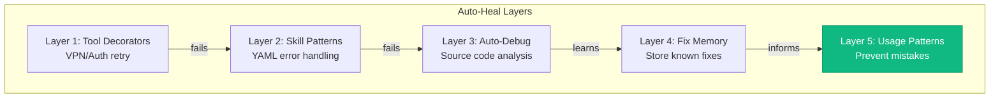
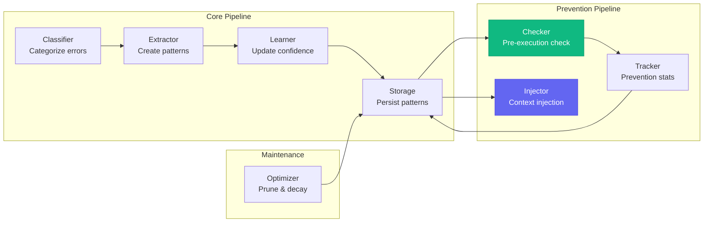
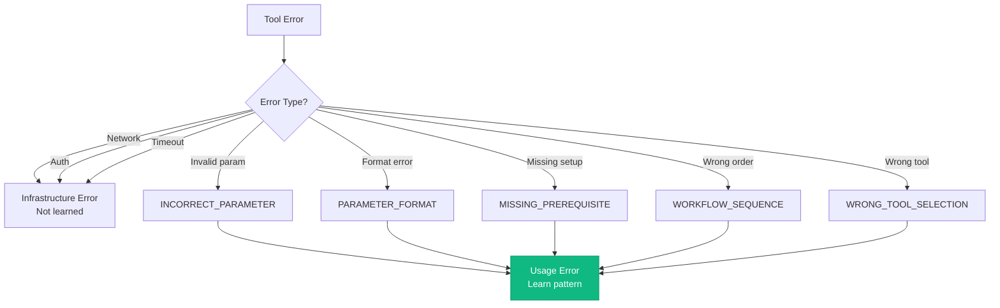
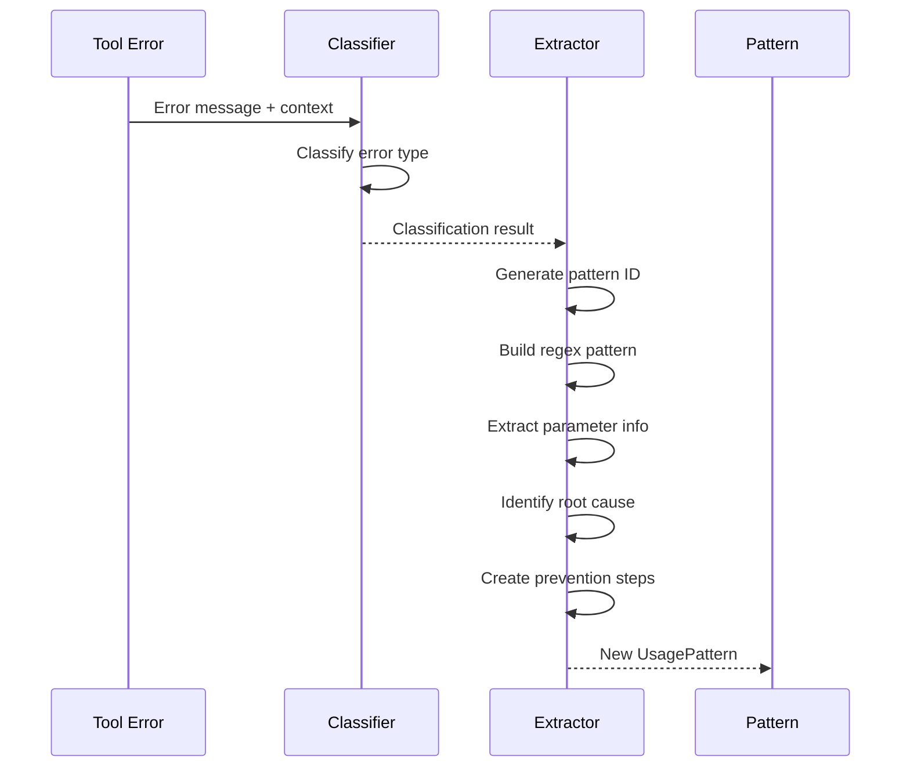
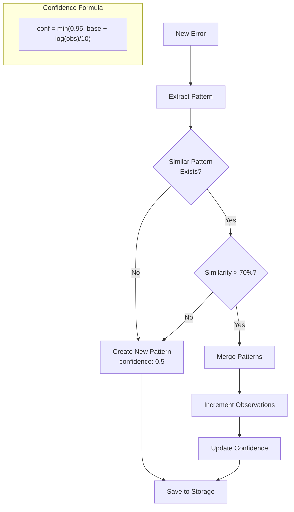
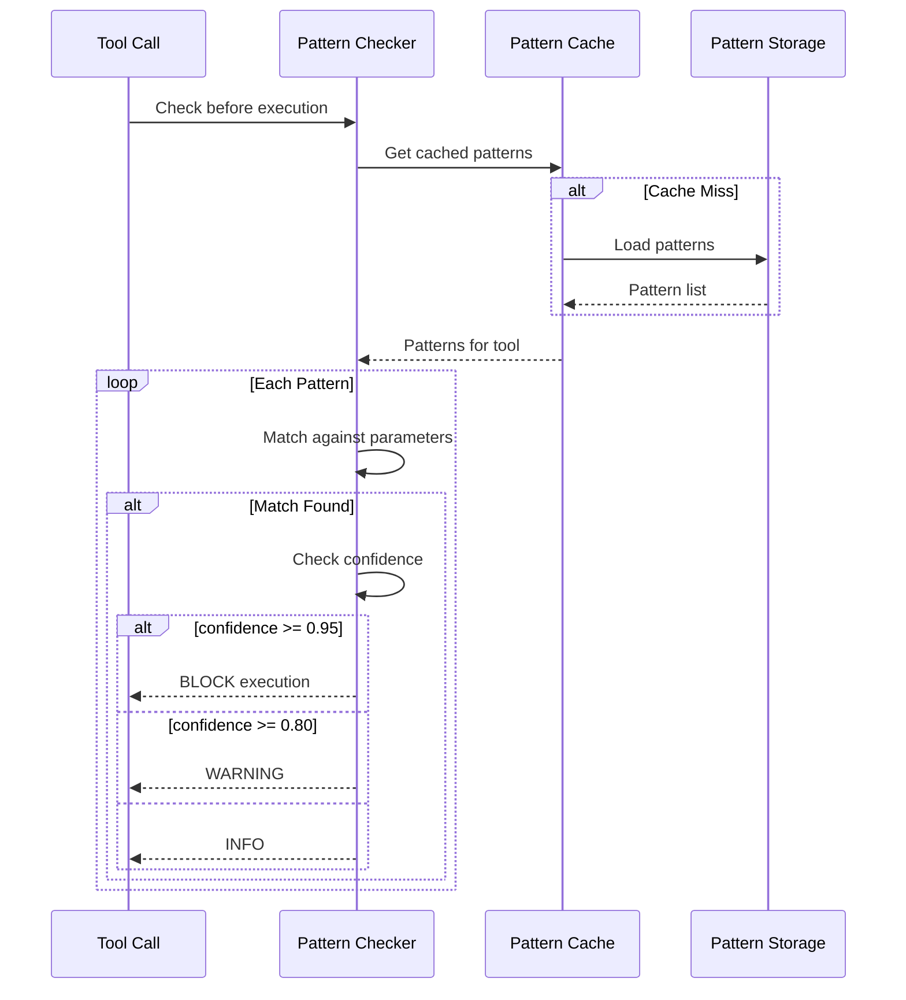
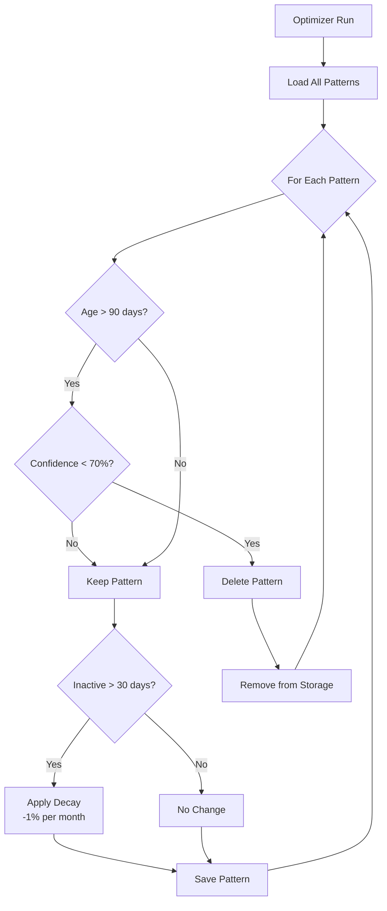
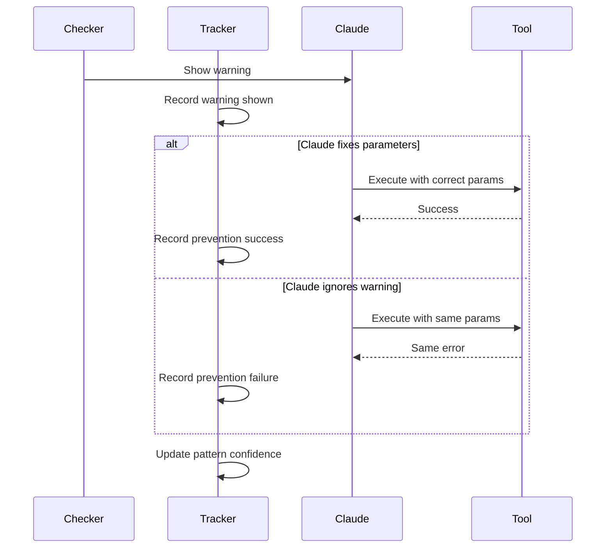
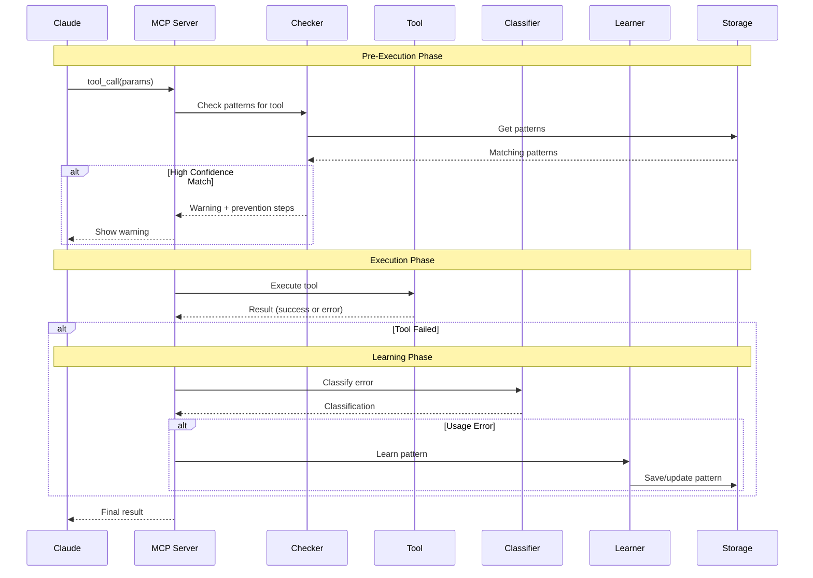
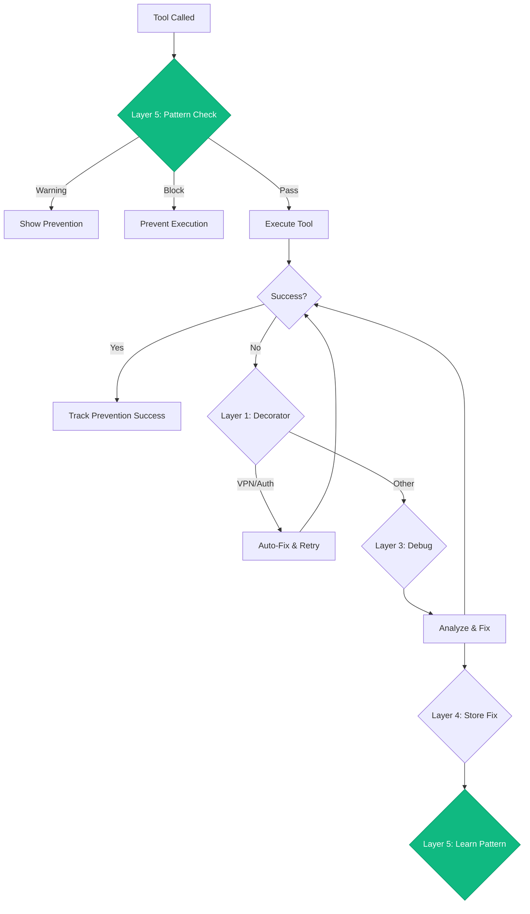

# 🧠 Usage Pattern Learning System (Layer 5)

This document describes the sophisticated usage pattern learning system that prevents mistakes before they happen by learning from past tool failures.

## Overview

The Usage Pattern Learning System is the fifth and most advanced layer of the auto-heal architecture. Unlike the reactive layers (1-4) that fix problems after they occur, Layer 5 is **proactive** - it learns from past mistakes and prevents them from recurring.



## Architecture

The system consists of 8 interconnected components:



## Component Details

### 1. Usage Pattern Classifier (`usage_pattern_classifier.py`)

**Purpose**: Classify errors as "usage errors" (Claude's mistakes) vs infrastructure errors.

**Usage Error Types**:

| Type | Description | Example |
|------|-------------|---------|
| `INCORRECT_PARAMETER` | Wrong parameter value | Using short SHA instead of full 40-char SHA |
| `PARAMETER_FORMAT` | Wrong format | Date in wrong format |
| `MISSING_PREREQUISITE` | Tool called before setup | Deploy before namespace reserved |
| `WORKFLOW_SEQUENCE` | Steps in wrong order | Test before build |
| `WRONG_TOOL_SELECTION` | Used wrong tool | `git_push` instead of `git_commit` |



**Classification Logic**:

```python
def classify_error(tool_name: str, error: str, context: dict) -> ErrorClassification:
    """Classify an error as usage vs infrastructure."""

    # Check for infrastructure errors first
    if any(p in error.lower() for p in ['no route', 'timeout', 'connection refused']):
        return ErrorClassification(type='infrastructure', category='network')

    if any(p in error.lower() for p in ['unauthorized', '401', '403']):
        return ErrorClassification(type='infrastructure', category='auth')

    # Check for usage error patterns
    if 'invalid' in error.lower() and 'parameter' in error.lower():
        return ErrorClassification(
            type='usage',
            category=ErrorCategory.INCORRECT_PARAMETER,
            parameter=extract_parameter_name(error)
        )

    if 'not found' in error.lower() and context.get('expected_prerequisite'):
        return ErrorClassification(
            type='usage',
            category=ErrorCategory.MISSING_PREREQUISITE,
            missing=context['expected_prerequisite']
        )

    # ...more classification logic
```

### 2. Usage Pattern Extractor (`usage_pattern_extractor.py`)

**Purpose**: Extract learnable patterns from classified errors.

**Pattern Structure**:

```python
@dataclass
class UsagePattern:
    id: str                     # Unique pattern ID
    tool: str                   # Tool name
    category: ErrorCategory     # Error type
    pattern: str                # Regex pattern for error matching
    root_cause: str             # Why the error occurred
    prevention: str             # How to prevent it
    parameters: dict            # Affected parameters
    validation_rules: list      # Rules to check before execution
    common_mistakes: list       # Common variations of this mistake
    confidence: float           # 0.0 to 1.0
    observations: int           # Times this pattern was seen
```

**Extraction Process**:



### 3. Usage Pattern Learner (`usage_pattern_learner.py`)

**Purpose**: Learn and update patterns with confidence evolution.

**Learning Flow**:



**Confidence Evolution**:

```python
def update_confidence(pattern: UsagePattern) -> float:
    """Update pattern confidence using Bayesian approach."""
    base_confidence = 0.5
    observation_factor = math.log(pattern.observations + 1) / 10

    # Adjust for prevention success rate
    if pattern.prevention_stats:
        success_rate = pattern.prevention_stats.get('success_rate', 0.5)
        prevention_factor = (success_rate - 0.5) * 0.2
    else:
        prevention_factor = 0

    new_confidence = min(0.95, base_confidence + observation_factor + prevention_factor)
    return new_confidence
```

### 4. Usage Pattern Checker (`usage_pattern_checker.py`)

**Purpose**: Check learned patterns BEFORE tool execution.

**Pre-Execution Check**:



**Check Result**:

```python
@dataclass
class PatternCheckResult:
    should_block: bool          # Block execution?
    warnings: list[str]         # Warning messages
    preventions: list[str]      # Prevention steps
    matched_patterns: list[str] # Pattern IDs that matched
    confidence: float           # Highest confidence match
```

### 5. Usage Pattern Storage (`usage_pattern_storage.py`)

**Purpose**: Persistent storage for all patterns.

**Storage File**: `memory/learned/usage_patterns.yaml`

```yaml
patterns:
  - id: "quay_short_sha_001"
    tool: "quay_get_manifest"
    category: "PARAMETER_FORMAT"
    pattern: "manifest unknown"
    root_cause: "Used short SHA (7 chars) instead of full 40-char SHA"
    prevention: "Always use full 40-character commit SHA for Quay operations"
    parameters:
      image_tag:
        expected_format: "^[a-f0-9]{40}$"
        common_mistake: "7-character short SHA"
    validation_rules:
      - "len(image_tag) == 40"
      - "re.match('^[a-f0-9]+$', image_tag)"
    confidence: 0.92
    observations: 15
    last_seen: "2026-01-26T10:00:00Z"
    first_seen: "2026-01-10T14:30:00Z"

stats:
  by_tool:
    quay_get_manifest: 15
    bonfire_namespace_reserve: 8
    git_push: 5
  by_category:
    PARAMETER_FORMAT: 18
    INCORRECT_PARAMETER: 7
    MISSING_PREREQUISITE: 3
  prevention_success_rate: 0.78
  total_patterns: 28
  active_patterns: 22
```

### 6. Usage Pattern Optimizer (`usage_pattern_optimizer.py`)

**Purpose**: Pattern maintenance - pruning and decay.

**Optimization Tasks**:

| Task | Trigger | Action |
|------|---------|--------|
| Pruning | Pattern age > 90 days AND confidence < 70% | Delete pattern |
| Decay | Pattern inactive > 30 days | Reduce confidence by 1% per month |
| Stats Cleanup | Daily | Keep only 30 days of daily stats |
| Deduplication | On merge | Combine similar patterns |



### 7. Usage Context Injector (`usage_context_injector.py`)

**Purpose**: Inject prevention guidelines into Claude's context.

**Injection Points**:

1. **Session Start**: High-confidence patterns shown as guidelines
2. **Tool Execution**: Specific warnings for matched patterns
3. **Error Recovery**: Prevention steps after failure

**Generated Guidelines**:

```markdown
## Tool Usage Guidelines

### quay_get_manifest
- **IMPORTANT**: Always use full 40-character SHA, not short SHA
- Pattern: `manifest unknown` indicates wrong SHA format
- Prevention: Verify SHA length before calling

### bonfire_namespace_reserve
- **IMPORTANT**: Ensure VPN is connected before reservation
- **IMPORTANT**: Check namespace quota before reserving new ones
```

### 8. Usage Prevention Tracker (`usage_prevention_tracker.py`)

**Purpose**: Track prevention effectiveness.

**Tracking Flow**:



**Tracking Metrics**:

```python
@dataclass
class PreventionStats:
    pattern_id: str
    warnings_shown: int
    preventions_successful: int
    preventions_failed: int
    false_positives: int

    @property
    def success_rate(self) -> float:
        total = self.preventions_successful + self.preventions_failed
        if total == 0:
            return 0.0
        return self.preventions_successful / total
```

## Complete Data Flow



## Configuration

### Pattern Thresholds

| Threshold | Value | Purpose |
|-----------|-------|---------|
| Block execution | 95%+ confidence | Prevent known bad patterns |
| Show warning | 80%+ confidence | Alert Claude |
| Show info | 50%+ confidence | Informational |
| Prune pattern | <70% AND >90 days old | Remove stale patterns |
| Merge similarity | 70%+ | Combine similar patterns |

### Pattern Cache

```python
PATTERN_CACHE = {
    'ttl': 300,          # 5 minutes
    'max_size': 1000,    # Max patterns in cache
    'refresh_on_miss': True
}
```

## Example Patterns

### 1. Short SHA Pattern

```yaml
id: "quay_short_sha_001"
tool: "quay_get_manifest"
category: "PARAMETER_FORMAT"
pattern: "manifest unknown.*[a-f0-9]{7}"
root_cause: "Quay requires full 40-character SHA for image lookup"
prevention: |
  Always use full 40-character commit SHA for Quay operations.
  Use `git rev-parse HEAD` to get full SHA.
parameters:
  image_tag:
    expected_format: "^[a-f0-9]{40}$"
validation_rules:
  - "len(image_tag) == 40"
confidence: 0.92
observations: 15
```

### 2. Missing VPN Pattern

```yaml
id: "bonfire_vpn_001"
tool: "bonfire_namespace_reserve"
category: "MISSING_PREREQUISITE"
pattern: "No route to host|Connection refused"
root_cause: "Ephemeral cluster requires VPN connection"
prevention: |
  Ensure VPN is connected before ephemeral operations.
  Run vpn_connect() first.
validation_rules:
  - "vpn_status == 'connected'"
confidence: 0.88
observations: 12
```

### 3. Wrong Tool Pattern

```yaml
id: "git_push_uncommitted_001"
tool: "git_push"
category: "WORKFLOW_SEQUENCE"
pattern: "nothing to push|up to date"
root_cause: "Tried to push without committing first"
prevention: |
  Ensure changes are committed before pushing.
  Sequence: git_add -> git_commit -> git_push
validation_rules:
  - "has_staged_changes == False"
  - "has_commits_ahead == True"
confidence: 0.85
observations: 8
```

## Integration with Auto-Heal

Layer 5 integrates with the other auto-heal layers:



## See Also

- [Architecture Overview](./README.md) - System overview
- [Auto-Heal Decorators](./README.md#auto-heal-architecture) - Layers 1-3
- [Memory System](./memory-system.md) - Pattern storage
- [Development Guide](../DEVELOPMENT.md) - Contributing guidelines
