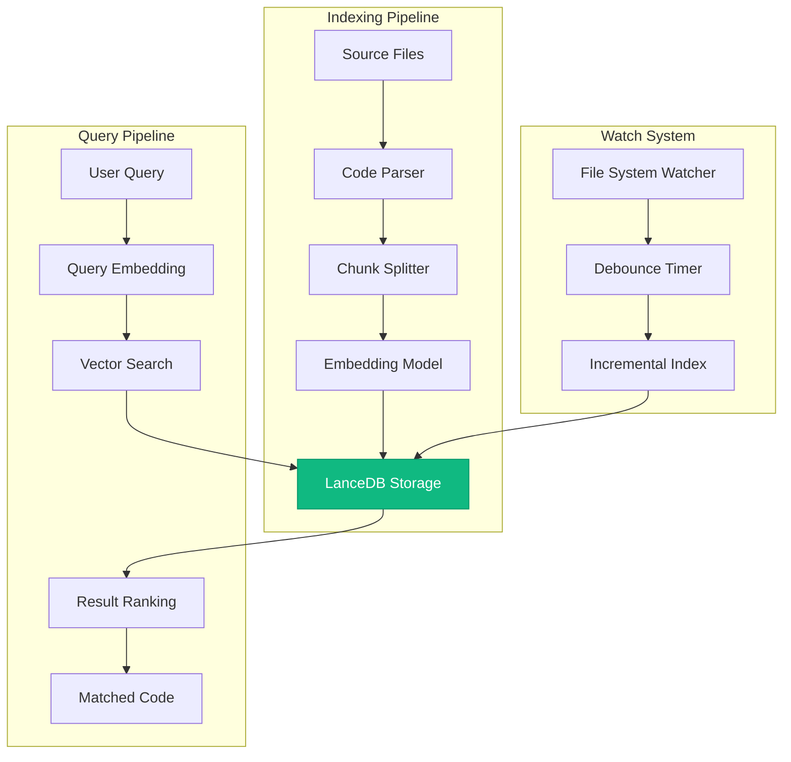
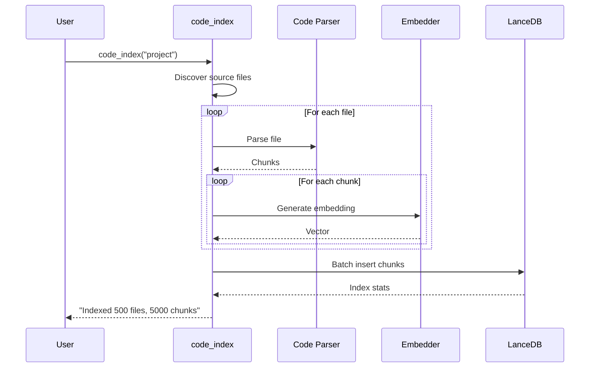
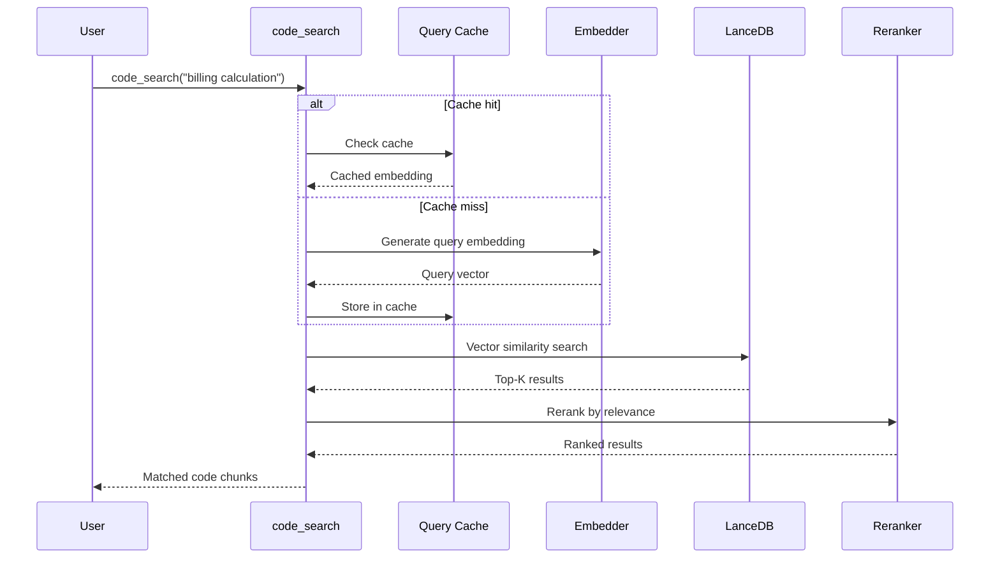
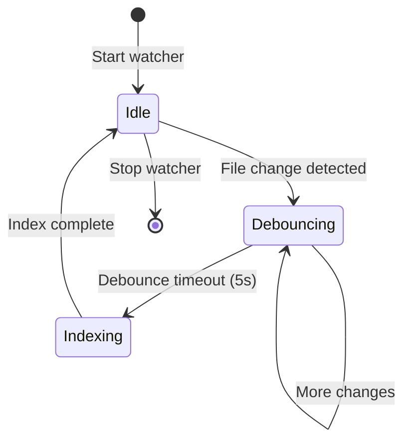
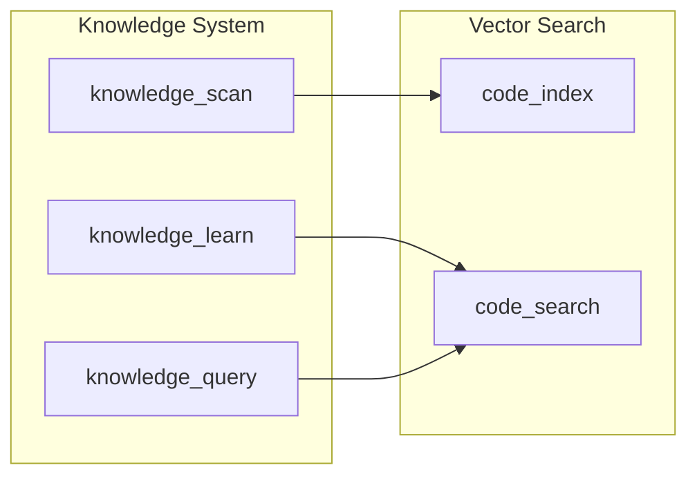

# Vector Search Architecture

The Vector Search system provides semantic code search capabilities using embeddings and LanceDB vector storage. It enables natural language queries like "Where do we handle billing calculations?" to find relevant code.

## Overview



## Components

### Code Parser

Extracts meaningful code chunks from source files:

- **Functions**: Complete function definitions with docstrings
- **Classes**: Class definitions with methods
- **Modules**: Top-level module documentation
- **Comments**: Block comments with context


### Chunk Structure

```python
@dataclass
class CodeChunk:
    id: str                    # Unique identifier
    content: str               # Code content
    file_path: str            # Source file path
    start_line: int           # Line number
    end_line: int             # End line
    chunk_type: str           # "function", "class", "module"
    name: str                 # Function/class name
    docstring: str | None     # Documentation
    language: str             # Programming language
    project: str              # Project name
    embedding: list[float]    # Vector embedding
```

### Embedding Model

Uses sentence-transformers for generating embeddings:

| Model | Dimensions | Speed | Quality |
|-------|------------|-------|---------|
| `all-MiniLM-L6-v2` | 384 | Fast | Good |
| `all-mpnet-base-v2` | 768 | Medium | Better |
| `instructor-xl` | 768 | Slow | Best |

Default: `all-MiniLM-L6-v2` for optimal speed/quality balance.

### LanceDB Storage

Vector database optimized for local storage:

```
~/.config/aa-workflow/vectors/
├── automation-analytics-backend/
│   ├── lance/                    # LanceDB data files
│   │   ├── _transactions/
│   │   ├── _versions/
│   │   └── data/
│   └── metadata.json            # Index metadata
├── pdf-generator/
│   └── ...
└── redhat-ai-workflow/
    └── ...
```

## Indexing Pipeline

### Full Index



### Incremental Index

Only re-indexes changed files:

```python
def incremental_index(project: str) -> IndexStats:
    """Index only files changed since last index."""
    last_index = get_last_index_time(project)
    changed_files = get_changed_files(project, since=last_index)

    # Delete old chunks for changed files
    delete_chunks_for_files(project, changed_files)

    # Index changed files
    for file in changed_files:
        chunks = parse_file(file)
        embeddings = generate_embeddings(chunks)
        store_chunks(project, chunks, embeddings)

    return IndexStats(files=len(changed_files), ...)
```

## Query Pipeline

### Semantic Search



### Search Options

| Parameter | Type | Description |
|-----------|------|-------------|
| `query` | string | Natural language query |
| `project` | string | Project to search (optional) |
| `limit` | int | Max results (default: 10) |
| `file_filter` | string | File path pattern filter |
| `type_filter` | string | Chunk type: "function", "class", "module" |

### Query Examples

```python
# Basic search
code_search("How does billing calculate vCPU hours?")

# Filter by file path
code_search("error handling", file_filter="api/")

# Filter by type
code_search("authentication", type_filter="class")

# Search specific project
code_search("database connection", project="backend")
```

## File Watcher

Automatically keeps indexes up-to-date:



### Watcher Configuration

```python
# Start watcher for a project
code_watch("automation-analytics-backend", "start")

# Start all project watchers
code_watch_all("start")

# Check watcher status
code_watch(action="status")

# Stop watcher
code_watch("automation-analytics-backend", "stop")
```

### Debounce Behavior

- Default debounce: 5 seconds
- Prevents rapid re-indexing during active development
- Batches multiple file changes into single index operation

## Performance Optimization

### Index Types

LanceDB supports multiple index types:

| Type | Best For | Memory | Search Speed |
|------|----------|--------|--------------|
| `FLAT` | < 10K vectors | Low | Linear |
| `IVF_PQ` | > 10K vectors | Medium | Fast |
| `IVF_HNSW` | Large datasets | High | Fastest |

Auto-selection:
- < 5,000 chunks: FLAT
- 5,000 - 50,000: IVF_PQ
- 50,000+: IVF_HNSW with memory warning

### Query Caching

Query embeddings are cached to avoid regeneration:

```python
# Cache configuration
CACHE_SIZE = 1000        # Max cached queries
CACHE_TTL = 3600         # 1 hour TTL

# Cache hit reduces query time by ~100ms
```

### Compaction

LanceDB creates fragment files on updates. Periodic compaction reduces disk usage:

```python
# Compact a project's index
code_compact("automation-analytics-backend")

# Compact all projects
code_compact()

# Output: "Compacted: 2.5GB -> 800MB (68% reduction)"
```

## Health Monitoring

```python
# Check vector search health
code_health()

# Returns:
# {
#   "status": "healthy",
#   "projects": {
#     "backend": {
#       "chunks": 5896,
#       "index_type": "FLAT",
#       "last_indexed": "2026-01-26T12:00:00Z",
#       "disk_usage": "45MB"
#     }
#   },
#   "cache": {
#     "size": 150,
#     "hit_rate": 0.85
#   },
#   "watchers": {
#     "running": 3,
#     "paused": 0
#   }
# }
```

## MCP Tools

### code_index

Index a project's code for semantic search:

```python
code_index(project="backend", force=False)
# force=True: Re-index all files
# force=False: Only changed files (incremental)
```

### code_search

Search indexed code semantically:

```python
code_search(
    query="How does user authentication work?",
    project="backend",
    limit=10,
    file_filter="auth/",
    type_filter="function"
)
```

### code_stats

Get indexing statistics:

```python
code_stats(project="backend")
# Shows: file count, chunk count, disk usage, last indexed, etc.
```

### code_compact

Optimize vector database storage:

```python
code_compact(project="backend")
# Merges fragments, removes old versions
```

### code_watch

Control file watchers:

```python
code_watch(project="backend", action="start")
code_watch(project="backend", action="stop")
code_watch(action="status")  # All watchers
```

### code_health

Health dashboard:

```python
code_health()
# Returns overall health, recommendations, issues
```

## Integration with Knowledge System

Vector search integrates with the knowledge system:



- `knowledge_deep_scan` uses vector search to find patterns
- `explain_code` skill uses semantic search for context
- `find_similar_code` skill uses vector similarity

## Troubleshooting

### Common Issues

| Issue | Cause | Solution |
|-------|-------|----------|
| Empty results | Index out of date | Run `code_index(force=True)` |
| Slow queries | Large index, no IVF | Check `code_stats()`, consider IVF_PQ |
| High disk usage | Fragmentation | Run `code_compact()` |
| Watcher not updating | Event not detected | Check file patterns in config |

### Debug Logging

```python
import logging
logging.getLogger("aa_code_search").setLevel(logging.DEBUG)
```

## See Also

- [Knowledge System](./knowledge-system.md) - Project knowledge
- [Tool Modules: code_search](../tool-modules/code_search.md) - Tool reference
- [MCP Implementation](./mcp-implementation.md) - Server architecture
