# 🖥️ VSCode Extension Architecture

This document describes the AI Workflow VSCode extension that provides real-time status indicators, workflow automation, and integration with the MCP server and background daemons.

## Overview

The AA Workflow VSCode extension (`aa_workflow_vscode`) provides:

- **Status bar indicators** - Real-time status for VPN, agent, Slack, issue, environment, MR, and namespace
- **Workflow Explorer** - Sidebar tree view for active work and quick actions
- **Memory Viewer** - Comprehensive view of the memory system
- **Skill Execution Visualization** - Real-time flowchart of skill execution
- **Command Center** - Unified interface for all workflow operations
- **Real-time Updates** - WebSocket and D-Bus integration for live data

## Architecture Diagram


## Component Details

### Entry Point (`extension.ts`)

**Location**: `src/extension.ts`

**Responsibilities**:
- Extension activation and deactivation lifecycle
- Initialize all UI components (status bar, tree views, memory tab)
- Set up periodic refresh intervals (30 seconds default)
- Register webview serializers for persistent panels
- Listen for workspace state changes
- Coordinate component updates

**Key Exports**:
```typescript
export function activate(context: vscode.ExtensionContext): void
export function deactivate(): void
export function getWorkspaceState(): WorkspaceState | undefined
```

### Status Bar (`statusBar.ts`)

**Location**: `src/statusBar.ts`

**Responsibilities**:
- Create and manage 7 status bar items
- Color-coded status displays with rich tooltips
- Click actions to open external tools

```mermaid
graph LR
    subgraph StatusBar["Status Bar Items"]
        VPN[🔒 VPN<br/>Connected/Disconnected]
        AGENT[🎭 Agent<br/>Current Persona]
        SLACK[💬 Slack<br/>Pending Count]
        ISSUE[📋 Issue<br/>Active Jira]
        ENV[🌍 Environment<br/>Stage/Prod Health]
        MR[🔀 MR<br/>Pipeline Status]
        NS[📦 Namespace<br/>Ephemeral Status]
    end

    VPN --> |click| VPNCMD[Connect VPN]
    ISSUE --> |click| JIRA[Open in Jira]
    MR --> |click| GITLAB[Open in GitLab]
    NS --> |click| BONFIRE[Manage Namespace]
```



**Status Bar Items**:

| Item | Colors | Click Action |
|------|--------|--------------|
| VPN | Green (connected), Red (disconnected) | Connect VPN |
| Agent | Blue (loaded), Gray (none) | Switch persona |
| Slack | Orange (pending), Green (clear) | Open Command Center |
| Issue | Blue (active), Gray (none) | Open in Jira |
| Environment | Green/Yellow/Red (health) | Show env details |
| MR | Green/Red (pipeline) | Open in GitLab |
| Namespace | Blue (active), Gray (none) | Manage namespace |

### Data Provider (`dataProvider.ts`)

**Location**: `src/dataProvider.ts`

**Responsibilities**:
- Central data source for all status information
- Read from YAML memory files
- Query D-Bus for daemon statistics
- Monitor VPN connectivity
- Load workspace state from JSON

**Key Interfaces**:

```typescript
interface WorkflowStatus {
  vpn: VpnStatus;
  agent: string;
  slack: SlackStatus;
  activeIssue: ActiveIssue | null;
  activeMR: ActiveMR | null;
  environment: EnvironmentStatus;
  namespace: EphemeralNamespace | null;
}

interface ActiveIssue {
  key: string;
  summary: string;
  status: string;
  branch?: string;
}

interface ActiveMR {
  id: number;
  title: string;
  status: string;
  pipelineStatus: string;
  url: string;
}

interface EnvironmentStatus {
  stage: 'healthy' | 'degraded' | 'unhealthy';
  prod: 'healthy' | 'degraded' | 'unhealthy';
  lastCheck: Date;
}
```

**Data Sources**:
- `memory/state/current_work.yaml` - Active issues, MRs, branches
- `memory/state/environments.yaml` - Environment health
- `~/.config/aa-workflow/workspace_states.json` - Session state
- D-Bus: `com.aiworkflow.BotSlack` - Slack statistics

### Workflow Explorer (`treeView.ts`)

**Location**: `src/treeView.ts`

**Responsibilities**:
- Hierarchical tree view in sidebar
- Organized sections for different workflow areas
- Clickable shortcuts for common workflows


**Skill Categories**:
| Category | Skills |
|----------|--------|
| Daily | coffee, beer, standup |
| Development | start_work, create_mr, sync_branch |
| DevOps | deploy_ephemeral, test_ephemeral |
| Jira | create_issue, close_issue, jira_hygiene |
| Memory | memory_view, memory_cleanup |
| Knowledge | knowledge_load, knowledge_scan |

### Memory Viewer (`memoryTab.ts`)

**Location**: `src/memoryTab.ts`

**Responsibilities**:
- Comprehensive view of memory system
- Hierarchical breakdown of memory categories
- Quick actions for memory operations


### Command Center (`commandCenter.ts`)

**Location**: `src/commandCenter.ts`

**Responsibilities**:
- Unified webview panel for all operations
- Tab-based interface
- Real-time updates via WebSocket
- Slack message approval workflow

**Tabs**:

| Tab | Purpose |
|-----|---------|
| Slack Messages | Pending approvals, message history |
| Running Skills | Active skill executions |
| MR Status | Open MRs with pipeline status |
| Namespaces | Ephemeral namespace management |


### Skill Execution Watcher (`skillExecutionWatcher.ts`)

**Location**: `src/skillExecutionWatcher.ts`

**Responsibilities**:
- Watch `skill_execution.json` for execution events
- Track multiple concurrent executions
- Dispatch events to flowchart and command center

**Event Types**:

```typescript
interface SkillExecutionEvent {
  execution_id: string;
  skill_name: string;
  status: 'running' | 'success' | 'failed';
  current_step?: string;
  steps: StepProgress[];
  started_at: string;
  completed_at?: string;
  error?: string;
}

interface StepProgress {
  id: string;
  name: string;
  status: 'pending' | 'running' | 'success' | 'failed' | 'skipped';
  duration_ms?: number;
  output?: string;
}
```

### WebSocket Client (`skillWebSocket.ts`)

**Location**: `src/skillWebSocket.ts`

**Responsibilities**:
- Connect to MCP server WebSocket (port 9876)
- Real-time skill execution updates
- Handle confirmations and auto-heal events
- Automatic reconnection with exponential backoff


**Message Types**:

| Type | Direction | Purpose |
|------|-----------|---------|
| `skill_started` | Server → Client | Skill execution began |
| `skill_updated` | Server → Client | Step progress update |
| `skill_completed` | Server → Client | Skill finished |
| `confirmation_required` | Server → Client | User confirmation needed |
| `confirmation_answer` | Client → Server | User's response |
| `auto_heal_triggered` | Server → Client | Auto-heal in progress |

### Notifications (`notifications.ts`)

**Location**: `src/notifications.ts`

**Responsibilities**:
- Monitor workflow status changes
- Show toast notifications
- D-Bus signal monitoring for Slack events
- Deduplication of similar notifications


**D-Bus Signal Monitoring**:

```bash
# Signals monitored from com.aiworkflow.BotSlack
MessageReceived(channel_id, user, text)
MessageProcessed(message_id, result)
PendingApproval(message_id, channel, text)
```

### Command Registration (`commands.ts`)

**Location**: `src/commands.ts`

**Responsibilities**:
- Register all command palette commands
- Dynamic skill loading from disk
- Agent/persona switching
- Clipboard-based message sending

**Registered Commands**:

| Command | Description |
|---------|-------------|
| `aaWorkflow.runSkill` | Open skill picker |
| `aaWorkflow.loadAgent` | Switch persona |
| `aaWorkflow.openJira` | Open current issue |
| `aaWorkflow.openGitLab` | Open current MR |
| `aaWorkflow.connectVpn` | Connect to VPN |
| `aaWorkflow.refreshStatus` | Refresh all status |
| `aaWorkflow.showMemory` | Open memory viewer |
| `aaWorkflow.showCommandCenter` | Open command center |

### Skill Flowchart (`skillFlowchartPanel.ts`)

**Location**: `src/skillFlowchartPanel.ts`

**Responsibilities**:
- Webview panel for skill visualization
- Step-by-step progress display
- Branching logic visualization
- Timing and error details

```mermaid
graph TD
    subgraph FlowchartPanel["Skill Flowchart View"]
        HEADER[Skill: deploy_ephemeral]

        STEP1[Step 1: Check VPN<br/>✅ 0.5s]
        STEP2[Step 2: Reserve Namespace<br/>⏳ Running...]
        STEP3[Step 3: Deploy App<br/>⏸️ Pending]
        STEP4[Step 4: Run Tests<br/>⏸️ Pending]

        STEP1 --> STEP2
        STEP2 --> STEP3
        STEP3 --> STEP4

        HEADER --> STEP1
    end
```



### Workspace State Provider (`workspaceStateProvider.ts`)

**Location**: `src/workspaceStateProvider.ts`

**Responsibilities**:
- Monitor workspace state file changes
- Provide current workspace context
- Handle per-session tracking
- Emit change events

**State File**: `~/.config/aa-workflow/workspace_states.json`

```typescript
interface WorkspaceState {
  workspace_uri: string;
  persona: string;
  project: string;
  active_issue?: string;
  active_branch?: string;
  sessions: ChatSession[];
}

interface ChatSession {
  session_id: string;
  name: string;
  created_at: string;
  updated_at: string;
  persona: string;
}
```

## Data Flow

### Status Bar Update Flow


### Skill Execution Flow


## Configuration

### Extension Settings

Configured in `package.json`:

```json
{
  "aaWorkflow.refreshInterval": {
    "type": "number",
    "default": 30,
    "description": "Status refresh interval in seconds"
  },
  "aaWorkflow.showVpnStatus": {
    "type": "boolean",
    "default": true,
    "description": "Show VPN status in status bar"
  },
  "aaWorkflow.showAgentStatus": {
    "type": "boolean",
    "default": true,
    "description": "Show agent status in status bar"
  },
  "aaWorkflow.defaultAgent": {
    "type": "string",
    "default": "developer",
    "description": "Default agent to load"
  },
  "aaWorkflow.autoSendToChat": {
    "type": "boolean",
    "default": false,
    "description": "Auto-send commands to Cursor chat"
  }
}
```

### Keybindings

| Keybinding | Command |
|------------|---------|
| `Ctrl+Shift+1` | Open Command Center |
| `Ctrl+Shift+2` | Run Skill |
| `Ctrl+Shift+3` | Refresh Status |

## Building and Development

### Prerequisites

- Node.js 18+
- VSCode 1.85+

### Build Commands

```bash
cd extensions/aa_workflow_vscode

# Install dependencies
npm install

# Build
npm run compile

# Watch mode
npm run watch

# Package extension
npm run package
```

### Testing

```bash
# Run tests
npm test

# Debug in Extension Host
# Press F5 in VSCode
```

## File Structure

```
extensions/aa_workflow_vscode/
├── package.json              # Extension manifest
├── tsconfig.json             # TypeScript config
├── src/
│   ├── extension.ts          # Entry point
│   ├── statusBar.ts          # Status bar items
│   ├── dataProvider.ts       # Data source
│   ├── treeView.ts           # Workflow Explorer
│   ├── memoryTab.ts          # Memory viewer
│   ├── commands.ts           # Command registration
│   ├── notifications.ts      # Toast notifications
│   ├── skillExecutionWatcher.ts  # File watcher
│   ├── skillWebSocket.ts     # WebSocket client
│   ├── skillFlowchartPanel.ts    # Flowchart webview
│   ├── commandCenter.ts      # Command Center panel
│   ├── workspaceStateProvider.ts # Workspace state
│   ├── chatDbusService.ts    # D-Bus service
│   ├── refreshCoordinator.ts # Refresh sync
│   ├── logger.ts             # Logging
│   ├── paths.ts              # Path utilities
│   └── chatUtils.ts          # Chat utilities
├── media/                    # Icons and images
└── out/                      # Compiled JavaScript
```

## Dependencies

| Package | Purpose |
|---------|---------|
| `vscode` | VSCode API |
| `ws` | WebSocket client |
| `dbus-next` | D-Bus communication |
| `js-yaml` | YAML parsing |

## See Also

- [Architecture Overview](./README.md) - System overview
- [Daemon Architecture](./daemons.md) - Background services
- [State Management](./state-management.md) - Persistence patterns
- [Development Guide](../DEVELOPMENT.md) - Contributing guidelines
