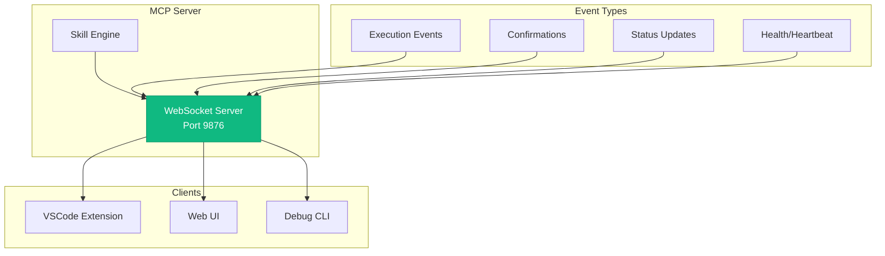
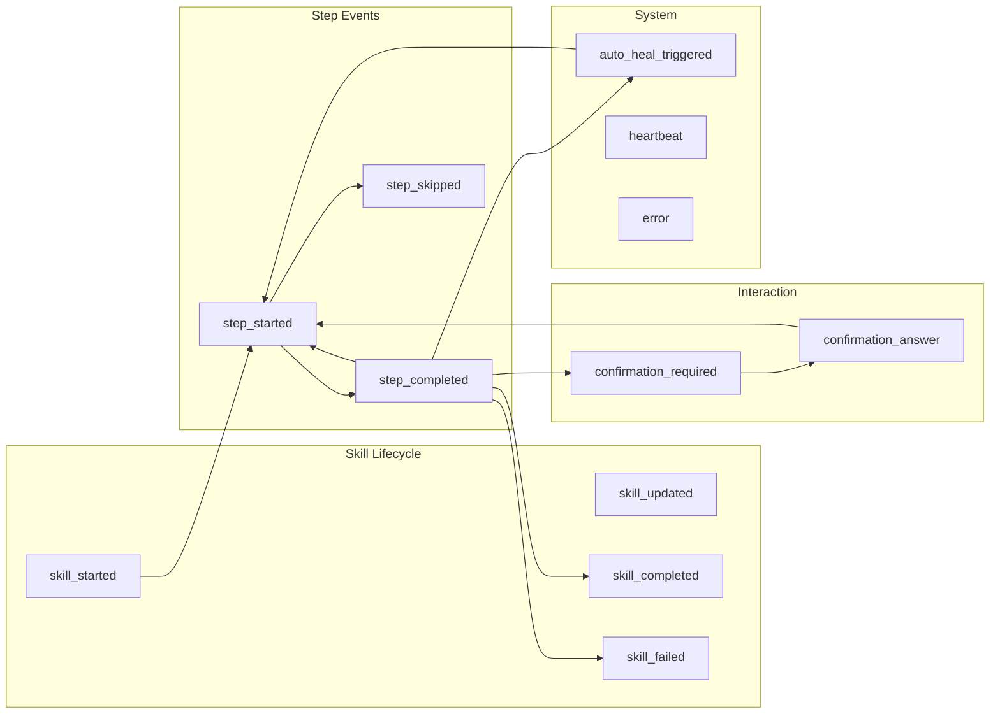
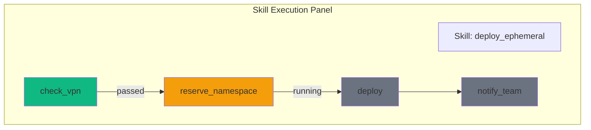

# WebSocket Protocol Architecture

The WebSocket server provides real-time communication between the MCP server and clients (VSCode extension, web UI) for skill execution visualization, confirmations, and live updates.

## Overview



## Connection

### Server Configuration

```python
# Default configuration
WEBSOCKET_HOST = "127.0.0.1"
WEBSOCKET_PORT = 9876

# Server starts automatically with MCP server
# See: server/websocket_server.py
```

### Client Connection

```typescript
// VSCode Extension
const ws = new WebSocket('ws://127.0.0.1:9876');

ws.onopen = () => {
  console.log('Connected to skill server');
  ws.send(JSON.stringify({ type: 'subscribe', topics: ['skills', 'status'] }));
};

ws.onmessage = (event) => {
  const message = JSON.parse(event.data);
  handleMessage(message);
};

ws.onclose = () => {
  console.log('Disconnected, reconnecting...');
  setTimeout(connect, 5000);
};
```

## Message Protocol

### Base Message Format

All messages follow this structure:

```typescript
interface WebSocketMessage {
  type: string;           // Event type
  timestamp: string;      // ISO 8601 timestamp
  execution_id?: string;  // Skill execution ID (if applicable)
  data: any;              // Event-specific payload
}
```

### Event Categories



## Event Types

### skill_started

Emitted when skill execution begins:

```json
{
  "type": "skill_started",
  "timestamp": "2026-01-26T12:00:00.000Z",
  "execution_id": "exec-abc123",
  "data": {
    "skill_name": "deploy_ephemeral",
    "inputs": {
      "mr_id": 1459,
      "duration": "4h"
    },
    "steps": [
      {"id": "check_vpn", "type": "tool", "tool": "vpn_status"},
      {"id": "reserve_ns", "type": "tool", "tool": "bonfire_namespace_reserve"},
      {"id": "deploy", "type": "tool", "tool": "bonfire_deploy"}
    ],
    "workspace_uri": "file:///home/user/project"
  }
}
```

### step_started

Emitted when a step begins:

```json
{
  "type": "step_started",
  "timestamp": "2026-01-26T12:00:01.000Z",
  "execution_id": "exec-abc123",
  "data": {
    "step_id": "reserve_ns",
    "step_index": 1,
    "step_type": "tool",
    "tool_name": "bonfire_namespace_reserve",
    "args": {
      "duration": "4h"
    }
  }
}
```

### step_completed

Emitted when a step finishes:

```json
{
  "type": "step_completed",
  "timestamp": "2026-01-26T12:00:05.000Z",
  "execution_id": "exec-abc123",
  "data": {
    "step_id": "reserve_ns",
    "success": true,
    "duration_ms": 4200,
    "result": {
      "namespace": "ephemeral-xyz789",
      "expires": "2026-01-26T16:00:00Z"
    }
  }
}
```

### step_skipped

Emitted when a step's condition is not met:

```json
{
  "type": "step_skipped",
  "timestamp": "2026-01-26T12:00:02.000Z",
  "execution_id": "exec-abc123",
  "data": {
    "step_id": "fix_vpn",
    "reason": "Condition not met: check_vpn.connected == true"
  }
}
```

### auto_heal_triggered

Emitted when auto-healing is attempted:

```json
{
  "type": "auto_heal_triggered",
  "timestamp": "2026-01-26T12:00:06.000Z",
  "execution_id": "exec-abc123",
  "data": {
    "step_id": "deploy",
    "failure_type": "auth",
    "action": "kube_login",
    "action_args": {
      "cluster": "ephemeral"
    },
    "retry_count": 1,
    "max_retries": 3
  }
}
```

### confirmation_required

Emitted when user input is needed:

```json
{
  "type": "confirmation_required",
  "timestamp": "2026-01-26T12:00:10.000Z",
  "execution_id": "exec-abc123",
  "data": {
    "confirmation_id": "confirm-xyz",
    "step_id": "delete_namespace",
    "message": "Delete namespace ephemeral-old123?",
    "options": [
      {"value": "yes", "label": "Yes, delete it"},
      {"value": "no", "label": "No, keep it"}
    ],
    "default": "no",
    "timeout_seconds": 60
  }
}
```

### confirmation_answer

Sent by client to answer a confirmation:

```json
{
  "type": "confirmation_answer",
  "timestamp": "2026-01-26T12:00:15.000Z",
  "data": {
    "confirmation_id": "confirm-xyz",
    "execution_id": "exec-abc123",
    "answer": "yes"
  }
}
```

### skill_completed

Emitted when skill finishes successfully:

```json
{
  "type": "skill_completed",
  "timestamp": "2026-01-26T12:00:20.000Z",
  "execution_id": "exec-abc123",
  "data": {
    "skill_name": "deploy_ephemeral",
    "success": true,
    "duration_ms": 20000,
    "outputs": {
      "namespace": "ephemeral-xyz789",
      "url": "https://app.ephemeral-xyz789.example.com",
      "success": true
    },
    "steps_completed": 5,
    "steps_skipped": 1,
    "steps_failed": 0
  }
}
```

### skill_failed

Emitted when skill fails:

```json
{
  "type": "skill_failed",
  "timestamp": "2026-01-26T12:00:20.000Z",
  "execution_id": "exec-abc123",
  "data": {
    "skill_name": "deploy_ephemeral",
    "error": "Failed to deploy: image not found",
    "failed_step_id": "deploy",
    "duration_ms": 15000,
    "steps_completed": 3,
    "partial_outputs": {
      "namespace": "ephemeral-xyz789"
    }
  }
}
```

### heartbeat

Periodic keep-alive:

```json
{
  "type": "heartbeat",
  "timestamp": "2026-01-26T12:00:30.000Z",
  "data": {
    "server_status": "healthy",
    "active_executions": 1,
    "connected_clients": 2
  }
}
```

## Client Subscriptions

Clients can subscribe to specific topics:

```json
{
  "type": "subscribe",
  "data": {
    "topics": ["skills", "status", "confirmations"]
  }
}
```

### Available Topics

| Topic | Events |
|-------|--------|
| `skills` | All skill lifecycle events |
| `steps` | Step-level events only |
| `confirmations` | Confirmation requests |
| `status` | Server status updates |
| `all` | All events |

### Unsubscribe

```json
{
  "type": "unsubscribe",
  "data": {
    "topics": ["steps"]
  }
}
```

## Server Implementation

### SkillWebSocketServer Class

```python
class SkillWebSocketServer:
    def __init__(self, port: int = 9876):
        self.port = port
        self.clients: set[WebSocket] = set()
        self.subscriptions: dict[WebSocket, set[str]] = {}
        self.running_skills: dict[str, SkillState] = {}
        self.pending_confirmations: dict[str, PendingConfirmation] = {}

    async def broadcast(self, event: dict, topic: str = "all"):
        """Broadcast event to subscribed clients."""
        message = json.dumps(event)
        for client in self.clients:
            if topic in self.subscriptions.get(client, {"all"}):
                try:
                    await client.send(message)
                except:
                    self.clients.discard(client)

    async def emit_skill_started(self, execution_id: str, skill: dict):
        await self.broadcast({
            "type": "skill_started",
            "timestamp": datetime.now().isoformat(),
            "execution_id": execution_id,
            "data": skill
        }, topic="skills")

    async def wait_for_confirmation(
        self,
        execution_id: str,
        step_id: str,
        message: str,
        options: list[dict],
        timeout: int = 60
    ) -> str:
        """Request confirmation and wait for response."""
        confirmation_id = str(uuid.uuid4())

        pending = PendingConfirmation(
            id=confirmation_id,
            execution_id=execution_id,
            event=asyncio.Event()
        )
        self.pending_confirmations[confirmation_id] = pending

        await self.broadcast({
            "type": "confirmation_required",
            "timestamp": datetime.now().isoformat(),
            "execution_id": execution_id,
            "data": {
                "confirmation_id": confirmation_id,
                "step_id": step_id,
                "message": message,
                "options": options,
                "timeout_seconds": timeout
            }
        }, topic="confirmations")

        try:
            await asyncio.wait_for(pending.event.wait(), timeout=timeout)
            return pending.answer
        except asyncio.TimeoutError:
            return options[0]["value"]  # Return default
        finally:
            del self.pending_confirmations[confirmation_id]
```

## Client Implementation

### VSCode Extension

```typescript
// skillWebSocket.ts

class SkillWebSocketClient {
  private ws: WebSocket | null = null;
  private reconnectTimer: NodeJS.Timeout | null = null;
  private eventEmitter = new vscode.EventEmitter<SkillEvent>();

  public readonly onEvent = this.eventEmitter.event;

  connect(): void {
    this.ws = new WebSocket('ws://127.0.0.1:9876');

    this.ws.onopen = () => {
      console.log('WebSocket connected');
      this.ws?.send(JSON.stringify({
        type: 'subscribe',
        data: { topics: ['skills', 'confirmations'] }
      }));
    };

    this.ws.onmessage = (event) => {
      const message = JSON.parse(event.data);
      this.handleMessage(message);
    };

    this.ws.onclose = () => {
      console.log('WebSocket disconnected');
      this.scheduleReconnect();
    };
  }

  private handleMessage(message: WebSocketMessage): void {
    switch (message.type) {
      case 'skill_started':
        this.showSkillPanel(message);
        break;

      case 'step_completed':
        this.updateStepStatus(message);
        break;

      case 'confirmation_required':
        this.showConfirmationDialog(message);
        break;

      case 'skill_completed':
        this.showCompletionToast(message);
        break;

      case 'skill_failed':
        this.showErrorToast(message);
        break;
    }

    this.eventEmitter.fire(message);
  }

  private async showConfirmationDialog(message: any): Promise<void> {
    const options = message.data.options.map((o: any) => o.label);
    const selected = await vscode.window.showQuickPick(options, {
      placeHolder: message.data.message
    });

    if (selected) {
      const answer = message.data.options.find(
        (o: any) => o.label === selected
      )?.value;

      this.ws?.send(JSON.stringify({
        type: 'confirmation_answer',
        data: {
          confirmation_id: message.data.confirmation_id,
          execution_id: message.execution_id,
          answer
        }
      }));
    }
  }
}
```

## Skill Visualization

### Flowchart Panel

The VSCode extension renders skill execution as a flowchart:



### Status Colors

| Status | Color | Meaning |
|--------|-------|---------|
| Pending | Gray | Not yet started |
| Running | Yellow | Currently executing |
| Completed | Green | Finished successfully |
| Skipped | Blue | Condition not met |
| Failed | Red | Error occurred |
| Healing | Orange | Auto-heal in progress |

## Toast Notifications

Real-time toasts for key events:

```typescript
// Skill started
vscode.window.withProgress({
  location: vscode.ProgressLocation.Notification,
  title: `Running: ${skillName}`,
  cancellable: false
}, async (progress) => {
  // Update progress as steps complete
  ws.onEvent((event) => {
    if (event.type === 'step_completed') {
      progress.report({
        message: `Step ${event.data.step_id}`,
        increment: stepIncrement
      });
    }
  });
});
```

## Connection Management

### Reconnection Strategy

```typescript
private scheduleReconnect(): void {
  if (this.reconnectTimer) return;

  const delays = [1000, 2000, 5000, 10000, 30000];
  let attempt = 0;

  const tryConnect = () => {
    if (attempt < delays.length) {
      this.reconnectTimer = setTimeout(() => {
        this.connect();
        attempt++;
        if (!this.ws?.readyState === WebSocket.OPEN) {
          tryConnect();
        }
      }, delays[attempt]);
    }
  };

  tryConnect();
}
```

### Health Monitoring

```typescript
// Expect heartbeat every 30 seconds
private startHeartbeatMonitor(): void {
  setInterval(() => {
    if (Date.now() - this.lastHeartbeat > 60000) {
      console.warn('No heartbeat received, reconnecting...');
      this.ws?.close();
      this.connect();
    }
  }, 30000);
}
```

## Security

### Local-Only Binding

Server binds to localhost only:
```python
# Only accessible from local machine
host = "127.0.0.1"  # Not "0.0.0.0"
```

### Message Validation

All incoming messages are validated:
```python
def validate_message(message: dict) -> bool:
    required_fields = ['type']
    if not all(f in message for f in required_fields):
        return False
    if message['type'] not in VALID_MESSAGE_TYPES:
        return False
    return True
```

## Debugging

### CLI Client

```bash
# Connect and monitor events
websocat ws://localhost:9876

# Send subscription
{"type": "subscribe", "data": {"topics": ["all"]}}
```

### Logging

```python
import logging
logging.getLogger("websocket_server").setLevel(logging.DEBUG)
```

## See Also

- [Skill Engine](./skill-engine.md) - Skill execution
- [VSCode Extension](./vscode-extension.md) - Client implementation
- [MCP Implementation](./mcp-implementation.md) - Server architecture
