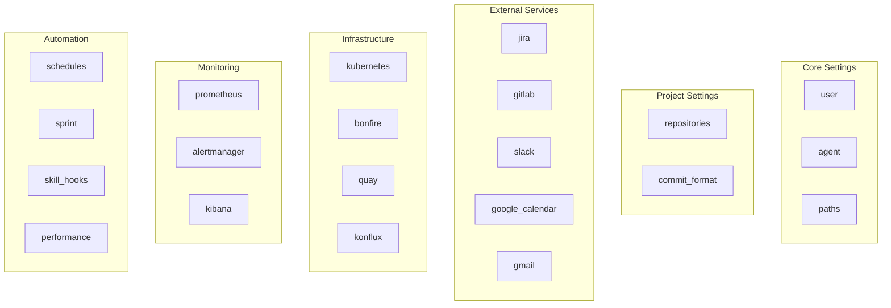

# Configuration Reference

This document provides a complete reference for the AI Workflow `config.json` configuration file.

## Overview

The `config.json` file is the central configuration for the AI Workflow system. It defines:

- Project repositories and their settings
- User identity and preferences
- External service connections (Jira, GitLab, Slack, etc.)
- Scheduled jobs and automation
- Daemon behavior and settings

**Location:** `config.json` in the project root

## Configuration Sections



---

## repositories

Defines local projects and their settings.

### Structure

```json
{
  "repositories": {
    "project-name": {
      "path": "/home/user/src/project-name",
      "gitlab": "org/project-name",
      "jira_project": "PROJ",
      "jira_component": "Component Name",
      "default_branch": "main",
      "lint_command": "make lint",
      "test_command": "make test",
      "test_setup": "# Setup instructions...",
      "konflux_namespace": "tenant-namespace",
      "fastapi_container": "container-name-1",
      "scopes": ["api", "auth", "db"],
      "docs": {
        "enabled": true,
        "path": "docs/",
        "readme": "README.md",
        "auto_update": true,
        "check_on_mr": true
      }
    }
  }
}
```

### Fields

| Field | Type | Required | Description |
|-------|------|----------|-------------|
| `path` | string | Yes | Absolute path to local repository |
| `gitlab` | string | Yes | GitLab project path (e.g., `org/repo`) |
| `jira_project` | string | Yes | Jira project key |
| `jira_component` | string | No | Jira component for filtering |
| `default_branch` | string | No | Main branch name (default: `main`) |
| `lint_command` | string | No | Command to run linting |
| `test_command` | string | No | Command to run tests |
| `test_setup` | string | No | Multi-line setup instructions |
| `konflux_namespace` | string | No | Konflux tenant namespace |
| `fastapi_container` | string | No | Local container name for dev |
| `scopes` | array | No | Valid commit scopes |
| `docs` | object | No | Documentation settings |

---

## user

User identity and preferences.

```json
{
  "user": {
    "username": "your_username",
    "email": "you@example.com",
    "email_aliases": ["you@example.com", "personal@gmail.com"],
    "full_name": "Your Name",
    "gitlab_username": "your_username",
    "jira_username": "your_username",
    "timezone": "America/New_York"
  }
}
```

| Field | Description |
|-------|-------------|
| `username` | Primary username |
| `email` | Primary email address |
| `email_aliases` | Additional email addresses |
| `full_name` | Display name |
| `gitlab_username` | GitLab username |
| `jira_username` | Jira username |
| `timezone` | IANA timezone (e.g., `America/New_York`) |

---

## commit_format

Commit message format specification.

```json
{
  "commit_format": {
    "pattern": "{issue_key} - {type}({scope}): {description}",
    "types": ["feat", "fix", "refactor", "docs", "test", "chore", "style", "perf"],
    "examples": [
      "PROJ-12345 - feat(api): Add new endpoint",
      "PROJ-12345 - fix(auth): Handle token expiry"
    ]
  }
}
```

| Field | Description |
|-------|-------------|
| `pattern` | Commit message pattern with placeholders |
| `types` | Valid commit types |
| `examples` | Example commit messages |

---

## jira

Jira integration settings.

```json
{
  "jira": {
    "url": "https://your-jira.atlassian.net",
    "default_project": "PROJ",
    "cli": "jira",
    "statuses": {
      "done": "Done",
      "pending_release": "Pending Release",
      "new": "New",
      "refinement": "Refinement",
      "in_progress": "In Progress"
    },
    "billing_events": {
      "summary_pattern": "BillingEvent {number:05d} - {description}",
      "search_jql": "project = PROJ AND summary ~ 'BillingEvent'",
      "labels": ["billing", "alert", "auto-created"],
      "component": "Component Name"
    },
    "alert_issues": {
      "summary_pattern": "Alert: {alert_name} - {description}",
      "search_jql": "project = PROJ AND labels = 'prometheus-alert'",
      "labels": ["prometheus-alert", "auto-created"],
      "component": "Component Name"
    }
  }
}
```

### Required Environment Variables

| Variable | Description |
|----------|-------------|
| `JIRA_URL` | Jira instance URL (fallback) |
| `JIRA_JPAT` | Jira Personal Access Token |

---

## gitlab

GitLab integration settings.

```json
{
  "gitlab": {
    "host": "gitlab.com"
  }
}
```

### Required Environment Variables

| Variable | Description |
|----------|-------------|
| `GITLAB_TOKEN` | GitLab API access token |

---

## slack

Comprehensive Slack integration configuration.

### Authentication

```json
{
  "slack": {
    "auth": {
      "xoxc_token": "xoxc-YOUR-TOKEN",
      "d_cookie": "xoxd-YOUR-COOKIE",
      "workspace_id": "TXXXXXXXX",
      "enterprise_id": "EXXXXXXXX",
      "host": "your-workspace.enterprise.slack.com"
    }
  }
}
```

### Listener Configuration

```json
{
  "slack": {
    "listener": {
      "poll_interval_min": 5,
      "poll_interval_max": 15,
      "watched_channels": ["D_YOUR_DM", "C_TEAM_CHANNEL"],
      "alert_channels": {
        "C_STAGE_ALERTS": {
          "name": "stage-alerts",
          "environment": "stage",
          "namespace": "app-stage",
          "severity": "medium",
          "auto_investigate": true
        }
      },
      "watched_keywords": ["help", "urgent", "alert"],
      "self_user_id": "U_YOUR_USER_ID",
      "self_dm_channel": "D_YOUR_DM"
    }
  }
}
```

### User Classification

```json
{
  "slack": {
    "user_classification": {
      "safe_list": {
        "user_ids": [],
        "user_names": [],
        "response_style": "casual",
        "auto_respond": true
      },
      "concerned_list": {
        "user_ids": [],
        "user_names": [],
        "response_style": "formal",
        "auto_respond": false,
        "require_review": true
      },
      "unknown_list": {
        "response_style": "professional",
        "auto_respond": true
      }
    }
  }
}
```

### Channels and User Mapping

```json
{
  "slack": {
    "channels": {
      "team": { "id": "C_TEAM", "name": "team-channel" },
      "standup": { "id": "C_STANDUP", "name": "standup" }
    },
    "user_mapping": {
      "gitlab_username": {
        "slack_id": "U_SLACK_ID",
        "name": "Full Name",
        "email": "user@example.com"
      }
    }
  }
}
```

---

## google_calendar

Google Calendar API integration.

```json
{
  "google_calendar": {
    "config_dir": "~/.config/google_calendar",
    "credentials_file": "credentials.json",
    "token_file": "token.json",
    "timezone": "America/New_York",
    "meeting_window": {
      "start_hour": 9,
      "end_hour": 17
    },
    "default_duration_minutes": 30,
    "duplicate_check": {
      "enabled": true,
      "days_back": 30,
      "days_ahead": 30
    },
    "availability_check": {
      "enabled": true,
      "days_ahead": 5,
      "skip_weekends": true
    },
    "user_emails": {
      "username": "user@example.com"
    }
  }
}
```

### Setup Instructions

1. Go to [Google Cloud Console](https://console.cloud.google.com/)
2. Create or select a project
3. Enable the Google Calendar API
4. Create OAuth 2.0 credentials (Desktop app)
5. Download as `~/.config/google_calendar/credentials.json`
6. Run `google_calendar_status()` to complete OAuth

---

## gmail

Gmail API integration (shares OAuth with Google Calendar).

```json
{
  "gmail": {
    "uses_same_oauth": true,
    "required_scopes": [
      "https://www.googleapis.com/auth/gmail.readonly",
      "https://www.googleapis.com/auth/gmail.modify"
    ],
    "auto_archive": {
      "enabled": false,
      "exclude_labels": ["IMPORTANT", "STARRED"]
    },
    "categories": {
      "newsletters": ["newsletter", "digest"],
      "notifications": ["noreply", "notification"],
      "important_domains": ["your-company.com"]
    },
    "max_emails_to_process": 50
  }
}
```

---

## kubernetes

Kubernetes cluster configuration.

```json
{
  "kubernetes": {
    "auth_command": "oc login",
    "environments": {
      "production": {
        "cluster": "prod",
        "kubeconfig_pattern": "~/.kube/config.p-{namespace}",
        "namespaces": ["app-prod"]
      },
      "stage": {
        "cluster": "stage",
        "kubeconfig_pattern": "~/.kube/config.s-{namespace}",
        "namespaces": ["app-stage"]
      },
      "ephemeral": {
        "cluster": "eph",
        "kubeconfig_pattern": "~/.kube/config.e-{namespace}",
        "namespace_pattern": "ephemeral-*"
      }
    }
  }
}
```

---

## bonfire

Ephemeral environment configuration (Bonfire).

```json
{
  "bonfire": {
    "ephemeral_cluster": "eph",
    "kubeconfig": "~/.kube/config.e",
    "ref_env": "insights-production",
    "default_timeout": 900,
    "optional_deps_method": "hybrid",
    "frontends": false,
    "apps": {
      "my-app": {
        "description": "My application",
        "components": {
          "main": {
            "name": "my-app-clowdapp",
            "description": "Main component"
          }
        },
        "image_base": "quay.io/org/my-app",
        "namespace_prefix": "ephemeral-"
      }
    }
  }
}
```

---

## prometheus

Prometheus metrics configuration.

```json
{
  "prometheus": {
    "environments": {
      "stage": {
        "url": "https://prometheus.stage.example.com",
        "kubeconfig": "~/.kube/config.s",
        "namespace": "app-stage"
      },
      "production": {
        "url": "https://prometheus.prod.example.com",
        "kubeconfig": "~/.kube/config.p",
        "namespace": "app-prod"
      }
    }
  }
}
```

---

## alertmanager

Alertmanager configuration.

```json
{
  "alertmanager": {
    "environments": {
      "stage": {
        "url": "https://alertmanager.stage.example.com",
        "kubeconfig": "~/.kube/config.s"
      },
      "production": {
        "url": "https://alertmanager.prod.example.com",
        "kubeconfig": "~/.kube/config.p"
      }
    }
  }
}
```

---

## kibana

Kibana log search configuration.

```json
{
  "kibana": {
    "environments": {
      "stage": {
        "url": "https://kibana.stage.example.com",
        "kubeconfig": "~/.kube/config.s",
        "index_pattern": "app-logs-*",
        "namespace": "app-stage"
      },
      "production": {
        "url": "https://kibana.prod.example.com",
        "kubeconfig": "~/.kube/config.p",
        "index_pattern": "app-logs-*",
        "namespace": "app-prod"
      }
    }
  }
}
```

---

## quay

Container registry configuration.

```json
{
  "quay": {
    "api_url": "https://quay.io/api/v1",
    "default_namespace": "your-namespace",
    "repositories": {
      "project-name": "org/project-name"
    }
  }
}
```

---

## konflux

Konflux CI/CD configuration.

```json
{
  "konflux": {
    "kubeconfig": "~/.kube/config.konflux",
    "cluster": "konflux-cluster.example.com"
  }
}
```

---

## schedules

Cron job scheduling configuration.

```json
{
  "schedules": {
    "timezone": "America/New_York",
    "execution_mode": "claude_cli",
    "default_retry": {
      "max_attempts": 2,
      "backoff": "exponential",
      "initial_delay_seconds": 30,
      "max_delay_seconds": 300,
      "retry_on": ["auth", "network"]
    },
    "jobs": [
      {
        "name": "morning_coffee",
        "description": "Morning briefing at 8:30 AM",
        "skill": "coffee",
        "cron": "30 8 * * 1-5",
        "persona": "developer",
        "inputs": {},
        "notify": ["slack", "desktop"]
      }
    ]
  }
}
```

### Job Fields

| Field | Type | Description |
|-------|------|-------------|
| `name` | string | Unique job identifier |
| `description` | string | Human-readable description |
| `skill` | string | Skill to execute |
| `cron` | string | Cron expression |
| `persona` | string | Persona for context |
| `inputs` | object | Skill input parameters |
| `notify` | array | Notification targets |
| `condition` | string | Optional execution condition |

---

## sprint

Sprint bot automation configuration.

### Working Hours

```json
{
  "sprint": {
    "working_hours": {
      "enabled": true,
      "timezone": "America/New_York",
      "start_hour": 9,
      "end_hour": 17,
      "weekdays_only": true,
      "randomize_start": true,
      "randomize_minutes": 15
    }
  }
}
```

### Safety Settings

```json
{
  "sprint": {
    "safety": {
      "require_clean_worktree": true,
      "auto_stash": true,
      "skip_main_branch": true,
      "never_run_shell_commands": true
    }
  }
}
```

### Status Mappings

```json
{
  "sprint": {
    "status_mappings": {
      "not_ready": {
        "display_name": "Not Ready",
        "icon": "⚠️",
        "jira_statuses": ["new", "refinement"],
        "bot_can_work": false
      },
      "ready": {
        "display_name": "Ready",
        "icon": "📋",
        "jira_statuses": ["to do", "open", "backlog"],
        "bot_can_work": true,
        "show_approve_buttons": true
      },
      "in_progress": {
        "display_name": "In Progress",
        "icon": "🔄",
        "jira_statuses": ["in progress"],
        "bot_can_work": false
      },
      "review": {
        "display_name": "Review",
        "icon": "👀",
        "jira_statuses": ["code review"],
        "bot_monitors": true
      },
      "done": {
        "display_name": "Done",
        "icon": "✅",
        "jira_statuses": ["done", "closed"],
        "bot_can_work": false
      }
    }
  }
}
```

### Issue Classification

```json
{
  "sprint": {
    "issue_classification": {
      "spike": {
        "name": "Spike/Research",
        "issue_types": ["spike", "research", "investigation"],
        "keywords": ["research", "investigate", "spike", "poc"],
        "workflow": {
          "persona": "researcher",
          "creates_mr": false,
          "final_status": "done"
        }
      },
      "code_change": {
        "name": "Code Change",
        "default": true,
        "issue_types": ["story", "task", "bug"],
        "workflow": {
          "persona": "developer",
          "creates_mr": true,
          "final_status": "review"
        }
      }
    }
  }
}
```

---

## skill_hooks

Event notifications during skill execution.

```json
{
  "skill_hooks": {
    "enabled": true,
    "rate_limiting": {
      "batch_window_seconds": 300,
      "max_per_author": 3
    },
    "events": {
      "review_approved": {
        "notify_author": true,
        "notify_channel": true,
        "template": "approved !{mr_id}"
      },
      "mr_created": {
        "notify_author": false,
        "notify_channel": true,
        "template": "new mr !{mr_id} for {issue_key}"
      },
      "pipeline_failed": {
        "notify_author": true,
        "notify_channel": false,
        "template": "pipeline failed on !{mr_id}"
      }
    }
  }
}
```

---

## performance

Quarterly performance tracking configuration.

```json
{
  "performance": {
    "enabled": true,
    "competencies": [
      "technical_contribution",
      "technical_knowledge",
      "creativity_innovation",
      "continuous_improvement",
      "leadership",
      "collaboration",
      "mentorship",
      "speaking_publicity",
      "portfolio_impact",
      "planning_execution",
      "end_to_end_delivery",
      "opportunity_recognition"
    ],
    "daily_cap_per_competency": 15,
    "quarter_max_per_competency": 100,
    "auto_collect": {
      "enabled": true,
      "sources": ["git", "jira", "gitlab", "github"]
    }
  }
}
```

---

## agent

Claude agent configuration.

```json
{
  "agent": {
    "default_persona": "developer",
    "provider": "vertex",
    "model": "claude-sonnet-4-20250514",
    "vertex_model": "claude-sonnet-4-5@20250929",
    "max_tokens": 4096,
    "system_prompt": "You are a senior software engineer..."
  }
}
```

---

## paths

System paths configuration.

```json
{
  "paths": {
    "kube_base": "~/.kube",
    "container_auth": "~/.config/containers/auth.json",
    "google_calendar_config": "~/.config/google_calendar",
    "vpn_connect_script": "~/src/redhatter/vpn-connect",
    "workspace_roots": [
      "~/src",
      "~/repos",
      "~/projects"
    ]
  }
}
```

---

## State Management

Runtime state is managed separately in `~/.config/aa-workflow/state.json`:

```json
{
  "services": {
    "scheduler": true,
    "sprint_bot": false,
    "google_calendar": true,
    "gmail": false
  },
  "jobs": {
    "morning_coffee": true,
    "evening_beer": true
  }
}
```

Use the StateManager API to toggle services:

```python
from server.state_manager import state

state.set_service_enabled("scheduler", True)
state.set_job_enabled("morning_coffee", False)
```

---

## Environment Variables

| Variable | Description | Module |
|----------|-------------|--------|
| `JIRA_URL` | Jira instance URL | aa_jira |
| `JIRA_JPAT` | Jira Personal Access Token | aa_jira |
| `GITLAB_TOKEN` | GitLab API token | aa_gitlab |
| `KUBECONFIG` | Default kubeconfig path | aa_k8s |
| `ANTHROPIC_API_KEY` | Claude API key | Slack daemon |
| `CLAUDE_CODE_USE_VERTEX` | Use Vertex AI | Slack daemon |
| `QUAY_TOKEN` | Quay.io API token | aa_quay |

---

## Validation

Validate your configuration:

```bash
# Check config syntax
python -c "import json; json.load(open('config.json'))"

# Validate with schema (if available)
python -m server.config_manager --validate
```

---

## See Also

- [Architecture Overview](./architecture/README.md) - System design
- [Cron Scheduler](./architecture/cron-scheduler.md) - Job scheduling
- [Daemon Architecture](./architecture/daemons.md) - Background services
- [Development Guide](./DEVELOPMENT.md) - Setup instructions
