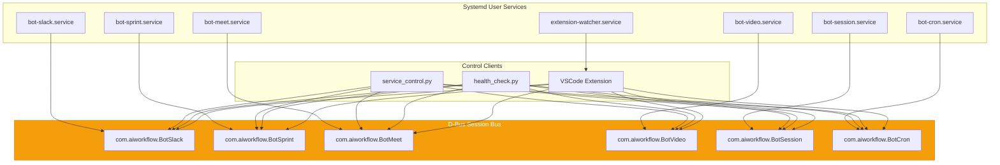
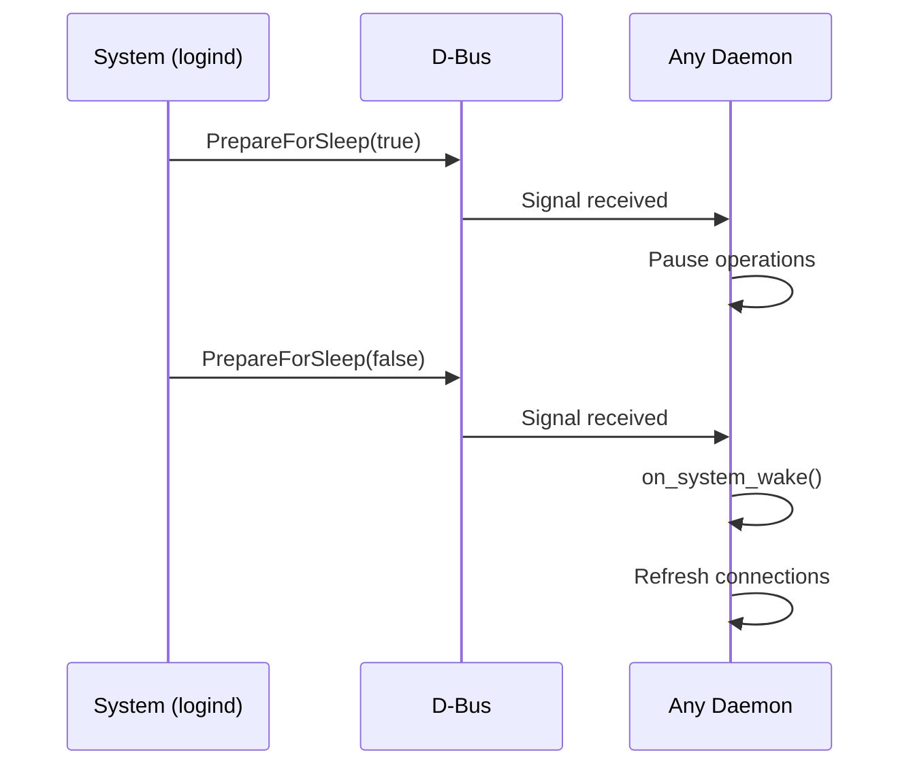

# 🤖 Background Daemons

This section documents the background daemon services that provide autonomous functionality for the AI Workflow system.

## Overview

The AI Workflow system includes 7 background daemons that run independently of the MCP server:

| Daemon | Service | Purpose |
|--------|---------|---------|
| [Slack](./slack.md) | `bot-slack.service` | Real-time Slack message monitoring and AI response |
| [Sprint](./sprint.md) | `bot-sprint.service` | Automated Jira issue processing during work hours |
| [Meet](./meet.md) | `bot-meet.service` | Google Meet auto-join and note-taking |
| [Video](./video.md) | `bot-video.service` | Virtual camera rendering for meetings |
| [Session](./session.md) | `bot-session.service` | Cursor IDE session synchronization |
| [Cron](./cron.md) | `bot-cron.service` | Scheduled job execution |
| [Extension Watcher](./extension-watcher.md) | `extension-watcher.service` | VSCode extension file watcher |

## Quick Start

### Installation

```bash
# Install all systemd services
./scripts/install_services.sh

# Or manually
cp systemd/*.service ~/.config/systemd/user/
systemctl --user daemon-reload
```

### Starting Daemons

```bash
# Start all daemons
systemctl --user start bot-slack bot-cron bot-session

# Start individual daemon
systemctl --user start bot-slack

# Enable auto-start on login
systemctl --user enable bot-slack
```

### Checking Status

```bash
# Check all services
python scripts/health_check.py

# Check specific service
systemctl --user status bot-slack

# View logs
journalctl --user -u bot-slack -f
```

### Controlling Daemons

```bash
# Use service control CLI
python scripts/service_control.py status
python scripts/service_control.py stop slack

# Or use make targets
make slack-status
make slack-daemon-stop
```

## Architecture

All daemons use a common D-Bus IPC architecture:



## D-Bus Interface

All daemons inherit from `DaemonDBusBase` and provide:

### Standard Properties

| Property | Type | Description |
|----------|------|-------------|
| `Running` | bool | Daemon is running |
| `Uptime` | float | Seconds since start |
| `Stats` | string | JSON statistics |

### Standard Methods

| Method | Returns | Description |
|--------|---------|-------------|
| `GetStatus()` | JSON | Complete daemon status |
| `GetStats()` | JSON | Service statistics |
| `Shutdown()` | JSON | Graceful shutdown |
| `HealthCheck()` | JSON | Health verification |
| `CallMethod(name, args)` | JSON | Call custom method |

### Standard Signals

| Signal | Parameters | Description |
|--------|------------|-------------|
| `StatusChanged` | status | Daemon state changed |
| `Event` | type, data | Generic event |

## State Files

Each daemon maintains its own state file in `~/.config/aa-workflow/`:

| Daemon | State File |
|--------|------------|
| Slack | `slack_state.db` (SQLite) |
| Sprint | `sprint_state_v2.json` |
| Meet | `meet_state.json`, `meetings.db` |
| Video | (managed by Meet) |
| Session | `session_state.json` |
| Cron | `cron_state.json` |

## Common Features

### Sleep/Wake Awareness

All daemons implement sleep/wake detection:



### Health Monitoring

```bash
# Check all daemons
python scripts/health_check.py

# JSON output
python scripts/health_check.py --json

# Continuous monitoring
python scripts/health_check.py --watch

# Attempt auto-repair
python scripts/health_check.py --fix
```

### Atomic State Writes

All state files use atomic writes to prevent corruption:

```python
def atomic_write(path, data):
    temp = path.with_suffix('.tmp')
    temp.write_text(json.dumps(data))
    temp.rename(path)  # Atomic on POSIX
```

## Daemon Details

### Slack Daemon

**Purpose**: Monitor Slack messages and generate AI responses

**Key Features**:
- WebSocket-based real-time listening
- Message classification and intent detection
- Approval workflow for sensitive responses
- Thread support

**Control Commands**:
```bash
make slack-daemon          # Start foreground
make slack-daemon-bg       # Start background
make slack-status          # Check status
make slack-pending         # List pending messages
make slack-approve-all     # Approve all pending
```

See [Slack Daemon](./slack.md) for details.

### Sprint Daemon

**Purpose**: Autonomous Jira issue processing

**Key Features**:
- Time-aware execution (Mon-Fri 9am-5pm)
- Issue prioritization
- Execution tracing
- Progress tracking

**Control Commands**:
```bash
python scripts/service_control.py approve-issue AAP-12345
python scripts/service_control.py skip-issue AAP-12345 "Blocked"
```

See [Sprint Daemon](./sprint.md) for details.

### Meet Daemon

**Purpose**: Google Meet bot for auto-join and notes

**Key Features**:
- Calendar polling
- Auto-join with different modes
- Live caption extraction
- Participant tracking

**Control Commands**:
```bash
python scripts/service_control.py list-meetings
```

See [Meet Daemon](./meet.md) for details.

### Cron Daemon

**Purpose**: Scheduled job execution

**Key Features**:
- APScheduler integration
- Dynamic config reloading
- Execution history
- Job enable/disable

**Control Commands**:
```bash
python scripts/service_control.py list-jobs
python scripts/service_control.py run-job daily_standup
```

See [Cron Daemon](./cron.md) for details.

### Session Daemon

**Purpose**: Cursor chat synchronization

**Key Features**:
- Cursor database watching
- Full-text chat search
- Session state sync

**Control Commands**:
```bash
python scripts/service_control.py search-chats "deploy"
```

See [Session Daemon](./session.md) for details.

### Video Daemon

**Purpose**: Virtual camera rendering

**Key Features**:
- v4l2loopback output
- Real-time video overlays
- Audio waveform visualization
- WebRTC streaming

See [Video Daemon](./video.md) for details.

## Development

### Creating a New Daemon

1. Inherit from `DaemonDBusBase`:

```python
from scripts.common.dbus_base import DaemonDBusBase

class MyDaemon(DaemonDBusBase):
    SERVICE_NAME = "com.aiworkflow.BotMy"
    OBJECT_PATH = "/com/aiworkflow/BotMy"
    INTERFACE_NAME = "com.aiworkflow.BotMy"

    async def get_service_stats(self) -> dict:
        return {"my_stat": 42}

    async def get_service_status(self) -> dict:
        return {"status": "running"}

    async def health_check(self) -> dict:
        return {"healthy": True}
```

2. Register custom methods:

```python
def __init__(self):
    super().__init__()
    self.register_handler("my_method", self._handle_my_method)

async def _handle_my_method(self, args: dict) -> dict:
    return {"result": "success"}
```

3. Create systemd service file:

```ini
[Unit]
Description=AI Workflow Bot - My Daemon
After=network.target dbus.service

[Service]
Type=simple
WorkingDirectory=%h/src/redhat-ai-workflow
ExecStart=%h/src/redhat-ai-workflow/.venv/bin/python scripts/my_daemon.py
Restart=on-failure
RestartSec=10

[Install]
WantedBy=default.target
```

### Testing Daemons

```bash
# Run daemon in foreground
python scripts/my_daemon.py

# Test D-Bus connection
busctl --user call com.aiworkflow.BotMy \
    /com/aiworkflow/BotMy \
    com.aiworkflow.BotMy \
    GetStatus
```

## See Also

- [Architecture Overview](../architecture/README.md) - System architecture
- [Daemon Architecture](../architecture/daemons.md) - Technical details
- [State Management](../architecture/state-management.md) - Persistence patterns
- [Development Guide](../DEVELOPMENT.md) - Contributing guidelines
