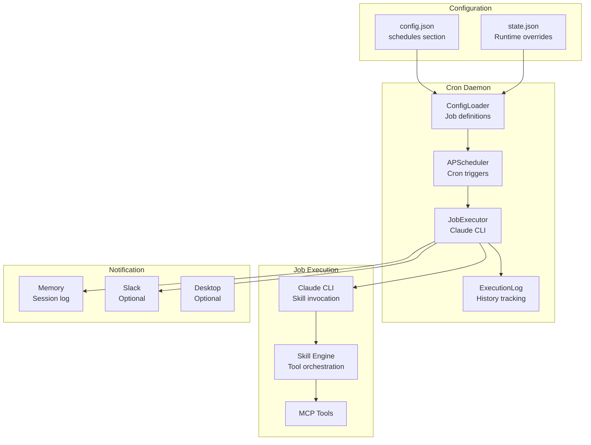
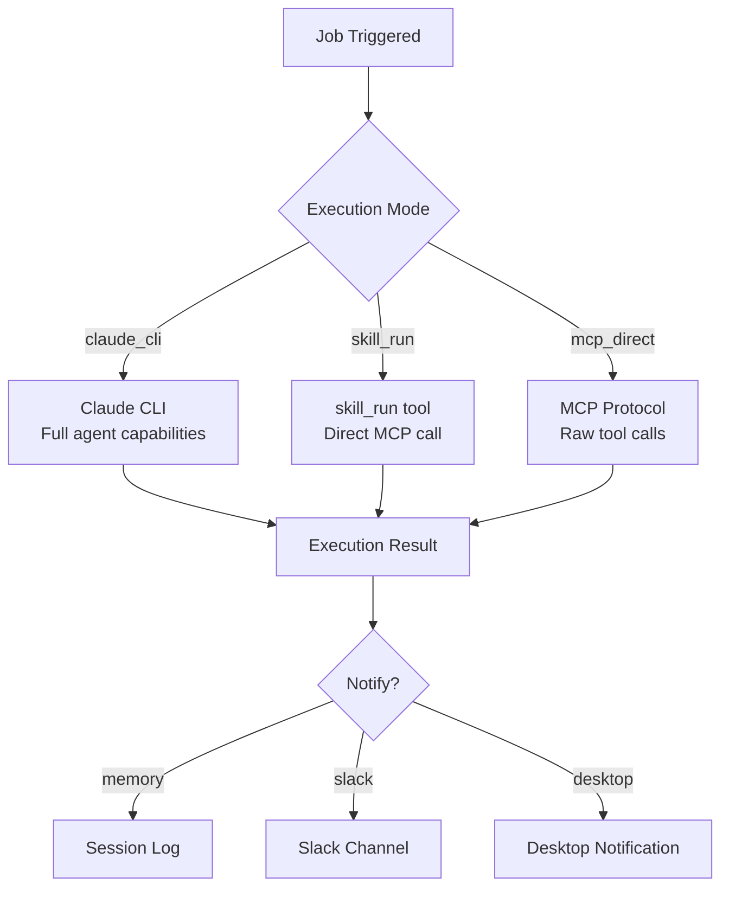
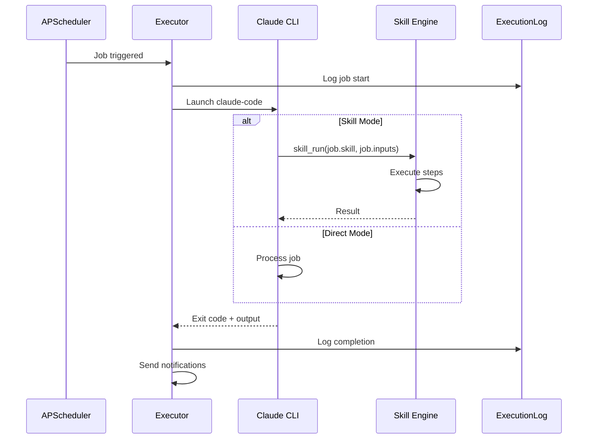
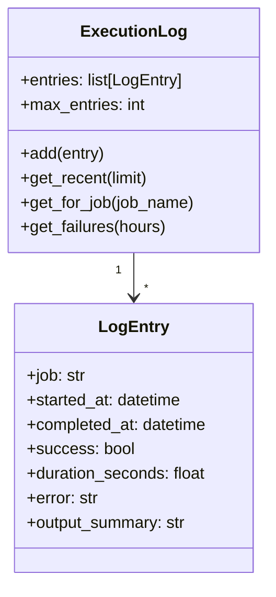
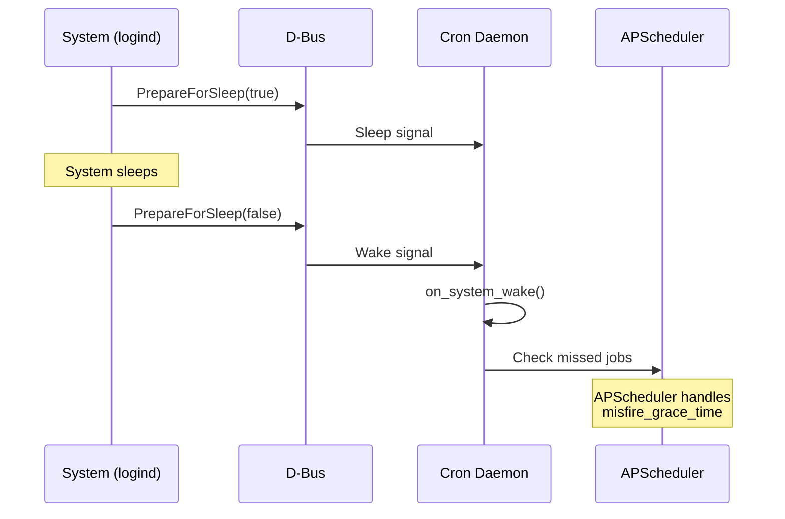

# Cron Daemon

> Scheduled job execution using Claude CLI

## Overview

The Cron Daemon (`scripts/cron_daemon.py`) is a standalone service that runs scheduled jobs using APScheduler. Jobs execute skills via Claude CLI, enabling automated AI-powered workflows.

## Architecture



## Features

| Feature | Description |
|---------|-------------|
| Cron scheduling | Standard cron syntax support |
| Poll triggers | Interval-based polling jobs |
| Dynamic config | Hot-reload on config changes |
| Job toggle | Enable/disable individual jobs |
| Execution history | Track success/failure |
| Multiple executors | Claude CLI, direct skill, MCP |

## D-Bus Interface

**Service**: `com.aiworkflow.BotCron`

### Methods

| Method | Parameters | Returns | Description |
|--------|------------|---------|-------------|
| `GetStatus` | - | JSON | Get daemon status |
| `ListJobs` | - | JSON | List scheduled jobs |
| `RunJob` | job_name | JSON | Run job immediately |
| `GetHistory` | limit? | JSON | Get execution history |
| `ToggleScheduler` | enabled | JSON | Enable/disable scheduler |
| `ToggleJob` | job_name, enabled | JSON | Enable/disable specific job |
| `UpdateConfig` | section, key, value | JSON | Update config value |
| `GetConfig` | section, key? | JSON | Get config value |

### Signals

| Signal | Parameters | Description |
|--------|------------|-------------|
| `JobStarted` | job_name | Job execution started |
| `JobCompleted` | job_name, success | Job execution finished |
| `ConfigReloaded` | - | Configuration was reloaded |

## Job Configuration

### Cron Jobs

```json
{
  "schedules": {
    "enabled": true,
    "timezone": "Europe/Dublin",
    "execution_mode": "claude_cli",
    "jobs": [
      {
        "name": "daily_standup",
        "description": "Generate daily standup summary",
        "trigger": "cron",
        "cron": "0 9 * * 1-5",
        "skill": "standup_summary",
        "persona": "developer",
        "inputs": {
          "days": 1
        },
        "notify": ["memory", "slack"],
        "enabled": true
      }
    ]
  }
}
```

### Poll Jobs

```json
{
  "name": "check_mr_feedback",
  "description": "Check MRs for new comments",
  "trigger": "poll",
  "interval_minutes": 30,
  "skill": "check_feedback",
  "notify": ["memory", "desktop"]
}
```

### Job Fields

| Field | Required | Description |
|-------|----------|-------------|
| `name` | Yes | Unique job identifier |
| `description` | No | Human-readable description |
| `trigger` | Yes | `cron` or `poll` |
| `cron` | If trigger=cron | Cron expression |
| `interval_minutes` | If trigger=poll | Poll interval |
| `skill` | Yes | Skill to execute |
| `persona` | No | Persona to load |
| `inputs` | No | Skill input parameters |
| `notify` | No | Notification channels |
| `enabled` | No | Whether job is active (default: true) |

## Execution Modes



### Mode Comparison

| Mode | Use Case | Capabilities |
|------|----------|--------------|
| `claude_cli` | Complex multi-step jobs | Full Claude reasoning |
| `skill_run` | Simple skill execution | Fast, deterministic |
| `mcp_direct` | Single tool calls | Minimal overhead |

## Job Lifecycle



## State Management

### State File Structure

`~/.config/aa-workflow/cron_state.json`:

```json
{
  "enabled": true,
  "timezone": "Europe/Dublin",
  "execution_mode": "claude_cli",
  "jobs": [
    {
      "name": "daily_standup",
      "description": "Generate daily standup summary",
      "skill": "standup_summary",
      "cron": "0 9 * * 1-5",
      "trigger": "cron",
      "persona": "developer",
      "enabled": true,
      "notify": ["memory", "slack"],
      "next_run": "2026-01-27T09:00:00+00:00"
    }
  ],
  "history": [
    {
      "job": "daily_standup",
      "started_at": "2026-01-26T09:00:00Z",
      "completed_at": "2026-01-26T09:02:30Z",
      "success": true,
      "duration_seconds": 150
    }
  ],
  "total_history": 1,
  "updated_at": "2026-01-26T09:02:30Z"
}
```

### Runtime State Overrides

The daemon uses `StateManager` for runtime overrides:

```python
# Toggle scheduler
state_manager.set_service_enabled("scheduler", False, flush=True)

# Toggle individual job
state_manager.set_job_enabled("daily_standup", False, flush=True)
```

These overrides persist in `state.json` and survive restarts.

## Execution History



## Usage

### Starting the Daemon

```bash
# Run in foreground
python scripts/cron_daemon.py

# Run with D-Bus IPC
python scripts/cron_daemon.py --dbus

# List configured jobs
python scripts/cron_daemon.py --list-jobs
```

### Systemd Service

```bash
# Start service
systemctl --user start bot-cron

# View logs
journalctl --user -u bot-cron -f

# Check status
systemctl --user status bot-cron
```

### D-Bus Control

```bash
# List jobs
python scripts/service_control.py list-jobs

# Run job immediately
python scripts/service_control.py run-job daily_standup

# Toggle job
busctl --user call com.aiworkflow.BotCron \
    /com/aiworkflow/BotCron \
    com.aiworkflow.BotCron \
    ToggleJob "sb" "daily_standup" false
```

## Sleep/Wake Handling



APScheduler automatically handles missed jobs based on `misfire_grace_time`. Jobs missed during sleep may run immediately on wake if within the grace period.

## Common Cron Expressions

| Expression | Schedule |
|------------|----------|
| `0 9 * * 1-5` | 9am weekdays |
| `*/30 * * * *` | Every 30 minutes |
| `0 */4 * * *` | Every 4 hours |
| `0 0 * * 0` | Midnight on Sunday |
| `0 17 * * 5` | 5pm on Friday |

## Configuration

### Required Setup

1. Claude CLI installed and configured
2. Skills defined in `skills/` directory

### config.json Settings

```json
{
  "schedules": {
    "enabled": true,
    "timezone": "Europe/Dublin",
    "execution_mode": "claude_cli",
    "misfire_grace_time": 300,
    "jobs": [...]
  }
}
```

## See Also

- [Daemons Overview](./README.md) - All background services
- [Skills Reference](../skills/README.md) - Available skills
- [Daemon Architecture](../architecture/daemons.md) - Technical details
