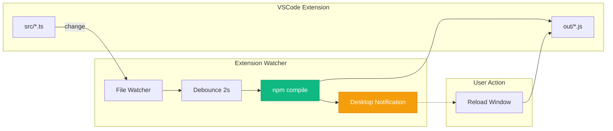
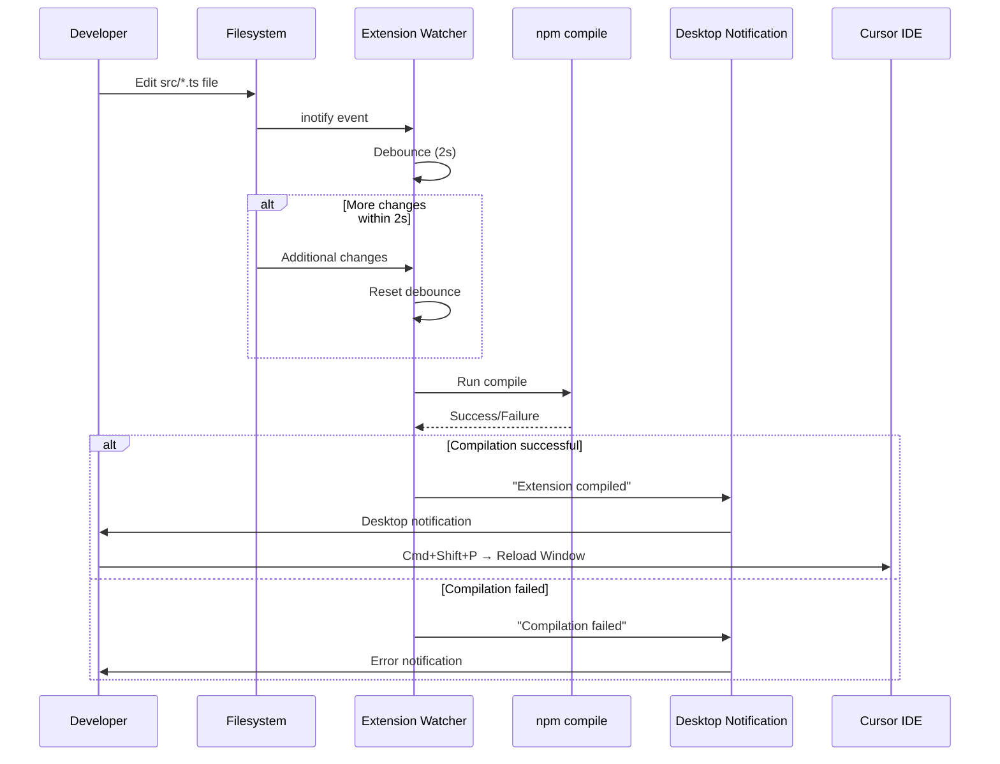

# Extension Watcher Daemon

The Extension Watcher daemon monitors VSCode extension source files and automatically recompiles on changes.

## Overview

| Property | Value |
|----------|-------|
| **Service** | `extension-watcher.service` |
| **Script** | `scripts/extension_watcher.py` |
| **Purpose** | Hot-reload VSCode extension development |
| **Watch Path** | `extensions/aa_workflow_vscode/src/*.ts` |

## Architecture



## How It Works



## Installation

```bash
# Copy service file
cp systemd/extension-watcher.service ~/.config/systemd/user/

# Reload systemd
systemctl --user daemon-reload

# Enable and start
systemctl --user enable extension-watcher
systemctl --user start extension-watcher
```

## Usage

### Starting the Watcher

```bash
# Via systemd (recommended)
systemctl --user start extension-watcher

# Via script directly
python scripts/extension_watcher.py

# With desktop notifications
python scripts/extension_watcher.py --notify
```

### Checking Status

```bash
# Check service status
systemctl --user status extension-watcher

# View logs
journalctl --user -u extension-watcher -f
```

### Stopping

```bash
systemctl --user stop extension-watcher
```

## Configuration

The watcher is configured via constants in the script:

| Setting | Default | Description |
|---------|---------|-------------|
| `WATCH_EXTENSIONS` | `.ts`, `.json` | File types to watch |
| `DEBOUNCE_SECONDS` | 2.0 | Wait time before compiling |
| `ENABLE_NOTIFY` | `--notify` flag | Enable desktop notifications |

## Environment Variables

The systemd service sets these environment variables:

| Variable | Value | Purpose |
|----------|-------|---------|
| `DISPLAY` | `:0` | X11 display for notifications |
| `WAYLAND_DISPLAY` | `wayland-0` | Wayland display for notifications |
| `XDG_RUNTIME_DIR` | `/run/user/1000` | D-Bus/notification socket |

## Workflow

After the watcher compiles changes:

1. You'll see a desktop notification (if enabled)
2. Switch to Cursor IDE
3. Press `Cmd+Shift+P` (Mac) or `Ctrl+Shift+P` (Linux)
4. Type "Developer: Reload Window"
5. The extension will reload with your changes

## Comparison with MCP Reload

| Aspect | Extension Watcher | MCP Server |
|--------|-------------------|------------|
| **Reload Required** | Manual window reload | Automatic |
| **Compilation** | TypeScript → JavaScript | None (Python) |
| **Notification** | Desktop notification | N/A |
| **State Loss** | Extension state reset | Session preserved |

## Troubleshooting

### Notifications Not Working

```bash
# Test notify-send directly
notify-send "Test" "Hello World"

# Check environment variables
echo $DISPLAY
echo $XDG_RUNTIME_DIR
```

### Compilation Failing

```bash
# Check npm is available
which npm

# Try compiling manually
cd extensions/aa_workflow_vscode
npm run compile

# Check for TypeScript errors
npm run lint
```

### Watcher Not Detecting Changes

```bash
# Check inotify limits
cat /proc/sys/fs/inotify/max_user_watches

# Increase if needed
echo fs.inotify.max_user_watches=524288 | sudo tee -a /etc/sysctl.conf
sudo sysctl -p
```

## See Also

- [VSCode Extension](../architecture/vscode-extension.md) - Extension architecture
- [Daemons Overview](./README.md) - All background services
- [Development Guide](../DEVELOPMENT.md) - Contributing guidelines
