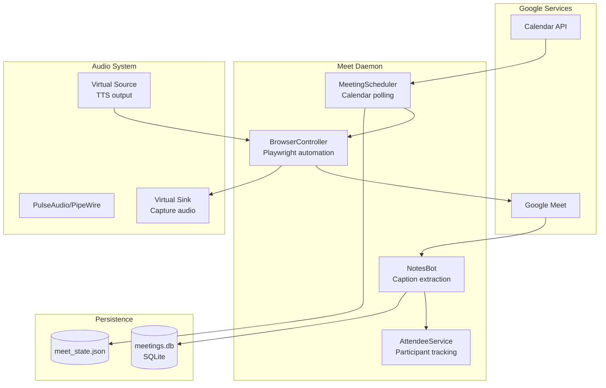
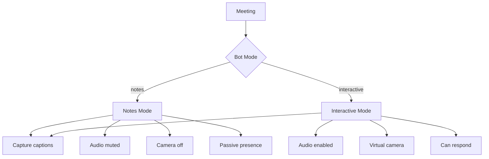
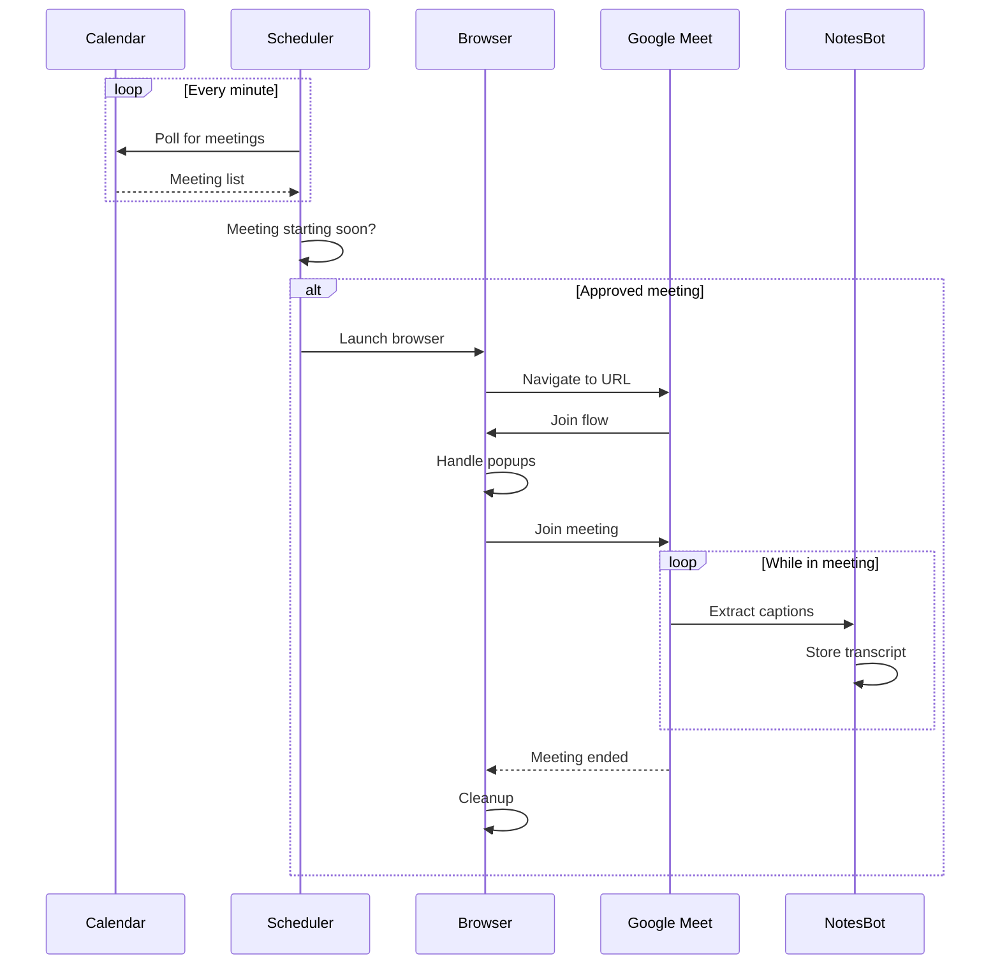
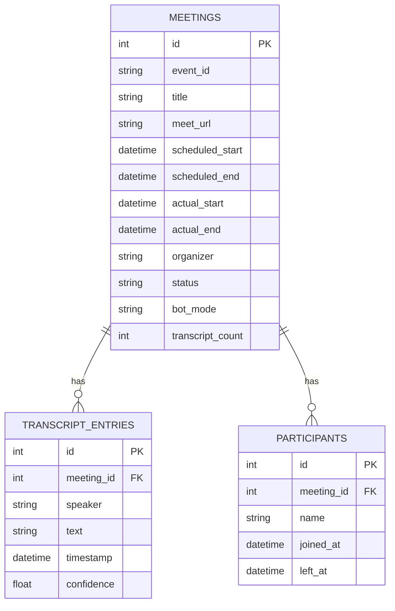
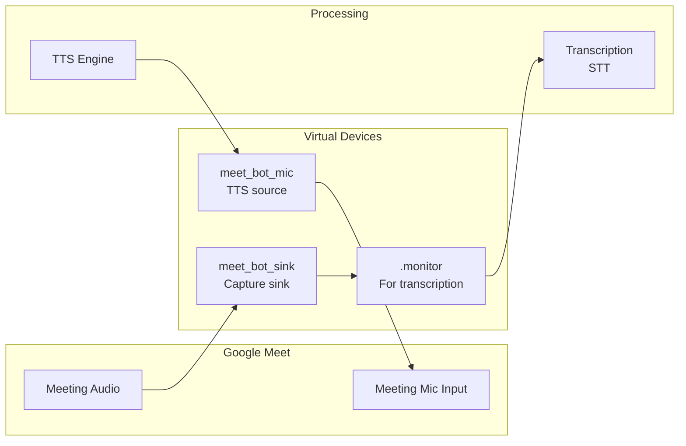
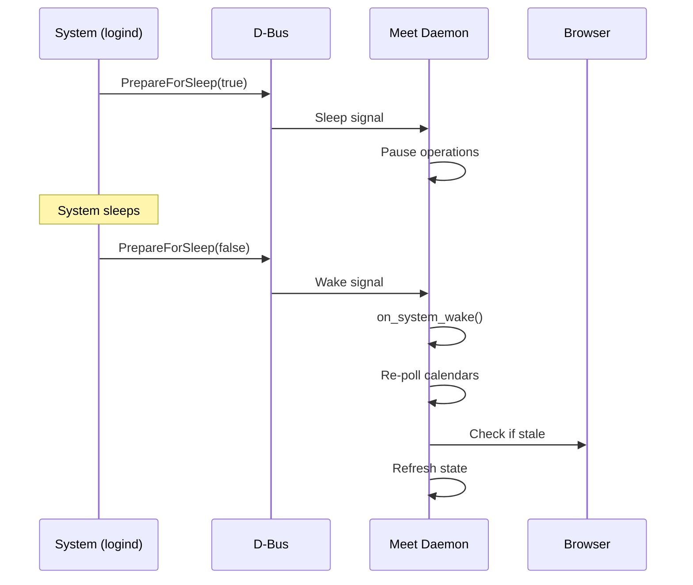

# Meet Daemon

> Google Meet auto-join and note-taking bot

## Overview

The Meet Daemon (`scripts/meet_daemon.py`) is a standalone service that monitors calendars for upcoming meetings with Google Meet links and automatically joins them with configurable modes.

## Architecture



## Features

| Feature | Description |
|---------|-------------|
| Calendar polling | Monitors multiple calendars |
| Auto-join | Joins meetings with buffer time |
| Meeting modes | Notes-only or interactive |
| Caption extraction | Real-time transcript capture |
| Participant tracking | Who's in the meeting |
| Meeting history | SQLite database storage |
| Audio routing | Virtual audio devices |

## D-Bus Interface

**Service**: `com.aiworkflow.BotMeet`

### Methods

| Method | Parameters | Returns | Description |
|--------|------------|---------|-------------|
| `GetStatus` | - | JSON | Get daemon status |
| `ListMeetings` | - | JSON | List upcoming meetings |
| `ApproveMeeting` | event_id, mode? | JSON | Pre-approve for auto-join |
| `UnapproveMeeting` | event_id | JSON | Cancel approval |
| `SkipMeeting` | event_id | JSON | Skip a meeting |
| `ForceJoin` | event_id | JSON | Immediately join meeting |
| `JoinMeeting` | url, title?, mode? | JSON | Join by URL |
| `LeaveMeeting` | session_id? | JSON | Leave current meeting |
| `SetMeetingMode` | event_id, mode | JSON | Set meeting mode |
| `ListCalendars` | - | JSON | List monitored calendars |
| `GetCaptions` | limit? | JSON | Get recent captions |
| `GetParticipants` | - | JSON | Get current participants |
| `GetMeetingHistory` | limit? | JSON | Get past meetings |
| `MuteAudio` | - | JSON | Mute meeting audio |
| `UnmuteAudio` | - | JSON | Unmute meeting audio |
| `GetAudioState` | - | JSON | Get audio mute state |

### Signals

| Signal | Parameters | Description |
|--------|------------|-------------|
| `MeetingJoined` | event_id, title | Joined a meeting |
| `MeetingLeft` | event_id | Left a meeting |
| `CaptionReceived` | speaker, text | New caption captured |

## Meeting Modes



| Mode | Audio | Video | Purpose |
|------|-------|-------|---------|
| `notes` | Muted | Off | Silent note-taking |
| `interactive` | On | Virtual camera | Active participation |

## Meeting Lifecycle



## Calendar Configuration

### Adding Calendars

```python
# Via MCP tool
meet_add_calendar(
    calendar_id="primary",
    name="Work Calendar",
    enabled=True,
    auto_join=False,  # Require approval
    bot_mode="notes"
)
```

### Calendar Properties

| Property | Type | Description |
|----------|------|-------------|
| `calendar_id` | string | Google Calendar ID |
| `name` | string | Display name |
| `enabled` | bool | Monitor this calendar |
| `auto_join` | bool | Join without approval |
| `bot_mode` | string | Default mode (notes/interactive) |

## State Management

### State File Structure

`~/.config/aa-workflow/meet_state.json`:

```json
{
  "schedulerRunning": true,
  "upcomingMeetings": [
    {
      "id": "event123",
      "title": "Team Standup",
      "url": "https://meet.google.com/abc-defg-hij",
      "startTime": "2026-01-26T10:00:00Z",
      "endTime": "2026-01-26T10:30:00Z",
      "organizer": "manager@example.com",
      "status": "approved",
      "botMode": "notes"
    }
  ],
  "currentMeetings": [],
  "monitoredCalendars": [
    {"id": "primary", "name": "Work", "enabled": true}
  ],
  "nextMeeting": {...},
  "countdown": "45m",
  "countdownSeconds": 2700,
  "lastPoll": "2026-01-26T09:15:00Z"
}
```

### Meeting Statuses

| Status | Description |
|--------|-------------|
| `scheduled` | On calendar, awaiting action |
| `approved` | Will auto-join |
| `skipped` | User chose to skip |
| `joining` | Currently joining |
| `joined` | In the meeting |
| `completed` | Meeting ended |

## Database Schema



## Audio Routing

In interactive mode, the daemon sets up virtual audio devices:



## Usage

### Starting the Daemon

```bash
# Run in foreground
python scripts/meet_daemon.py

# Run with D-Bus IPC
python scripts/meet_daemon.py --dbus

# List upcoming meetings
python scripts/meet_daemon.py --list
```

### Systemd Service

```bash
# Start service
systemctl --user start bot-meet

# View logs
journalctl --user -u bot-meet -f

# Check status
systemctl --user status bot-meet
```

### D-Bus Control

```bash
# Via service_control.py
python scripts/service_control.py list-meetings

# Approve a meeting
busctl --user call com.aiworkflow.BotMeet \
    /com/aiworkflow/BotMeet \
    com.aiworkflow.BotMeet \
    ApproveMeeting "ss" "event123" "notes"

# Join by URL
busctl --user call com.aiworkflow.BotMeet \
    /com/aiworkflow/BotMeet \
    com.aiworkflow.BotMeet \
    JoinMeeting "sss" "https://meet.google.com/abc" "Quick Meeting" "notes"
```

## Sleep/Wake Handling



## Configuration

### Required Setup

1. Google OAuth credentials configured
2. Calendar API enabled
3. Playwright browsers installed

### config.json Settings

```json
{
  "google": {
    "credentials_file": "~/.config/aa-workflow/google_credentials.json",
    "token_file": "~/.config/aa-workflow/google_token.json"
  },
  "meet": {
    "join_buffer_minutes": 2,
    "leave_after_minutes": 5,
    "screenshot_interval_seconds": 30
  }
}
```

## See Also

- [Daemons Overview](./README.md) - All background services
- [Video Daemon](./video.md) - Virtual camera rendering
- [Daemon Architecture](../architecture/daemons.md) - Technical details
