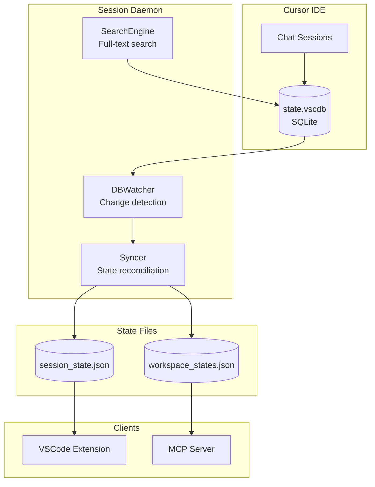
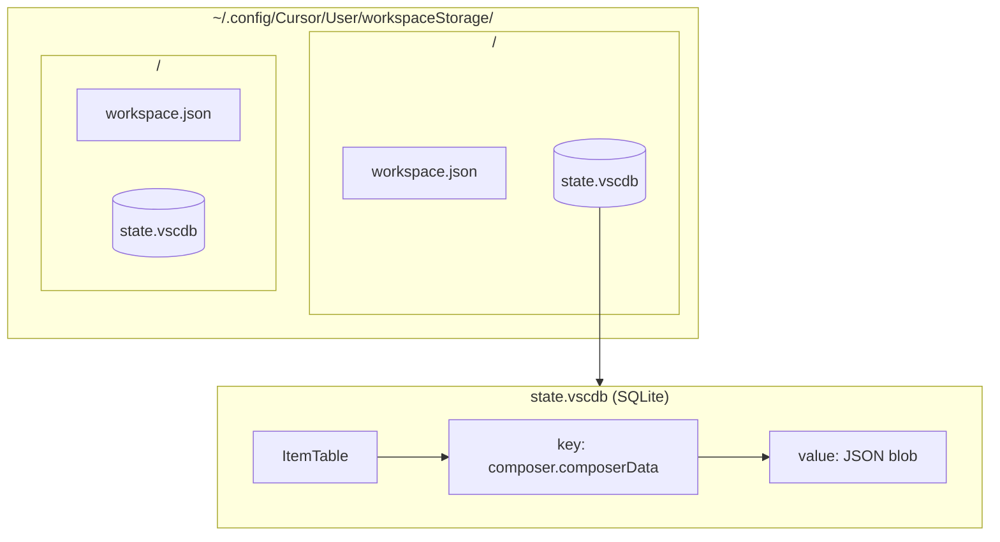
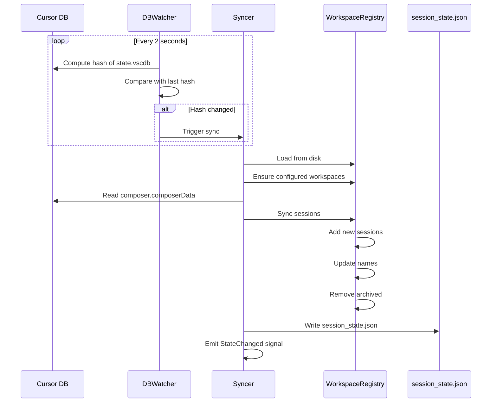
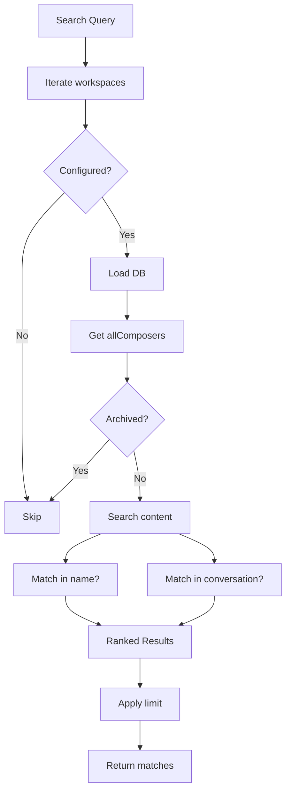
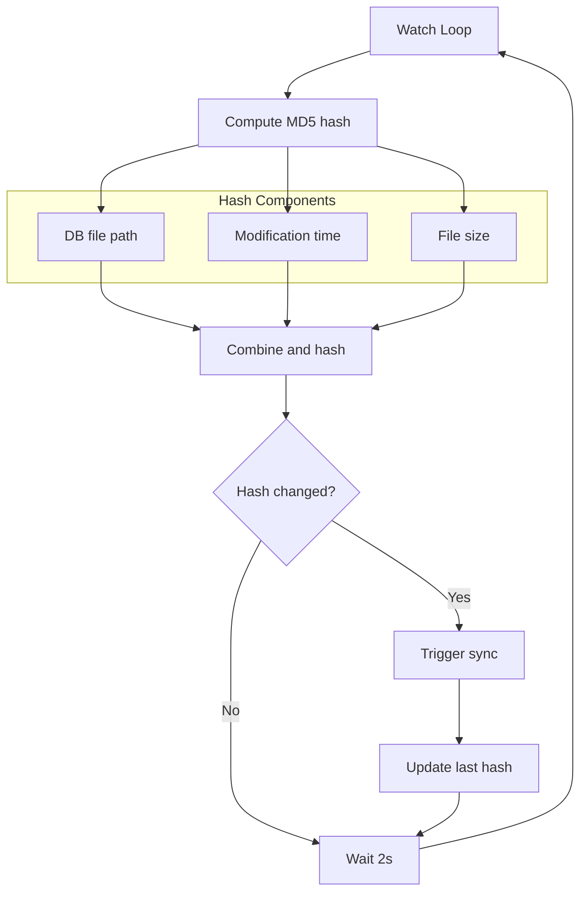
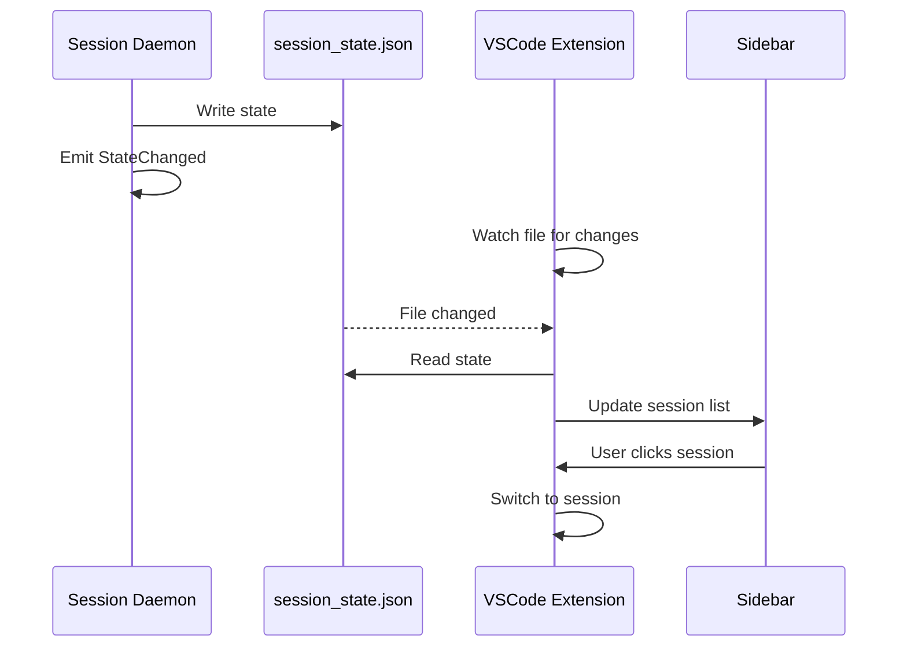

# Session Daemon

> Cursor IDE session synchronization and search

## Overview

The Session Daemon (`scripts/session_daemon.py`) is a standalone service that monitors Cursor's internal database for session changes and provides real-time synchronization with the MCP server's workspace state.

## Architecture



## Features

| Feature | Description |
|---------|-------------|
| Database watching | Monitors Cursor's SQLite for changes |
| Session sync | Keeps MCP state aligned with Cursor |
| Full-text search | Search across all chat content |
| State change detection | Hash-based change detection |
| Multi-workspace | Supports multiple configured projects |

## D-Bus Interface

**Service**: `com.aiworkflow.BotSession`

### Methods

| Method | Parameters | Returns | Description |
|--------|------------|---------|-------------|
| `GetStatus` | - | JSON | Get daemon status |
| `SearchChats` | query, limit? | JSON | Search chat content |
| `GetSessions` | - | JSON | Get all sessions |
| `RefreshNow` | - | JSON | Trigger immediate sync |
| `GetState` | - | JSON | Get full session state |

### Signals

| Signal | Parameters | Description |
|--------|------------|-------------|
| `StateChanged` | change_type | Sessions changed |

## Cursor Database Structure



### Composer Data Structure

The `composer.composerData` value contains:

```json
{
  "allComposers": [
    {
      "composerId": "uuid-here",
      "name": "Session Name",
      "isArchived": false,
      "isDraft": false,
      "lastUpdatedAt": "2026-01-26T09:30:00Z",
      "conversation": [
        {
          "role": "user",
          "text": "Help me with..."
        },
        {
          "role": "assistant",
          "content": "Sure, I can..."
        }
      ]
    }
  ]
}
```

## Sync Flow



## Search Functionality



### Search Response

```json
{
  "results": [
    {
      "session_id": "abc-123",
      "name": "Working on AAP-12345",
      "project": "automation-analytics-backend",
      "workspace_uri": "file:///home/user/src/backend",
      "name_match": true,
      "content_matches": [
        {
          "snippet": "...working on the AAP-12345 issue...",
          "role": "user"
        }
      ],
      "match_count": 3,
      "last_updated": "2026-01-26T09:30:00Z"
    }
  ],
  "query": "AAP-12345",
  "total_found": 1
}
```

## State Management

### State File Structure

`~/.config/aa-workflow/session_state.json`:

```json
{
  "workspaces": {
    "file:///home/user/src/project": {
      "uri": "file:///home/user/src/project",
      "persona": "developer",
      "project": "automation-analytics-backend",
      "active_issue": "AAP-12345",
      "active_branch": "aap-12345-feature",
      "sessions": {
        "abc-123": {
          "session_id": "abc-123",
          "name": "Working on AAP-12345",
          "persona": "developer",
          "created_at": "2026-01-25T14:00:00Z",
          "updated_at": "2026-01-26T09:30:00Z",
          "cursor_chat_id": "cursor-uuid"
        }
      }
    }
  },
  "sessions": [
    {
      "session_id": "abc-123",
      "name": "Working on AAP-12345",
      "workspace_uri": "file:///home/user/src/project",
      "persona": "developer",
      "updated_at": "2026-01-26T09:30:00Z"
    }
  ],
  "workspace_count": 1,
  "session_count": 1,
  "last_sync": {
    "synced": 1,
    "added": 0,
    "removed": 0,
    "updated": 1
  },
  "updated_at": "2026-01-26T09:30:00Z"
}
```

## Change Detection

The daemon uses hash-based change detection for efficiency:



## Usage

### Starting the Daemon

```bash
# Run in foreground
python scripts/session_daemon.py

# Run with verbose logging
python scripts/session_daemon.py --verbose

# Disable D-Bus (for testing)
python scripts/session_daemon.py --no-dbus
```

### Systemd Service

```bash
# Start service
systemctl --user start bot-session

# View logs
journalctl --user -u bot-session -f

# Check status
systemctl --user status bot-session
```

### D-Bus Control

```bash
# Search chats
python scripts/session_daemon.py --search "deploy"

# Via D-Bus directly
busctl --user call com.aiworkflow.BotSession \
    /com/aiworkflow/BotSession \
    com.aiworkflow.BotSession \
    SearchChats "si" "AAP-12345" 10
```

### Search from CLI

```bash
python scripts/session_daemon.py --search "deploy to stage" --limit 5
```

## Integration with VSCode Extension



## Configuration

### Configured Workspaces

The daemon only monitors workspaces listed in `config.json`:

```json
{
  "repositories": {
    "backend": {
      "path": "/home/user/src/automation-analytics-backend",
      "gitlab": "insights/automation-analytics-backend"
    },
    "workflow": {
      "path": "/home/user/src/redhat-ai-workflow",
      "gitlab": "user/redhat-ai-workflow"
    }
  }
}
```

### Sync Intervals

| Interval | Value | Purpose |
|----------|-------|---------|
| Watch interval | 2 seconds | Check for DB changes |
| Sync interval | 10 seconds | Full periodic sync |

## See Also

- [Daemons Overview](./README.md) - All background services
- [Session Management](../architecture/session-management.md) - Architecture details
- [Daemon Architecture](../architecture/daemons.md) - Technical details
