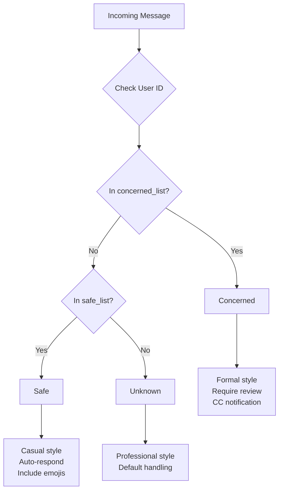
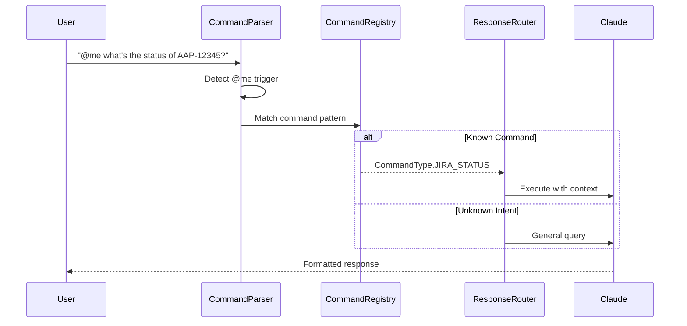
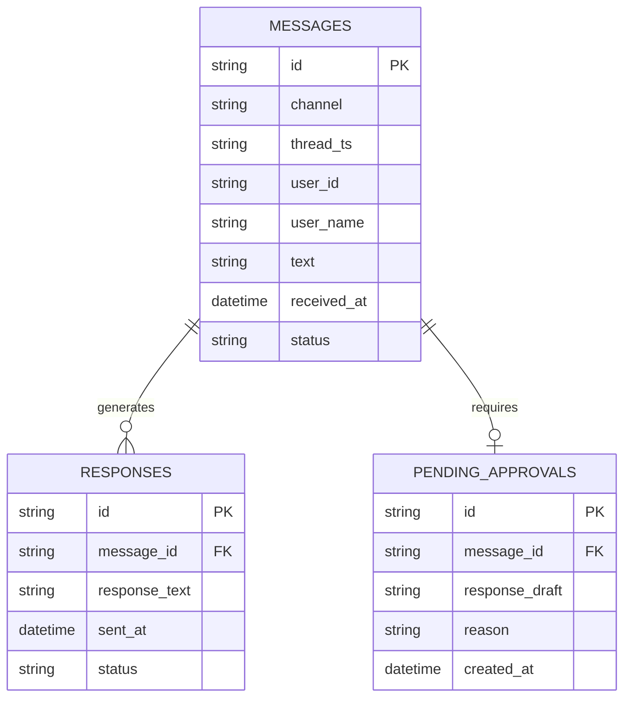
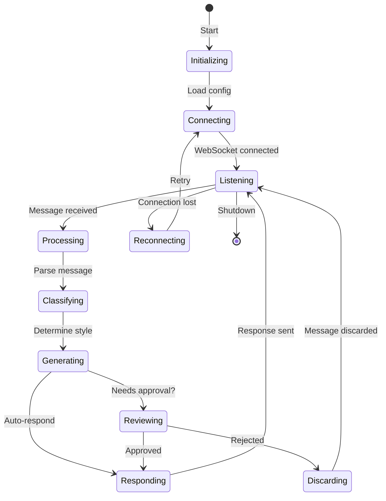

# Slack Daemon

> Real-time Slack message monitoring and AI-powered response generation

## Overview

The Slack Daemon (`scripts/slack_daemon.py`) is a standalone service that monitors Slack channels for messages mentioning the configured bot and generates intelligent responses using Claude AI and MCP tools.

## Architecture

```mermaid
graph TB
    subgraph Slack["Slack Platform"]
        WS[WebSocket API]
        API[Web API]
    end

    subgraph Daemon["Slack Daemon"]
        LISTENER[SlackListener<br/>WebSocket monitoring]
        PARSER[CommandParser<br/>@me detection]
        ROUTER[ResponseRouter<br/>Response selection]
        FORMATTER[ResponseFormatter<br/>Output formatting]
        CLASSIFIER[UserClassifier<br/>User categorization]
    end

    subgraph AI["AI Processing"]
        CLAUDE[Claude AI<br/>Response generation]
        MCP[MCP Tools<br/>Jira, GitLab, K8s, etc.]
    end

    subgraph State["Persistence"]
        DB[(SlackStateDB<br/>SQLite)]
        PENDING[Pending Messages<br/>Approval queue]
    end

    WS --> LISTENER
    LISTENER --> PARSER
    PARSER --> CLASSIFIER
    CLASSIFIER --> ROUTER
    ROUTER --> CLAUDE
    CLAUDE --> MCP
    CLAUDE --> FORMATTER
    FORMATTER --> API

    LISTENER --> DB
    ROUTER --> PENDING
```

## Features

| Feature | Description |
|---------|-------------|
| Real-time monitoring | WebSocket-based message detection |
| @me commands | Natural language command parsing |
| User classification | Safe/Concerned/Unknown categorization |
| Approval workflow | Review before sending sensitive responses |
| Tool integration | Access to all MCP tools via Claude |
| Thread support | Proper thread context handling |
| Desktop notifications | Optional GNOME notifications |

## D-Bus Interface

**Service**: `com.aiworkflow.BotSlack`

### Methods

| Method | Parameters | Returns | Description |
|--------|------------|---------|-------------|
| `GetStatus` | - | JSON | Get daemon status and statistics |
| `GetPending` | - | JSON | List pending approval messages |
| `ApproveMessage` | message_id | JSON | Approve a pending message |
| `RejectMessage` | message_id | JSON | Reject a pending message |
| `ApproveAll` | - | JSON | Approve all pending messages |
| `SetDryRun` | enabled | JSON | Toggle dry-run mode |
| `RefreshCredentials` | - | JSON | Refresh Slack OAuth tokens |

### Signals

| Signal | Parameters | Description |
|--------|------------|-------------|
| `MessageReceived` | channel, user | New message detected |
| `ResponseSent` | channel, thread | Response was sent |
| `ApprovalRequired` | message_id | Message needs approval |

## User Classification

The daemon classifies users into three categories:



### Configuration

In `config.json`:

```json
{
  "slack": {
    "user_classification": {
      "safe_list": {
        "user_ids": ["U12345678"],
        "user_names": ["teammate1", "teammate2"],
        "response_style": "casual",
        "auto_respond": true,
        "include_emojis": true
      },
      "concerned_list": {
        "user_ids": ["U87654321"],
        "user_names": ["manager"],
        "response_style": "formal",
        "auto_respond": false,
        "require_review": true,
        "cc_notification": true
      }
    }
  }
}
```

## Command Parsing

The daemon supports natural language commands via `@me` mentions:



### Command Types

| Type | Patterns | Description |
|------|----------|-------------|
| `JIRA_STATUS` | "status of AAP-*", "what's happening with *" | Check Jira issue |
| `MR_REVIEW` | "review MR *", "check merge request *" | Review GitLab MR |
| `DEPLOY` | "deploy to *", "push to *" | Trigger deployment |
| `HELP` | "help", "what can you do" | List capabilities |
| `GENERAL` | (anything else) | Free-form query |

## State Management

The daemon maintains state in SQLite:



## Usage

### Starting the Daemon

```bash
# Run in foreground
python scripts/slack_daemon.py

# Run with verbose logging
python scripts/slack_daemon.py --verbose

# Run in dry-run mode (no responses sent)
python scripts/slack_daemon.py --dry-run
```

### Systemd Service

```bash
# Start service
systemctl --user start bot-slack

# View logs
journalctl --user -u bot-slack -f

# Check status
systemctl --user status bot-slack
```

### D-Bus Control

```bash
# Check status
make slack-status

# List pending messages
make slack-pending

# Approve all pending
make slack-approve-all

# Via D-Bus directly
busctl --user call com.aiworkflow.BotSlack \
    /com/aiworkflow/BotSlack \
    com.aiworkflow.BotSlack \
    GetStatus
```

## Configuration

### Required Environment Variables

| Variable | Description |
|----------|-------------|
| `ANTHROPIC_API_KEY` | Claude API key (or use Vertex AI) |
| `CLAUDE_CODE_USE_VERTEX` | Set to `1` for Vertex AI |
| `ANTHROPIC_VERTEX_PROJECT_ID` | GCP project for Vertex AI |

### config.json Settings

```json
{
  "slack": {
    "auth": {
      "xoxc_token": "...",
      "xoxd_token": "...",
      "team_id": "T..."
    },
    "monitored_channels": ["C12345678"],
    "bot_user_id": "U...",
    "response_delay_seconds": 2,
    "max_response_length": 2000
  }
}
```

## Lifecycle



## See Also

- [Daemons Overview](./README.md) - All background services
- [Daemon Architecture](../architecture/daemons.md) - Technical details
- [MCP Implementation](../architecture/mcp-implementation.md) - Tool integration
