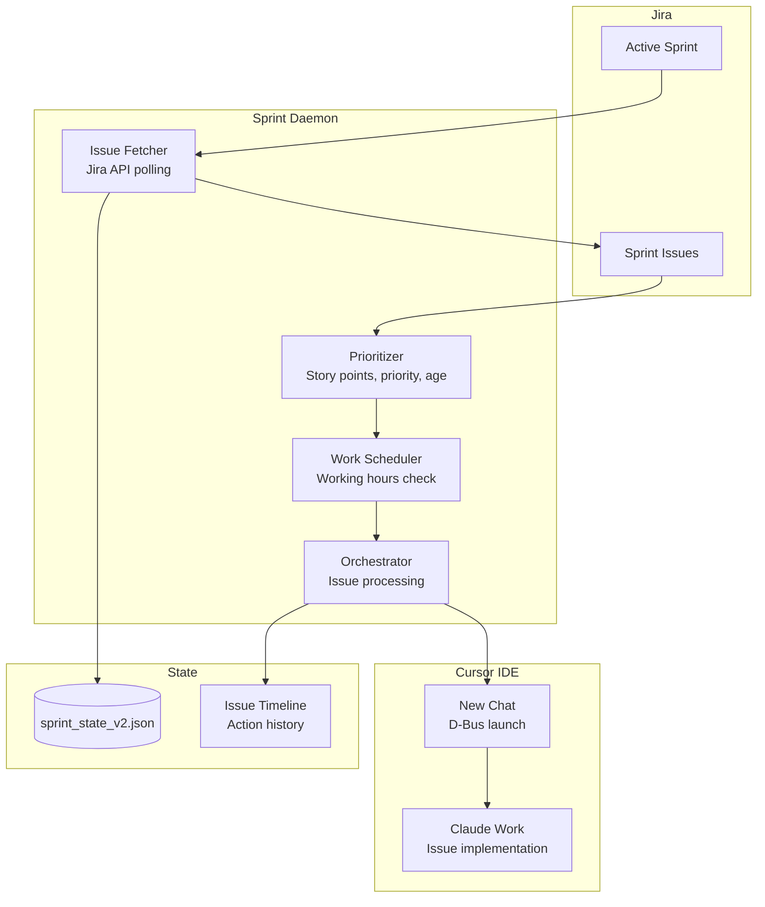
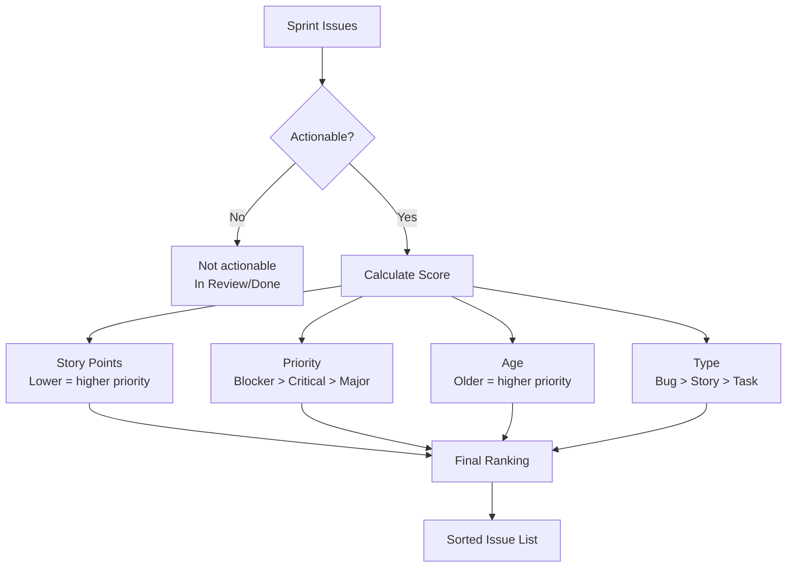
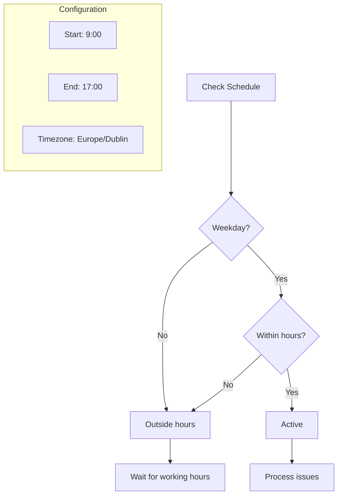
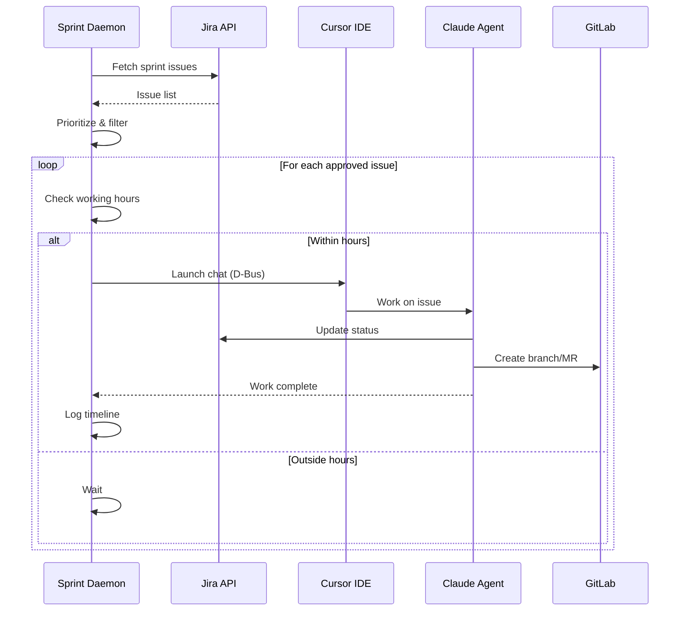
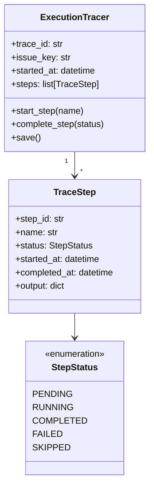
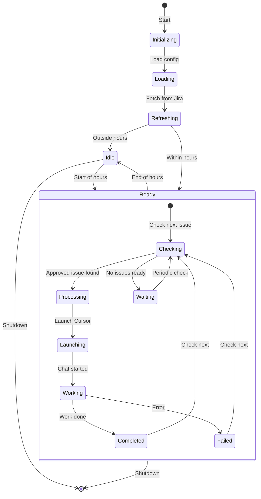

# Sprint Daemon

> Automated Jira issue processing during work hours

## Overview

The Sprint Daemon (`scripts/sprint_daemon.py`) is a standalone service that automates sprint work by fetching Jira issues, prioritizing them, and orchestrating Cursor chats to work on approved issues.

## Architecture



## Features

| Feature | Description |
|---------|-------------|
| Working hours | Operates Mon-Fri 9am-5pm (configurable) |
| Issue prioritization | Ranks by story points, priority, age, type |
| Approval workflow | User approves issues before processing |
| Execution tracing | Detailed logs of all actions taken |
| Progress tracking | Real-time UI updates via state file |
| Skip-on-block | Skips blocked issues automatically |

## D-Bus Interface

**Service**: `com.aiworkflow.BotSprint`

### Methods

| Method | Parameters | Returns | Description |
|--------|------------|---------|-------------|
| `GetStatus` | - | JSON | Get daemon status |
| `ListIssues` | status?, actionable? | JSON | List sprint issues |
| `ApproveIssue` | issue_key | JSON | Approve issue for processing |
| `SkipIssue` | issue_key, reason? | JSON | Skip/block an issue |
| `ApproveAll` | - | JSON | Approve all actionable issues |
| `Refresh` | - | JSON | Refresh from Jira |
| `Enable` | - | JSON | Enable automatic mode |
| `Disable` | - | JSON | Disable automatic mode |
| `Start` | - | JSON | Manual start (ignores schedule) |
| `Stop` | - | JSON | Manual stop |
| `ProcessNext` | - | JSON | Process next approved issue |
| `StartIssue` | issue_key | JSON | Start work on specific issue |
| `GetWorkLog` | issue_key | JSON | Get work log for issue |
| `OpenInCursor` | issue_key | JSON | Open issue in Cursor |

### Signals

| Signal | Parameters | Description |
|--------|------------|-------------|
| `IssueStarted` | issue_key | Started working on issue |
| `IssueCompleted` | issue_key | Finished issue work |
| `IssueSkipped` | issue_key, reason | Issue was skipped |

## Issue Prioritization



### Actionable Statuses

| Status | Actionable | Description |
|--------|------------|-------------|
| New | Yes | Fresh issue |
| Refinement | Yes | Needs work |
| Backlog | Yes | Ready to start |
| In Progress | No | Already being worked |
| In Review | No | Waiting for review |
| Done | No | Completed |

## Working Hours

The daemon respects working hours to avoid running during off-hours:



### Configuration

```python
working_hours = {
    "start_hour": 9,
    "start_minute": 0,
    "end_hour": 17,
    "end_minute": 0,
    "weekdays_only": True,
    "timezone": "Europe/Dublin",
}
```

## Issue Processing Flow



## State Management

### State File Structure

`~/.config/aa-workflow/sprint_state_v2.json`:

```json
{
  "issues": [
    {
      "key": "AAP-12345",
      "summary": "Fix billing calculation",
      "type": "Bug",
      "priority": "Major",
      "storyPoints": 3,
      "jiraStatus": "New",
      "approvalStatus": "approved",
      "isActionable": true,
      "timeline": [
        {
          "timestamp": "2026-01-26T10:00:00Z",
          "action": "approved",
          "description": "Issue approved for sprint bot"
        }
      ]
    }
  ],
  "processingIssue": null,
  "automaticMode": true,
  "manuallyStarted": false,
  "lastUpdated": "2026-01-26T09:30:00Z"
}
```

### Approval Statuses

| Status | Description |
|--------|-------------|
| `pending` | Awaiting user approval |
| `approved` | Ready for processing |
| `skipped` | User skipped this issue |
| `processing` | Currently being worked |
| `completed` | Work finished |
| `failed` | Processing failed |

## Execution Tracing

The daemon creates detailed traces of all work:



## Usage

### Starting the Daemon

```bash
# Run in foreground
python scripts/sprint_daemon.py

# Run with D-Bus IPC
python scripts/sprint_daemon.py --dbus

# List sprint issues
python scripts/sprint_daemon.py --list
```

### Systemd Service

```bash
# Start service
systemctl --user start bot-sprint

# View logs
journalctl --user -u bot-sprint -f

# Check status
systemctl --user status bot-sprint
```

### D-Bus Control

```bash
# Via service_control.py
python scripts/service_control.py approve-issue AAP-12345
python scripts/service_control.py skip-issue AAP-12345 "Blocked by dependency"
python scripts/service_control.py status sprint

# Via D-Bus directly
busctl --user call com.aiworkflow.BotSprint \
    /com/aiworkflow/BotSprint \
    com.aiworkflow.BotSprint \
    ApproveIssue "s" "AAP-12345"
```

## Lifecycle



## Configuration

### config.json Settings

```json
{
  "sprint": {
    "jira_project": "AAP",
    "jira_component": null,
    "check_interval_seconds": 300,
    "jira_refresh_interval_seconds": 1800,
    "skip_blocked_after_minutes": 30,
    "working_hours": {
      "start_hour": 9,
      "end_hour": 17,
      "weekdays_only": true,
      "timezone": "Europe/Dublin"
    }
  }
}
```

## See Also

- [Daemons Overview](./README.md) - All background services
- [Daemon Architecture](../architecture/daemons.md) - Technical details
- [Jira Tools](../tool-modules/aa_jira.md) - Jira integration
