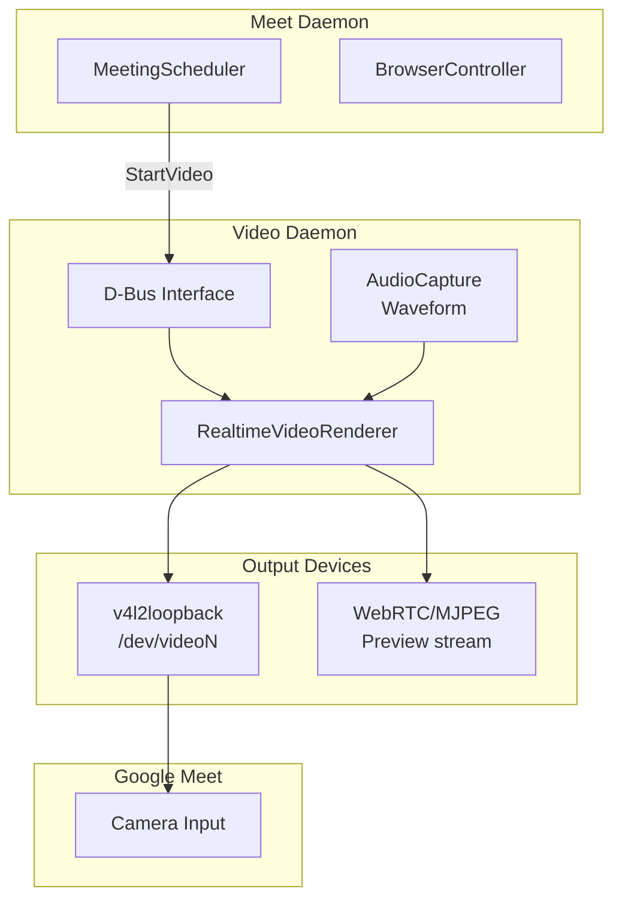
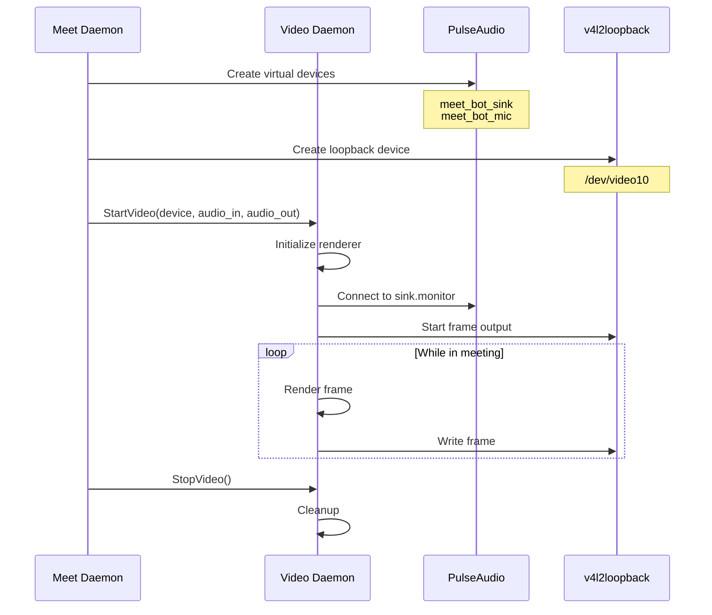
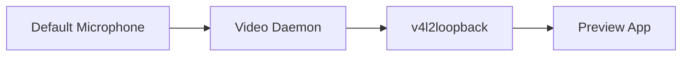
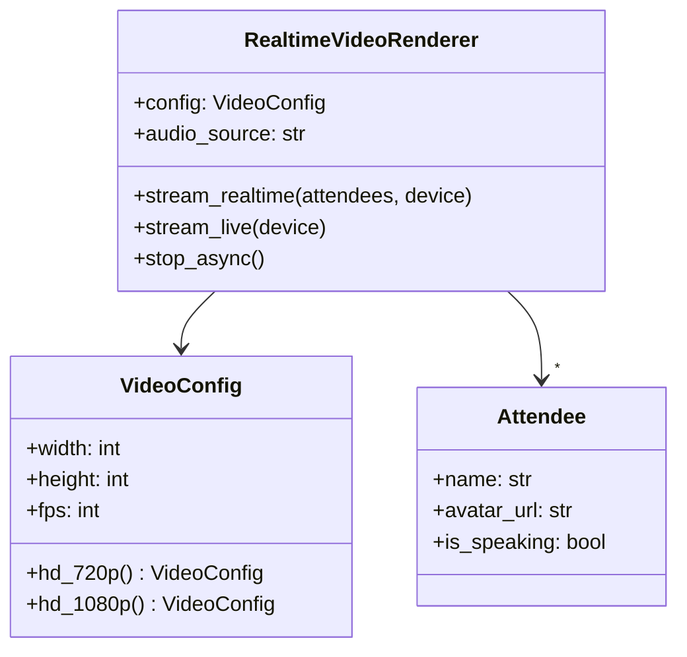
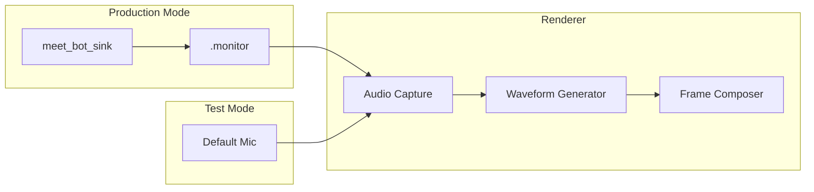
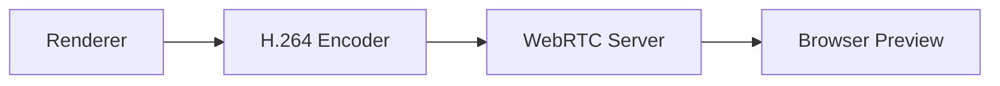
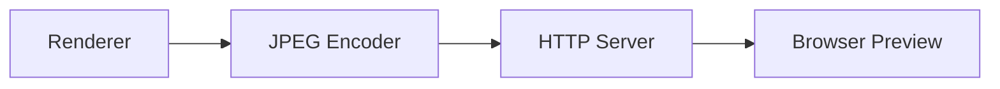
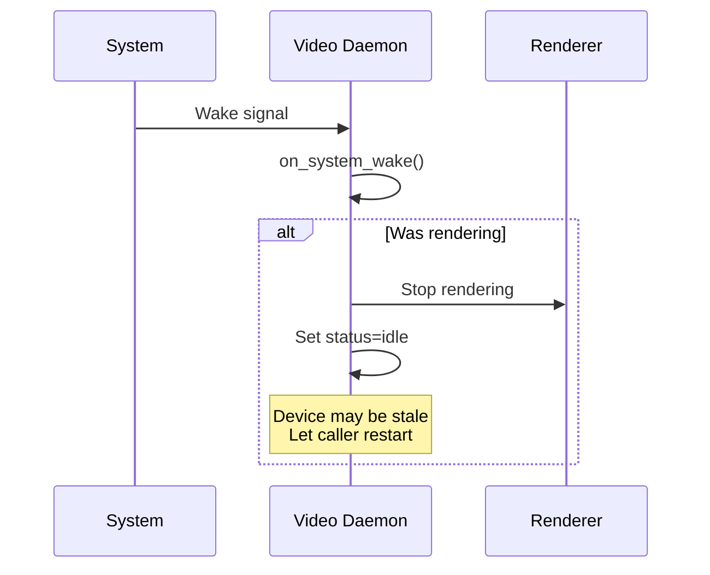

# Video Daemon

> Virtual camera rendering for Google Meet

## Overview

The Video Daemon (`scripts/video_daemon.py`) is a standalone service that renders AI-generated video overlays to a v4l2loopback virtual camera device. It is controlled by the Meet Daemon during meetings.

## Architecture



## Features

| Feature | Description |
|---------|-------------|
| Virtual camera | v4l2loopback device output |
| Audio waveform | Real-time visualization |
| Attendee display | Show meeting participants |
| Horizontal flip | Google Meet mirror compensation |
| WebRTC streaming | Preview stream output |
| MJPEG streaming | Low-latency preview |

## D-Bus Interface

**Service**: `com.aiworkflow.BotVideo`

### Methods

| Method | Parameters | Returns | Description |
|--------|------------|---------|-------------|
| `GetStatus` | - | JSON | Get daemon status |
| `StartVideo` | device, audio_in, audio_out, w, h, flip | JSON | Start rendering |
| `StopVideo` | - | JSON | Stop rendering |
| `UpdateAttendees` | attendees_json | JSON | Update participant list |
| `SetFlip` | flip | JSON | Toggle horizontal flip |
| `GetRenderStats` | - | JSON | Get rendering statistics |
| `StartStreaming` | device?, mode, port | JSON | Start WebRTC/MJPEG stream |
| `StopStreaming` | - | JSON | Stop streaming |

### Signals

| Signal | Parameters | Description |
|--------|------------|-------------|
| `RenderingStarted` | device | Started rendering |
| `RenderingStopped` | - | Stopped rendering |
| `StreamingStarted` | mode:port | Preview stream started |
| `StreamingStopped` | - | Preview stream stopped |
| `Error` | message | Error occurred |

### Properties

| Property | Type | Description |
|----------|------|-------------|
| `Status` | string | "idle", "rendering", "error" |
| `CurrentDevice` | string | Active v4l2 device path |
| `AudioInput` | string | PulseAudio source for waveform |
| `AudioOutput` | string | PulseAudio source for TTS |
| `Flip` | bool | Horizontal flip enabled |
| `FrameRate` | float | Current FPS |
| `StreamingMode` | string | "webrtc", "mjpeg", null |

## Operation Modes

### Production Mode

In production, the Meet Daemon orchestrates the Video Daemon:



### Test Mode

For development without the Meet Daemon:

```bash
# Create device and use default microphone
python scripts/video_daemon.py --test --create-device --flip
```



## Video Rendering

### Renderer Components



### Frame Layout

```
+----------------------------------------------------------+
|  AI Research Assistant                                    |
+----------------------------------------------------------+
|                                                           |
|  +---------------+  +---------------+  +---------------+  |
|  |   Attendee 1  |  |   Attendee 2  |  |   Attendee 3  |  |
|  |    Avatar     |  |    Avatar     |  |    Avatar     |  |
|  +---------------+  +---------------+  +---------------+  |
|                                                           |
|  +-----------------------------------------------------+  |
|  |                 Audio Waveform                      |  |
|  +-----------------------------------------------------+  |
|                                                           |
+----------------------------------------------------------+
```

## Audio Routing

### Waveform Visualization

The daemon captures audio for real-time waveform display:



### Audio Sources

| Mode | Audio Input | Audio Output |
|------|-------------|--------------|
| Production | `meet_bot_sink.monitor` | `meet_bot_mic` |
| Test | Default microphone | Default speakers |

## v4l2loopback Setup

### Automatic Device Creation

With `--create-device`:

```python
def setup_v4l2_device(width: int, height: int) -> str:
    # Load v4l2loopback module
    subprocess.run([
        "sudo", "modprobe", "v4l2loopback",
        "devices=1",
        "exclusive_caps=1",
        f"video_nr={video_nr}",
        "card_label=AI_Camera"
    ])
    return f"/dev/video{video_nr}"
```

### Manual Setup

```bash
# Load module
sudo modprobe v4l2loopback devices=1 exclusive_caps=1 video_nr=10 card_label=AI_Camera

# Check device
v4l2-ctl --list-devices
```

## Streaming Preview

### WebRTC Mode



### MJPEG Mode



### Starting Streaming

```bash
# WebRTC on port 8765
busctl --user call com.aiworkflow.BotVideo \
    /com/aiworkflow/BotVideo \
    com.aiworkflow.BotVideo \
    StartStreaming "ssi" "/dev/video10" "webrtc" 8765

# MJPEG on port 8080
busctl --user call com.aiworkflow.BotVideo \
    /com/aiworkflow/BotVideo \
    com.aiworkflow.BotVideo \
    StartStreaming "ssi" "" "mjpeg" 8080
```

## Usage

### Starting the Daemon

```bash
# Production mode (wait for Meet Daemon)
python scripts/video_daemon.py

# Test mode with all options
python scripts/video_daemon.py --test --create-device --flip --verbose
```

### Systemd Service

```bash
# Start service
systemctl --user start bot-video

# View logs
journalctl --user -u bot-video -f

# Check status
systemctl --user status bot-video
```

### D-Bus Control

```bash
# Check status
python scripts/video_daemon.py --status

# Start video manually
python scripts/video_daemon.py --start-video /dev/video10 --audio-input default --flip

# Stop video
python scripts/video_daemon.py --stop-video
```

## Sleep/Wake Handling



## Configuration

### Command Line Options

| Option | Description |
|--------|-------------|
| `--status` | Check daemon status |
| `--stop` | Stop running daemon |
| `--verbose` | Verbose output |
| `--no-dbus` | Disable D-Bus |
| `--create-device` | Create v4l2loopback device |
| `--test` | Test mode (use default audio) |
| `--flip` | Enable horizontal flip |
| `--start-video DEVICE` | Start rendering |
| `--stop-video` | Stop rendering |
| `--audio-input SOURCE` | PulseAudio source |
| `--audio-output SOURCE` | PulseAudio output |

### Video Resolutions

| Preset | Width | Height |
|--------|-------|--------|
| 720p | 1280 | 720 |
| 1080p | 1920 | 1080 |

## See Also

- [Daemons Overview](./README.md) - All background services
- [Meet Daemon](./meet.md) - Meeting orchestration
- [Daemon Architecture](../architecture/daemons.md) - Technical details
