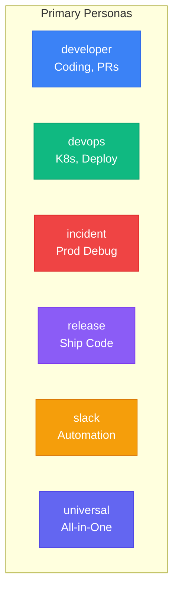
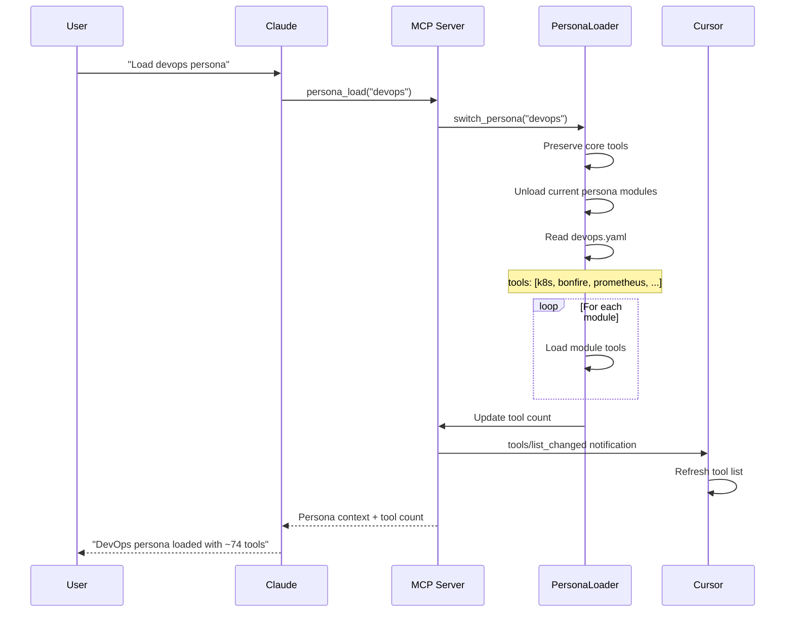
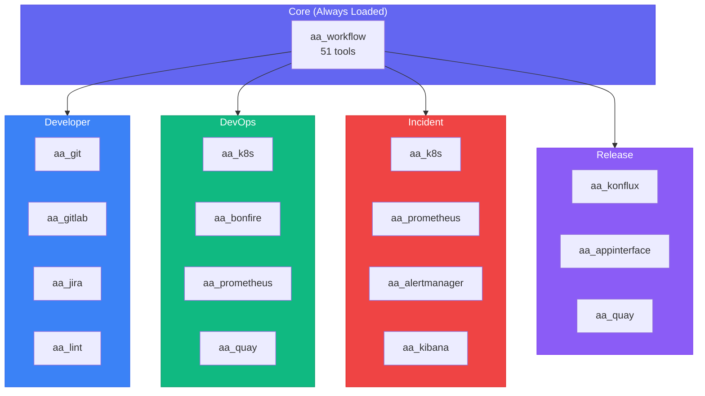
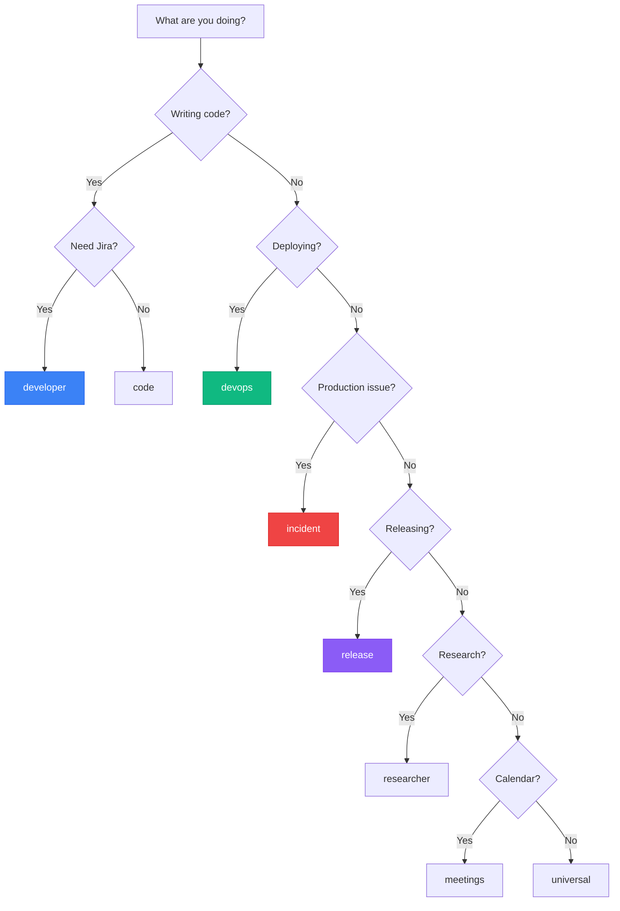

# Personas Reference

> **Terminology Note:** In this project, "agents" refers to **tool configuration profiles** (personas) that determine which MCP tools are available to Claude. This is NOT a multi-agent AI system - there is always a single Claude instance. The term "agent" is used because you "load an agent" to adopt a specialized role with focused tools.

Personas are **specialized tool configurations** with curated tool sets. Switch personas to get different capabilities.

## Quick Statistics

| Metric | Count |
|--------|-------|
| **Total Personas** | 15 |
| **Primary Personas** | 6 |
| **Specialized Personas** | 9 |

## All Personas

| Persona | Modules | Description |
|---------|---------|-------------|
| [developer](./developer.md) | 13 | Coding, PRs, and code review |
| [devops](./devops.md) | 13 | Infrastructure, monitoring, and ephemeral deployments |
| [incident](./incident.md) | 13 | Production incident response and recovery |
| [release](./release.md) | 11 | Release management and deployments |
| [slack](./slack.md) | 16 | Slack daemon automation |
| [universal](./universal.md) | 13 | Combined developer and devops capabilities |
| [core](./core.md) | 13 | Shared tools for all agents |
| [admin](./admin.md) | 13 | Administrative tasks - expenses, calendar, team |
| [code](./code.md) | 9 | Pure coding - git, linting, search |
| [meetings](./meetings.md) | 8 | Calendar, scheduling, meeting management |
| [observability](./observability.md) | 6 | Monitoring, metrics, logs |
| [performance](./performance.md) | 11 | PSE competency tracking, quarterly reviews |
| [project](./project.md) | 8 | Project context, knowledge management |
| [researcher](./researcher.md) | 10 | Information gathering, research, planning |
| [workspace](./workspace.md) | 9 | Multi-project workspace and session management |

## Persona Categories

### Primary Personas (6)

The main personas for daily work:



| Persona | Use When | Key Modules |
|---------|----------|-------------|
| **developer** | Writing code, reviewing PRs | git, gitlab, jira, lint |
| **devops** | Deploying, managing infra | k8s, bonfire, prometheus, quay |
| **incident** | Production issues | prometheus, alertmanager, kibana, k8s |
| **release** | Shipping to prod | konflux, appinterface, quay |
| **slack** | Slack bot daemon | slack, jira, gitlab |
| **universal** | General work | All primary tools combined |

### Specialized Personas (9)

Focused personas for specific tasks:

| Persona | Use When | Key Modules |
|---------|----------|-------------|
| **admin** | Expenses, calendar, team | concur, google_calendar, slack |
| **code** | Pure coding, no Jira | git, lint, code_search |
| **core** | Base for other personas | workflow, git, jira |
| **meetings** | Scheduling meetings | google_calendar, meet_bot |
| **observability** | Metrics and logs only | prometheus, kibana |
| **performance** | Quarterly reviews | performance, jira |
| **project** | Project knowledge | knowledge, project, code_search |
| **researcher** | Research and planning | code_search, knowledge, ollama |
| **workspace** | Session management | workflow, project |

## How Persona Loading Works



## Switching Personas

You can switch personas at any time:

```
You: Load the developer agent
Claude: Developer persona loaded (~78 tools)

You: Actually I need to deploy, load devops
Claude: DevOps persona loaded (~74 tools)
        [Tools automatically switch!]
```

### Via Tool

```python
persona_load("devops")
persona_load("incident")
persona_load("developer")
```

### Via Command

```
/load-developer
/load-devops
/load-incident
/load-release
```

## Core Tools (Always Available)

These tools are available regardless of which persona is loaded:

| Tool | Purpose |
|------|---------|
| `persona_load` | Switch to a different persona |
| `persona_list` | List available personas |
| `session_start` | Initialize session with context |
| `session_info` | Get current session info |
| `debug_tool` | Self-healing tool debugger |
| `skill_run` | Execute a skill |
| `skill_list` | List available skills |
| `vpn_connect` | Connect to VPN |
| `kube_login` | Refresh k8s credentials |
| `memory_read` | Read from memory |
| `memory_write` | Write to memory |

## Persona Tool Composition



## Tool Limit

Each persona is designed to stay under Cursor's **128 tool limit**. Tool counts are managed by:

1. **Basic/Extra Split**: Only basic tools loaded by default
2. **Module Selection**: Each persona loads only relevant modules
3. **`tool_exec()`**: Access extra tools on-demand

## Persona Configuration

Personas are defined in YAML files in the `personas/` directory:

```yaml
name: developer
description: Coding, PRs, and code review

# Tool modules to load (basic by default)
tools:
  - workflow        # 51 tools - Core system
  - git             # 31 tools - Repository operations
  - gitlab          # 32 tools - MRs, pipelines
  - jira            # 28 tools - Issue tracking
  - lint            # 7 tools  - Code quality

# Skills available to this persona
skills:
  - coffee
  - start_work
  - create_mr
  - review_pr
  - mark_mr_ready
  - close_issue
  # ...

# Focus areas for context
focus:
  - Code development
  - Pull request workflow
  - Code review
  - Jira issue tracking
```

## Persona File Structure

```
personas/
├── admin.yaml          # Administrative tasks
├── code.yaml           # Pure coding
├── core.yaml           # Shared base tools
├── developer.yaml      # Primary: coding, PRs
├── devops.yaml         # Primary: infrastructure
├── incident.yaml       # Primary: production debugging
├── meetings.yaml       # Calendar and scheduling
├── observability.yaml  # Monitoring and metrics
├── performance.yaml    # Quarterly reviews
├── project.yaml        # Project knowledge
├── release.yaml        # Primary: shipping code
├── researcher.yaml     # Research and planning
├── slack.yaml          # Primary: Slack automation
├── universal.yaml      # Primary: all-in-one
└── workspace.yaml      # Session management
```

## Persona Selection Guide



## See Also

- [Tool Modules](../tool-modules/README.md) - Available tool modules
- [Skills](../skills/README.md) - Available workflows
- [Architecture](../architecture/README.md) - System design
- [MCP Implementation](../architecture/mcp-implementation.md) - Server details
