# 🎭 Personas Reference

> **Terminology Note:** In this project, "agents" refers to **tool configuration profiles** (personas) that determine which MCP tools are available to Claude. This is NOT a multi-agent AI system - there is always a single Claude instance. The term "agent" is used because you "load an agent" to adopt a specialized role with focused tools.

Personas are **specialized tool configurations** with curated tool sets. Switch personas to get different capabilities.

## Quick Reference

| Persona | Command | Tools | Focus |
|---------|---------|-------|-------|
| [👨‍💻 developer](./developer.md) | `Load developer agent` | ~102 | Daily coding, PRs |
| [🔧 devops](./devops.md) | `Load devops agent` | ~118 | Deployments, K8s |
| [🚨 incident](./incident.md) | `Load incident agent` | ~106 | Production debugging |
| [📦 release](./release.md) | `Load release agent` | ~98 | Shipping releases |
| [💬 slack](./slack.md) | `Load slack agent` | ~103 | Slack automation |
| [🌐 universal](./universal.md) | `Load universal agent` | ~123 | All-in-one |

## How Persona Loading Works

```mermaid
sequenceDiagram
    participant User
    participant Claude
    participant MCP as MCP Server
    participant Cursor

    User->>Claude: "Load devops agent"
    Claude->>MCP: persona_load("devops")
    MCP->>MCP: Unload current tools
    MCP->>MCP: Load k8s, bonfire, quay, gitlab
    MCP->>Cursor: tools/list_changed notification
    Cursor->>Cursor: Refresh tool list
    MCP-->>Claude: Persona + tool count
    Claude-->>User: "🔧 DevOps persona loaded with 90 tools"
```



## Switching Personas

You can switch personas at any time:

```
You: Load the developer agent
Claude: 👨‍💻 Developer persona loaded (~80 tools)

You: Actually I need to deploy, load devops
Claude: 🔧 DevOps persona loaded (~90 tools)
        [Tools automatically switch!]
```

## Tool Limit

Each persona is designed to stay under Cursor's 128 tool limit:

| Persona | Tool Count | Headroom |
|---------|------------|----------|
| developer | ~102 | 26 |
| devops | ~118 | 10 |
| incident | ~106 | 22 |
| release | ~98 | 30 |
| slack | ~103 | 25 |
| universal | ~123 | 5 |

## Persona Tool Modules

All personas include `workflow` module (required for skills/memory).

```mermaid
graph TD
    subgraph Developer["👨‍💻 Developer"]
        D_WF[workflow]
        D_GIT[git]
        D_GITLAB[gitlab]
        D_JIRA[jira]
    end

    subgraph DevOps["🔧 DevOps"]
        O_WF[workflow]
        O_K8S[k8s]
        O_BON[bonfire]
        O_QUAY[quay]
        O_GITLAB[gitlab]
    end

    subgraph Incident["🚨 Incident"]
        I_WF[workflow]
        I_K8S[k8s]
        I_PROM[prometheus]
        I_ALERT[alertmanager]
        I_KIB[kibana]
        I_JIRA[jira]
    end

    subgraph Release["📦 Release"]
        R_WF[workflow]
        R_KON[konflux]
        R_QUAY[quay]
        R_APP[appinterface]
        R_GIT[git]
    end

    style Developer fill:#3b82f6,stroke:#2563eb,color:#fff
    style DevOps fill:#10b981,stroke:#059669,color:#fff
    style Incident fill:#ef4444,stroke:#dc2626,color:#fff
    style Release fill:#8b5cf6,stroke:#7c3aed,color:#fff
```



## Core Tools (Always Available)

These tools are available regardless of which persona is loaded:

| Tool | Purpose |
|------|---------|
| `persona_load` | Switch to a different persona |
| `persona_list` | List available personas |
| `session_start` | Initialize session with context |
| `debug_tool` | Self-healing tool debugger |
| `skill_run` | Execute a skill |
| `skill_list` | List available skills |
| `vpn_connect` | Connect to VPN (fixes network errors) |
| `kube_login` | Refresh k8s credentials |

## Persona Variants

Several personas have "slim" variants with fewer tools for combining:

| Variant | Base Persona | Description |
|---------|--------------|-------------|
| `developer-slim` | developer | Core dev tools only (~39 tools) |
| `devops-slim` | devops | Essential k8s/deploy (~39 tools) |
| `incident-slim` | incident | Fast incident response (~15 tools) |
| `release-slim` | release | Streamlined release (~48 tools) |

**Special Personas:**

| Persona | Description |
|---------|-------------|
| `core` | Essential shared tools (~106 tools) |
| `universal` | Developer + DevOps combined (~123 tools) |

> All personas now include `workflow` module for skills, memory, and infrastructure tools

## Persona Configuration

Personas are defined in YAML files in the `personas/` directory:

```yaml
name: developer
description: Coding, PRs, and code review
persona: personas/developer.md

tools:
  - workflow        # 30 tools - REQUIRED for skills/memory
  - git             # 15 tools
  - gitlab          # 35 tools
  - jira            # 24 tools

skills:
  - coffee
  - start_work
  - create_mr
  - mark_mr_ready
  # ...
```

## See Also

- [MCP Servers](../tool-modules/README.md) - Tool modules
- [Skills](../skills/README.md) - Available workflows
