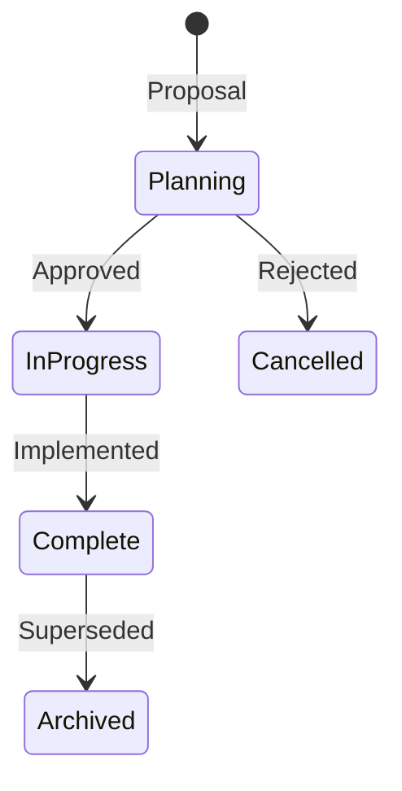

# Plans & Architecture Proposals

This directory contains design documents and implementation plans for features.

## Plan Index

| Plan | Status | Description |
|------|--------|-------------|
| [IDE Integrations](./ide-integrations.md) | Complete | VSCode/Cursor extension |
| [Skill Auto-Heal](./skill-auto-heal.md) | Complete | Automatic error recovery |
| [Per-Workspace Context](./per-workspace-context.md) | Complete | Multi-project sessions |
| [Per-Chat Session Investigation](./per-chat-session-investigation.md) | Complete | Cursor chat tracking |
| [Skill Confirmation System](./skill-confirmation-system.md) | In Progress | User confirmation for skills |
| [VSCode Extension Chats Tab](./vscode-extension-chats-tab.md) | In Progress | Chat management UI |
| [VSCode Extension Upgrades](./vscode-extension-upgrades.md) | In Progress | Extension improvements |
| [Skill Execution History](./skill-execution-history.md) | Planning | SQLite-based skill history |
| [Local Inference](./local-inference-implementation-plan.md) | Planning | Ollama/local models |
| [Custom Electron IDE](./custom-electron-ide.md) | Planning | Standalone IDE concept |
| [Cleanup](./cleanup.md) | Ongoing | Technical debt tracking |
| [Skill Error Handling Audit](./skill-error-handling-audit.md) | Complete | Error handling review |
| [Skill Improvements Audit](./skill-improvements-audit.md) | Complete | Skill quality review |
| [Magic](./magic.md) | Research | Experimental features |

## Plan Lifecycle



## Completed Plans

### IDE Integrations

**Goal:** Enhance developer experience with IDE integration.

**Completed Features:**
- Status bar with Slack, Issue, Environment, MR indicators
- Tree view sidebar with active work, namespaces, alerts
- Command palette integration (11 commands)
- Toast notifications for alerts, pipelines, MR updates
- Dashboard webview with current work overview
- Skill execution visualizer (GitHub Actions style)

**Location:** `extensions/aa_workflow-vscode/`

### Skill Auto-Heal

**Goal:** Automatic recovery from common tool failures.

**Completed Features:**
- VPN disconnect detection and auto-reconnect
- Kubernetes auth token refresh
- Pattern-based error recognition
- Memory-backed fix learning

**Location:** `server/auto_heal_decorator.py`, `memory/learned/`

### Per-Workspace Context

**Goal:** Support multiple projects with independent state.

**Completed Features:**
- Workspace-specific state files
- Project detection from directory
- Session isolation per workspace
- Config-based project registry

## In Progress Plans

### Skill Confirmation System

**Goal:** User confirmation before destructive skill actions.

**Current State:**
- Prototype confirmation dialogs
- Risk level classification
- Dry-run mode

### VSCode Extension Upgrades

**Goal:** Enhance extension capabilities.

**Planned Features:**
- Sprint tab with issue management
- Performance tab with metrics
- Enhanced notifications
- Refresh coordination

## Creating New Plans

When proposing a new feature or architecture change:

1. Create a new `.md` file in this directory
2. Use the following template:

```markdown
# [Feature Name] Plan

## Overview
Brief description of what this plan proposes.

## Current State
What exists today.

## Target State
What we want to achieve.

## Implementation Phases
Detailed breakdown of work.

## Timeline
Estimated effort per phase.

## Risks & Mitigations
Potential issues and how to address them.

## See Also
Related documentation.
```

3. Update this README to add your plan to the Active Plans table
4. Discuss with the team before implementation

## See Also

- [Architecture Overview](../architecture/README.md)
- [Learning Loop](../learning-loop.md)
- [Development Guide](../DEVELOPMENT.md)
