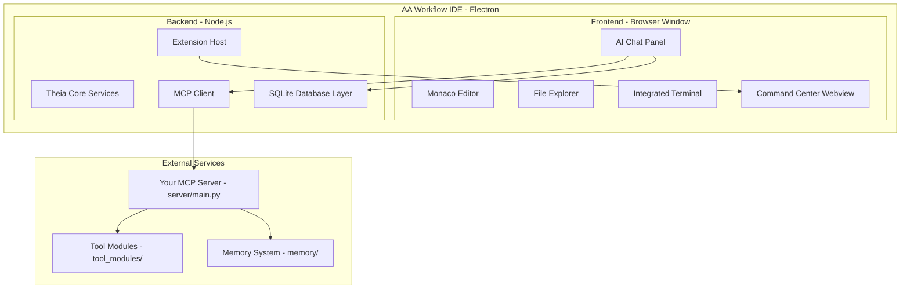
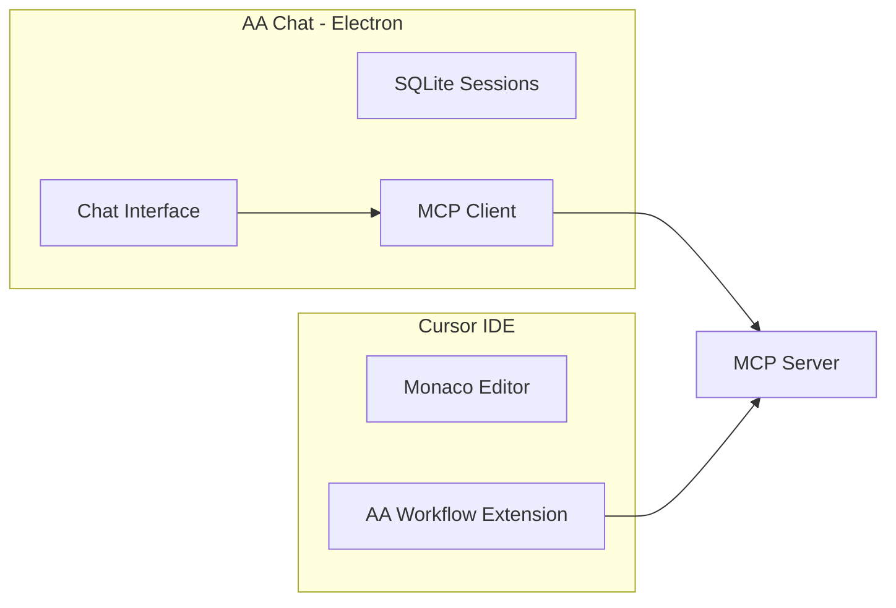

# Custom Electron IDE for AI Workflow

## Overview

Build a custom Electron-based IDE that supports your VS Code extension and provides a chat interface with backend database, reducing dependency on Cursor while leveraging your existing MCP server infrastructure.

## Status

- **Status:** Planning
- **Created:** 2026-01-22

## Todos

- [ ] Clone and explore Theia IDE Blueprint structure
- [ ] Build minimal chat panel prototype with MCP client
- [ ] Design SQLite schema for sessions and messages
- [ ] Extract Command Center webview into standalone component
- [ ] Configure electron-builder for Linux/Mac distribution

---

## The Strategic Decision

You have three main paths to reduce Cursor dependency:

### Option A: Fork/Extend Theia IDE (Recommended)

**Why Theia:**
- VS Code extension compatible (3000+ extensions at open-vsx.org)
- Not a VS Code fork - independent architecture with 1000+ extra extension points
- Already AI-native (competing with Cursor/Copilot)
- Uses Monaco editor (same as VS Code)
- Electron-based with electron-builder for packaging
- Apache 2.0 licensed - fully open source

**What you'd build:**
- Custom Theia product with your branding
- Integrate your existing `aa_workflow_vscode` extension directly
- Add a custom AI chat panel using Theia's extension system
- Connect to your existing MCP server (`server/main.py`)

### Option B: OpenSumi Framework

**Pros:**
- Chinese Alibaba-backed, very active development
- VS Code extension API 1.68.0 compatible
- React-based UI customization
- Electron Webview management built-in

**Cons:**
- Documentation primarily in Chinese
- Smaller Western community
- API compatibility lags VS Code by ~1 year

### Option C: Build from Scratch with Monaco + Electron

**Pros:**
- Maximum control
- No upstream dependencies

**Cons:**
- Massive undertaking (VS Code is millions of lines)
- Would need to implement extension host yourself
- Not recommended unless you have a large team

---

## Recommended Architecture (Theia-based)



---

## Implementation Approach

### Phase 1: Theia Product Setup

1. **Clone Theia IDE Blueprint**
   ```bash
   git clone https://github.com/eclipse-theia/theia-ide.git aa-workflow-ide
   cd aa-workflow-ide
   yarn
   ```

2. **Customize branding** in `applications/electron/package.json`:
   - App name: "AA Workflow IDE"
   - Icons, splash screen
   - Remove unwanted default extensions

3. **Add your VS Code extension** to `applications/electron/package.json`:
   ```json
   "theiaPlugins": {
     "aa-workflow": "local:../../../extensions/aa_workflow_vscode"
   }
   ```

### Phase 2: Custom Chat Panel (Theia Extension)

Create a new Theia extension at `packages/aa-chat/`:

**Key files:**
- `src/browser/aa-chat-widget.tsx` - React-based chat UI
- `src/browser/aa-chat-contribution.ts` - Register panel in sidebar
- `src/browser/mcp-client.ts` - MCP protocol client (stdio or HTTP)

**Chat widget features:**
- Message history with SQLite persistence
- Tool call visualization (reuse your flowchart code)
- Session management (port from `workspace_state.py` concepts)
- Real-time streaming responses

### Phase 3: Database Layer

**SQLite schema** (similar to Cursor's approach):

```sql
-- Chat sessions
CREATE TABLE sessions (
    id TEXT PRIMARY KEY,
    workspace_uri TEXT,
    persona TEXT,
    project TEXT,
    issue_key TEXT,
    branch TEXT,
    created_at TIMESTAMP,
    last_activity TIMESTAMP,
    name TEXT
);

-- Messages
CREATE TABLE messages (
    id TEXT PRIMARY KEY,
    session_id TEXT REFERENCES sessions(id),
    role TEXT, -- 'user', 'assistant', 'tool'
    content TEXT,
    tool_calls JSON,
    created_at TIMESTAMP
);

-- Tool executions (for flowchart)
CREATE TABLE tool_executions (
    id TEXT PRIMARY KEY,
    session_id TEXT,
    tool_name TEXT,
    args JSON,
    result JSON,
    status TEXT,
    started_at TIMESTAMP,
    completed_at TIMESTAMP
);
```

**Implementation:** Use `better-sqlite3` for synchronous operations or `sql.js` for browser compatibility.

### Phase 4: MCP Integration

Your existing MCP server (`server/main.py`) works over stdio. Options:

1. **Stdio transport** (simplest): Spawn MCP server as child process
   ```typescript
   const mcpProcess = spawn('python', ['-m', 'server', '--agent', 'developer']);
   // Communicate via stdin/stdout with JSON-RPC
   ```

2. **HTTP transport** (for remote): Your server already has `--web` flag
   ```typescript
   // Connect to http://localhost:8765
   ```

### Phase 5: Port Command Center

Your `commandCenter.ts` is already a webview - it can run almost unchanged:

1. Extract the HTML/CSS/JS generation into standalone files
2. Load in Theia's webview widget
3. Connect to MCP server via the same message passing

---

## Key Files to Leverage

| Current File | Purpose | Reuse Strategy |
|--------------|---------|----------------|
| `extensions/aa_workflow_vscode/` | VS Code extension | Load directly in Theia |
| `server/main.py` | MCP server | Spawn as child process |
| `server/workspace_state.py` | Session management | Port to TypeScript/SQLite |
| `commandCenter.ts` | Dashboard UI | Extract webview HTML |
| `tool_modules/` | All your tools | No changes needed |
| `memory/` | Persistent state | No changes needed |

---

## What You Gain

1. **Full control** over the IDE experience
2. **No Cursor dependency** for chat/AI features
3. **Your own database** for chat history, sessions, analytics
4. **Customizable UI** - remove VS Code features you don't need
5. **Offline capable** - no cloud dependency
6. **Distributable** - package as .deb, .rpm, .AppImage, .dmg

## What You Keep

1. **VS Code extension compatibility** - your extension works unchanged
2. **MCP server** - all your tools, skills, memory work unchanged
3. **Monaco editor** - same editing experience as VS Code/Cursor

---

## Effort Estimate

| Phase | Complexity | Notes |
|-------|------------|-------|
| Phase 1: Theia setup | Low | Mostly configuration |
| Phase 2: Chat panel | Medium | Core new development |
| Phase 3: Database | Low | Standard SQLite patterns |
| Phase 4: MCP integration | Low | Your server already works |
| Phase 5: Command Center port | Medium | Mostly extraction/adaptation |

---

## Alternative: Minimal Chat-Only App

If you want to keep using Cursor for editing but have your own chat interface:



This would be a separate Electron app just for chat, while continuing to use Cursor for editing. Simpler but less integrated.

---

## Questions to Clarify

1. Do you want a full IDE replacement (Theia-based) or just a standalone chat app?
2. Should the chat support multiple concurrent sessions (like your current Command Center shows)?
3. Do you need the app to work offline, or is MCP server always local?
4. Any specific VS Code features you'd want to remove/simplify?

---

## References

- [Theia IDE](https://theia-ide.org/) - AI-native open-source cloud and desktop IDE
- [Theia IDE Blueprint](https://github.com/eclipse-theia/theia-ide) - Template for custom products
- [OpenSumi](https://opensumi.com/) - Alternative framework with VS Code extension support
- [Monaco Editor](https://microsoft.github.io/monaco-editor/) - The editor powering VS Code
- [MCP Documentation](https://claudemcp.com/docs) - Model Context Protocol specs
