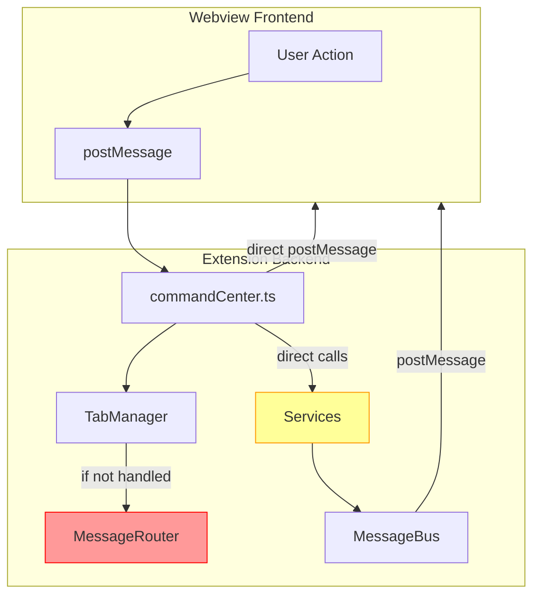

# VSCode Extension UI Architecture Cleanup

## Overview

This document tracks the cleanup of UI anti-patterns and architectural inconsistencies in the VSCode extension.

**Deep scan date:** 2026-02-04

---

## CRITICAL: Five Overlapping Message/Update Systems

The codebase has **FIVE different systems** for handling messages and updates:

### System 1: TabManager + Tab Classes (TARGET)

```
webview message -> TabManager.handleMessage() -> Tab.handleMessage() -> return true/false
```

- **Location**: `panels/TabManager.ts`, `tabs/*.ts`
- **Priority**: Checked FIRST in message handler
- **Pattern**: Each Tab has `handleMessage()` that returns `true` if handled

### System 2: MessageRouter + MessageHandlers (REDUNDANT)

```
webview message -> MessageRouter.route() -> *MessageHandler.handle()
```

- **Location**: `panels/messageRouter.ts`
- **Priority**: Checked SECOND (only if TabManager returns false)
- **Problem**: Many handlers duplicate Tab handlers - NEVER EXECUTED

### System 3: MessageBus (Singleton)

```
Service.method() -> MessageBus.publish() -> webview.postMessage()
```

- **Location**: `services/MessageBus.ts`
- **Purpose**: Decoupled UI communication from services
- **Used by**: SprintService, SlackService, CronService, etc.

### System 4: Service Classes (DUPLICATES TAB LOGIC)

```
commandCenter -> Service.handleAction() -> D-Bus call -> MessageBus.publish()
```

- **Location**: `services/*.ts` (SprintService, SlackService, etc.)
- **Problem**: Duplicates logic in Tab classes

### System 5: Direct postMessage from commandCenter (LEGACY)

```
commandCenter._loadSprintFromFile() -> webview.postMessage({ type: "sprintTabUpdate" })
```

- **Location**: Throughout `commandCenter.ts`
- **Problem**: Bypasses all other systems, some messages never handled

---

## Duplicate Handler Analysis

### Messages Handled in BOTH TabManager AND MessageRouter

Since TabManager is checked first and returns `true`, MessageRouter handlers are **DEAD CODE**:

| Message | TabManager Handler | MessageRouter Handler (DEAD) |
|---------|-------------------|------------------------------|
| `refreshServices` | ServicesTab.ts | ServiceMessageHandler |
| `refreshCron` | CronTab.ts | CronMessageHandler |
| `sprintAction` | SprintTab.ts | SprintMessageHandler |
| `approveSlackMessage` | SlackTab.ts | SlackMessageHandler |
| `rejectSlackMessage` | SlackTab.ts | SlackMessageHandler |
| `refreshCalendar` | MeetingsTab.ts | MeetingMessageHandler |

**Total: 70+ duplicate handlers identified**

### Triple Handling Example: Sprint Actions

1. **SprintTab.handleSprintAction()** - calls D-Bus directly
2. **SprintService.handleAction()** - also calls D-Bus  
3. **SprintMessageHandler** - calls SprintService (never reached)

---

## Dead Message Types

Messages sent but **never handled** in webview:

| Message Type | Sent From | Handler |
|--------------|-----------|---------|
| `sprintTabUpdate` | commandCenter.ts:1912 | NONE |
| `sprintIssuesUpdate` | commandCenter.ts:1895 | NONE |
| `performanceTabBadgeUpdate` | commandCenter.ts:3199 | NONE |

---

## RefreshCoordinator Analysis

`refreshCoordinator.ts` adds ANOTHER layer:

- Manages UIState cache
- Has its own message types (`sprintTabUpdate`, etc.)
- May be redundant with Tab.loadData() + notifyNeedsRender()

---

## Recommended Actions

### Phase 1: Remove Dead Code (LOW RISK)

1. **Remove dead MessageRouter handlers** - they're never executed
2. **Remove unused message sends** (`sprintTabUpdate`, `sprintIssuesUpdate`, `performanceTabBadgeUpdate`)
3. **Remove `getPerformanceTabContent()`** from performanceRenderer.ts

### Phase 2: Consolidate Message Handling (MEDIUM RISK)

1. **Keep TabManager as single entry point** - it works correctly
2. **Remove MessageRouter entirely** - all its handlers are dead or duplicated
3. **Services should only handle business logic** - not message routing

### Phase 3: Consolidate Refresh System (MEDIUM RISK)

1. **Audit RefreshCoordinator** - determine if redundant with Tab system
2. **Standardize on Tab.loadData() + notifyNeedsRender()** pattern
3. **Remove direct postMessage calls** from commandCenter.ts

### Phase 4: Minor Cleanup (LOW RISK)

1. Refactor reconnect banner inline onclick
2. Decide on debug click listener in base.js

---

## Event Delegation Pattern

### Target Pattern

Each tab's `getScript()` method should:
1. Use an IIFE to scope variables
2. Get the tab's root container (`#tabId`)
3. Check `dataset.tabDelegationInit` flag to prevent re-initialization
4. Attach a single `click` listener (and `keypress` if needed) to the container
5. Handle all actions via event delegation using `target.closest()` or `target.id`

```javascript
// Standard pattern
(function() {
  const container = document.getElementById('tabId');
  if (!container || container.dataset.tabDelegationInit) return;
  container.dataset.tabDelegationInit = 'true';
  
  container.addEventListener('click', function(e) {
    const target = e.target;
    // Handle actions via delegation
  });
})();
```

### Status: All Tabs Refactored

| File | Container | Status |
|------|-----------|--------|
| `SlackTab.ts` | `#slack` | Done |
| `SlopTab.ts` | `#slop` | Done |
| `ServicesTab.ts` | `#services` | Done |
| `CronTab.ts` | `#cron` | Done |
| `ToolsTab.ts` | `#tools` | Done |
| `SkillsTab.ts` | `#skills` | Done |
| `PerformanceTab.ts` | `#performance` | Done |
| `CreateTab.ts` | `#create` | Done |
| `InferenceTab.ts` | `#inference` | Done |
| `MemoryTab.ts` | `#memory` | Done |
| `SessionsTab.ts` | `#sessions` | Done |
| `PersonasTab.ts` | `#personas` | Done |
| `sprintRenderer.ts` | `#sprint` | Done |
| `meetingsRenderer.ts` | `#meetings` | Done |

### No Changes Needed

| File | Reason |
|------|--------|
| `OverviewTab.ts` | No interactive elements |
| `tabs.js` | Static navigation tabs |
| `skillToast.ts` | Separate webview |

---

## Dead Code to Remove

### 1. `performanceRenderer.ts` - getPerformanceTabContent()

Lines 390-516: Exported but never imported. Contains legacy anti-pattern.
`PerformanceTab.ts` has correct implementation.

### 2. Unused message sends in `commandCenter.ts`

- `sprintTabUpdate` (line 1912)
- `sprintIssuesUpdate` (line 1895)  
- `performanceTabBadgeUpdate` (line 3199)

### 3. Dead MessageRouter Handlers

All handlers in `messageRouter.ts` for messages already handled by TabManager:
- ServiceMessageHandler
- CronMessageHandler  
- SprintMessageHandler
- SlackMessageHandler
- MeetingMessageHandler

### 4. Duplicate Service Methods

Methods in Service classes that duplicate Tab logic:
- `SprintService.handleAction()` duplicates `SprintTab.handleSprintAction()`
- `SlackService.handleApprove/Reject()` duplicates `SlackTab` handlers

---

## Minor Issues

### 1. Inline onclick in `base.js` (line 50)

Reconnect banner uses inline onclick. Low priority.

### 2. Debug click listener in `base.js` (lines 380-388)

Decision needed: keep for debugging or remove?

---

## Cleanup Tasks

### Phase 1: Remove Dead Code (HIGH PRIORITY) - COMPLETED
- [x] Remove `getPerformanceTabContent()` from performanceRenderer.ts
- [x] Remove dead message sends from commandCenter.ts (`sprintTabUpdate`, `sprintIssuesUpdate`, `performanceTabBadgeUpdate`)
- [ ] Remove dead MessageRouter handlers (or entire MessageRouter) - DEFERRED (too risky, deeply integrated)
- [ ] Remove duplicate Service methods - DEFERRED

### Phase 2: Consolidate Message Handling (MEDIUM PRIORITY) - AUDITED
- [x] Audit MessageRouter - Many handlers are dead but deeply integrated with Services
- [ ] Remove MessageRouter entirely - DEFERRED (requires careful refactoring)
- [x] TabManager is already the primary entry point

### Phase 3: Consolidate Refresh System (MEDIUM PRIORITY) - AUDITED
- [x] Audit RefreshCoordinator usage - **FINDING: RefreshCoordinator sends messages that are NEVER handled in webview**
- [ ] Standardize on Tab.loadData() pattern - DEFERRED
- [ ] Remove direct postMessage calls from commandCenter.ts - DEFERRED

### Phase 4: Minor Cleanup (LOW PRIORITY) - COMPLETED
- [x] Refactor reconnect banner inline onclick (now uses addEventListener)
- [x] Debug click listener kept for debugging purposes

### Testing
- [ ] Test all 15 tabs after cleanup

---

## Architecture Diagram



**Legend:**
- Red: Dead code (MessageRouter handlers shadowed by TabManager)
- Yellow: Duplicate logic (Services duplicate Tab logic)

---

## Date Started

2026-02-04

## Last Updated

2026-02-04 (Phase 1 and Phase 4 completed, Phase 2 and 3 audited and deferred)

## Changes Made

1. **Removed `getPerformanceTabContent()`** from `performanceRenderer.ts` (~125 lines of dead code)
2. **Removed dead postMessage calls** from `commandCenter.ts`:
   - `sprintIssuesUpdate` 
   - `sprintTabUpdate`
   - `sprintIssuesError`
   - `performanceTabBadgeUpdate`
3. **Fixed inline onclick** in `base.js` reconnect banner (now uses addEventListener)

## Key Findings

1. **RefreshCoordinator is sending dead messages** - All message types it sends (`serviceStatus`, `cronData`, `sprintTabUpdate`, `meetingsTabBadgeUpdate`, `performanceTabBadgeUpdate`, `updateWorkspaces`, `ollamaStatusUpdate`, `slackChannels`, `dataUpdate`, `batchUpdate`) are NOT handled in the webview
2. **MessageBus is also sending dead messages** - Same issue as RefreshCoordinator
3. **MessageRouter has 70+ dead handlers** - Shadowed by TabManager which is checked first
4. **Services duplicate Tab logic** - SprintService, SlackService, etc. duplicate handlers in Tab classes

## Deferred Work

The following items require more careful refactoring and testing:
- Remove MessageRouter entirely
- Remove RefreshCoordinator (or fix its message handlers)
- Consolidate Service classes with Tab classes
