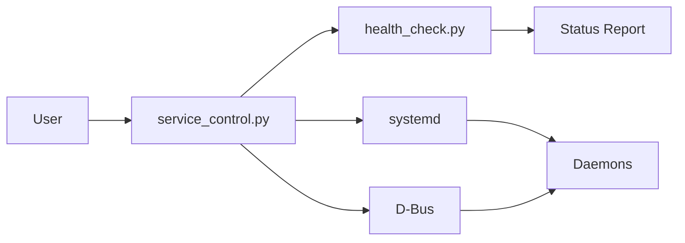
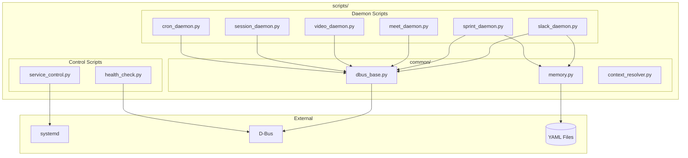

# Scripts Reference

Utility and daemon scripts for the AI Workflow system.

## Overview

The `scripts/` directory contains Python scripts for:
- **Daemons** - Background services (slack, sprint, meet, video, session, cron)
- **Control** - Service management and health monitoring
- **Analysis** - Pattern mining and skill analysis
- **Integration** - Testing and configuration

## Script Categories

### Daemon Scripts (6)

Background services that run independently.

| Script | Purpose | Service |
|--------|---------|---------|
| `slack_daemon.py` | Real-time Slack message monitoring | `bot-slack.service` |
| `sprint_daemon.py` | Automated Jira issue processing | `bot-sprint.service` |
| `meet_daemon.py` | Google Meet auto-join and notes | `bot-meet.service` |
| `video_daemon.py` | Virtual camera rendering | `bot-video.service` |
| `session_daemon.py` | Cursor IDE session sync | `bot-session.service` |
| `cron_daemon.py` | Scheduled job execution | `bot-cron.service` |

See [Daemons Documentation](../daemons/README.md) for details.

### Control Scripts (4)



| Script | Purpose | Usage |
|--------|---------|-------|
| `service_control.py` | Control daemon services | `python service_control.py start slack` |
| `health_check.py` | Monitor all daemon health | `python health_check.py` |
| `slack_control.py` | Slack-specific control | `python slack_control.py pause` |
| `slack_dbus.py` | D-Bus communication layer | Used internally |

### Analysis Scripts (4)

| Script | Purpose | Usage |
|--------|---------|-------|
| `analyze_skill_tool_usage.py` | Analyze which tools skills use | `python analyze_skill_tool_usage.py` |
| `pattern_miner.py` | Discover error patterns from logs | `python pattern_miner.py` |
| `optimize_patterns.py` | Optimize pattern matching | `python optimize_patterns.py` |
| `skill_hooks.py` | Skill execution hooks | Used internally |

### Integration & Testing (5)

| Script | Purpose | Usage |
|--------|---------|-------|
| `integration_test.py` | Run integration tests | `python integration_test.py` |
| `skill_test_runner.py` | Test skill execution | `python skill_test_runner.py` |
| `slack_test.py` | Test Slack integration | `python slack_test.py` |
| `claude_agent.py` | Claude agent for Slack | Used by slack_daemon |
| `get_slack_creds.py` | Get Slack credentials | `python get_slack_creds.py` |

### Configuration & Migration (4)

| Script | Purpose | Usage |
|--------|---------|-------|
| `slack_path_setup.py` | Configure Slack paths | `python slack_path_setup.py` |
| `migrate_state.py` | Migrate state files | `python migrate_state.py` |
| `backfill_q1_2026.py` | Backfill Q1 2026 data | `python backfill_q1_2026.py` |
| `update_skill_error_handling.py` | Update skill error handling | `python update_skill_error_handling.py` |

### Utilities (4)

| Script | Purpose | Usage |
|--------|---------|-------|
| `mcp_proxy.py` | MCP proxy server | Used for testing |
| `extension_watcher.py` | Watch VSCode extension | `python extension_watcher.py` |
| `generate_slides.py` | Generate presentation slides | `python generate_slides.py` |
| `generate_layer5_dashboard.py` | Generate Layer 5 dashboard | `python generate_layer5_dashboard.py` |

## Common Module

The `scripts/common/` directory contains shared utilities:

```
scripts/common/
├── __init__.py
├── command_registry.py    # D-Bus command registration
├── dbus_base.py           # D-Bus base class for daemons
├── memory.py              # Memory file operations
├── context_resolver.py    # Resolve repos, projects, namespaces
├── repo_utils.py          # Repository utilities
├── video_device.py        # V4L2 virtual device
└── skill_error_recovery.py # Skill error recovery
```

### Memory Helper Functions

```python
from scripts.common.memory import (
    read_memory,
    write_memory,
    append_to_list,
    remove_from_list,
    update_field,
    get_active_issues,
    add_active_issue,
)

# Read memory file
work = read_memory("state/current_work")

# Add to list
add_active_issue(
    issue_key="AAP-12345",
    summary="Fix bug",
    status="In Progress",
    branch="fix-bug",
    repo="backend"
)
```

### D-Bus Base Class

```python
from scripts.common.dbus_base import DaemonBase

class MyDaemon(DaemonBase):
    def __init__(self):
        super().__init__(
            name="my_daemon",
            bus_name="com.redhat.ai.MyDaemon",
            object_path="/com/redhat/ai/MyDaemon"
        )

    async def run(self):
        while self.running:
            # Daemon logic
            await asyncio.sleep(1)
```

## Running Scripts

### Direct Execution

```bash
# Run script directly
python scripts/health_check.py

# Run with specific args
python scripts/service_control.py start slack
```

### Via Make Targets

```bash
# Service control
make slack-start
make slack-status
make slack-stop

# Health check
make health-check

# Analysis
make analyze-skills
```

## Script Architecture



## See Also

- [Daemons Documentation](../daemons/README.md)
- [Architecture Overview](../architecture/README.md)
- [Development Guide](../DEVELOPMENT.md)
