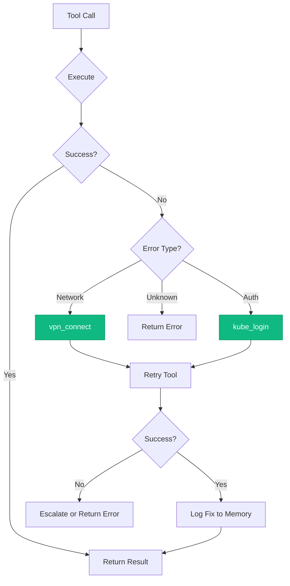
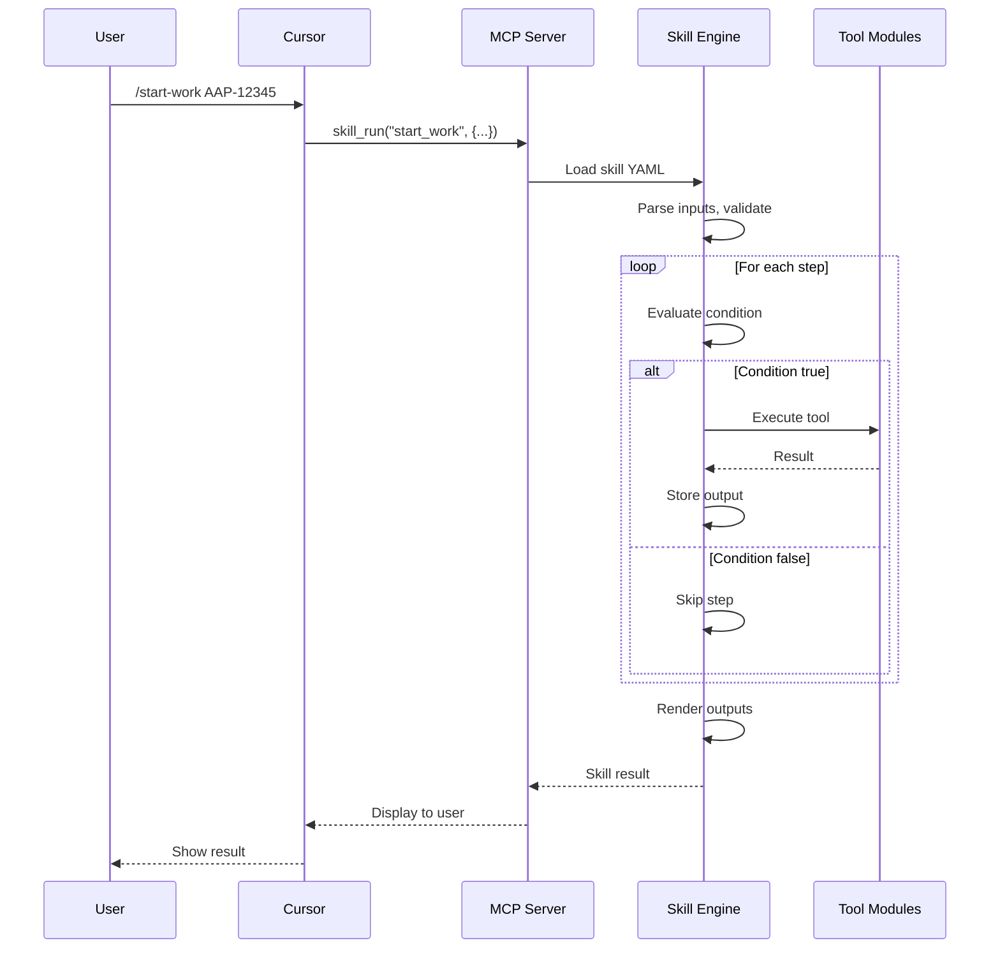

# Skills Reference

Skills are **reusable multi-step workflows** that chain MCP tools together with logic, conditions, and templating. All production skills include **auto-healing** for VPN and authentication issues.

## Quick Statistics

| Metric | Count |
|--------|-------|
| **Total Skills** | 82 |
| **Root Skills** | 78 |
| **Performance Skills** | 4 |
| **With Auto-Heal** | 55+ |

> **Tool Usage:** Skills drive the tool organization - the 294 "basic" tools are those commonly used in skills. See [Tool Organization](../tool-organization.md) for details.

## Skill Categories

### Daily Rituals (6 skills)

| Skill | Description |
|-------|-------------|
| [coffee](./coffee.md) | Morning briefing - calendar, email, PRs, Jira, ephemeral, alerts |
| [beer](./beer.md) | End-of-day wrap-up and standup prep |
| [standup_summary](./standup_summary.md) | Generate standup notes from activity |
| [weekly_summary](./weekly_summary.md) | Weekly activity report |
| [work_analysis](./work_analysis.md) | Analyze work across repositories |
| [discovered_work_summary](./discovered_work_summary.md) | Summarize discovered work items |

### Development Flow (12 skills)

| Skill | Description |
|-------|-------------|
| [start_work](./start_work.md) | Begin work on a Jira issue - branch, context, knowledge |
| [sync_branch](./sync_branch.md) | Quick sync with main branch |
| [create_mr](./create_mr.md) | Create MR with validation and linting |
| [mark_mr_ready](./mark_mr_ready.md) | Mark draft MR as ready for review |
| [close_issue](./close_issue.md) | Close issue with commit summary |
| [close_mr](./close_mr.md) | Close merge request |
| [hotfix](./hotfix.md) | Create emergency hotfix |
| [rebase_pr](./rebase_pr.md) | Rebase with auto-conflict hints |
| [cleanup_branches](./cleanup_branches.md) | Clean up stale branches |
| [pr_jira_audit](./pr_jira_audit.md) | Audit PRs for missing Jira refs |
| [sync_discovered_work](./sync_discovered_work.md) | Sync discovered work items |
| [update_docs](./update_docs.md) | Check and update documentation |

### Code Review (7 skills)

| Skill | Description |
|-------|-------------|
| [review_pr](./review_pr.md) | Review MR with detailed analysis |
| [review_all_prs](./review_all_prs.md) | Batch review open PRs |
| [review_local_changes](./review_local_changes.md) | Review uncommitted local changes |
| [review_pr_multiagent](./review_pr_multiagent.md) | Multi-agent coordinated code review |
| [review_pr_multiagent_test](./review_pr_multiagent_test.md) | Test multi-agent review |
| [check_my_prs](./check_my_prs.md) | Check your PR status and feedback |
| [check_mr_feedback](./check_mr_feedback.md) | Find comments needing response |

### Testing & Deployment (10 skills)

| Skill | Description |
|-------|-------------|
| [test_mr_ephemeral](./test_mr_ephemeral.md) | Deploy MR to ephemeral environment |
| [deploy_to_ephemeral](./deploy_to_ephemeral.md) | Full ephemeral deployment |
| [extend_ephemeral](./extend_ephemeral.md) | Extend ephemeral namespace TTL |
| [check_ci_health](./check_ci_health.md) | CI pipeline health check |
| [ci_retry](./ci_retry.md) | Retry failed CI pipeline |
| [cancel_pipeline](./cancel_pipeline.md) | Cancel running pipeline |
| [check_integration_tests](./check_integration_tests.md) | Check Konflux integration tests |
| [scan_vulnerabilities](./scan_vulnerabilities.md) | Scan container for CVEs |
| [rollout_restart](./rollout_restart.md) | Restart deployment with rollout |
| [scale_deployment](./scale_deployment.md) | Scale deployment replicas |

### Incident Response (6 skills)

| Skill | Description |
|-------|-------------|
| [investigate_alert](./investigate_alert.md) | Quick alert triage |
| [debug_prod](./debug_prod.md) | Deep production debugging |
| [investigate_slack_alert](./investigate_slack_alert.md) | Handle alerts from Slack |
| [silence_alert](./silence_alert.md) | Silence Prometheus alert |
| [environment_overview](./environment_overview.md) | Environment health overview |
| [check_secrets](./check_secrets.md) | Check Kubernetes secrets |

### Jira Management (7 skills)

| Skill | Description |
|-------|-------------|
| [create_jira_issue](./create_jira_issue.md) | Create issue with Markdown support |
| [clone_jira_issue](./clone_jira_issue.md) | Clone existing Jira issue |
| [jira_hygiene](./jira_hygiene.md) | Validate and fix issue quality |
| [jira_hygiene_all](./jira_hygiene_all.md) | Hygiene check all assigned issues |
| [sprint_planning](./sprint_planning.md) | Sprint planning assistance |
| [sprint_autopilot](./sprint_autopilot.md) | Autonomous sprint issue processing |
| [monitor_jira_comments](./monitor_jira_comments.md) | Monitor Jira comments for questions |

### Release & Infrastructure (5 skills)

| Skill | Description |
|-------|-------------|
| [release_aa_backend_prod](./release_aa_backend_prod.md) | Release aa-backend to production |
| [release_to_prod](./release_to_prod.md) | Generic production release |
| [appinterface_check](./appinterface_check.md) | Check app-interface GitOps state |
| [konflux_status](./konflux_status.md) | Konflux platform status |
| [submit_expense](./submit_expense.md) | Submit SAP Concur expense |

### Communication (5 skills)

| Skill | Description |
|-------|-------------|
| [notify_team](./notify_team.md) | Post to team Slack channel |
| [notify_mr](./notify_mr.md) | Notify team about MR |
| [schedule_meeting](./schedule_meeting.md) | Create calendar meeting |
| [slack_daemon_control](./slack_daemon_control.md) | Control Slack daemon |
| [compare_options](./compare_options.md) | Compare approaches/libraries |

### Knowledge & Research (10 skills)

| Skill | Description |
|-------|-------------|
| [gather_context](./gather_context.md) | Gather context using semantic search |
| [explain_code](./explain_code.md) | Explain code with project knowledge |
| [find_similar_code](./find_similar_code.md) | Find similar code patterns |
| [research_topic](./research_topic.md) | Deep dive on a topic |
| [summarize_findings](./summarize_findings.md) | Summarize research findings |
| [plan_implementation](./plan_implementation.md) | Create implementation plan |
| [bootstrap_knowledge](./bootstrap_knowledge.md) | Generate project knowledge |
| [bootstrap_all_knowledge](./bootstrap_all_knowledge.md) | Bootstrap all project knowledge |
| [knowledge_refresh](./knowledge_refresh.md) | Refresh project knowledge |
| [learn_architecture](./learn_architecture.md) | Deep scan project architecture |

### Memory & Patterns (7 skills)

| Skill | Description |
|-------|-------------|
| [memory_view](./memory_view.md) | View memory contents |
| [memory_edit](./memory_edit.md) | Edit memory entries |
| [memory_init](./memory_init.md) | Initialize memory structure |
| [memory_cleanup](./memory_cleanup.md) | Clean up old memory entries |
| [learn_pattern](./learn_pattern.md) | Save learned pattern to memory |
| [suggest_patterns](./suggest_patterns.md) | Auto-discover error patterns |
| [reindex_all_vectors](./reindex_all_vectors.md) | Reindex vector databases |

### Project Management (2 skills)

| Skill | Description |
|-------|-------------|
| [add_project](./add_project.md) | Add project to config.json |
| [hello_world](./hello_world.md) | Test skill to verify engine |

### Performance Tracking (4 skills)

Located in `skills/performance/`:

| Skill | Description |
|-------|-------------|
| [backfill_missing](./performance-backfill-missing.md) | Backfill missing performance data |
| [collect_daily](./performance-collect-daily.md) | Collect daily performance evidence |
| [evaluate_questions](./performance-evaluate-questions.md) | Evaluate quarterly questions with AI |
| [export_report](./performance-export-report.md) | Export quarterly performance report |

### Testing & Internal (2 skills)

| Skill | Description |
|-------|-------------|
| [test_error_recovery](./test_error_recovery.md) | Test interactive error recovery |
| [test_mr_ephemeral](./test_mr_ephemeral.md) | Test MR in ephemeral |

## Daily Workflow


## Auto-Heal Feature

All production skills include automatic remediation for common failures via **Python decorators** applied to MCP tools.

### How It Works



### Auto-Heal Decorators

| Decorator | Environment | Use Case |
|-----------|-------------|----------|
| `@auto_heal()` | Auto-detect | General tools |
| `@auto_heal_ephemeral()` | Ephemeral | Bonfire namespace tools |
| `@auto_heal_konflux()` | Konflux | Tekton pipeline tools |
| `@auto_heal_k8s()` | Stage/Prod | Kubectl tools |
| `@auto_heal_stage()` | Stage | Prometheus, Alertmanager |
| `@auto_heal_jira()` | - | Jira tools (auth only) |
| `@auto_heal_git()` | - | Git/GitLab tools (VPN only) |

### Error Patterns

| Error Pattern | Detection | Auto-Fix |
|---------------|-----------|----------|
| "No route to host" | Network timeout | `vpn_connect()` |
| "Connection refused" | Network issue | `vpn_connect()` |
| "Unauthorized" / "401" | Auth expired | `kube_login(cluster)` |
| "Forbidden" / "403" | Auth issue | `kube_login(cluster)` |
| "Token expired" | Auth expired | `kube_login(cluster)` |

## Running Skills

### Via Chat
```
Run the start_work skill for AAP-12345
```

### Via Tool
```python
skill_run("start_work", '{"issue_key": "AAP-12345"}')
```

### Via Cursor Command
```
/start-work AAP-12345
/coffee
/deploy
```

## Skill YAML Format

```yaml
name: skill_name
description: |
  Multi-line description of what this skill does.

version: "1.0"

inputs:
  - name: issue_key
    type: string
    required: true
    description: "Jira issue key"

  - name: repo
    type: string
    required: false
    default: ""
    description: "Repository name (auto-detected if empty)"

steps:
  - name: get_issue
    tool: jira_view_issue
    args:
      issue_key: "{{ inputs.issue_key }}"
    output: issue_data
    on_error: fail

  - name: check_success
    condition: "issue_data and not issue_data.get('error')"
    compute: |
      result = {
        "success": True,
        "summary": issue_data.get("summary")
      }
    output: check_result

  - name: create_branch
    condition: "check_result.success"
    tool: git_checkout
    args:
      repo: "{{ inputs.repo or resolved_repo }}"
      branch: "{{ inputs.issue_key | lower }}"
      create: true
    output: branch_result

outputs:
  - name: summary
    value: "{{ branch_result | json }}"
```

### Skill Features

| Feature | Syntax | Example |
|---------|--------|---------|
| **Jinja2 Templates** | `{{ variable }}` | `{{ inputs.issue_key }}` |
| **Filters** | `{{ var \| filter }}` | `{{ data \| json }}` |
| **Conditions** | `condition: "expr"` | `condition: "result.success"` |
| **Compute Blocks** | `compute: \| python` | Python code execution |
| **Error Handling** | `on_error: continue/fail` | Continue or stop on error |
| **Output Capture** | `output: var_name` | Store step result |

## Skill Execution Flow



## See Also

- [Architecture Overview](../architecture/README.md) - System design
- [Tool Modules](../tool-modules/README.md) - Available tools
- [Commands Reference](../commands/README.md) - Cursor slash commands
- [Personas Reference](../personas/README.md) - Tool loading profiles
- [Skill Engine](../architecture/skill-engine.md) - Engine implementation
