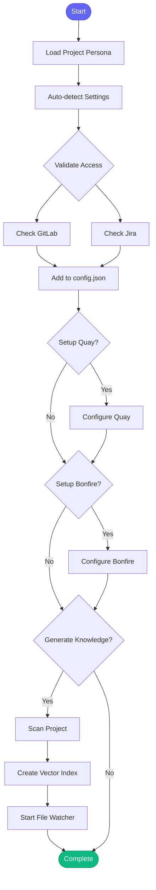

# :heavy_plus_sign: add_project

> Add a new project to config.json with auto-detection and validation

## Overview

The `add_project` skill automates the process of adding a new project to your workflow configuration. It auto-detects project settings from the directory, validates GitLab and Jira access, and optionally sets up Quay/Bonfire integrations and generates initial project knowledge with vector indexing.

## Quick Start

```text
skill_run("add_project", '{"path": "/home/user/src/my-project", "jira_project": "AAP"}')
```

Or with all options:

```text
skill_run("add_project", '{"path": "/home/user/src/my-project", "jira_project": "AAP", "gitlab": "org/my-project", "generate_knowledge": true}')
```

## Inputs

| Input | Type | Required | Default | Description |
|-------|------|----------|---------|-------------|
| `path` | string | Yes | - | Path to the project directory |
| `name` | string | No | - | Project name (defaults to directory name) |
| `gitlab` | string | No | - | GitLab project path (auto-detected if not provided) |
| `jira_project` | string | Yes | - | Jira project key (e.g., AAP, KONFLUX) |
| `jira_component` | string | No | - | Jira component name |
| `konflux_namespace` | string | No | - | Konflux tenant namespace (if using Konflux CI) |
| `setup_quay` | boolean | No | `false` | Configure Quay repository |
| `setup_bonfire` | boolean | No | `false` | Configure Bonfire/ephemeral deployment |
| `generate_knowledge` | boolean | No | `true` | Generate initial project knowledge |

## What It Does

1. **Load Project Persona** - Loads the project persona for project management tools
2. **Check Known Issues** - Proactively checks memory for known GitLab issues
3. **Detect Settings** - Auto-detects project settings from the directory (language, lint/test commands, scopes)
4. **Validate Path** - Verifies the project path exists
5. **Check GitLab Access** - Validates the GitLab project is accessible
6. **Check Jira Access** - Validates the Jira project is accessible
7. **Add Project** - Adds the project to config.json with detected settings
8. **Setup Quay** (optional) - Outputs instructions for Quay repository configuration
9. **Setup Bonfire** (optional) - Outputs instructions for Bonfire app configuration
10. **Generate Knowledge** - Scans project and generates knowledge for developer persona
11. **Create Vector Index** - Creates semantic vector index for code search
12. **Start File Watcher** - Starts automatic index updates on file changes
13. **Log Session** - Logs the project addition to session history

## Flow



## Example Output

```text
## Project Setup Complete

### Added to config.json
- Project: my-backend-service
- Path: /home/user/src/my-backend-service
- GitLab: org/my-backend-service
- Jira: AAP

### Next Steps
1. Verify settings: project_list()
2. Start working: skill_run('start_work', '{"issue_key": "AAP-XXXXX", "repo": "my-backend-service"}')

### Vector Search
- Index created: True
- File watcher: running

To search code semantically:
  code_search(query='your query', project='my-backend-service')
```

## MCP Tools Used

- `persona_load` - Load project persona
- `check_known_issues` - Check for known issues
- `project_detect` - Auto-detect project settings
- `gitlab_mr_list` - Validate GitLab access
- `jira_list_issues` - Validate Jira access
- `project_add` - Add project to config
- `knowledge_scan` - Generate project knowledge
- `code_index` - Create vector index
- `code_watch` - Start file watcher
- `memory_session_log` - Log to session

## Related Skills

- [bootstrap_knowledge](./bootstrap_knowledge.md) - Generate knowledge for existing projects
- [start_work](./start_work.md) - Begin working on an issue in the project
- [detect_project](./detect_project.md) - Just detect settings without adding
