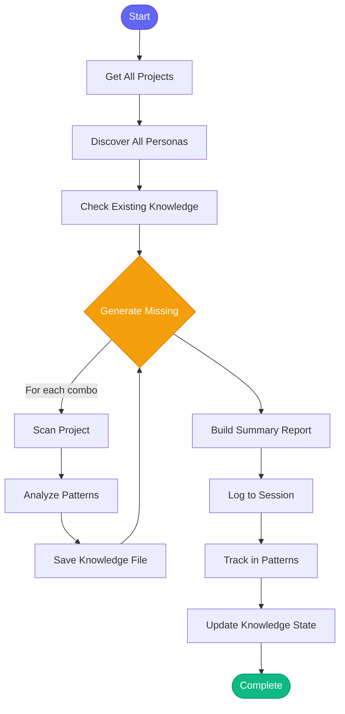

# 🧠 bootstrap_all_knowledge

> Initialize or refresh project knowledge for all projects and personas

## Overview

The `bootstrap_all_knowledge` skill iterates through all configured projects and available personas to build comprehensive project knowledge. It generates persona-specific knowledge files that enable semantic code search and context-aware assistance across your entire codebase.

Use this skill to:
- Initialize knowledge for all projects at once
- Ensure all personas have knowledge for all projects
- Run as scheduled maintenance via cron

## Quick Start

```text
skill_run("bootstrap_all_knowledge", '{}')
```

Or use the Cursor command:

```text
/bootstrap-all-knowledge
```

## Inputs

| Input | Type | Required | Default | Description |
|-------|------|----------|---------|-------------|
| `force` | boolean | No | `false` | Regenerate all knowledge even if it already exists |
| `projects` | string | No | all | Comma-separated list of projects (empty = all configured) |
| `personas` | string | No | all | Comma-separated list of personas (empty = all discovered) |
| `skip_existing` | boolean | No | `true` | Skip project/persona combinations that already have knowledge |

## What It Does

1. **Gets All Projects** - Reads all repositories from config.json with valid paths
2. **Discovers Personas** - Scans `personas/*.yaml` for all available personas
3. **Checks Existing Knowledge** - Identifies which project/persona combinations need generation
4. **Generates Knowledge** - For each missing combination:
   - Scans project structure
   - Analyzes patterns and dependencies
   - Creates persona-specific knowledge file
5. **Reports Summary** - Provides detailed matrix of what was generated
6. **Tracks in Memory** - Records bootstrap for pattern analysis
7. **Updates State** - Updates knowledge state tracking

## Flow



## Example Output

```markdown
## 🧠 Knowledge Bootstrap Complete

**Timestamp:** 2026-01-26 14:30:00 GMT

---

### 📊 Summary

- **Projects processed:** 5
- **Personas processed:** 6
- **Total combinations:** 30
- **Already had knowledge:** 18
- **Generated/refreshed:** 12

### 📁 Projects

| Project | Path |
|---------|------|
| automation-analytics-backend | `/home/user/src/automation-analytics-bac...` |
| redhat-ai-workflow | `/home/user/src/redhat-ai-workflow...` |
| app-interface | `/home/user/src/app-interface...` |

### 🎭 Personas: developer, devops, incident, release, researcher, workspace

### 📋 Generation Results

| Project | Persona | Status | Action |
|---------|---------|--------|--------|
| automation-analytics-backend | developer | ✅ | missing |
| automation-analytics-backend | devops | ✅ | missing |
| redhat-ai-workflow | researcher | ✅ | refresh |
| app-interface | incident | ⏭️ | skipped |

---

### Next Steps

- View knowledge: `knowledge_query(project='...', persona='...')`
- Update knowledge: `knowledge_update(project='...', persona='...', section='gotchas', content='...')`
- Check status in VS Code: Memory tab -> Project Knowledge
```

## Knowledge Files

Knowledge is stored in persona-specific directories:

```
memory/knowledge/personas/
├── developer/
│   ├── automation-analytics-backend.yaml
│   └── redhat-ai-workflow.yaml
├── devops/
│   ├── automation-analytics-backend.yaml
│   └── redhat-ai-workflow.yaml
└── ...
```

Each knowledge file contains:
- Architecture overview
- Key modules and their purposes
- Dependencies
- Coding patterns
- Testing patterns
- Deployment patterns
- Gotchas and learned insights

## MCP Tools Used

- `memory_session_log` - Log bootstrap to session
- Internal knowledge functions:
  - `_load_knowledge` - Load existing knowledge
  - `_save_knowledge` - Save generated knowledge
  - `_generate_initial_knowledge` - Generate knowledge from project scan

## Related Skills

- [knowledge_refresh](./knowledge_refresh.md) - Refresh a single project's knowledge
- [learn_architecture](./learn_architecture.md) - Deep scan project architecture
- [reindex_all_vectors](./reindex_all_vectors.md) - Reindex all vector databases
- [knowledge_list](./knowledge_list.md) - List all available knowledge files
