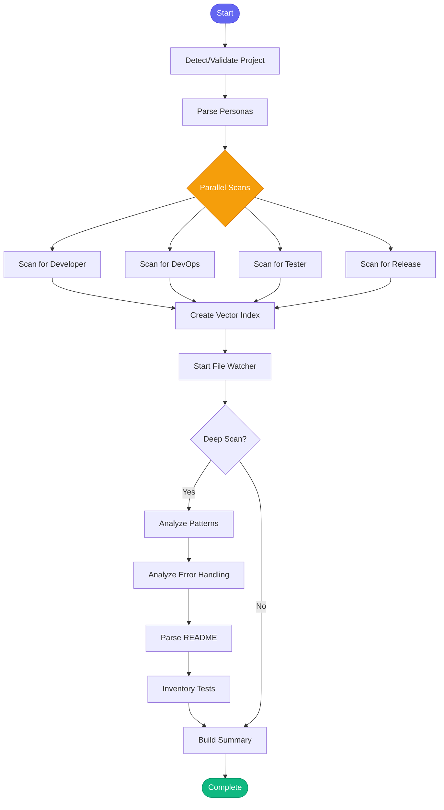

# :books: bootstrap_knowledge

> Scan a project and generate comprehensive knowledge for all personas

## Overview

The `bootstrap_knowledge` skill creates a complete knowledge base for a project by scanning its structure, analyzing code patterns, creating a semantic vector index, and generating persona-specific knowledge files. This enables intelligent code search and context-aware assistance across the entire codebase.

## Quick Start

```text
skill_run("bootstrap_knowledge", '{"project": "automation-analytics-backend"}')
```

Or with deep analysis:

```text
skill_run("bootstrap_knowledge", '{"project": "my-project", "deep_scan": true, "personas": "developer,devops"}')
```

## Inputs

| Input | Type | Required | Default | Description |
|-------|------|----------|---------|-------------|
| `project` | string | No | auto-detected | Project name from config.json (auto-detected from cwd if empty) |
| `personas` | string | No | `"developer,devops,tester,release"` | Comma-separated list of personas to generate knowledge for |
| `deep_scan` | boolean | No | `false` | If true, perform deeper analysis (slower but more comprehensive) |
| `create_vector_index` | boolean | No | `true` | If true, create semantic vector index for code search |
| `start_watcher` | boolean | No | `true` | If true, start file watcher for automatic index updates |

## What It Does

1. **Detect Project** - Auto-detects the project from current working directory if not provided
2. **Validate Project** - Confirms the project exists in config.json
3. **Get Project Path** - Resolves the full filesystem path
4. **Parse Personas** - Parses the comma-separated personas list
5. **Scan for Each Persona** - Generates knowledge for developer, devops, tester, and release personas
6. **Create Vector Index** - Indexes all code files for semantic search
7. **Start File Watcher** - Monitors for changes and auto-updates the index
8. **Deep Analysis** (if enabled):
   - Analyzes code patterns using semantic search
   - Scans error handling patterns
   - Parses README content
   - Inventories test files and fixtures
9. **Build Summary** - Compiles results into a formatted report
10. **Track History** - Records the bootstrap in memory for future reference

## Flow



## Example Output

```text
## :books: Knowledge Bootstrap Complete: automation-analytics-backend

**Project Path:** `/home/user/src/automation-analytics-backend`
**Personas:** developer, devops, tester, release

### Generated Knowledge Files
- `memory/knowledge/personas/developer/automation-analytics-backend.yaml`
- `memory/knowledge/personas/devops/automation-analytics-backend.yaml`
- `memory/knowledge/personas/tester/automation-analytics-backend.yaml`
- `memory/knowledge/personas/release/automation-analytics-backend.yaml`

### :mag: Vector Index Created
- **Files indexed:** 342
- **Chunks created:** 1847
- **File watcher:** Running (auto-updates enabled)

Use `code_search(query='...', project='automation-analytics-backend')` for semantic code search.

### Deep Scan Results
**README:** 4523 chars analyzed
**Tests:** [{'directory': 'tests', 'python_tests': 156, 'js_tests': 0}, {'fixtures': 'conftest.py found'}]
**Code Patterns:** 8 patterns identified
**Error Handling:** 12 handlers found

### Next Steps
1. Review generated knowledge with `knowledge_query(project='automation-analytics-backend', persona='developer')`
2. Search code semantically with `code_search(query='...', project='automation-analytics-backend')`
3. Add specific gotchas with `knowledge_update()`
4. Knowledge will grow automatically as you complete tasks
```

## MCP Tools Used

- `check_known_issues` - Check for known vector indexing issues
- `knowledge_query` - Validate project exists
- `knowledge_scan` - Scan project for each persona
- `code_index` - Create semantic vector index
- `code_watch` - Start file watcher for auto-updates
- `code_search` - Deep analysis of code patterns
- `memory_session_log` - Log to session history

## Knowledge Files Created

The skill creates YAML knowledge files for each persona in:

```
memory/knowledge/personas/{persona}/{project}.yaml
```

Each file contains:
- **Architecture** - Overview, key modules, patterns
- **Patterns** - Coding patterns, testing patterns
- **Gotchas** - Project-specific pitfalls to avoid
- **Learned** - Empty section that grows over time

## Related Skills

- [add_project](./add_project.md) - Add a new project (includes knowledge generation)
- [knowledge_refresh](./knowledge_refresh.md) - Update existing knowledge
- [explain_code](./explain_code.md) - Explain code using generated knowledge
- [find_similar_code](./find_similar_code.md) - Search using the vector index
