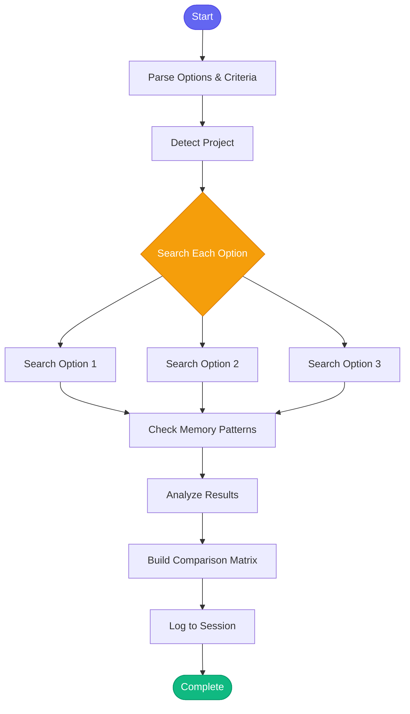

# :balance_scale: compare_options

> Compare multiple approaches, libraries, or patterns before making a decision

## Overview

The `compare_options` skill helps you make informed technical decisions by comparing multiple options side-by-side. It searches the codebase for existing usage of each option, checks memory for past experiences, and generates a structured comparison matrix with pros, cons, and evaluation criteria.

## Quick Start

```text
skill_run("compare_options", '{"question": "Which caching solution to use?", "options": "Redis, Memcached, Django cache"}')
```

Or with custom criteria:

```text
skill_run("compare_options", '{"question": "Best testing framework?", "options": "pytest, unittest, nose2", "criteria": "performance, ease of use, community support"}')
```

## Inputs

| Input | Type | Required | Default | Description |
|-------|------|----------|---------|-------------|
| `question` | string | Yes | - | What decision are you trying to make? (e.g., "Which caching solution to use?") |
| `options` | string | Yes | - | Comma-separated options to compare (e.g., "Redis, Memcached, Django cache") |
| `criteria` | string | No | `"complexity, performance, maintainability, existing usage"` | Comma-separated criteria to evaluate |
| `project` | string | No | auto-detected | Project context for codebase search |

## What It Does

1. **Parse Options** - Splits the comma-separated options and criteria into lists
2. **Detect Project** - Auto-detects the project from current directory if not provided
3. **Search Codebase** - Searches for each option (up to 3) in the project's code
4. **Check Memory** - Looks for past decisions and patterns in memory
5. **Analyze Results** - Counts usage occurrences and identifies files for each option
6. **Build Comparison** - Creates a formatted comparison matrix with:
   - Usage overview table
   - Detailed analysis per option
   - Evaluation matrix template
   - Recommendation placeholder
7. **Log Session** - Records the comparison in session history

## Flow



## Example Output

```text
## :balance_scale: Options Comparison

**Question:** Which caching solution to use?

**Project:** automation-analytics-backend

### :bar_chart: Options Overview

| Option | In Codebase | Usage Count | Files |
|--------|-------------|-------------|-------|
| Redis | :white_check_mark: | 12 | api/cache.py, tasks/worker.py |
| Memcached | :x: | 0 | - |
| Django cache | :white_check_mark: | 5 | views/dashboard.py, utils/... |

### :memo: Detailed Analysis

#### Redis

:white_check_mark: **Already used in codebase** (12 occurrences)

Found in:
- `api/cache.py`
- `tasks/worker.py`
- `services/session.py`

**Pros:**
- [ ] *Add pros from research*

**Cons:**
- [ ] *Add cons from research*

#### Memcached

:x: **Not currently used in codebase**

**Pros:**
- [ ] *Add pros from research*

**Cons:**
- [ ] *Add cons from research*

#### Django cache

:white_check_mark: **Already used in codebase** (5 occurrences)

Found in:
- `views/dashboard.py`
- `utils/caching.py`

**Pros:**
- [ ] *Add pros from research*

**Cons:**
- [ ] *Add cons from research*

### :clipboard: Evaluation Matrix

Rate each option 1-5 for each criterion:

| Criterion | Redis | Memcached | Django cache |
|-----------|-------|-----------|--------------|
| complexity | ? | ? | ? |
| performance | ? | ? | ? |
| maintainability | ? | ? | ? |
| existing usage | ? | ? | ? |

### :bulb: Recommendation

*Based on the analysis above, fill in your recommendation:*

**Recommended option:** ___
**Rationale:** ___

---
### :mag: Next Steps

- Use **WebSearch** to research pros/cons of each option
- Review existing usage with `explain_code` if found in codebase
- Use `plan_implementation` once you've decided
```

## MCP Tools Used

- `code_search` - Search codebase for each option
- `memory_read` - Check for related patterns in memory
- `memory_session_log` - Log comparison to session

## Use Cases

- **Library Selection** - Compare frameworks, databases, or tools
- **Architecture Decisions** - Evaluate different design patterns
- **Technology Choices** - Assess new technologies vs existing ones
- **Refactoring Options** - Compare approaches before major changes

## Related Skills

- [research_topic](./research_topic.md) - Deep dive on a single option
- [plan_implementation](./plan_implementation.md) - Create action plan after deciding
- [explain_code](./explain_code.md) - Understand existing implementations
