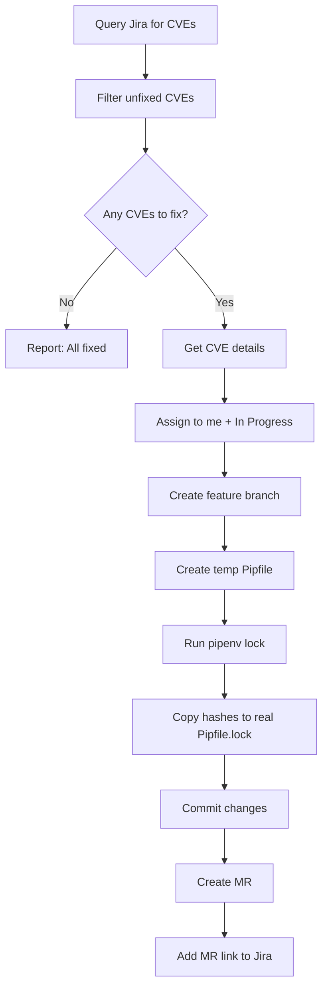

# CVE Fix Skill

Automated CVE remediation for Python dependencies.

## Overview

The `cve_fix` skill automates the process of fixing CVE vulnerabilities in Python projects. It queries Jira for CVEs, updates dependency versions and hashes in `Pipfile.lock`, creates merge requests, and links everything back to Jira.

## Workflow



## Usage

### Manual Execution

```bash
# Run via skill_run
skill_run("cve_fix", '{}')

# Dry run to see what would be done
skill_run("cve_fix", '{"dry_run": true}')

# Process up to 3 CVEs
skill_run("cve_fix", '{"max_cves": 3}')

# Different downstream component
skill_run("cve_fix", '{"downstream_component": "my-other-project"}')
```

### Cron Job

Add to `config.json` under `schedules.jobs`:

```json
{
  "name": "daily_cve_fix",
  "description": "Check and fix CVEs daily at 10 AM",
  "skill": "cve_fix",
  "cron": "0 10 * * 1-5",
  "persona": "developer",
  "inputs": {
    "downstream_component": "automation-analytics-backend",
    "max_cves": 1
  },
  "notify": ["slack", "memory"]
}
```

## Inputs

| Input | Type | Required | Default | Description |
|-------|------|----------|---------|-------------|
| `downstream_component` | string | No | `automation-analytics-backend` | Jira "Downstream Component Name" to filter CVEs |
| `repo` | string | No | (auto) | Repository path |
| `repo_name` | string | No | `automation-analytics-backend` | Repository name from config |
| `dry_run` | boolean | No | `false` | Preview changes without executing |
| `max_cves` | integer | No | `1` | Maximum CVEs to process per run |

## How It Works

### 1. CVE Discovery

The skill queries Jira using JQL:

```jql
"Downstream Component Name" = "automation-analytics-backend"
AND type = Vulnerability
AND resolution = Unresolved
ORDER BY created DESC
```

### 2. Filtering Already Fixed

CVEs are filtered by checking if any git commit mentions the issue key (e.g., `AAP-61939`). This prevents duplicate work.

### 3. Pipfile.lock Update Process

The skill uses a clever approach to get fresh hashes:

1. **Create temp directory** in `/tmp/cve-fix-XXXX/`
2. **Create minimal Pipfile** with only the vulnerable package:
   ```toml
   [[source]]
   url = "https://pypi.org/simple"
   verify_ssl = true
   name = "pypi"

   [packages]
   aiohttp = "*"  # No version restriction = latest

   [requires]
   python_version = "3.11"
   ```
3. **Run `pipenv lock`** to generate fresh lock file with new hashes
4. **Extract package info** (version + hashes) from new lock
5. **Update real Pipfile.lock** with new version and hashes
6. **Clean up temp directory**

### 4. Branch Naming

Branches follow the convention:
```
AAP-XXXXX-cve-YYYY-NNNNN-package-name
```

Example: `AAP-61939-cve-2025-69223-aiohttp`

### 5. Commit Message

Uses the standard commit format from `config.json`:
```
AAP-61939 - fix(deps): update aiohttp ==3.9.1 -> ==3.10.0 to fix CVE-2025-69223
```

### 6. MR Description

The MR includes:
- CVE ID and details
- Package name and version change
- CVSS score and severity
- Link to Jira issue
- Testing checklist

## Example Output

```
## ✅ CVE Fix Complete

### CVE Details

| Field | Value |
|-------|-------|
| Issue | [AAP-61939](https://issues.redhat.com/browse/AAP-61939) |
| CVE ID | CVE-2025-69223 |
| Package | aiohttp |
| Severity | Important |
| CVSS | 7.5 |

### Changes Made

- **Branch:** `AAP-61939-cve-2025-69223-aiohttp`
- **Package Update:** `==3.9.1` → `==3.10.0`
- **Hashes Updated:** 42

### Merge Request

**MR:** [AAP-61939 - fix(security): fix CVE-2025-69223 in aiohttp](https://gitlab.cee.redhat.com/automation-analytics/automation-analytics-backend/-/merge_requests/1500)
```

## Jira Requirements

For the skill to work correctly, CVE issues in Jira must have:

1. **Downstream Component Name** field set (e.g., `automation-analytics-backend`)
2. **CVE ID** somewhere in the issue (title, description, or CVE ID field)
3. **Upstream Affected Component** field with the Python package name

## Error Handling

The skill handles common errors:

- **Missing CVE info**: Reports which fields are missing
- **Package not in Pipfile.lock**: Reports if the package isn't a dependency
- **pipenv lock failure**: Reports the error message
- **Git/GitLab errors**: Uses auto-heal for auth issues

## Related Skills

- `start_work` - General issue workflow
- `create_mr` - MR creation with validation
- `scan_vulnerabilities` - Security scanning
