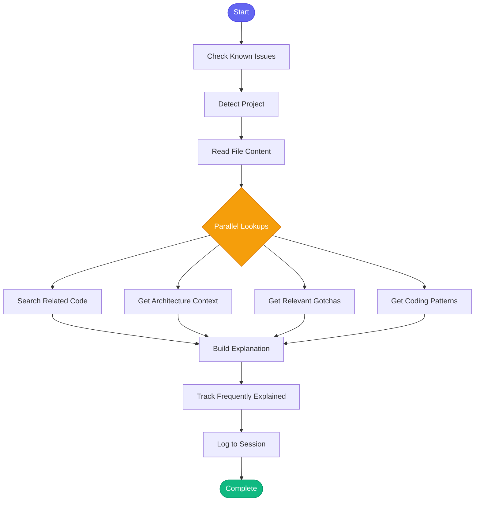

# :book: explain_code

> Explain code using project knowledge and semantic context

## Overview

The `explain_code` skill provides comprehensive explanations of code files by combining the actual code content with project knowledge, architecture context, related implementations, and relevant gotchas. Use this skill when you need to understand unfamiliar code or how it fits into the larger system.

## Quick Start

```text
skill_run("explain_code", '{"file": "api/billing.py"}')
```

Or with specific line range:

```text
skill_run("explain_code", '{"file": "services/calculator.py", "lines": "50-100", "depth": "detailed"}')
```

## Inputs

| Input | Type | Required | Default | Description |
|-------|------|----------|---------|-------------|
| `file` | string | Yes | - | File path to explain (relative to project root) |
| `lines` | string | No | - | Line range to focus on (e.g., "10-50") |
| `project` | string | No | auto-detected | Project name from config.json |
| `depth` | string | No | `"normal"` | Explanation depth: `"brief"`, `"normal"`, or `"detailed"` |

## What It Does

1. **Check Known Issues** - Proactively checks for known vector search issues
2. **Detect Project** - Auto-detects the project from current directory
3. **Get Project Path** - Resolves the full filesystem path
4. **Read File Content** - Reads the specified file (or line range)
5. **Search Related Code** - Finds similar implementations in the codebase
6. **Get Architecture Context** - Loads module-level architecture information
7. **Get Relevant Gotchas** - Finds gotchas related to this file/module
8. **Get Coding Patterns** - Retrieves applicable coding patterns
9. **Build Explanation** - Compiles all information into a structured explanation
10. **Track Patterns** - Records frequently explained files for future reference
11. **Log Session** - Records the explanation in session history

## Flow



## Example Output

```text
## :book: Code Explanation: `api/billing.py`

**Lines:** 50-100

### :building_construction: Architecture Context

**Module:** api/
**Purpose:** REST API endpoints for the billing service

### :memo: Code

```python
50: class BillingCalculator:
51:     """Calculate billing based on usage metrics."""
52:
53:     def __init__(self, tenant_id: str):
54:         self.tenant_id = tenant_id
55:         self.metering = MeteringService()
56:
57:     def calculate_vcpu_hours(self, start: datetime, end: datetime) -> Decimal:
58:         """Calculate vCPU hours for the billing period."""
59:         usage = self.metering.get_usage(self.tenant_id, start, end)
60:         return self._aggregate_vcpu(usage)
```

### :link: Related Code

Similar implementations found:
- `services/billing_aggregator.py:25`
- `utils/calculations.py:88`
- `tests/test_billing.py:42`

### :warning: Gotchas

Keep these in mind:
- Billing uses tenant timezone, not UTC
- vCPU calculations must round to 4 decimal places
- Always use Decimal for money calculations

### :books: Coding Patterns

This code should follow these patterns:
- Use type hints for all function parameters
- Document public methods with docstrings
- Validate input at API boundaries

---
*Use `find_similar_code` to search for more related implementations.*
```

## MCP Tools Used

- `check_known_issues` - Check for known vector search issues
- `code_search` - Find related code in codebase
- `knowledge_query` - Query architecture, gotchas, and patterns
- `memory_session_log` - Log to session history

## Tracking Features

The skill tracks:

- **Code Explanations** - Records each explanation with metadata
- **Frequently Explained Files** - Identifies files that need explanation often (may indicate need for better docs)
- **Failure Patterns** - Learns from errors (file not found, permission issues)

## Use Cases

- **Onboarding** - Understanding unfamiliar code
- **Code Review** - Getting context before reviewing changes
- **Bug Investigation** - Understanding code behavior
- **Refactoring** - Understanding before making changes
- **Documentation** - Gathering information for docs

## Related Skills

- [find_similar_code](./find_similar_code.md) - Find similar implementations
- [research_topic](./research_topic.md) - Research a broader topic
- [gather_context](./gather_context.md) - Gather context for a task
- [bootstrap_knowledge](./bootstrap_knowledge.md) - Generate project knowledge
