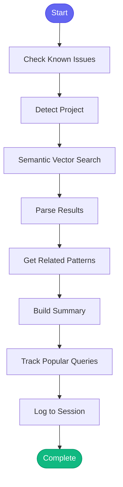

# :mag_right: find_similar_code

> Find code similar to a given pattern or description using semantic search

## Overview

The `find_similar_code` skill uses semantic vector search to find code that is conceptually similar to a given query or code snippet. Unlike text search, it understands meaning - so searching for "calculate billing" will find code about "compute charges" even if those exact words are not used. This is essential for discovering patterns, finding code to reference, and identifying potential duplication.

## Quick Start

```text
skill_run("find_similar_code", '{"query": "calculate vCPU usage from metrics"}')
```

Or with more options:

```text
skill_run("find_similar_code", '{"query": "error handling for API requests", "project": "backend", "limit": 15, "show_context": true}')
```

## Inputs

| Input | Type | Required | Default | Description |
|-------|------|----------|---------|-------------|
| `query` | string | Yes | - | Description of what you are looking for, or a code snippet |
| `project` | string | No | auto-detected | Project name from config.json |
| `limit` | integer | No | `10` | Maximum number of results to return |
| `show_context` | boolean | No | `true` | Show surrounding code context for each result |

## What It Does

1. **Check Known Issues** - Proactively checks for known vector search issues
2. **Detect Project** - Auto-detects the project from current directory
3. **Search Similar** - Performs semantic vector search for matching code
4. **Parse Results** - Extracts file paths, line numbers, and code snippets
5. **Get Related Patterns** - Fetches coding patterns from knowledge base
6. **Build Summary** - Compiles results into a formatted report
7. **Track Searches** - Records search for pattern analysis
8. **Track Popular Queries** - Identifies frequently searched topics
9. **Log Session** - Records the search in session history

## Flow



## Outputs

The skill returns two outputs:

| Output | Type | Description |
|--------|------|-------------|
| `summary` | string | Formatted markdown report |
| `results` | list | Parsed search results for programmatic use |

### Results Structure

```yaml
- file: "api/billing.py"
  line: 42
  snippet: "def calculate_vcpu_hours(self, start, end)..."
- file: "services/metering.py"
  line: 88
  snippet: "class UsageCalculator..."
```

## Example Output

```text
## :mag: Similar Code Search: automation-analytics-backend

**Query:** calculate vCPU usage from metrics

### Found 7 Results

**1. `api/billing.py:42`**
```
def calculate_vcpu_hours(self, start: datetime, end: datetime) -> Decimal:
    """Calculate vCPU hours for the billing period."""
```

**2. `services/metering.py:88`**
```
class UsageCalculator:
    def aggregate_cpu_metrics(self, raw_metrics: List[Metric]) -> ...
```

**3. `utils/calculations.py:15`**
```
def vcpu_to_hours(vcpu_seconds: int) -> Decimal:
    return Decimal(vcpu_seconds) / Decimal(3600)
```

**4. `tests/test_billing.py:56`**
```
def test_vcpu_calculation_precision():
    result = calculator.calculate_vcpu_hours(...)
```

### :books: Related Coding Patterns

- Use Decimal for all billing calculations
- Always validate metric timestamps
- Log calculation inputs for audit trail

---
*Use `code_search()` directly for more control over search parameters.*
```

## Semantic Search vs Text Search

| Feature | Semantic Search (this skill) | Text Search (grep) |
|---------|------------------------------|-------------------|
| Finds synonyms | Yes - "calculate" finds "compute" | No - exact match only |
| Understands context | Yes - knows API code differs from tests | No |
| Handles typos | Somewhat tolerant | No |
| Requires indexing | Yes - run `bootstrap_knowledge` first | No |
| Speed | Fast (pre-computed) | Depends on codebase size |

## MCP Tools Used

- `check_known_issues` - Check for known vector search issues
- `code_search` - Perform semantic vector search
- `knowledge_query` - Get related coding patterns
- `memory_session_log` - Log to session history

## Tracking Features

The skill tracks:

- **Code Searches** - Records each search with result counts
- **Popular Queries** - Identifies frequently searched topics (useful for documentation gaps)
- **Failure Patterns** - Learns from search failures (missing index, etc.)

## Prerequisites

Before using this skill, ensure the project has a vector index:

```text
skill_run("bootstrap_knowledge", '{"project": "my-project"}')
```

Or just create the index:

```text
code_index(project="my-project")
```

## Use Cases

- **Finding Examples** - "How do we handle pagination in this codebase?"
- **Code Reuse** - "Is there existing code for date range validation?"
- **Pattern Discovery** - "Show me how we handle database transactions"
- **Duplication Detection** - "Is this logic implemented elsewhere?"
- **Refactoring** - "What code would be affected by changing this interface?"

## Related Skills

- [explain_code](./explain_code.md) - Explain a specific file in detail
- [research_topic](./research_topic.md) - Deep dive on a topic
- [gather_context](./gather_context.md) - Gather context for a task
- [bootstrap_knowledge](./bootstrap_knowledge.md) - Create the vector index
