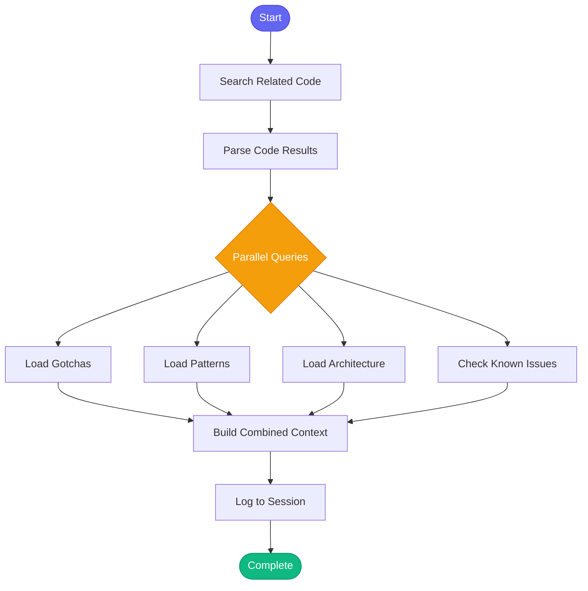

# :package: gather_context

> Gather relevant context for a task using semantic search and knowledge base

## Overview

The `gather_context` skill consolidates the common pattern of gathering context before starting work. It combines semantic code search, project knowledge (gotchas, patterns, architecture), and known issues into a single structured output. Use this at the start of any task that needs context about the codebase.

## Quick Start

```text
skill_run("gather_context", '{"query": "billing calculation API endpoint"}')
```

Or with specific options:

```text
skill_run("gather_context", '{"query": "authentication flow", "project": "backend", "include_architecture": true, "code_limit": 10}')
```

## Inputs

| Input | Type | Required | Default | Description |
|-------|------|----------|---------|-------------|
| `query` | string | Yes | - | What to search for (issue description, feature name, error message, etc.) |
| `project` | string | No | `"automation-analytics-backend"` | Project name from config for knowledge lookup |
| `tool_name` | string | No | - | Tool name to check for known issues (optional) |
| `code_limit` | integer | No | `5` | Maximum code search results |
| `include_architecture` | boolean | No | `true` | Include architecture overview in context |
| `include_gotchas` | boolean | No | `true` | Include project gotchas in context |
| `include_patterns` | boolean | No | `true` | Include coding patterns in context |

## What It Does

1. **Search Related Code** - Performs semantic search for code matching the query
2. **Parse Code Results** - Extracts file paths and relevant snippets
3. **Load Gotchas** - Retrieves project-specific gotchas from knowledge base
4. **Load Patterns** - Gets coding patterns from knowledge base
5. **Load Architecture** - Fetches architecture overview for context
6. **Check Known Issues** - Searches memory for known issues related to the query
7. **Build Combined Context** - Merges all sources into a structured output
8. **Log Session** - Records the context gathering in session history

## Flow



## Outputs

The skill returns three outputs:

| Output | Type | Description |
|--------|------|-------------|
| `context` | object | Structured context data for programmatic use |
| `report` | string | Formatted markdown report for display |
| `has_context` | boolean | True if any context was found |

### Context Object Structure

```yaml
query: "billing calculation"
project: "automation-analytics-backend"
code:
  found: true
  count: 5
  results: ["api/billing.py:42", "services/calc.py:15"]
gotchas:
  found: true
  count: 2
  items: ["Billing uses tenant timezone, not UTC", "..."]
patterns:
  found: true
  count: 3
  items: ["Use Decimal for money calculations", "..."]
architecture:
  found: true
  overview: "The billing module handles..."
known_issues:
  found: false
  count: 0
  items: []
summary:
  has_code: true
  has_gotchas: true
  has_patterns: true
  has_architecture: true
  has_known_issues: false
  total_items: 10
```

## Example Output

```text
## :books: Context Gathered

**Query:** billing calculation API endpoint
**Project:** automation-analytics-backend

### Summary
- **Code Results:** 5
- **Gotchas:** 2
- **Patterns:** 3
- **Known Issues:** 0

### :mag: Related Code
- `api/billing.py:42`
- `services/billing_calculator.py:15`
- `tests/test_billing.py:88`

### :warning: Project Gotchas
- Billing uses tenant timezone, not UTC
- vCPU calculations round to 4 decimal places

### :triangular_ruler: Coding Patterns
- Use Decimal for all money calculations
- Validate input before processing
- Log all billing events for audit

### :building_construction: Architecture
The billing module handles subscription and usage-based billing.
It integrates with the metering service for usage data...
```

## MCP Tools Used

- `code_search` - Semantic search for related code
- `knowledge_query` - Query gotchas, patterns, and architecture
- `check_known_issues` - Search memory for known issues
- `memory_session_log` - Log to session history

## Use Cases

This skill is commonly used by other skills as a first step:

- **start_work** - Gather context before starting on a Jira issue
- **review_pr** - Understand the code being reviewed
- **investigate_alert** - Get context for production issues
- **implement_feature** - Gather relevant patterns before coding

## Related Skills

- [research_topic](./research_topic.md) - Deep dive research on a topic
- [explain_code](./explain_code.md) - Explain specific code files
- [find_similar_code](./find_similar_code.md) - Find similar implementations
- [start_work](./start_work.md) - Uses this skill internally
