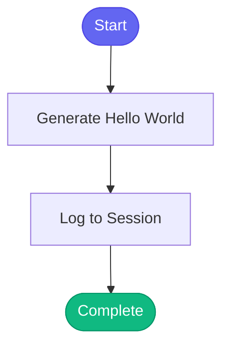

# 🌍 hello_world

> Simple test skill for verifying the skill engine

## Overview

The `hello_world` skill is a minimal test skill that prints "Hello World" with a timestamp. It is used for testing the cron scheduler functionality and verifying the skill engine is working correctly.

Use this skill to:
- Verify the skill engine is operational
- Test cron scheduler execution
- Debug skill system issues

## Quick Start

```text
skill_run("hello_world", '{}')
```

Or use the Cursor command:

```text
/hello-world
```

## Inputs

This skill has no inputs.

| Input | Type | Required | Default | Description |
|-------|------|----------|---------|-------------|
| - | - | - | - | No inputs required |

## What It Does

1. **Generates Greeting** - Creates a "Hello World" message with current timestamp
2. **Logs Execution** - Records the execution to session memory

## Flow



## Example Output

```text
🌍 Hello World!

Timestamp: 2026-01-26 14:30:00 GMT

The cron scheduler is working!
```

## Use Cases

### Testing Skill Engine

Run manually to verify the skill engine is functioning:

```text
skill_run("hello_world", '{}')
```

### Cron Scheduler Testing

Configure in cron scheduler to verify scheduled execution:

```yaml
# In cron configuration
schedules:
  - skill: hello_world
    cron: "*/5 * * * *"  # Every 5 minutes
    description: "Test cron is running"
```

### Debugging

Use this skill when troubleshooting skill execution issues:

1. If `hello_world` works but other skills fail, the issue is skill-specific
2. If `hello_world` fails, the skill engine itself has a problem

## Session Logging

The skill logs its execution to the session:

```yaml
# In today's session log
entries:
  - action: "Hello World skill executed"
    details: "Cron test at 2026-01-26 14:30:00 GMT"
    timestamp: "2026-01-26T14:30:00+00:00"
```

## MCP Tools Used

- `memory_session_log` - Log execution to session

## Related Skills

- [test_error_recovery](./test_error_recovery.md) - Test error recovery functionality
- [memory_view](./memory_view.md) - View session logs
- [memory_init](./memory_init.md) - Reset memory to clean state
