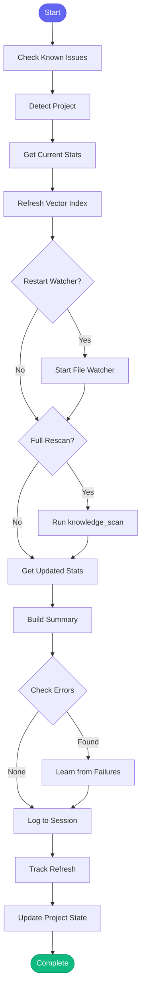

# 🔄 knowledge_refresh

> Refresh project knowledge and vector index

## Overview

The `knowledge_refresh` skill updates a project's vector index and optionally rescans project knowledge. It keeps semantic code search accurate and project knowledge current by processing recent code changes.

Use this skill to:
- Update the vector index with recent code changes
- Re-scan project for architecture changes
- Refresh knowledge confidence scores
- Start or restart file watchers for automatic updates

## Quick Start

```text
skill_run("knowledge_refresh", '{}')
```

Or use the Cursor command:

```text
/knowledge-refresh
```

## Inputs

| Input | Type | Required | Default | Description |
|-------|------|----------|---------|-------------|
| `project` | string | No | auto-detect | Project name from config.json |
| `full_rescan` | boolean | No | `false` | Perform full rescan instead of incremental update |
| `restart_watcher` | boolean | No | `true` | Restart the file watcher for auto-updates |

## What It Does

1. **Checks Known Issues** - Proactively checks for known vector indexing problems
2. **Detects Project** - Auto-detects from current directory or uses provided project
3. **Gets Current Stats** - Records files, chunks, and searches before refresh
4. **Updates Vector Index** - Indexes new and changed files
5. **Restarts Watcher** - Optionally restarts file watcher for automatic updates
6. **Full Rescan** - Optionally performs complete knowledge rescan
7. **Reports Results** - Shows before/after comparison and status
8. **Detects Failures** - Identifies permission or memory errors
9. **Learns from Errors** - Records fixes for future reference
10. **Updates State** - Tracks refresh history and project state

## Flow



## Example Output

```markdown
## 🔄 Knowledge Refresh Complete: automation-analytics-backend

### Vector Index Updated
- **Files indexed:** 15
- **Chunks created:** 127
- **Change:** +3 files, +24 chunks

### 🟢 File Watcher
- Watcher is running (auto-updates enabled)

### 📊 Current Stats
- **Total files:** 342
- **Total chunks:** 2,456
- **Total searches:** 89

*Use `code_search()` for semantic code search.*
```

## Error Detection and Learning

The skill automatically detects common errors and learns fixes:

| Error Pattern | Root Cause | Automatic Fix |
|---------------|------------|---------------|
| `permission denied` | Cannot write to vector cache | Check permissions on `~/.cache/aa-workflow/vectors/` |
| `out of memory` | Not enough memory for indexing | Try with fewer files or increase memory |
| `failed to start` (watcher) | Watcher already running | Restart MCP server |

Detected fixes are saved via `learn_tool_fix` for future reference.

## State Tracking

The skill updates project knowledge state in memory:

```yaml
# memory/state/knowledge.yaml
projects:
  automation-analytics-backend:
    last_refresh: "2026-01-26T14:30:00"
    files_indexed: 342
    chunks_indexed: 2456
    total_searches: 89
    watcher_status: running
    index_healthy: true
```

Refresh history is also tracked in patterns:

```yaml
# memory/learned/patterns.yaml
knowledge_refreshes:
  - project: automation-analytics-backend
    full_rescan: false
    files_before: 339
    files_after: 342
    chunks_before: 2432
    chunks_after: 2456
    index_success: true
    watcher_status: running
    timestamp: "2026-01-26T14:30:00"
```

## MCP Tools Used

- `check_known_issues` - Check for known problems before starting
- `code_stats` - Get vector index statistics
- `code_index` - Update vector index
- `code_watch` - Start/restart file watcher
- `knowledge_scan` - Full project knowledge rescan
- `learn_tool_fix` - Record fixes for future reference
- `memory_session_log` - Log refresh to session

## Related Skills

- [reindex_all_vectors](./reindex_all_vectors.md) - Reindex all projects
- [bootstrap_all_knowledge](./bootstrap_all_knowledge.md) - Bootstrap all knowledge
- [learn_architecture](./learn_architecture.md) - Deep scan project architecture
- [find_similar_code](./find_similar_code.md) - Find similar code using vector search
