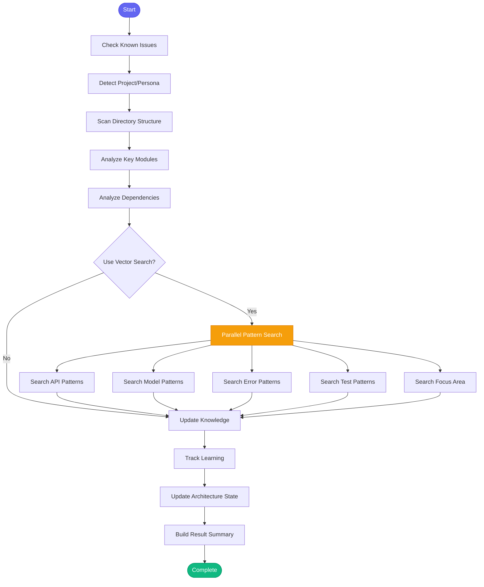

# 🏗️ learn_architecture

> Deep scan project structure to update architecture knowledge

## Overview

The `learn_architecture` skill performs a comprehensive scan of project structure using both static analysis and semantic code search. It discovers key modules, dependencies, patterns (API, models, error handling, testing), and updates persona-specific architecture knowledge.

Use this skill to:
- Understand a new project's architecture
- Update knowledge after major refactoring
- Discover code patterns using semantic search
- Focus on specific areas like "api" or "tests"

## Quick Start

```text
skill_run("learn_architecture", '{}')
```

Or use the Cursor command:

```text
/learn-architecture
```

With focus area:

```text
skill_run("learn_architecture", '{"focus": "api", "project": "backend"}')
```

## Inputs

| Input | Type | Required | Default | Description |
|-------|------|----------|---------|-------------|
| `project` | string | No | auto-detect | Project name from config.json |
| `persona` | string | No | current | Persona to update (e.g., "developer", "devops") |
| `focus` | string | No | all | Specific area to focus on (e.g., "api", "tests", "models") |
| `use_vector_search` | boolean | No | `true` | Use semantic vector search for deeper pattern discovery |

## What It Does

1. **Checks Known Issues** - Proactively checks for known vector search problems
2. **Detects Context** - Auto-detects project and persona from current directory
3. **Scans Directory Structure** - Builds tree of project directories (3 levels deep)
4. **Analyzes Key Modules** - Identifies important directories (src, api, models, tests, etc.)
5. **Analyzes Dependencies** - Parses pyproject.toml, requirements.txt, or package.json
6. **Semantic Pattern Search** - Uses vector search to discover:
   - API endpoint patterns
   - Data model patterns
   - Error handling patterns
   - Testing patterns
   - Focus area patterns (if specified)
7. **Updates Knowledge** - Saves findings to persona-specific knowledge file
8. **Tracks Learning** - Records architecture learning history
9. **Updates State** - Maintains project architecture state

## Flow



## Example Output

```markdown
## 🏗️ Architecture Knowledge Updated: automation-analytics-backend

**Persona:** developer

### Key Modules Found

- **src/**: Source code (156 source files)
- **api/**: API endpoints (45 source files)
- **models/**: Data models (23 source files)
- **services/**: Service layer (34 source files)
- **tests/**: Test suite (89 source files)
- **migrations/**: Database migrations (12 source files)

### Dependencies (18)

`fastapi`, `sqlalchemy`, `pydantic`, `redis`, `celery`, `pytest`, `httpx`...

### 🔍 Patterns Discovered (Semantic Search)

**API Endpoints:** 12 patterns found
  - `api/routes/billing.py:create_invoice`
  - `api/routes/users.py:get_current_user`
  - `api/routes/health.py:healthcheck`

**Data Models:** 8 patterns found
  - `models/invoice.py:Invoice`
  - `models/user.py:User`
  - `models/organization.py:Organization`

**Error Handling:** 6 patterns found
  - `api/exceptions.py:APIException`
  - `services/base.py:handle_service_error`
  - `utils/errors.py:format_error_response`

**Testing:** 15 patterns found
  - `tests/conftest.py:test_client`
  - `tests/factories.py:UserFactory`
  - `tests/test_billing.py:test_create_invoice`

*Use `knowledge_query()` to view full architecture knowledge.*
*Use `code_search()` for semantic code search.*
```

## Semantic Search Queries

The skill uses these queries to discover patterns:

| Pattern Type | Search Query |
|--------------|--------------|
| API Endpoints | "API endpoint route handler request response" |
| Data Models | "class model schema database table field" |
| Error Handling | "exception error handling try except raise" |
| Testing | "test fixture mock assert pytest unittest" |
| Focus Area | "{focus} implementation pattern" |

## Knowledge Storage

Architecture knowledge is saved to:

```
memory/knowledge/personas/{persona}/{project}.yaml
```

Under the `architecture` section:
- `key_modules`: List of important directories with purposes
- `dependencies`: Project dependencies
- Pattern discoveries are used to inform updates

## State Tracking

Architecture state is maintained in:

```yaml
# memory/state/architecture.yaml
projects:
  automation-analytics-backend:
    last_scan: "2026-01-26T14:30:00"
    modules_count: 8
    dependencies_count: 18
    key_modules: ["src/", "api/", "models/", ...]
    top_dependencies: ["fastapi", "sqlalchemy", ...]
    patterns_discovered:
      api: true
      models: true
      errors: true
      tests: true
```

## MCP Tools Used

- `check_known_issues` - Check for known problems
- `code_search` - Semantic pattern discovery
- `knowledge_update` - Save architecture knowledge
- `learn_tool_fix` - Record fixes for future reference
- `memory_session_log` - Log learning to session

## Related Skills

- [knowledge_refresh](./knowledge_refresh.md) - Refresh vector index
- [bootstrap_all_knowledge](./bootstrap_all_knowledge.md) - Bootstrap all knowledge
- [explain_code](./explain_code.md) - Explain specific code
- [find_similar_code](./find_similar_code.md) - Find similar patterns
