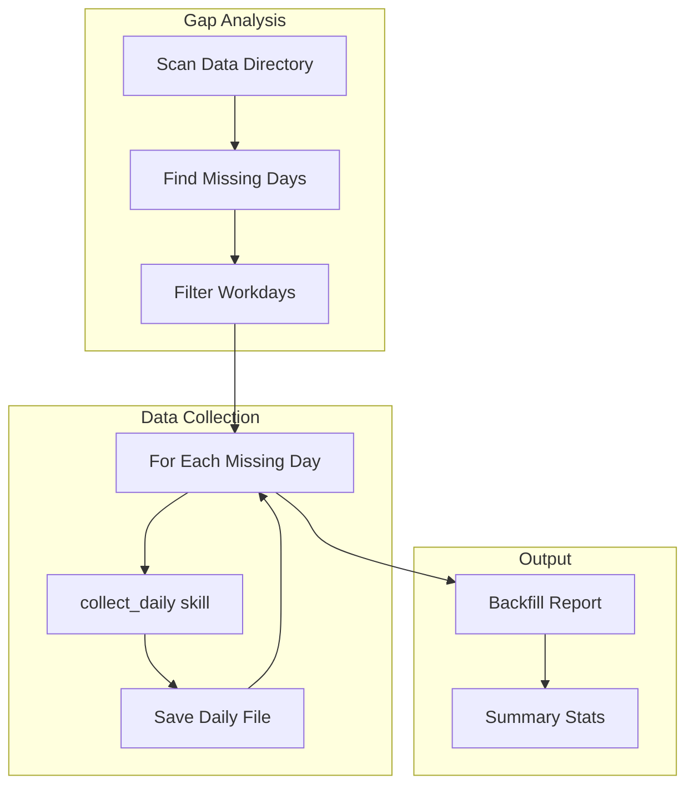
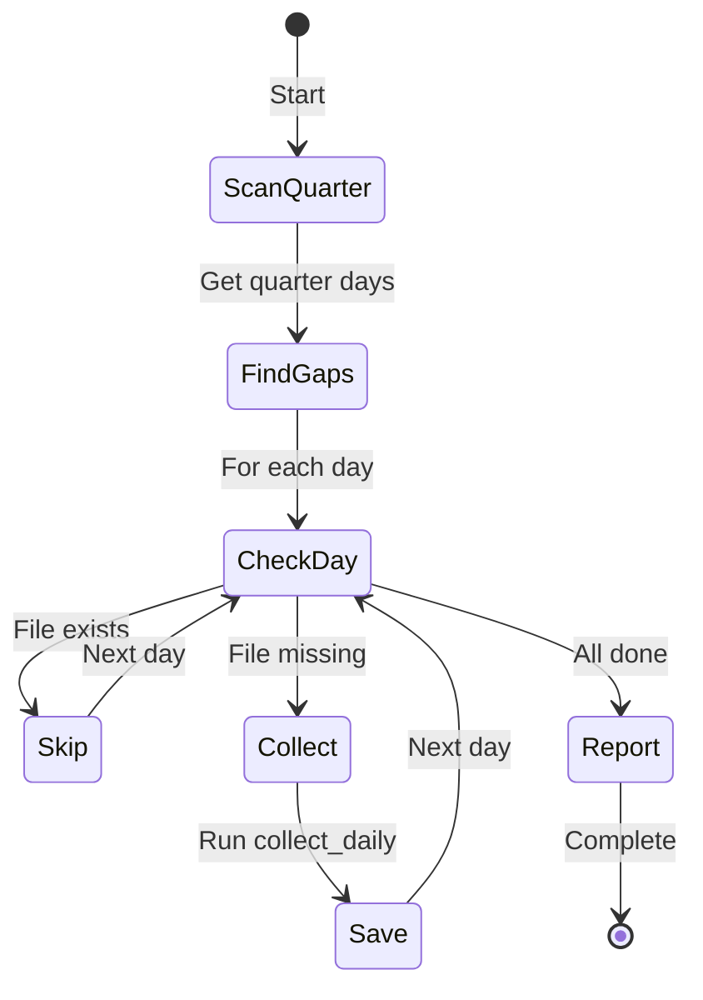

# :arrows_counterclockwise: backfill_missing

> Find and backfill missing days in the current quarter

## Overview

The `backfill_missing` skill identifies gaps in daily performance data collection and fills them by running `collect_daily` for each missing weekday. Useful when daily collection was missed, after returning from PTO, or when joining mid-quarter.

## Quick Start

```bash
# Backfill missing days (up to 10)
skill_run("performance/backfill_missing")

# Or use the Cursor command
/performance-backfill
```

## Usage

```bash
# Backfill up to 10 missing days (default)
skill_run("performance/backfill_missing")

# Backfill more days in one run
skill_run("performance/backfill_missing", '{"max_days": 30}')

# Backfill just 5 days
skill_run("performance/backfill_missing", '{"max_days": 5}')
```

## Parameters

| Parameter | Type | Required | Default | Description |
|-----------|------|----------|---------|-------------|
| `max_days` | integer | No | `10` | Maximum number of days to backfill in one run |

## What It Does

1. **Load Persona** - Loads developer persona for tool access
2. **Find Missing** - Scans the current quarter for weekdays without data files
3. **Filter Workdays** - Excludes weekends automatically
4. **Backfill Dates** - Runs `collect_daily` for each missing date (up to `max_days`)
5. **Update Summary** - Recalculates quarter summary after backfilling
6. **Log Session** - Records backfill activity to session log

## Process Flow



## State Machine



## Example Output

```text
## Backfill Complete

**Quarter:** Q1 2026

### Results
- **Total missing days found:** 12
- **Days processed:** 10
- **Days remaining:** 2

### Dates Backfilled
- 2026-01-02
- 2026-01-03
- 2026-01-06
- 2026-01-07
- 2026-01-08
- 2026-01-09
- 2026-01-10
- 2026-01-13
- 2026-01-14
- 2026-01-16

---

2 days still need backfilling.
Run again to continue: `skill_run("performance/backfill_missing")`
```

## No Missing Days Output

```text
## Backfill Complete

**Quarter:** Q1 2026

### Results
- **Total missing days found:** 0
- **Days processed:** 0
- **Days remaining:** 0

No missing days to backfill!
```

## Tips

- **Run multiple times**: If more than `max_days` are missing, run the skill again to continue
- **Weekend handling**: Weekends are automatically excluded from backfilling
- **PTO days**: Days with no activity will have 0 events but still create a file
- **Historical limits**: Data sources may have retention limits on historical data

## Configuration

Configure in `~/.config/aa-workflow/config.json`:

```json
{
  "performance": {
    "data_dir": "~/src/performance-data"
  }
}
```

## Related Skills

- [collect_daily](./performance-collect-daily.md) - Daily data collection
- [evaluate_questions](./performance-evaluate-questions.md) - Generate AI summaries
- [export_report](./performance-export-report.md) - Export quarterly report

## See Also

- [Performance Tools](../tool-modules/performance.md)
- [Performance Persona](../personas/performance.md)
