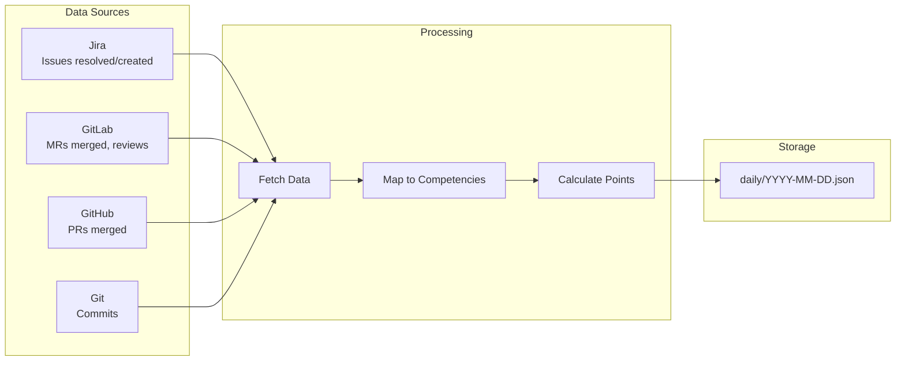

# :chart_with_upwards_trend: collect_daily

> Collect daily performance data and map to PSE competencies

## Overview

The `collect_daily` skill automatically gathers work evidence from multiple sources (Jira, GitLab, GitHub, Git) and maps each item to PSE (Principal Software Engineer) competencies using keyword rules. This is the foundation of the performance tracking system, running daily to build your evidence portfolio.

## Quick Start

```bash
# Collect for today
skill_run("performance/collect_daily")

# Or use the Cursor command
/performance-daily
```

## Usage

```bash
# Collect for today (default)
skill_run("performance/collect_daily")

# Collect for a specific date
skill_run("performance/collect_daily", '{"date": "2026-01-15"}')

# Backfill yesterday
skill_run("performance/collect_daily", '{"date": "2026-01-25"}')
```

## Parameters

| Parameter | Type | Required | Default | Description |
|-----------|------|----------|---------|-------------|
| `date` | string | No | Today | Target date in `YYYY-MM-DD` format |

## What It Does

1. **Load Persona** - Loads developer persona for Jira, GitLab, Git tool access
2. **Determine Date** - Parses target date or defaults to today
3. **Fetch Jira Resolved** - Gets issues resolved on the target date
4. **Fetch Jira Created** - Gets issues you created (shows initiative)
5. **Fetch GitLab MRs** - Gets merge requests merged on the target date
6. **Fetch GitHub PRs** - Gets upstream contributions merged
7. **Fetch Git Commits** - Gets commits from configured repositories
8. **Map Events** - Maps each item to competencies using keyword rules
9. **Calculate Points** - Scores each item with daily caps
10. **Save Daily File** - Writes to the performance data directory
11. **Update Summary** - Recalculates quarter summary statistics

## Data Flow



## Competency Mapping

Each work item is mapped to one or more PSE competencies based on keywords:

| Competency | Keywords | Base Points |
|------------|----------|-------------|
| Technical Contribution | PR merged, MR merged | 2 (up to 6 for large changes) |
| Planning & Execution | planning, roadmap, spike | 2 |
| Collaboration | review, pair, feedback | 2 |
| Mentorship | mentor, onboard, training | 3 |
| Continuous Improvement | ci/cd, pipeline, automation, refactor | 3 |
| Creativity & Innovation | poc, prototype, innovation, ai | 4 |
| Leadership | cross-team, lead, architecture | 3 |
| Portfolio Impact | api, schema, app-interface | 4 |
| End-to-End Delivery | release, deploy, production | 3 |
| Opportunity Recognition | (GitHub upstream contributions) | 4 |
| Technical Knowledge | doc, readme, documentation | 3 |

## Output File Format

The skill generates a daily JSON file at `{data_dir}/{year}/q{quarter}/performance/daily/{date}.json`:

```json
{
  "date": "2026-01-15",
  "day_of_quarter": 15,
  "events": [
    {
      "id": "jira:AAP-12345:resolved",
      "source": "jira",
      "type": "issue_resolved",
      "item_id": "AAP-12345",
      "title": "AAP-12345: Fix billing calculation bug",
      "timestamp": "2026-01-15T14:30:00",
      "points": {
        "technical_contribution": 2,
        "continuous_improvement": 3
      }
    }
  ],
  "daily_points": {
    "technical_contribution": 4,
    "continuous_improvement": 3
  },
  "daily_total": 7,
  "saved_at": "2026-01-15T17:00:00"
}
```

## Example Output

```text
## Daily Performance Collection Complete

**Date:** Wednesday, January 15, 2026
**Quarter:** Q1 2026 (Day 15)

### Results
- **Events collected:** 8
- **Daily total:** 15 points
- **File:** `~/src/performance-data/2026/q1/performance/daily/2026-01-15.json`

### Points by Competency
- technical_contribution: 6 pts
- continuous_improvement: 3 pts
- collaboration: 4 pts
- planning_execution: 2 pts

---

Run `performance_status()` to see updated quarter progress.
```

## Configuration

Configure in `~/.config/aa-workflow/config.json`:

```json
{
  "performance": {
    "data_dir": "~/src/performance-data"
  },
  "repositories": {
    "automation-analytics-backend": {
      "path": "~/src/automation-analytics-backend"
    }
  }
}
```

## Related Skills

- [backfill_missing](./performance-backfill-missing.md) - Fill gaps in historical data
- [evaluate_questions](./performance-evaluate-questions.md) - Generate AI summaries for quarterly questions
- [export_report](./performance-export-report.md) - Export quarterly performance report

## See Also

- [Performance Tools](../tool-modules/performance.md)
- [Performance Persona](../personas/performance.md)
