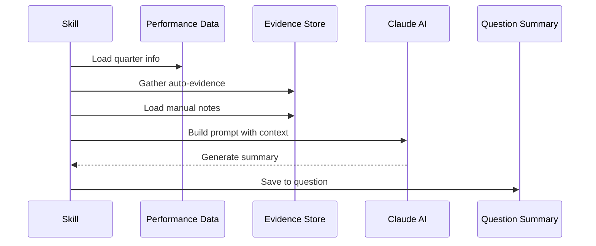
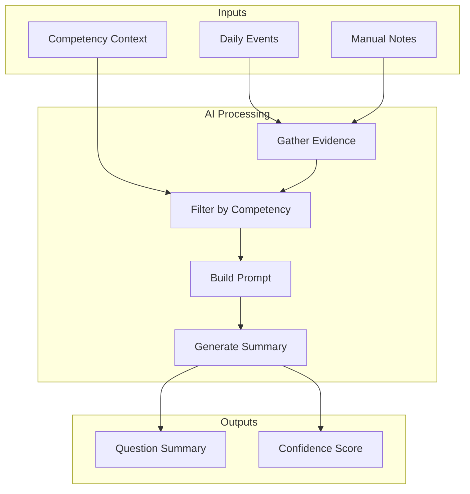

# :robot: evaluate_questions

> Run AI evaluation on quarterly performance questions

## Overview

The `evaluate_questions` skill uses Claude to analyze collected evidence and generate professional summaries for quarterly self-assessment questions. It gathers auto-evidence from daily events, combines with manual notes, and produces contextual summaries mapped to PSE competencies.

## Quick Start

```bash
# Evaluate all questions for current quarter
skill_run("performance/evaluate_questions")

# Or use the Cursor command
/performance-evaluate
```

## Usage

```bash
# Evaluate all questions
skill_run("performance/evaluate_questions")

# Evaluate a specific question only
skill_run("performance/evaluate_questions", '{"question_id": "q1"}')

# Evaluate technical contributions question
skill_run("performance/evaluate_questions", '{"question_id": "technical_contributions"}')
```

## Parameters

| Parameter | Type | Required | Default | Description |
|-----------|------|----------|---------|-------------|
| `question_id` | string | No | (all) | Specific question ID to evaluate; evaluates all if empty |

## What It Does

1. **Get Quarter** - Determines the current quarter
2. **Load Questions** - Loads quarterly questions and gathers evidence
3. **Gather Evidence** - Collects auto-evidence from daily event files
4. **Load Manual Notes** - Includes user-added context
5. **Build Prompts** - Creates Claude prompts with competency context
6. **Generate Summaries** - Uses LLM to synthesize evidence into responses
7. **Save Evaluations** - Writes summaries back to questions file
8. **Log Session** - Records evaluation to session log

## AI Evaluation Flow



## Evidence Processing



## Prompt Construction

For each question, the skill builds a prompt that includes:

1. **Question text** - The quarterly question being answered
2. **Evidence items** - Work events from daily files with point values
3. **Manual notes** - User-added context and highlights
4. **Competency scores** - Current percentage progress

The AI is instructed to:
- Highlight the most significant accomplishments
- Provide specific examples with metrics
- Frame responses in first person ("I accomplished...")
- Focus on impact, not just activities

## Example Output

```text
## Question Evaluation Complete

**Quarter:** Q1 2026

### Results
- **Questions evaluated:** 5
- **Total questions:** 5

### Describe your key technical contributions
- Evidence items: 24
- Status: Evaluated

### How have you demonstrated technical leadership?
- Evidence items: 12
- Status: Evaluated

### What innovations have you introduced?
- Evidence items: 8
- Status: Evaluated

---

View results with `performance_questions()` or `performance_export()`.
```

## Generated Summary Format

```markdown
## Technical Contributions

### Evidence
- Resolved 12 Jira issues including AAP-12345 (critical billing fix)
- Merged 8 MRs with 2,500+ lines of production code
- Contributed 3 upstream PRs to open source projects

### Summary
This quarter I demonstrated strong technical contributions through
consistent delivery of high-quality code. Key achievements include
the critical billing calculation fix (AAP-12345) which reduced
customer-reported errors by 40%, and the new API endpoint feature
that improved system integration capabilities.

### Competency Alignment
- **Technical Contribution:** High (8 merged MRs)
- **Problem Solving:** High (critical bug fixes)
- **Innovation:** Medium (new features)
```

## Questions File Format

Questions are stored in `{data_dir}/{year}/q{quarter}/performance/questions.json`:

```json
{
  "questions": [
    {
      "id": "q1",
      "text": "Describe your key technical contributions",
      "subtext": "Include specific examples with metrics",
      "auto_evidence": ["jira:AAP-12345:resolved", "gitlab:mr:1459:merged"],
      "manual_notes": [{"text": "Led billing overhaul project"}],
      "llm_summary": "This quarter I...",
      "last_evaluated": "2026-01-26T10:30:00"
    }
  ]
}
```

## Related Skills

- [collect_daily](./performance-collect-daily.md) - Collect daily evidence
- [backfill_missing](./performance-backfill-missing.md) - Fill historical gaps
- [export_report](./performance-export-report.md) - Export quarterly report

## See Also

- [Performance Tools](../tool-modules/performance.md)
- [Performance Persona](../personas/performance.md)
