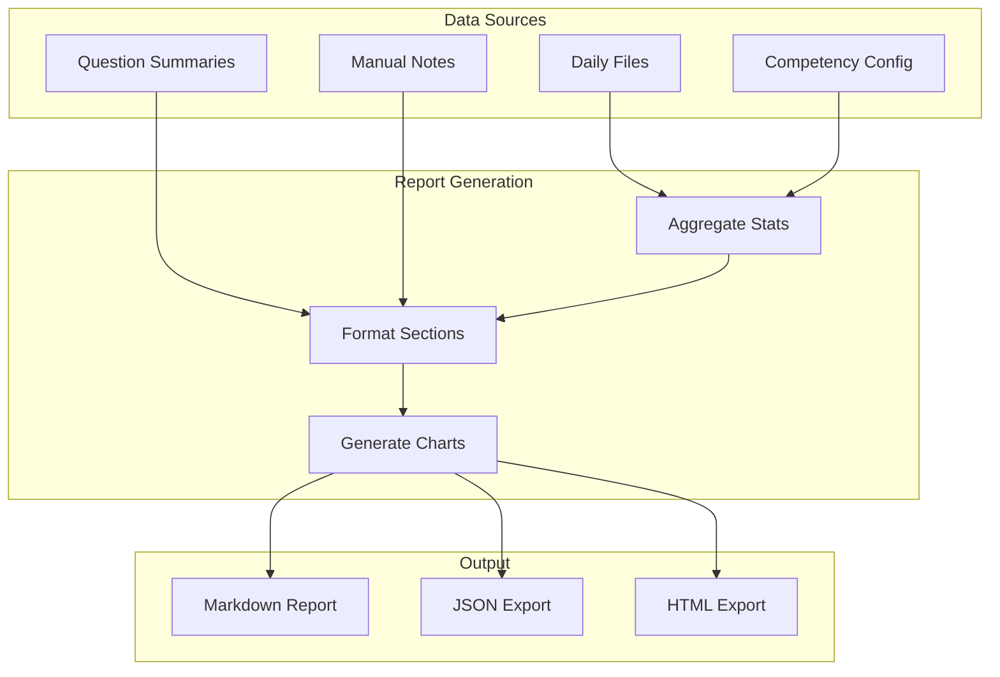

# :page_facing_up: export_report

> Generate a comprehensive quarterly performance report

## Overview

The `export_report` skill generates a comprehensive quarterly performance report suitable for self-assessment or manager review. It aggregates daily evidence, competency scores, question summaries, and creates formatted output in Markdown, JSON, or HTML.

## Quick Start

```bash
# Export current quarter report
skill_run("performance/export_report")

# Or use the Cursor command
/performance-report
```

## Usage

```bash
# Export current quarter as Markdown (default)
skill_run("performance/export_report")

# Export as JSON
skill_run("performance/export_report", '{"format": "json"}')

# Export specific quarter
skill_run("performance/export_report", '{"quarter": "Q4 2025"}')

# Export Q1 2026 as JSON
skill_run("performance/export_report", '{"quarter": "Q1 2026", "format": "json"}')
```

## Parameters

| Parameter | Type | Required | Default | Description |
|-----------|------|----------|---------|-------------|
| `format` | string | No | `markdown` | Export format: `markdown`, `json`, or `html` |
| `quarter` | string | No | Current | Quarter to export (e.g., `Q1 2026`) |

## What It Does

1. **Get Quarter** - Determines target quarter and date range
2. **Load Data** - Loads summary statistics and question responses
3. **Generate Report** - Formats report based on requested format
4. **Save File** - Writes to the performance data directory
5. **Log Session** - Records export to session log

## Report Generation Flow



## Output Formats

| Format | Extension | Use Case |
|--------|-----------|----------|
| Markdown | `.md` | GitHub/GitLab rendering, easy editing |
| JSON | `.json` | Data analysis, programmatic access |
| HTML | `.html` | Web viewing, sharing |

## Report Sections

### 1. Executive Summary
- Quarter overview and date range
- Overall progress percentage
- Total work events counted

### 2. Competency Scores
- All PSE competencies with percentage complete
- Points accumulated per competency
- Status indicators (on track, needs attention)

### 3. Areas for Improvement
- Competencies below target
- Gap analysis

### 4. Quarterly Connection Questions
- Each question with AI-generated response
- Manual notes included
- Evidence summaries

### 5. Key Highlights
- Top achievements
- Notable contributions

## Example Output

```text
## Report Exported

**Quarter:** Q1 2026
**Format:** markdown
**File:** `~/src/performance-data/2026/q1/performance/report_q1_2026.md`

---

# Quarterly Performance Report
## Q1 2026

**Generated:** 2026-01-26 10:30
**Period:** 2026-01-01 to 2026-03-31
**Day of Quarter:** 26 of 90

---

## Executive Summary

**Overall Progress:** 65%
**Total Work Events:** 156

## Competency Scores

- **Technical Contribution:** 78% (234 pts)
- **Collaboration:** 72% (180 pts)
- **Planning Execution:** 68% (170 pts)
- **Continuous Improvement:** 65% (162 pts)
- **Leadership:** 52% (130 pts) :warning:

### Areas for Improvement
- Leadership: 52%

---

## Quarterly Connection Questions

### Describe your key technical contributions
*Include specific examples with metrics*

This quarter I demonstrated strong technical contributions through
consistent delivery of high-quality code. Key achievements include
the billing calculation overhaul (AAP-12345) which reduced customer
errors by 40%, and the new API endpoint feature.

---

## Key Highlights

- Merged 15 MRs with 3,200+ lines of production code
- Led billing overhaul project (AAP-12345)
- Contributed 3 upstream PRs to open source projects

---

*Report generated by AA Workflow Performance Tracker*
```

## JSON Export Format

```json
{
  "quarter": "Q1 2026",
  "period": "2026-01-01 to 2026-03-31",
  "generated": "2026-01-26 10:30",
  "summary": {
    "overall_percentage": 65,
    "total_events": 156,
    "cumulative_points": {
      "technical_contribution": 234,
      "collaboration": 180
    },
    "cumulative_percentage": {
      "technical_contribution": 78,
      "collaboration": 72
    },
    "gaps": ["leadership"],
    "highlights": [
      "Merged 15 MRs",
      "Led billing overhaul"
    ]
  },
  "questions": [
    {
      "id": "q1",
      "text": "Describe your key technical contributions",
      "llm_summary": "This quarter I..."
    }
  ]
}
```

## Configuration

Configure in `~/.config/aa-workflow/config.json`:

```json
{
  "performance": {
    "data_dir": "~/src/performance-data"
  }
}
```

## Related Skills

- [collect_daily](./performance-collect-daily.md) - Daily data collection
- [backfill_missing](./performance-backfill-missing.md) - Fill historical gaps
- [evaluate_questions](./performance-evaluate-questions.md) - Generate AI summaries

## See Also

- [Performance Tools](../tool-modules/performance.md)
- [Performance Persona](../personas/performance.md)
