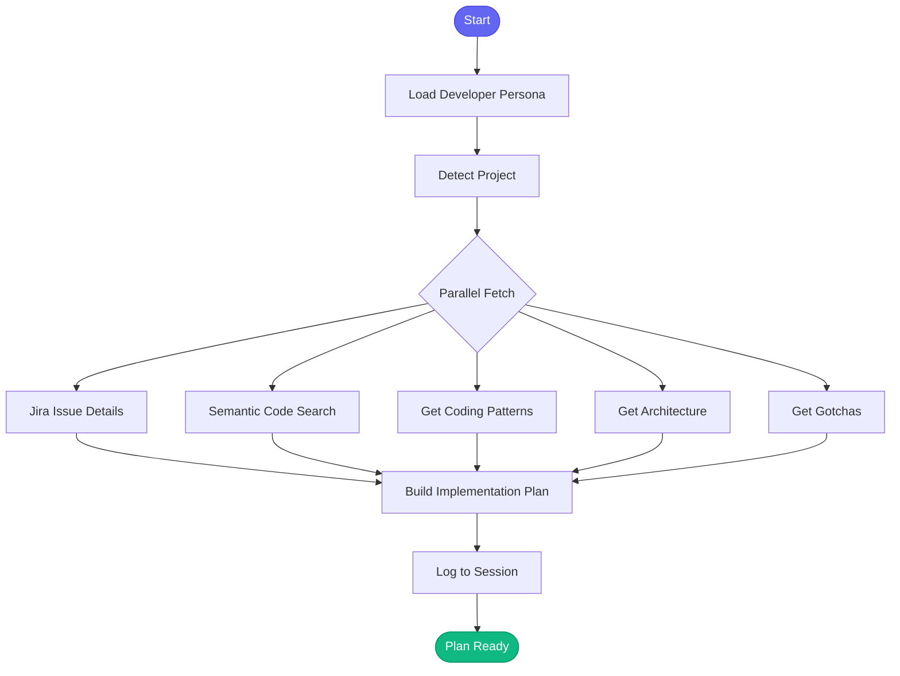

# 📋 plan_implementation

> Create structured implementation plans from research findings

## Overview

The `plan_implementation` skill creates actionable implementation plans for features or changes. It analyzes your goal, identifies relevant code files using semantic search, gathers patterns and gotchas from project knowledge, and produces a structured checklist-style plan.

Use this skill after researching a feature to create a clear plan before coding.

## Quick Start

```text
skill_run("plan_implementation", '{"goal": "Add Redis caching to billing API"}')
```

Or use the Cursor command:

```text
/plan-implementation goal="Add Redis caching to billing API"
```

## Inputs

| Input | Type | Required | Default | Description |
|-------|------|----------|---------|-------------|
| `goal` | string | Yes | - | What you want to implement (e.g., "Add Redis caching to billing API") |
| `project` | string | No | auto-detect | Project to plan for (from config.json) |
| `issue_key` | string | No | - | Jira issue key if planning for a specific ticket |
| `constraints` | string | No | - | Any constraints or requirements (e.g., "must be backwards compatible") |

## What It Does

1. **Loads Developer Persona** - Ensures access to Jira and development tools
2. **Detects Project** - Auto-detects from current directory or uses provided project
3. **Gets Jira Context** - If issue_key provided, fetches issue details and acceptance criteria
4. **Searches Related Code** - Uses semantic search to find files related to your goal
5. **Gathers Patterns** - Retrieves coding patterns from project knowledge
6. **Gets Architecture Info** - Fetches key module information
7. **Identifies Gotchas** - Pulls relevant gotchas from project knowledge
8. **Builds Implementation Plan** - Creates structured markdown plan with:
   - Goal and context
   - Files to modify
   - Implementation steps checklist
   - Patterns to follow
   - Risks and gotchas
   - Unknowns to resolve
   - Ready-to-start commands

## Flow



## Example Output

```markdown
## 📋 Implementation Plan

**Goal:** Add Redis caching to billing API
**Issue:** AAP-12345
**Project:** automation-analytics-backend
**Constraints:** must be backwards compatible

### 📝 Issue Context

**Summary:** Implement Redis caching for billing calculations
**Acceptance Criteria:**
- Cache billing calculations for 1 hour
- Support cache invalidation on data changes

### 📁 Files to Modify

Based on semantic search, these files are likely relevant:

- [ ] `api/billing/calculations.py`
- [ ] `api/billing/routes.py`
- [ ] `services/cache_service.py`
- [ ] `tests/test_billing.py`

### 🔨 Implementation Steps

1. [ ] **Setup** - Create branch, update Jira status
2. [ ] **Research** - Review existing patterns in codebase
3. [ ] **Implement** - Write the code changes
4. [ ] **Test** - Add/update tests
5. [ ] **Document** - Update docstrings/README if needed
6. [ ] **Review** - Self-review, run lints
7. [ ] **Submit** - Create MR, request review

### 📚 Patterns to Follow

- Use dependency injection for services
- Follow existing error handling patterns
- Add type hints to all functions

### ⚠️ Risks & Gotchas

- Watch for race conditions with cache invalidation
- Billing calculations must remain accurate
- Check for backwards compatibility

### ❓ Unknowns to Resolve

- [ ] *Add unknowns discovered during research*

---
### 🚀 Ready to Start?

```python
# Switch to developer persona and start work
persona_load('developer')
skill_run('start_work', '{"issue_key": "AAP-12345"}')
```
```

## MCP Tools Used

- `persona_load` - Load developer persona
- `jira_view_issue` - Get Jira issue details
- `code_search` - Semantic search for related code
- `knowledge_query` - Get patterns, architecture, and gotchas
- `memory_session_log` - Log plan creation

## Related Skills

- [start_work](./start_work.md) - Begin implementation after planning
- [gather_context](./gather_context.md) - Gather context for a task
- [research_topic](./research_topic.md) - Research before planning
- [summarize_findings](./summarize_findings.md) - Summarize research findings
